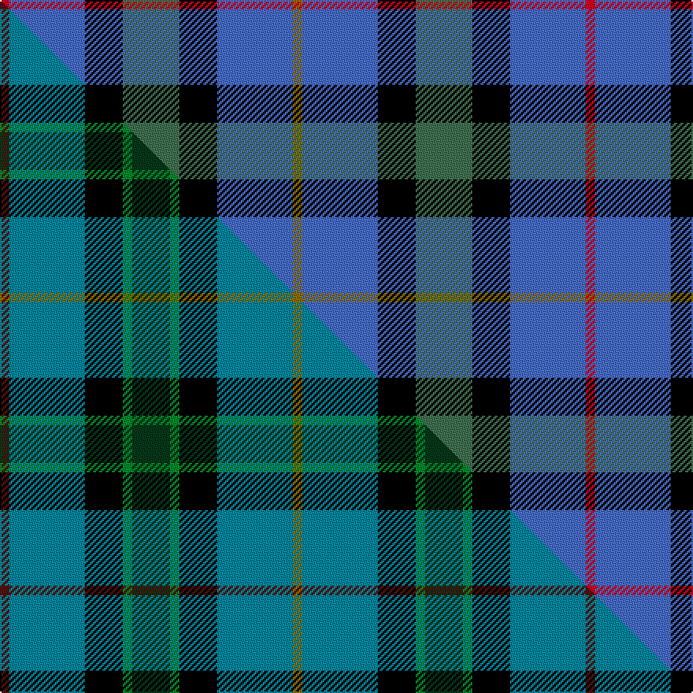

This page is one **sett** — a single exact thread-count. It belongs to the [tartan](/setts/r1b8k4g6k4b8y1/)
(the same proportion at any scale), whose colour order is pattern [GBKGKBR](/stripes/gbkgkbr/).

Part of the [Quinn](/tartans/quinn/) tartan — the named design grouping this sett with its other cloths.

Sourced from weddslist.  It is a [7 stripe tartan](/stripes/stripes7/).

Original link http://www.weddslist.com/cgi-bin/tartans/pg.pl?source=sts

## Thread count
R/6 B48 K24 G36 K24 B48 Y/6

One full sett is **372 threads**.

## Palette
<table><thead><tr><th>Colour</th><th>Shade</th><th>OKLCh</th></tr></thead><tbody><tr><td>R</td><td><code style="background-color:#D60020;">#D60020</code> <small style="color:#888">#D60020</small></td><td><small style="color:#888">oklch(55.2% 0.224 25.5)</small></td></tr><tr><td>G</td><td><code style="background-color:#407050;">#407050</code> <small style="color:#888">#407050</small></td><td><small style="color:#888">oklch(50.1% 0.074 153.7)</small></td></tr><tr><td>G</td><td><code style="background-color:#407050;">#407050</code> <small style="color:#888">#407050</small></td><td><small style="color:#888">oklch(50.1% 0.074 153.7)</small></td></tr><tr><td>K</td><td><code style="background-color:#000000;">#000000</code> <small style="color:#888">#000000</small></td><td><small style="color:#888">oklch(0.0% 0.000 0.0)</small></td></tr><tr><td>B</td><td><code style="background-color:#466CC8;">#466CC8</code> <small style="color:#888">#466CC8</small></td><td><small style="color:#888">oklch(55.1% 0.149 265.0)</small></td></tr><tr><td>Y</td><td><code style="background-color:#8B6E00;">#8B6E00</code> <small style="color:#888">#8B6E00</small></td><td><small style="color:#888">oklch(55.1% 0.113 90.4)</small></td></tr></tbody></table>

# Sample pattern

## Compared to the master

This cloth is one sett of its design; the master sett (the exemplar the design is anchored on) is below for comparison.

Its **ΔTartan distance** from the master is **1.78** — the same measure the nearest-tartans table ranks by (0 is identical; a re-scale of the same cloth is near 0, a recolour or a different proportion further).

<figure class="master-compare" style="margin:0">

this sett
master sett ★

<figcaption style="color:#888;font-size:smaller">One weave of this sett against the <a href="/setts/dr1t8k4g1dg4g1k4t8y1/">master sett ★</a>, split on the diagonal: a shared proportion runs seamlessly across it with only the shades shifting; a different proportion breaks on it.</figcaption>
</figure>

## Nearest tartan variants

The nearest existing variants by ΔTartan distance, with this cloth at the top so the swatches line up against it.

ΔTartan

Threads

Variant

Sett

—

372

<a href="/variants/s7/r1b8k4g6k4b8y1~x6~g2003152/">Quinn</a>

<a href="/ttd/edit/#slug=w3db3r2db14k3g12k14db16y2~x2&amp;base=r1b8k4g6k4b8y1~x6~g2003152" title="compare in the TTD">1.57</a>

266

<a href="/variants/s9/w3db3r2db14k3g12k14db16y2~x2/">Royal Navy Submarine Service</a>

<a href="/ttd/edit/#slug=r4db24k12g14k4lb3~x2&amp;base=r1b8k4g6k4b8y1~x6~g2003152" title="compare in the TTD">1.74</a>

230

<a href="/variants/s6/r4db24k12g14k4lb3~x2/">MacPhail Hunting #2</a>

<a href="/ttd/edit/#slug=g8k7db12r2db12k7g8lb2~x4~db1406275&amp;base=r1b8k4g6k4b8y1~x6~g2003152" title="compare in the TTD">1.96</a>

424

<a href="/variants/s8/g8k7db12r2db12k7g8lb2~x4~db1406275/">Forbo Nairn Corporate Tartan</a>

<a href="/ttd/edit/#slug=db31t4db5k19g20lo4~x2&amp;base=r1b8k4g6k4b8y1~x6~g2003152" title="compare in the TTD">2.11</a>

262

<a href="/variants/s6/db31t4db5k19g20lo4~x2/">Midlothian</a>

<a href="/ttd/edit/#slug=db31b4db5k19g20y4~x2&amp;base=r1b8k4g6k4b8y1~x6~g2003152" title="compare in the TTD">2.11</a>

262

<a href="/variants/s6/db31b4db5k19g20y4~x2/">Midlothian</a>

<a href="/ttd/edit/#slug=db18dp1db12k14g14r2~x2&amp;base=r1b8k4g6k4b8y1~x6~g2003152" title="compare in the TTD">2.15</a>

204

<a href="/variants/s6/db18dp1db12k14g14r2~x2/">Mackison</a>

<a href="/ttd/edit/#slug=k19w8k19b16y4b16w2~x2&amp;base=r1b8k4g6k4b8y1~x6~g2003152" title="compare in the TTD">2.32</a>

294

<a href="/variants/s7/k19w8k19b16y4b16w2~x2/">St Johnstone F.C.</a>

<a href="/ttd/edit/#slug=lb3k2g2k1db10w1~x8&amp;base=r1b8k4g6k4b8y1~x6~g2003152" title="compare in the TTD">2.37</a>

272

<a href="/variants/s6/lb3k2g2k1db10w1~x8/">Isle of Harris (District)</a>

<a href="/ttd/edit/#slug=lo4db23k4g16db23lb4&amp;base=r1b8k4g6k4b8y1~x6~g2003152" title="compare in the TTD">2.43</a>

140

<a href="/variants/s6/lo4db23k4g16db23lb4/">Baptist Union of Scotland</a>

<a href="/ttd/edit/#slug=k6lb3k8db7lo2db7lb1~x4&amp;base=r1b8k4g6k4b8y1~x6~g2003152" title="compare in the TTD">2.54</a>

244

<a href="/variants/s7/k6lb3k8db7lo2db7lb1~x4/">St. Johnstone F.C. (Sports)</a>

## Neighbour map

Every grey dot is one of 13620 variants placed by the first two principal components of the ΔTartan feature space (42% of its variance). Red is this tartan; blue dots are its nearest — click one to open its page.

<svg viewBox="0 0 640 380" role="img" style="max-width:100%;height:auto;border:1px solid #e0e0e0;border-radius:4px;display:block" xmlns="http://www.w3.org/2000/svg"><image href="/nn/cloud.v1.png" width="640" height="380"/><a href="/variants/s9/w3db3r2db14k3g12k14db16y2~x2/"><circle cx="146.4" cy="166.3" r="4" fill="#3465a4"><title>Royal Navy Submarine Service</title></circle></a><a href="/variants/s6/r4db24k12g14k4lb3~x2/"><circle cx="132.2" cy="198.5" r="4" fill="#3465a4"><title>MacPhail Hunting #2</title></circle></a><a href="/variants/s8/g8k7db12r2db12k7g8lb2~x4~db1406275/"><circle cx="116.2" cy="228.4" r="4" fill="#3465a4"><title>Forbo Nairn Corporate Tartan</title></circle></a><a href="/variants/s6/db31t4db5k19g20lo4~x2/"><circle cx="156.2" cy="203.0" r="4" fill="#3465a4"><title>Midlothian</title></circle></a><a href="/variants/s6/db31b4db5k19g20y4~x2/"><circle cx="163.5" cy="204.9" r="4" fill="#3465a4"><title>Midlothian</title></circle></a><a href="/variants/s6/db18dp1db12k14g14r2~x2/"><circle cx="215.7" cy="183.5" r="4" fill="#3465a4"><title>Mackison</title></circle></a><a href="/variants/s7/k19w8k19b16y4b16w2~x2/"><circle cx="166.0" cy="213.0" r="4" fill="#3465a4"><title>St Johnstone F.C.</title></circle></a><a href="/variants/s6/lb3k2g2k1db10w1~x8/"><circle cx="207.3" cy="164.1" r="4" fill="#3465a4"><title>Isle of Harris (District)</title></circle></a><a href="/variants/s6/lo4db23k4g16db23lb4/"><circle cx="257.8" cy="216.3" r="4" fill="#3465a4"><title>Baptist Union of Scotland</title></circle></a><a href="/variants/s7/k6lb3k8db7lo2db7lb1~x4/"><circle cx="158.0" cy="226.5" r="4" fill="#3465a4"><title>St. Johnstone F.C. (Sports)</title></circle></a><circle cx="177.8" cy="206.8" r="5" fill="#c00000"/><text x="320" y="376" text-anchor="middle" font-size="11" fill="#999">ground</text><text x="11" y="190" text-anchor="middle" font-size="11" fill="#999" transform="rotate(-90 11 190)">complexity</text></svg>

ID: /variants/s7/r1b8k4g6k4b8y1~x6~g2003152/
