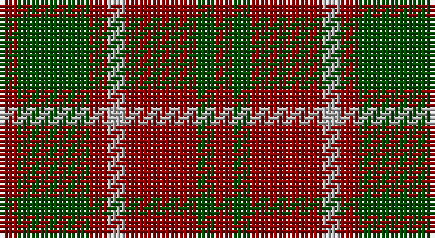

This page is one **sett** — a single exact thread-count. It belongs to the [tartan](/setts/r1dg4r1lr1r4dg1r1/)
(the same proportion at any scale), whose colour order is pattern [RGRYRGR](/stripes/rgryrgr/).

Part of the [Unidentified](/tartans/unidentified/) tartan — the named design grouping this sett with its other cloths.

Sourced from register-of-tartans.  It is a [7 stripe tartan](/stripes/stripes7/).

Original link https://www.tartanregister.gov.uk/tartanDetails.aspx?ref=4260

## Also known as

This cloth is also recorded under:

- Unidentified #10
- Unidentified #12
- Unidentified #14
- Unidentified #15
- Unidentified #16
- Unidentified #18
- Unidentified #2
- Unidentified #21
- Unidentified #22
- Unidentified #24
- Unidentified #25
- Unidentified #28
- Unidentified #29
- Unidentified #30
- Unidentified #31
- Unidentified #32
- Unidentified #36
- Unidentified #37
- Unidentified #38
- Unidentified #40
- Unidentified #43
- Unidentified #44
- Unidentified #45
- Unidentified #46
- Unidentified #47
- Unidentified #48
- Unidentified #49
- Unidentified #5
- Unidentified #50
- Unidentified #51
- Unidentified #52
- Unidentified #53
- Unidentified #54
- Unidentified #55
- Unidentified #56
- Unidentified #57
- Unidentified #58
- Unidentified #59
- Unidentified #60
- Unidentified #61
- Unidentified #62
- Unidentified #63
- Unidentified #64
- Unidentified #65
- Unidentified #66
- Unidentified #7
- Unidentified #8
- Unidentified #9
- Unidentified 16
- Unidentified Artifact
- Unidentified Plaid
- Unidentified Plaid #11
- Unidentified Plaid #13
- Unidentified Plaid #2
- Unidentified Plaid #3
- Unidentified Plaid #7
- Unidentified Plaid #8
- Unidentified Plaid #9
- Unidentified Portrait

## Register references

External register numbers recorded for this tartan.

- Scottish Register of Tartans: [4260](https://www.tartanregister.gov.uk/tartanDetails.aspx?ref=4260)
- Scottish Tartans Authority (ITI): 4615

## Thread count
DR/4 G16 DR4 N4 DR16 G4 DR/4

One full sett is **96 threads**.

## Palette

Palette: <strong>Tartan Register</strong> <small style="color:#888">(2 of 3 colours)</small>
<table><thead><tr><th>Colour</th><th>Threads</th><th>Shade</th><th>Base</th><th>OKLCh</th></tr></thead><tbody><tr><td>DR/</td><td style="text-align:right;font-variant-numeric:tabular-nums">4</td><td><code style="background-color:#8C0000;">#8C0000</code> <small style="color:#888">#8C0000</small></td><td>R <code style="background-color:#CC0000;">#CC0000</code></td><td><small style="color:#888">oklch(40.2% 0.165 29.2)</small></td></tr><tr><td>G</td><td style="text-align:right;font-variant-numeric:tabular-nums">16</td><td><code style="background-color:#004C00;">#004C00</code> <small style="color:#888">#004C00</small></td><td>G <code style="background-color:#006100;">#006100</code></td><td><small style="color:#888">oklch(36.1% 0.123 142.5)</small></td></tr><tr><td>DR</td><td style="text-align:right;font-variant-numeric:tabular-nums">4</td><td><code style="background-color:#8C0000;">#8C0000</code> <small style="color:#888">#8C0000</small></td><td>R <code style="background-color:#CC0000;">#CC0000</code></td><td><small style="color:#888">oklch(40.2% 0.165 29.2)</small></td></tr><tr><td>N</td><td style="text-align:right;font-variant-numeric:tabular-nums">4</td><td><code style="background-color:#B0B0B0;">#B0B0B0</code> <small style="color:#888">#B0B0B0</small></td><td>Y <code style="background-color:#F2BF00;">#F2BF00</code></td><td><small style="color:#888">oklch(75.7% 0.000 89.9)</small></td></tr><tr><td>DR</td><td style="text-align:right;font-variant-numeric:tabular-nums">16</td><td><code style="background-color:#8C0000;">#8C0000</code> <small style="color:#888">#8C0000</small></td><td>R <code style="background-color:#CC0000;">#CC0000</code></td><td><small style="color:#888">oklch(40.2% 0.165 29.2)</small></td></tr><tr><td>G</td><td style="text-align:right;font-variant-numeric:tabular-nums">4</td><td><code style="background-color:#004C00;">#004C00</code> <small style="color:#888">#004C00</small></td><td>G <code style="background-color:#006100;">#006100</code></td><td><small style="color:#888">oklch(36.1% 0.123 142.5)</small></td></tr><tr><td>DR/</td><td style="text-align:right;font-variant-numeric:tabular-nums">4</td><td><code style="background-color:#8C0000;">#8C0000</code> <small style="color:#888">#8C0000</small></td><td>R <code style="background-color:#CC0000;">#CC0000</code></td><td><small style="color:#888">oklch(40.2% 0.165 29.2)</small></td></tr></tbody></table>

# Sample pattern

## Compared to the master

This cloth is one sett of its design; the master sett (the exemplar the design is anchored on) is below for comparison.

<figure style="margin:0"><figcaption style="color:#888;font-size:smaller">this sett</figcaption></figure>
<figure style="margin:0"><figcaption style="color:#888;font-size:smaller"><a href="/setts/dp4r3dp26r26dg26r4/">master sett →</a></figcaption></figure>

## Nearest tartans

The nearest existing variants by ΔTartan distance, with this tartan at the top so the swatches line up against it.

ΔTartan

Tartan

Sett

—

<a href="/ttd/edit/#slug=r1dg4r1lr1r4dg1r1~x4">Unidentified #59</a> <a class="nn-out" href="/variants/s7/r1dg4r1lr1r4dg1r1~x4/" title="open its dictionary page">↗</a>

1.17

<a href="/ttd/edit/#slug=dg1r5dg4r1dg1r1dt4r5dt1~x14&amp;base=r1dg4r1lr1r4dg1r1~x4">Lumsden Boghead</a> <a class="nn-out" href="/variants/s9/dg1r5dg4r1dg1r1dt4r5dt1~x14/" title="open its dictionary page">↗</a>

1.20

<a href="/ttd/edit/#slug=dt1r5dt4r1g1r1g4r5g1~x12&amp;base=r1dg4r1lr1r4dg1r1~x4">Lumsden of Kintore (Clan?)</a> <a class="nn-out" href="/variants/s9/dt1r5dt4r1g1r1g4r5g1~x12/" title="open its dictionary page">↗</a>

1.21

<a href="/ttd/edit/#slug=dg4r2dg13lb2r13dg2r4~x2&amp;base=r1dg4r1lr1r4dg1r1~x4">Crossnor School</a> <a class="nn-out" href="/variants/s7/dg4r2dg13lb2r13dg2r4~x2/" title="open its dictionary page">↗</a>

1.24

<a href="/ttd/edit/#slug=db1r5db4r1g1r1g4r5g1~x20&amp;base=r1dg4r1lr1r4dg1r1~x4">Lumsden 1797</a> <a class="nn-out" href="/variants/s9/db1r5db4r1g1r1g4r5g1~x20/" title="open its dictionary page">↗</a>

1.40

<a href="/ttd/edit/#slug=lr1r4dg1r1dg3r1dg3r1dg1r4ly1~x2&amp;base=r1dg4r1lr1r4dg1r1~x4">Bruce</a> <a class="nn-out" href="/variants/s11/lr1r4dg1r1dg3r1dg3r1dg1r4ly1~x2/" title="open its dictionary page">↗</a>

1.45

<a href="/ttd/edit/#slug=db6r3g2r3g12r3g2~x2&amp;base=r1dg4r1lr1r4dg1r1~x4">Skene Clan Tartan</a> <a class="nn-out" href="/variants/s7/db6r3g2r3g12r3g2~x2/" title="open its dictionary page">↗</a>

1.46

<a href="/ttd/edit/#slug=dg1ri8dg8r1dg8ri8lb1~x2&amp;base=r1dg4r1lr1r4dg1r1~x4">MacKinnon Hunting</a> <a class="nn-out" href="/variants/s7/dg1ri8dg8r1dg8ri8lb1~x2/" title="open its dictionary page">↗</a>

1.51

<a href="/ttd/edit/#slug=dg16r5dg2r18k2&amp;base=r1dg4r1lr1r4dg1r1~x4">MacDonald of Sleat</a> <a class="nn-out" href="/variants/s5/dg16r5dg2r18k2/" title="open its dictionary page">↗</a>

1.53

<a href="/ttd/edit/#slug=r2k4r2k4r6k1lo1~x4&amp;base=r1dg4r1lr1r4dg1r1~x4">MacIan</a> <a class="nn-out" href="/variants/s7/r2k4r2k4r6k1lo1~x4/" title="open its dictionary page">↗</a>

1.62

<a href="/ttd/edit/#slug=ly1r3dg7r3dg7r3ly1~x4&amp;base=r1dg4r1lr1r4dg1r1~x4">Unidentified #42</a> <a class="nn-out" href="/variants/s7/ly1r3dg7r3dg7r3ly1~x4/" title="open its dictionary page">↗</a>

## Neighbour map

Every grey dot is one of 14360 variants placed by the first two principal components of the ΔTartan feature space (44% of its variance). Red is this tartan; blue dots are its nearest — click one to open its page.

<svg viewBox="0 0 640 380" role="img" style="max-width:100%;height:auto;border:1px solid #e0e0e0;border-radius:4px;display:block" xmlns="http://www.w3.org/2000/svg"><image href="/nn/cloud.v1.png" width="640" height="380"/><a href="/variants/s9/dg1r5dg4r1dg1r1dt4r5dt1~x14/"><circle cx="279.2" cy="247.2" r="4" fill="#3465a4"><title>Lumsden Boghead</title></circle></a><a href="/variants/s9/dt1r5dt4r1g1r1g4r5g1~x12/"><circle cx="272.1" cy="244.6" r="4" fill="#3465a4"><title>Lumsden of Kintore (Clan?)</title></circle></a><a href="/variants/s7/dg4r2dg13lb2r13dg2r4~x2/"><circle cx="326.5" cy="251.0" r="4" fill="#3465a4"><title>Crossnor School</title></circle></a><a href="/variants/s9/db1r5db4r1g1r1g4r5g1~x20/"><circle cx="273.6" cy="245.3" r="4" fill="#3465a4"><title>Lumsden 1797</title></circle></a><a href="/variants/s11/lr1r4dg1r1dg3r1dg3r1dg1r4ly1~x2/"><circle cx="262.8" cy="240.8" r="4" fill="#3465a4"><title>Bruce</title></circle></a><a href="/variants/s7/db6r3g2r3g12r3g2~x2/"><circle cx="283.5" cy="254.3" r="4" fill="#3465a4"><title>Skene Clan Tartan</title></circle></a><a href="/variants/s7/dg1ri8dg8r1dg8ri8lb1~x2/"><circle cx="303.1" cy="241.2" r="4" fill="#3465a4"><title>MacKinnon Hunting</title></circle></a><a href="/variants/s5/dg16r5dg2r18k2/"><circle cx="362.4" cy="250.4" r="4" fill="#3465a4"><title>MacDonald of Sleat</title></circle></a><a href="/variants/s7/r2k4r2k4r6k1lo1~x4/"><circle cx="309.1" cy="273.8" r="4" fill="#3465a4"><title>MacIan</title></circle></a><a href="/variants/s7/ly1r3dg7r3dg7r3ly1~x4/"><circle cx="300.3" cy="245.0" r="4" fill="#3465a4"><title>Unidentified #42</title></circle></a><circle cx="315.7" cy="275.7" r="5" fill="#c00000"/></svg>

ID: /variants/s7/r1dg4r1lr1r4dg1r1~x4/
