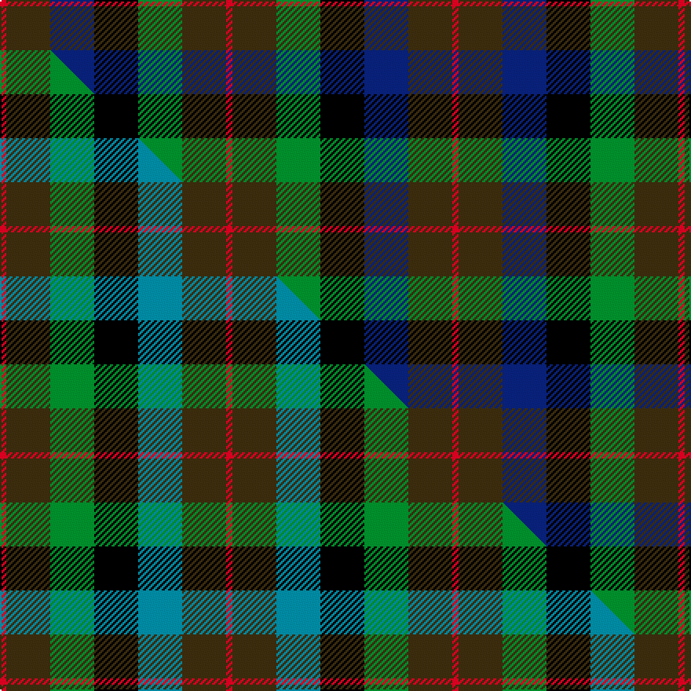

This is one **variant** — a specific cloth: this exact thread count and colourway, with its own
provenance below. It is one weaving of the [sett](/setts/r1dy7db7k7g7dy7r1/) (the scale-free proportion — the
same cloth at any scale or shade), whose colour order is pattern [RGBKGGR](/stripes/rgbkggr/).

Part of the [Tennant](/tartans/tennant-4/) tartan — the named design grouping this sett with its other cloths.

Sourced from house-of-tartan.  It is a [7 stripe tartan](/stripes/stripes7/).

Original link [http://www.house-of-tartan.scotland.net/house/TartanViewjs.asp?colr=Def&tnam=1653](http://www.house-of-tartan.scotland.net/house/TartanViewjs.asp?colr=Def&tnam=1653)

## Provenance

Earliest known date: 1930 MacGregor-Hastie made few notes about his sample collection. In December 1967, Captain Tennant wrote to the Scottish Tartans Society, saying, ".. and I have no objection to other Tennants wearing it (Tennant tartan) but their problem will be to get hold of it ... I don't know of any other Tennant tartan and that is why I think my father designed this one." The head of the Tennant family is Lord Glenconner, descended from John Tennant of Blairston, Ayr. (1635).

Dataset <small>— provenance for this record, inherited from the source manifest</small>

<dl class="dataset-prov">
<dt>source</dt><dd><a href="/sources/house-of-tartan/">House of Tartan</a></dd>
<dt>data captured from</dt><dd><a href="https://github.com/thetartan/tartan-database/blob/master/data/house-of-tartan/data.csv">https://github.com/thetartan/tartan-database/blob/master/data/house-of-tartan/data.csv</a></dd>
<dt>data date</dt><dd>1930 <small>(this record)</small></dd>
<dt>licence</dt><dd><a href="https://creativecommons.org/licenses/by-nc-nd/4.0/">CC BY-NC-ND 4.0</a></dd>
</dl>

Capture chain <small>— the hands this data passed through, oldest first; each capture carries its own licence</small>

<ol class="capture-chain">
<li><a href="http://www.house-of-tartan.scotland.net/">House of Tartan</a> <small>the weaver/retailer's database — the site is now offline; the URL is kept as the ultimate source's identity</small></li>
<li><a href="https://github.com/thetartan/tartan-database">thetartan/tartan-database</a> <small>2016-2017</small> · <a href="https://creativecommons.org/licenses/by-nc-nd/4.0/">CC BY-NC-ND 4.0</a> <small>Levko Kravets's frozen compilation — the capture we vendored, and where its CC licence text came from</small></li>
<li>this dictionary <small>captured 2026-06-10 · commit 5bf86c7566</small> <small>each re-capture is a git commit to data/sources</small></li>
</ol>

## Thread count
R/4 DY28 DB28 K28 G28 DY28 R/4

One full sett is **288 threads**.

## Palette
<table><thead><tr><th>Colour</th><th>Shade</th><th>OKLCh</th></tr></thead><tbody><tr><td>DB</td><td><code style="background-color:#082077;">#082077</code> <small style="color:#888">#082077</small></td><td><small style="color:#888">oklch(30.0% 0.149 265.1)</small></td></tr><tr><td>G</td><td><code style="background-color:#008B2A;">#008B2A</code> <small style="color:#888">#008B2A</small></td><td><small style="color:#888">oklch(55.4% 0.170 145.9)</small></td></tr><tr><td>K</td><td><code style="background-color:#000000;">#000000</code> <small style="color:#888">#000000</small></td><td><small style="color:#888">oklch(0.0% 0.000 0.0)</small></td></tr><tr><td>R</td><td><code style="background-color:#D60020;">#D60020</code> <small style="color:#888">#D60020</small></td><td><small style="color:#888">oklch(55.2% 0.224 25.5)</small></td></tr><tr><td>DY</td><td><code style="background-color:#3A2B0D;">#3A2B0D</code> <small style="color:#888">#3A2B0D</small></td><td><small style="color:#888">oklch(30.0% 0.049 82.0)</small></td></tr></tbody></table>

# Sample pattern

## Compared to the master

This cloth is one sett of its design; the master sett (the exemplar the design is anchored on) is below for comparison.

Its **ΔTartan distance** from the master is **0.11** — the same measure the nearest-tartans table ranks by (0 is identical; a re-scale of the same cloth is near 0, a recolour or a different proportion further).

<figure class="master-compare" style="margin:0">

this sett
master sett ★

<figcaption style="color:#888;font-size:smaller">One weave of this sett against the <a href="/setts/r1dy7g7k7t7dy7r1/">master sett ★</a>, split on the diagonal: a shared proportion runs seamlessly across it with only the shades shifting; a different proportion breaks on it.</figcaption>
</figure>

## Nearest tartan variants

The nearest existing variants by ΔTartan distance, with this cloth at the top so the swatches line up against it.

ΔTartan

Threads

Variant

Sett

—

288

<a href="/variants/s7/r1dy7db7k7g7dy7r1~x4/">Tennant Family Tartan</a>

<a href="/ttd/edit/#slug=r1dy7g7k7t7dy7r1~x4&amp;base=r1dy7db7k7g7dy7r1~x4" title="compare in the TTD">0.11</a>

288

<a href="/variants/s7/r1dy7g7k7t7dy7r1~x4/">Tennant #2</a>

<a href="/ttd/edit/#slug=dy8r1dy8g8k8db8dy8r2~x2&amp;base=r1dy7db7k7g7dy7r1~x4" title="compare in the TTD">1.39</a>

184

<a href="/variants/s8/dy8r1dy8g8k8db8dy8r2~x2/">MacDuff Hunting Clan Tartan</a>

<a href="/ttd/edit/#slug=do10r2do10g17k12db9do9r2~x2&amp;base=r1dy7db7k7g7dy7r1~x4" title="compare in the TTD">1.43</a>

260

<a href="/variants/s8/do10r2do10g17k12db9do9r2~x2/">MacDuff Hunting</a>

<a href="/ttd/edit/#slug=r2b3n12k11dg11y2~x2~n2003284-dg1304144&amp;base=r1dy7db7k7g7dy7r1~x4" title="compare in the TTD">1.91</a>

156

<a href="/variants/s6/r2b3n12k11dg11y2~x2~n2003284-dg1304144/">Huntly Gordon</a>

<a href="/ttd/edit/#slug=db14g18k3g18dr20k14lo3~x2&amp;base=r1dy7db7k7g7dy7r1~x4" title="compare in the TTD">2.13</a>

326

<a href="/variants/s7/db14g18k3g18dr20k14lo3~x2/">Scottish Parliament (unofficial)</a>

<a href="/ttd/edit/#slug=r4dg11k11dg2db11g3~x4~dg1803171-g1904130&amp;base=r1dy7db7k7g7dy7r1~x4" title="compare in the TTD">2.25</a>

308

<a href="/variants/s6/r4dg11k11dg2db11g3~x4~dg1803171-g1904130/">Casely</a>

<a href="/ttd/edit/#slug=r1do7db7k7g7do7r1~x4&amp;base=r1dy7db7k7g7dy7r1~x4" title="compare in the TTD">2.25</a>

288

<a href="/variants/s7/r1do7db7k7g7do7r1~x4/">Tennant</a>

<a href="/ttd/edit/#slug=r1do7g7k7t7do7r1~x4&amp;base=r1dy7db7k7g7dy7r1~x4" title="compare in the TTD">2.28</a>

288

<a href="/variants/s7/r1do7g7k7t7do7r1~x4/">Tennant (Clan)</a>

<a href="/ttd/edit/#slug=k7db11k3db11dy11g22db3~x2~db1605267&amp;base=r1dy7db7k7g7dy7r1~x4" title="compare in the TTD">2.38</a>

252

<a href="/variants/s7/k7db11k3db11dy11g22db3~x2~db1605267/">Scottish Odyssey Commemorative Tartan</a>

<a href="/ttd/edit/#slug=dp11lb2k10g10y3~x2&amp;base=r1dy7db7k7g7dy7r1~x4" title="compare in the TTD">2.43</a>

116

<a href="/variants/s5/dp11lb2k10g10y3~x2/">Wilson's No.217</a>

## Neighbour map

Every grey dot is one of 13621 variants placed by the first two principal components of the ΔTartan feature space (42% of its variance). Red is this tartan; blue dots are its nearest — click one to open its page.

<svg viewBox="0 0 640 380" role="img" style="max-width:100%;height:auto;border:1px solid #e0e0e0;border-radius:4px;display:block" xmlns="http://www.w3.org/2000/svg"><image href="/nn/cloud.v1.png" width="640" height="380"/><a href="/variants/s7/r1dy7g7k7t7dy7r1~x4/"><circle cx="110.5" cy="230.9" r="4" fill="#3465a4"><title>Tennant #2</title></circle></a><a href="/variants/s8/dy8r1dy8g8k8db8dy8r2~x2/"><circle cx="170.3" cy="232.8" r="4" fill="#3465a4"><title>MacDuff Hunting Clan Tartan</title></circle></a><a href="/variants/s8/do10r2do10g17k12db9do9r2~x2/"><circle cx="140.8" cy="218.1" r="4" fill="#3465a4"><title>MacDuff Hunting</title></circle></a><a href="/variants/s6/r2b3n12k11dg11y2~x2~n2003284-dg1304144/"><circle cx="76.3" cy="211.3" r="4" fill="#3465a4"><title>Huntly Gordon</title></circle></a><a href="/variants/s7/db14g18k3g18dr20k14lo3~x2/"><circle cx="108.6" cy="229.4" r="4" fill="#3465a4"><title>Scottish Parliament (unofficial)</title></circle></a><a href="/variants/s6/r4dg11k11dg2db11g3~x4~dg1803171-g1904130/"><circle cx="94.6" cy="238.2" r="4" fill="#3465a4"><title>Casely</title></circle></a><a href="/variants/s7/r1do7db7k7g7do7r1~x4/"><circle cx="124.0" cy="232.6" r="4" fill="#3465a4"><title>Tennant</title></circle></a><a href="/variants/s7/r1do7g7k7t7do7r1~x4/"><circle cx="111.0" cy="230.3" r="4" fill="#3465a4"><title>Tennant (Clan)</title></circle></a><a href="/variants/s7/k7db11k3db11dy11g22db3~x2~db1605267/"><circle cx="141.1" cy="224.7" r="4" fill="#3465a4"><title>Scottish Odyssey Commemorative Tartan</title></circle></a><a href="/variants/s5/dp11lb2k10g10y3~x2/"><circle cx="73.4" cy="223.9" r="4" fill="#3465a4"><title>Wilson's No.217</title></circle></a><circle cx="123.2" cy="233.1" r="5" fill="#c00000"/><text x="320" y="376" text-anchor="middle" font-size="11" fill="#999">ground</text><text x="11" y="190" text-anchor="middle" font-size="11" fill="#999" transform="rotate(-90 11 190)">complexity</text></svg>

ID: /variants/s7/r1dy7db7k7g7dy7r1~x4/
