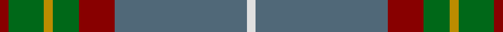
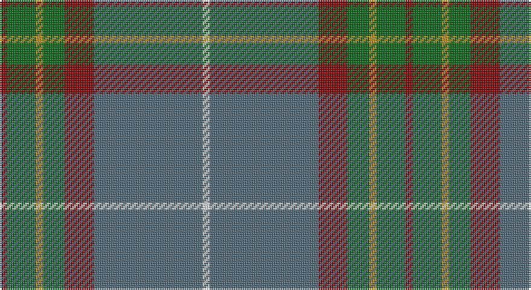

This page is one **sett** — a single exact thread-count. It belongs to the [tartan](/setts/r1g4lo1g3r4n15w1/)
(the same proportion at any scale), whose colour order is pattern [RGYGRBW](/stripes/rgygrbw/).

Part of the [Bressuire](/tartans/bressuire/) tartan — the named design grouping this sett with its other cloths.

Sourced from tartans-authority.  It is a [7 stripe tartan](/stripes/stripes7/).

Original link http://www.tartansauthority.com/tartan-ferret/display/10260/

## Register references

External register numbers recorded for this tartan.

- Scottish Register of Tartans: [10260](https://www.tartanregister.gov.uk/tartanDetails?ref=10260)
- Scottish Tartans Authority (ITI): 10260

## Thread count
DR/4 G16 DY4 G12 DR16 N60 LN/4

One full sett is **224 threads**.

## Palette

Palette: <strong>Tartan Register</strong> <small style="color:#888">(4 of 5 colours)</small>
<table><thead><tr><th>Colour</th><th>Threads</th><th>Shade</th><th>Base</th><th>OKLCh</th></tr></thead><tbody><tr><td>DR/</td><td style="text-align:right;font-variant-numeric:tabular-nums">4</td><td><code style="background-color:#880000;">#880000</code> <small style="color:#888">#880000</small></td><td>R <code style="background-color:#CC0000;">#CC0000</code></td><td><small style="color:#888">oklch(39.4% 0.162 29.2)</small></td></tr><tr><td>G</td><td style="text-align:right;font-variant-numeric:tabular-nums">16</td><td><code style="background-color:#006818;">#006818</code> <small style="color:#888">#006818</small></td><td>G <code style="background-color:#006100;">#006100</code></td><td><small style="color:#888">oklch(45.0% 0.142 145.0)</small></td></tr><tr><td>DY</td><td style="text-align:right;font-variant-numeric:tabular-nums">4</td><td><code style="background-color:#BC8C00;">#BC8C00</code> <small style="color:#888">#BC8C00</small></td><td>Y <code style="background-color:#F2BF00;">#F2BF00</code></td><td><small style="color:#888">oklch(66.8% 0.137 84.1)</small></td></tr><tr><td>G</td><td style="text-align:right;font-variant-numeric:tabular-nums">12</td><td><code style="background-color:#006818;">#006818</code> <small style="color:#888">#006818</small></td><td>G <code style="background-color:#006100;">#006100</code></td><td><small style="color:#888">oklch(45.0% 0.142 145.0)</small></td></tr><tr><td>DR</td><td style="text-align:right;font-variant-numeric:tabular-nums">16</td><td><code style="background-color:#880000;">#880000</code> <small style="color:#888">#880000</small></td><td>R <code style="background-color:#CC0000;">#CC0000</code></td><td><small style="color:#888">oklch(39.4% 0.162 29.2)</small></td></tr><tr><td>N</td><td style="text-align:right;font-variant-numeric:tabular-nums">60</td><td><code style="background-color:#506878;">#506878</code> <small style="color:#888">#506878</small></td><td>B <code style="background-color:#2A418A;">#2A418A</code></td><td><small style="color:#888">oklch(50.4% 0.038 237.7)</small></td></tr><tr><td>LN/</td><td style="text-align:right;font-variant-numeric:tabular-nums">4</td><td><code style="background-color:#E0E0E0;">#E0E0E0</code> <small style="color:#888">#E0E0E0</small></td><td>W <code style="background-color:#F7F7F7;">#F7F7F7</code></td><td><small style="color:#888">oklch(90.7% 0.000 89.9)</small></td></tr></tbody></table>

# Sample pattern

## Compared to the master

This cloth is one sett of its design; the master sett (the exemplar the design is anchored on) is below for comparison.

<figure style="margin:0"><figcaption style="color:#888;font-size:smaller">this sett</figcaption></figure>
<figure style="margin:0"><figcaption style="color:#888;font-size:smaller"><a href="/setts/dr1dg4y1dg3dr4dt15w1/">master sett →</a></figcaption></figure>

## Nearest tartans

The nearest existing variants by ΔTartan distance, with this tartan at the top so the swatches line up against it.

ΔTartan

Tartan

Sett

—

<a href="/ttd/edit/#slug=r1g4lo1g3r4n15w1~x4">Bressuire (District)</a> <a class="nn-out" href="/variants/s7/r1g4lo1g3r4n15w1~x4/" title="open its dictionary page">↗</a>

0.86

<a href="/ttd/edit/#slug=o3lr4o4do4o18do3n36w3~x2&amp;base=r1g4lo1g3r4n15w1~x4">Hebridean Granite Fashion Tartan</a> <a class="nn-out" href="/variants/s8/o3lr4o4do4o18do3n36w3~x2/" title="open its dictionary page">↗</a>

0.95

<a href="/ttd/edit/#slug=ri4y2db4y35t27r3~x2&amp;base=r1g4lo1g3r4n15w1~x4">Royal Deeside (District)</a> <a class="nn-out" href="/variants/s6/ri4y2db4y35t27r3~x2/" title="open its dictionary page">↗</a>

0.96

<a href="/ttd/edit/#slug=lp4dy2dp4dy35n27r3~x2&amp;base=r1g4lo1g3r4n15w1~x4">Deeside, Royal</a> <a class="nn-out" href="/variants/s6/lp4dy2dp4dy35n27r3~x2/" title="open its dictionary page">↗</a>

0.98

<a href="/ttd/edit/#slug=n4o4n4k4n18k3do38w3~x2&amp;base=r1g4lo1g3r4n15w1~x4">Scotch Mist</a> <a class="nn-out" href="/variants/s8/n4o4n4k4n18k3do38w3~x2/" title="open its dictionary page">↗</a>

1.11

<a href="/ttd/edit/#slug=o3lr4o4k4o18k3n36w3~x2&amp;base=r1g4lo1g3r4n15w1~x4">Hebridean Granite (Fashion)</a> <a class="nn-out" href="/variants/s8/o3lr4o4k4o18k3n36w3~x2/" title="open its dictionary page">↗</a>

1.13

<a href="/variants/s7/dp3n24ni10n2g11n8w3~x2/">Hesco</a>

1.22

<a href="/ttd/edit/#slug=t32r3t3r3t3r10g24ri3~x2&amp;base=r1g4lo1g3r4n15w1~x4">Gammell (Personal)</a> <a class="nn-out" href="/variants/s8/t32r3t3r3t3r10g24ri3~x2/" title="open its dictionary page">↗</a>

1.24

<a href="/ttd/edit/#slug=y12db2r2db2dt26dg2y3dg3y24r4~x2&amp;base=r1g4lo1g3r4n15w1~x4">New South Wales Waratah</a> <a class="nn-out" href="/variants/s10/y12db2r2db2dt26dg2y3dg3y24r4~x2/" title="open its dictionary page">↗</a>

1.28

<a href="/ttd/edit/#slug=o6w1o24db6g2db1g2db1g12r1~x2&amp;base=r1g4lo1g3r4n15w1~x4">Chisholm hunting</a> <a class="nn-out" href="/variants/s10/o6w1o24db6g2db1g2db1g12r1~x2/" title="open its dictionary page">↗</a>

1.30

<a href="/ttd/edit/#slug=db3g13lr1o3lr1db10lo1~x2&amp;base=r1g4lo1g3r4n15w1~x4">Graeme Heckenberg Hunting</a> <a class="nn-out" href="/variants/s7/db3g13lr1o3lr1db10lo1~x2/" title="open its dictionary page">↗</a>

## Neighbour map

Every grey dot is one of 14360 variants placed by the first two principal components of the ΔTartan feature space (44% of its variance). Red is this tartan; blue dots are its nearest — click one to open its page.

<svg viewBox="0 0 640 380" role="img" style="max-width:100%;height:auto;border:1px solid #e0e0e0;border-radius:4px;display:block" xmlns="http://www.w3.org/2000/svg"><image href="/nn/cloud.v1.png" width="640" height="380"/><a href="/variants/s8/o3lr4o4do4o18do3n36w3~x2/"><circle cx="302.6" cy="173.7" r="4" fill="#3465a4"><title>Hebridean Granite Fashion Tartan</title></circle></a><a href="/variants/s6/ri4y2db4y35t27r3~x2/"><circle cx="341.4" cy="187.2" r="4" fill="#3465a4"><title>Royal Deeside (District)</title></circle></a><a href="/variants/s6/lp4dy2dp4dy35n27r3~x2/"><circle cx="337.6" cy="188.7" r="4" fill="#3465a4"><title>Deeside, Royal</title></circle></a><a href="/variants/s8/n4o4n4k4n18k3do38w3~x2/"><circle cx="329.7" cy="186.4" r="4" fill="#3465a4"><title>Scotch Mist</title></circle></a><a href="/variants/s8/o3lr4o4k4o18k3n36w3~x2/"><circle cx="291.1" cy="167.2" r="4" fill="#3465a4"><title>Hebridean Granite (Fashion)</title></circle></a><a href="/variants/s7/dp3n24ni10n2g11n8w3~x2/"><circle cx="323.8" cy="218.0" r="4" fill="#3465a4"><title>Hesco</title></circle></a><a href="/variants/s8/t32r3t3r3t3r10g24ri3~x2/"><circle cx="303.4" cy="202.2" r="4" fill="#3465a4"><title>Gammell (Personal)</title></circle></a><a href="/variants/s10/y12db2r2db2dt26dg2y3dg3y24r4~x2/"><circle cx="323.5" cy="184.7" r="4" fill="#3465a4"><title>New South Wales Waratah</title></circle></a><a href="/variants/s10/o6w1o24db6g2db1g2db1g12r1~x2/"><circle cx="382.3" cy="151.9" r="4" fill="#3465a4"><title>Chisholm hunting</title></circle></a><a href="/variants/s7/db3g13lr1o3lr1db10lo1~x2/"><circle cx="261.5" cy="191.5" r="4" fill="#3465a4"><title>Graeme Heckenberg Hunting</title></circle></a><circle cx="332.3" cy="183.6" r="5" fill="#c00000"/></svg>

ID: /variants/s7/r1g4lo1g3r4n15w1~x4/
