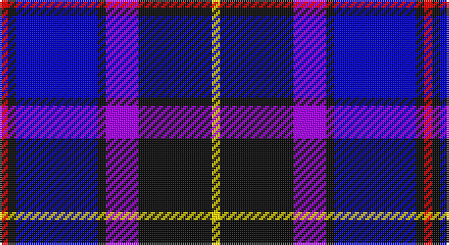

This page is one **sett** — a single exact thread-count. It belongs to the [tartan](/setts/r1k1db10k1p4k9ly1/)
(the same proportion at any scale), whose colour order is pattern [RKBKBKY](/stripes/rkbkbky/).

Sourced from register-of-tartans.  It is a [7 stripe tartan](/stripes/stripes7/).

Original link https://www.tartanregister.gov.uk/tartanDetails.aspx?ref=10221

## Register references

External register numbers recorded for this tartan.

- Scottish Register of Tartans: [10221](https://www.tartanregister.gov.uk/tartanDetails.aspx?ref=10221)

## Thread count
R/4 K4 B40 K4 P16 K36 Y/4

One full sett is **208 threads**.

## Palette

Palette: <strong>Tartan Register</strong>
<table><thead><tr><th>Colour</th><th>Threads</th><th>Shade</th><th>Base</th><th>OKLCh</th></tr></thead><tbody><tr><td>R/</td><td style="text-align:right;font-variant-numeric:tabular-nums">4</td><td><code style="background-color:#FF0000;">#FF0000</code> <small style="color:#888">#FF0000</small></td><td>R <code style="background-color:#CC0000;">#CC0000</code></td><td><small style="color:#888">oklch(62.8% 0.258 29.2)</small></td></tr><tr><td>K</td><td style="text-align:right;font-variant-numeric:tabular-nums">4</td><td><code style="background-color:#101010;">#101010</code> <small style="color:#888">#101010</small></td><td>K <code style="background-color:#000000;">#000000</code></td><td><small style="color:#888">oklch(17.3% 0.000 89.9)</small></td></tr><tr><td>B</td><td style="text-align:right;font-variant-numeric:tabular-nums">40</td><td><code style="background-color:#0000CD;">#0000CD</code> <small style="color:#888">#0000CD</small></td><td>B <code style="background-color:#2A418A;">#2A418A</code></td><td><small style="color:#888">oklch(38.3% 0.266 264.1)</small></td></tr><tr><td>K</td><td style="text-align:right;font-variant-numeric:tabular-nums">4</td><td><code style="background-color:#101010;">#101010</code> <small style="color:#888">#101010</small></td><td>K <code style="background-color:#000000;">#000000</code></td><td><small style="color:#888">oklch(17.3% 0.000 89.9)</small></td></tr><tr><td>P</td><td style="text-align:right;font-variant-numeric:tabular-nums">16</td><td><code style="background-color:#AA00FF;">#AA00FF</code> <small style="color:#888">#AA00FF</small></td><td>B <code style="background-color:#2A418A;">#2A418A</code></td><td><small style="color:#888">oklch(58.1% 0.299 307.0)</small></td></tr><tr><td>K</td><td style="text-align:right;font-variant-numeric:tabular-nums">36</td><td><code style="background-color:#101010;">#101010</code> <small style="color:#888">#101010</small></td><td>K <code style="background-color:#000000;">#000000</code></td><td><small style="color:#888">oklch(17.3% 0.000 89.9)</small></td></tr><tr><td>Y/</td><td style="text-align:right;font-variant-numeric:tabular-nums">4</td><td><code style="background-color:#FFE600;">#FFE600</code> <small style="color:#888">#FFE600</small></td><td>Y <code style="background-color:#F2BF00;">#F2BF00</code></td><td><small style="color:#888">oklch(91.7% 0.192 101.4)</small></td></tr></tbody></table>

# Sample pattern

## Nearest tartans

The nearest existing variants by ΔTartan distance, with this tartan at the top so the swatches line up against it.

ΔTartan

Tartan

Sett

—

<a href="/ttd/edit/#slug=r1k1db10k1p4k9ly1~x4">Graeme High School Homecoming 2009</a> <a class="nn-out" href="/variants/s7/r1k1db10k1p4k9ly1~x4/" title="open its dictionary page">↗</a>

1.32

<a href="/ttd/edit/#slug=w2db15y2dbi20r9w2~x2&amp;base=r1k1db10k1p4k9ly1~x4">The Open Championship</a> <a class="nn-out" href="/variants/s6/w2db15y2dbi20r9w2~x2/" title="open its dictionary page">↗</a>

1.35

<a href="/ttd/edit/#slug=k3r2k14lt2db6lt2db16lt3~x2&amp;base=r1k1db10k1p4k9ly1~x4">Immanuel Presbyterian Church (Milwaukee)</a> <a class="nn-out" href="/variants/s8/k3r2k14lt2db6lt2db16lt3~x2/" title="open its dictionary page">↗</a>

1.38

<a href="/ttd/edit/#slug=w4db24ly2dbi24t5db4ly4~x2&amp;base=r1k1db10k1p4k9ly1~x4">Mina Perhonen Japanese Corporate Tartan</a> <a class="nn-out" href="/variants/s7/w4db24ly2dbi24t5db4ly4~x2/" title="open its dictionary page">↗</a>

1.45

<a href="/ttd/edit/#slug=p30db5p3db33lg8k3db8w2~x2&amp;base=r1k1db10k1p4k9ly1~x4">Saint Margaret of Scotland Youth Group</a> <a class="nn-out" href="/variants/s8/p30db5p3db33lg8k3db8w2~x2/" title="open its dictionary page">↗</a>

1.48

<a href="/ttd/edit/#slug=dbi26w2dbi3db15t26db2t3ly4~x2&amp;base=r1k1db10k1p4k9ly1~x4">Banff, and Buchan</a> <a class="nn-out" href="/variants/s8/dbi26w2dbi3db15t26db2t3ly4~x2/" title="open its dictionary page">↗</a>

1.52

<a href="/ttd/edit/#slug=k6db3k3db33k16b21k3b3r4~x2&amp;base=r1k1db10k1p4k9ly1~x4">USCBP - Office of Field Operations</a> <a class="nn-out" href="/variants/s9/k6db3k3db33k16b21k3b3r4~x2/" title="open its dictionary page">↗</a>

1.53

<a href="/ttd/edit/#slug=k17lb2k3db16t28db2t3lo2~x2&amp;base=r1k1db10k1p4k9ly1~x4">Banff and Buchan</a> <a class="nn-out" href="/variants/s8/k17lb2k3db16t28db2t3lo2~x2/" title="open its dictionary page">↗</a>

1.55

<a href="/variants/s7/k1db6b1ki6b6k1w1~x6/">Mary Washington</a>

1.58

<a href="/ttd/edit/#slug=r3db2w2db26k22w3db3w3~x2&amp;base=r1k1db10k1p4k9ly1~x4">DeCloud-McMasters (Personal)</a> <a class="nn-out" href="/variants/s8/r3db2w2db26k22w3db3w3~x2/" title="open its dictionary page">↗</a>

1.61

<a href="/ttd/edit/#slug=y16r8b57db56lb8&amp;base=r1k1db10k1p4k9ly1~x4">Bryson (1988)</a> <a class="nn-out" href="/variants/s5/y16r8b57db56lb8/" title="open its dictionary page">↗</a>

## Neighbour map

Every grey dot is one of 14360 variants placed by the first two principal components of the ΔTartan feature space (44% of its variance). Red is this tartan; blue dots are its nearest — click one to open its page.

<svg viewBox="0 0 640 380" role="img" style="max-width:100%;height:auto;border:1px solid #e0e0e0;border-radius:4px;display:block" xmlns="http://www.w3.org/2000/svg"><image href="/nn/cloud.v1.png" width="640" height="380"/><a href="/variants/s6/w2db15y2dbi20r9w2~x2/"><circle cx="176.8" cy="189.4" r="4" fill="#3465a4"><title>The Open Championship</title></circle></a><a href="/variants/s8/k3r2k14lt2db6lt2db16lt3~x2/"><circle cx="209.3" cy="200.2" r="4" fill="#3465a4"><title>Immanuel Presbyterian Church (Milwaukee)</title></circle></a><a href="/variants/s7/w4db24ly2dbi24t5db4ly4~x2/"><circle cx="212.6" cy="177.3" r="4" fill="#3465a4"><title>Mina Perhonen Japanese Corporate Tartan</title></circle></a><a href="/variants/s8/p30db5p3db33lg8k3db8w2~x2/"><circle cx="279.6" cy="157.8" r="4" fill="#3465a4"><title>Saint Margaret of Scotland Youth Group</title></circle></a><a href="/variants/s8/dbi26w2dbi3db15t26db2t3ly4~x2/"><circle cx="182.0" cy="165.4" r="4" fill="#3465a4"><title>Banff, and Buchan</title></circle></a><a href="/variants/s9/k6db3k3db33k16b21k3b3r4~x2/"><circle cx="206.0" cy="186.3" r="4" fill="#3465a4"><title>USCBP - Office of Field Operations</title></circle></a><a href="/variants/s8/k17lb2k3db16t28db2t3lo2~x2/"><circle cx="199.3" cy="157.4" r="4" fill="#3465a4"><title>Banff and Buchan</title></circle></a><a href="/variants/s7/k1db6b1ki6b6k1w1~x6/"><circle cx="101.4" cy="204.9" r="4" fill="#3465a4"><title>Mary Washington</title></circle></a><a href="/variants/s8/r3db2w2db26k22w3db3w3~x2/"><circle cx="256.3" cy="162.2" r="4" fill="#3465a4"><title>DeCloud-McMasters (Personal)</title></circle></a><a href="/variants/s5/y16r8b57db56lb8/"><circle cx="177.0" cy="221.4" r="4" fill="#3465a4"><title>Bryson (1988)</title></circle></a><circle cx="189.0" cy="174.7" r="5" fill="#c00000"/></svg>

ID: /variants/s7/r1k1db10k1p4k9ly1~x4/
