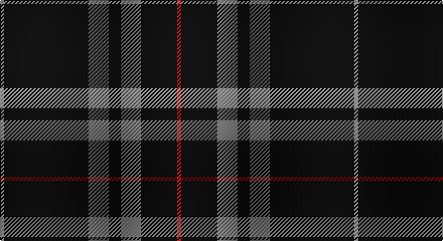

This page is one **sett** — a single exact thread-count. It belongs to the [tartan](/setts/r1k9o5k3o5k21o1/)
(the same proportion at any scale), whose colour order is pattern [RKRKRKR](/stripes/rkrkrkr/).

Sourced from tartans-authority.  It is a [7 stripe tartan](/stripes/stripes7/).

Original link http://www.tartansauthority.com/tartan-ferret/display/7511/

## Provenance

Earliest known date: July 2007 Woven by Lochcarron for Lyle & Scott of Hawick. Count & sample from Lochcarron.

3 attestations — the source records this cloth was collapsed from (oldest owns this page)

<ul>
<li>July 2007 — Sunderland of Scotland (Fashion) (tartans-authority, <a href="http://www.tartansauthority.com/tartan-ferret/display/7511/">record</a>)</li>
<li>undated — Sunderland of Scotland (register-of-tartans, <a href="https://www.tartanregister.gov.uk/tartanDetails.aspx?ref=5549">record</a>)</li>
<li>undated — Sunderland of Scotland Fashion Tartan (house-of-tartan, <a href="http://www.house-of-tartan.scotland.net/house/TartanViewjs.asp?colr=Def&tnam=7511">record</a>)</li>
</ul>

## Register references

External register numbers recorded for this tartan.

- Scottish Register of Tartans: [5549](https://www.tartanregister.gov.uk/tartanDetails.aspx?ref=5549)
- Scottish Tartans Authority (ITI): 7511

## Thread count
N/4 K84 N20 K12 N20 K36 R/4

One full sett is **352 threads**.

## Palette

Palette: <strong>Tartan Register</strong>
<table><thead><tr><th>Colour</th><th>Threads</th><th>Shade</th><th>Base</th><th>OKLCh</th></tr></thead><tbody><tr><td>N/</td><td style="text-align:right;font-variant-numeric:tabular-nums">4</td><td><code style="background-color:#888888;">#888888</code> <small style="color:#888">#888888</small></td><td>R <code style="background-color:#CC0000;">#CC0000</code></td><td><small style="color:#888">oklch(62.7% 0.000 89.9)</small></td></tr><tr><td>K</td><td style="text-align:right;font-variant-numeric:tabular-nums">84</td><td><code style="background-color:#101010;">#101010</code> <small style="color:#888">#101010</small></td><td>K <code style="background-color:#000000;">#000000</code></td><td><small style="color:#888">oklch(17.3% 0.000 89.9)</small></td></tr><tr><td>N</td><td style="text-align:right;font-variant-numeric:tabular-nums">20</td><td><code style="background-color:#888888;">#888888</code> <small style="color:#888">#888888</small></td><td>R <code style="background-color:#CC0000;">#CC0000</code></td><td><small style="color:#888">oklch(62.7% 0.000 89.9)</small></td></tr><tr><td>K</td><td style="text-align:right;font-variant-numeric:tabular-nums">12</td><td><code style="background-color:#101010;">#101010</code> <small style="color:#888">#101010</small></td><td>K <code style="background-color:#000000;">#000000</code></td><td><small style="color:#888">oklch(17.3% 0.000 89.9)</small></td></tr><tr><td>N</td><td style="text-align:right;font-variant-numeric:tabular-nums">20</td><td><code style="background-color:#888888;">#888888</code> <small style="color:#888">#888888</small></td><td>R <code style="background-color:#CC0000;">#CC0000</code></td><td><small style="color:#888">oklch(62.7% 0.000 89.9)</small></td></tr><tr><td>K</td><td style="text-align:right;font-variant-numeric:tabular-nums">36</td><td><code style="background-color:#101010;">#101010</code> <small style="color:#888">#101010</small></td><td>K <code style="background-color:#000000;">#000000</code></td><td><small style="color:#888">oklch(17.3% 0.000 89.9)</small></td></tr><tr><td>R/</td><td style="text-align:right;font-variant-numeric:tabular-nums">4</td><td><code style="background-color:#C80000;">#C80000</code> <small style="color:#888">#C80000</small></td><td>R <code style="background-color:#CC0000;">#CC0000</code></td><td><small style="color:#888">oklch(52.3% 0.215 29.2)</small></td></tr></tbody></table>

# Sample pattern

## Nearest tartans

The nearest existing variants by ΔTartan distance, with this tartan at the top so the swatches line up against it.

ΔTartan

Tartan

Sett

—

<a href="/ttd/edit/#slug=r1k9o5k3o5k21o1~x4">Sunderland of Scotland (Fashion)</a> <a class="nn-out" href="/variants/s7/r1k9o5k3o5k21o1~x4/" title="open its dictionary page">↗</a>

1.14

<a href="/ttd/edit/#slug=k75y26y3k4ly6~x2&amp;base=r1k9o5k3o5k21o1~x4">Perry Ancient (Personal)</a> <a class="nn-out" href="/variants/s5/k75y26y3k4ly6~x2/" title="open its dictionary page">↗</a>

1.14

<a href="/ttd/edit/#slug=n3k31w6k8n3k12w2~x2&amp;base=r1k9o5k3o5k21o1~x4">Believe - Colette</a> <a class="nn-out" href="/variants/s7/n3k31w6k8n3k12w2~x2/" title="open its dictionary page">↗</a>

1.17

<a href="/ttd/edit/#slug=n3k31w6k7n3k12w2~x2&amp;base=r1k9o5k3o5k21o1~x4">Believe - Colette</a> <a class="nn-out" href="/variants/s7/n3k31w6k7n3k12w2~x2/" title="open its dictionary page">↗</a>

1.18

<a href="/ttd/edit/#slug=k2w1k2r6k6r3k28w2~x2&amp;base=r1k9o5k3o5k21o1~x4">Brockton</a> <a class="nn-out" href="/variants/s8/k2w1k2r6k6r3k28w2~x2/" title="open its dictionary page">↗</a>

1.24

<a href="/ttd/edit/#slug=g12k8w6k22w3k8w3k40g6&amp;base=r1k9o5k3o5k21o1~x4">Jensen, Sven (Personal)</a> <a class="nn-out" href="/variants/s9/g12k8w6k22w3k8w3k40g6/" title="open its dictionary page">↗</a>

1.27

<a href="/ttd/edit/#slug=k10y5k2y5k10w1k26w1y4w1k5w1~x2&amp;base=r1k9o5k3o5k21o1~x4">Clergy #3</a> <a class="nn-out" href="/variants/s12/k10y5k2y5k10w1k26w1y4w1k5w1~x2/" title="open its dictionary page">↗</a>

1.29

<a href="/ttd/edit/#slug=k1o2k7o11k18ly2k1~x2&amp;base=r1k9o5k3o5k21o1~x4">DDB Canada (Fashion)</a> <a class="nn-out" href="/variants/s7/k1o2k7o11k18ly2k1~x2/" title="open its dictionary page">↗</a>

1.37

<a href="/ttd/edit/#slug=k14n2k2n5k25w1n9p3k3w1k14~x2&amp;base=r1k9o5k3o5k21o1~x4">Springbank</a> <a class="nn-out" href="/variants/s11/k14n2k2n5k25w1n9p3k3w1k14~x2/" title="open its dictionary page">↗</a>

1.38

<a href="/ttd/edit/#slug=k53o22k10o10k2o4~x2&amp;base=r1k9o5k3o5k21o1~x4">Black Isle</a> <a class="nn-out" href="/variants/s6/k53o22k10o10k2o4~x2/" title="open its dictionary page">↗</a>

1.39

<a href="/ttd/edit/#slug=r1k20lb5r1~x4&amp;base=r1k9o5k3o5k21o1~x4">Dobelman (Personal)</a> <a class="nn-out" href="/variants/s4/r1k20lb5r1~x4/" title="open its dictionary page">↗</a>

## Neighbour map

Every grey dot is one of 14360 variants placed by the first two principal components of the ΔTartan feature space (44% of its variance). Red is this tartan; blue dots are its nearest — click one to open its page.

<svg viewBox="0 0 640 380" role="img" style="max-width:100%;height:auto;border:1px solid #e0e0e0;border-radius:4px;display:block" xmlns="http://www.w3.org/2000/svg"><image href="/nn/cloud.v1.png" width="640" height="380"/><a href="/variants/s5/k75y26y3k4ly6~x2/"><circle cx="462.0" cy="183.0" r="4" fill="#3465a4"><title>Perry Ancient (Personal)</title></circle></a><a href="/variants/s7/n3k31w6k8n3k12w2~x2/"><circle cx="474.5" cy="195.0" r="4" fill="#3465a4"><title>Believe - Colette</title></circle></a><a href="/variants/s7/n3k31w6k7n3k12w2~x2/"><circle cx="471.4" cy="192.5" r="4" fill="#3465a4"><title>Believe - Colette</title></circle></a><a href="/variants/s8/k2w1k2r6k6r3k28w2~x2/"><circle cx="520.9" cy="156.5" r="4" fill="#3465a4"><title>Brockton</title></circle></a><a href="/variants/s9/g12k8w6k22w3k8w3k40g6/"><circle cx="416.0" cy="198.2" r="4" fill="#3465a4"><title>Jensen, Sven (Personal)</title></circle></a><a href="/variants/s12/k10y5k2y5k10w1k26w1y4w1k5w1~x2/"><circle cx="478.2" cy="150.8" r="4" fill="#3465a4"><title>Clergy #3</title></circle></a><a href="/variants/s7/k1o2k7o11k18ly2k1~x2/"><circle cx="394.7" cy="188.2" r="4" fill="#3465a4"><title>DDB Canada (Fashion)</title></circle></a><a href="/variants/s11/k14n2k2n5k25w1n9p3k3w1k14~x2/"><circle cx="466.6" cy="161.5" r="4" fill="#3465a4"><title>Springbank</title></circle></a><a href="/variants/s6/k53o22k10o10k2o4~x2/"><circle cx="449.6" cy="199.0" r="4" fill="#3465a4"><title>Black Isle</title></circle></a><a href="/variants/s4/r1k20lb5r1~x4/"><circle cx="478.4" cy="199.1" r="4" fill="#3465a4"><title>Dobelman (Personal)</title></circle></a><circle cx="479.2" cy="194.8" r="5" fill="#c00000"/></svg>

ID: /variants/s7/r1k9o5k3o5k21o1~x4/
