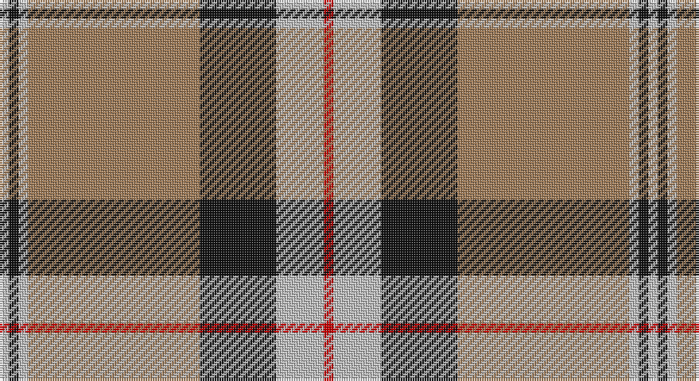

This page is one **sett** — a single exact thread-count. It belongs to the [tartan](/setts/r1lb5k8o18lb1k1lb1/)
(the same proportion at any scale), whose colour order is pattern [RWKRWKW](/stripes/rwkrwkw/).

Sourced from register-of-tartans.  It is a [7 stripe tartan](/stripes/stripes7/).

Original link https://www.tartanregister.gov.uk/tartanDetails.aspx?ref=2937

2 attestations — the source records this cloth was collapsed from (oldest owns this page)

<ul>
<li>01/01/1985 — Merrick, Camel (register-of-tartans, <a href="https://www.tartanregister.gov.uk/tartanDetails.aspx?ref=2937">record</a>)</li>
<li>1985 — Merrick, Camel (Fashion) (tartans-authority, <a href="http://www.tartansauthority.com/tartan-ferret/display/1688/">record</a>)</li>
</ul>

## Register references

External register numbers recorded for this tartan.

- Scottish Register of Tartans: [2937](https://www.tartanregister.gov.uk/tartanDetails.aspx?ref=2937)
- Scottish Tartans Authority (ITI): 1688
- Scottish Tartans World Register: 1688

## Thread count
N/4 K4 N4 LT72 K32 N20 R/4

One full sett is **272 threads**.

## Palette

Palette: <strong>Tartan Register</strong>
<table><thead><tr><th>Colour</th><th>Threads</th><th>Shade</th><th>Base</th><th>OKLCh</th></tr></thead><tbody><tr><td>N/</td><td style="text-align:right;font-variant-numeric:tabular-nums">4</td><td><code style="background-color:#C0C0C0;">#C0C0C0</code> <small style="color:#888">#C0C0C0</small></td><td>W <code style="background-color:#F7F7F7;">#F7F7F7</code></td><td><small style="color:#888">oklch(80.8% 0.000 89.9)</small></td></tr><tr><td>K</td><td style="text-align:right;font-variant-numeric:tabular-nums">4</td><td><code style="background-color:#101010;">#101010</code> <small style="color:#888">#101010</small></td><td>K <code style="background-color:#000000;">#000000</code></td><td><small style="color:#888">oklch(17.3% 0.000 89.9)</small></td></tr><tr><td>N</td><td style="text-align:right;font-variant-numeric:tabular-nums">4</td><td><code style="background-color:#C0C0C0;">#C0C0C0</code> <small style="color:#888">#C0C0C0</small></td><td>W <code style="background-color:#F7F7F7;">#F7F7F7</code></td><td><small style="color:#888">oklch(80.8% 0.000 89.9)</small></td></tr><tr><td>LT</td><td style="text-align:right;font-variant-numeric:tabular-nums">72</td><td><code style="background-color:#A07C58;">#A07C58</code> <small style="color:#888">#A07C58</small></td><td>R <code style="background-color:#CC0000;">#CC0000</code></td><td><small style="color:#888">oklch(61.2% 0.067 66.0)</small></td></tr><tr><td>K</td><td style="text-align:right;font-variant-numeric:tabular-nums">32</td><td><code style="background-color:#101010;">#101010</code> <small style="color:#888">#101010</small></td><td>K <code style="background-color:#000000;">#000000</code></td><td><small style="color:#888">oklch(17.3% 0.000 89.9)</small></td></tr><tr><td>N</td><td style="text-align:right;font-variant-numeric:tabular-nums">20</td><td><code style="background-color:#C0C0C0;">#C0C0C0</code> <small style="color:#888">#C0C0C0</small></td><td>W <code style="background-color:#F7F7F7;">#F7F7F7</code></td><td><small style="color:#888">oklch(80.8% 0.000 89.9)</small></td></tr><tr><td>R/</td><td style="text-align:right;font-variant-numeric:tabular-nums">4</td><td><code style="background-color:#C80000;">#C80000</code> <small style="color:#888">#C80000</small></td><td>R <code style="background-color:#CC0000;">#CC0000</code></td><td><small style="color:#888">oklch(52.3% 0.215 29.2)</small></td></tr></tbody></table>

# Sample pattern

## Nearest tartans

The nearest existing variants by ΔTartan distance, with this tartan at the top so the swatches line up against it.

ΔTartan

Tartan

Sett

—

<a href="/ttd/edit/#slug=r1lb5k8o18lb1k1lb1~x4">Merrick, Camel</a> <a class="nn-out" href="/variants/s7/r1lb5k8o18lb1k1lb1~x4/" title="open its dictionary page">↗</a>

0.43

<a href="/ttd/edit/#slug=r2lb10k15lo36lb2k2lb2~x2&amp;base=r1lb5k8o18lb1k1lb1~x4">Unidentified (ex Tony Murray)</a> <a class="nn-out" href="/variants/s7/r2lb10k15lo36lb2k2lb2~x2/" title="open its dictionary page">↗</a>

0.96

<a href="/ttd/edit/#slug=do2w2k6do3k2o14k1o1~x4&amp;base=r1lb5k8o18lb1k1lb1~x4">Braemar or Blair Atholl</a> <a class="nn-out" href="/variants/s8/do2w2k6do3k2o14k1o1~x4/" title="open its dictionary page">↗</a>

0.97

<a href="/ttd/edit/#slug=r4k2lb10k10y28k3~x2&amp;base=r1lb5k8o18lb1k1lb1~x4">Thomson Camel (Jedburgh Mill)</a> <a class="nn-out" href="/variants/s6/r4k2lb10k10y28k3~x2/" title="open its dictionary page">↗</a>

1.00

<a href="/ttd/edit/#slug=lb3k3lb3k3o15r1~x4&amp;base=r1lb5k8o18lb1k1lb1~x4">Tiree Grey</a> <a class="nn-out" href="/variants/s6/lb3k3lb3k3o15r1~x4/" title="open its dictionary page">↗</a>

1.05

<a href="/ttd/edit/#slug=do2lr2k6do3k2o14k1o1~x4&amp;base=r1lb5k8o18lb1k1lb1~x4">Blair Atholl (Fashion)</a> <a class="nn-out" href="/variants/s8/do2lr2k6do3k2o14k1o1~x4/" title="open its dictionary page">↗</a>

1.09

<a href="/ttd/edit/#slug=k9lr4k2lr4k2lr29k9lr4lg14ly2~x2&amp;base=r1lb5k8o18lb1k1lb1~x4">Hannay Dress (Dance)</a> <a class="nn-out" href="/variants/s10/k9lr4k2lr4k2lr29k9lr4lg14ly2~x2/" title="open its dictionary page">↗</a>

1.15

<a href="/ttd/edit/#slug=o10lb2lg3lb2do24lb4do4o34do2lb3do2~x2&amp;base=r1lb5k8o18lb1k1lb1~x4">Fort William (Fashion)</a> <a class="nn-out" href="/variants/s11/o10lb2lg3lb2do24lb4do4o34do2lb3do2~x2/" title="open its dictionary page">↗</a>

1.19

<a href="/ttd/edit/#slug=t1r1lo1k15lo15r1t1lo1~x4&amp;base=r1lb5k8o18lb1k1lb1~x4">Pittsburgh St Andrew's Society</a> <a class="nn-out" href="/variants/s8/t1r1lo1k15lo15r1t1lo1~x4/" title="open its dictionary page">↗</a>

1.21

<a href="/ttd/edit/#slug=r2w8k14dy25w2k2w2~x2&amp;base=r1lb5k8o18lb1k1lb1~x4">Merric Dark Camel.. Trade Tartan</a> <a class="nn-out" href="/variants/s7/r2w8k14dy25w2k2w2~x2/" title="open its dictionary page">↗</a>

1.22

<a href="/ttd/edit/#slug=k30w2lr4lo10w9k3lr5~x2&amp;base=r1lb5k8o18lb1k1lb1~x4">Virginia Commonwealth University</a> <a class="nn-out" href="/variants/s7/k30w2lr4lo10w9k3lr5~x2/" title="open its dictionary page">↗</a>

## Neighbour map

Every grey dot is one of 14360 variants placed by the first two principal components of the ΔTartan feature space (44% of its variance). Red is this tartan; blue dots are its nearest — click one to open its page.

<svg viewBox="0 0 640 380" role="img" style="max-width:100%;height:auto;border:1px solid #e0e0e0;border-radius:4px;display:block" xmlns="http://www.w3.org/2000/svg"><image href="/nn/cloud.v1.png" width="640" height="380"/><a href="/variants/s7/r2lb10k15lo36lb2k2lb2~x2/"><circle cx="291.2" cy="138.2" r="4" fill="#3465a4"><title>Unidentified (ex Tony Murray)</title></circle></a><a href="/variants/s8/do2w2k6do3k2o14k1o1~x4/"><circle cx="255.7" cy="155.3" r="4" fill="#3465a4"><title>Braemar or Blair Atholl</title></circle></a><a href="/variants/s6/r4k2lb10k10y28k3~x2/"><circle cx="260.4" cy="177.6" r="4" fill="#3465a4"><title>Thomson Camel (Jedburgh Mill)</title></circle></a><a href="/variants/s6/lb3k3lb3k3o15r1~x4/"><circle cx="290.6" cy="171.5" r="4" fill="#3465a4"><title>Tiree Grey</title></circle></a><a href="/variants/s8/do2lr2k6do3k2o14k1o1~x4/"><circle cx="267.3" cy="161.8" r="4" fill="#3465a4"><title>Blair Atholl (Fashion)</title></circle></a><a href="/variants/s10/k9lr4k2lr4k2lr29k9lr4lg14ly2~x2/"><circle cx="267.0" cy="139.7" r="4" fill="#3465a4"><title>Hannay Dress (Dance)</title></circle></a><a href="/variants/s11/o10lb2lg3lb2do24lb4do4o34do2lb3do2~x2/"><circle cx="297.5" cy="127.5" r="4" fill="#3465a4"><title>Fort William (Fashion)</title></circle></a><a href="/variants/s8/t1r1lo1k15lo15r1t1lo1~x4/"><circle cx="283.0" cy="129.6" r="4" fill="#3465a4"><title>Pittsburgh St Andrew's Society</title></circle></a><a href="/variants/s7/r2w8k14dy25w2k2w2~x2/"><circle cx="233.4" cy="163.7" r="4" fill="#3465a4"><title>Merric Dark Camel.. Trade Tartan</title></circle></a><a href="/variants/s7/k30w2lr4lo10w9k3lr5~x2/"><circle cx="247.3" cy="153.2" r="4" fill="#3465a4"><title>Virginia Commonwealth University</title></circle></a><circle cx="294.4" cy="143.3" r="5" fill="#c00000"/></svg>

ID: /variants/s7/r1lb5k8o18lb1k1lb1~x4/
