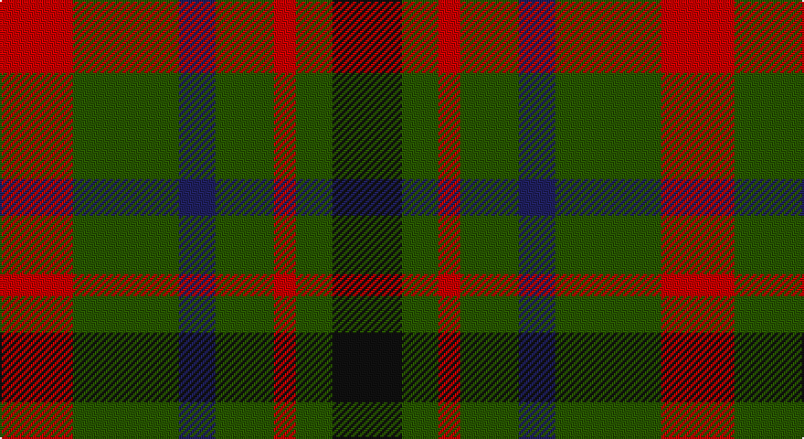

This page is one **sett** — a single exact thread-count. It belongs to the [tartan](/setts/r20dg29db10dg16r6dg10k19/)
(the same proportion at any scale), whose colour order is pattern [KGRGBGR](/stripes/kgrgbgr/).

Sourced from tartans-authority.  It is a [7 stripe tartan](/stripes/stripes7/).

Original link http://www.tartansauthority.com/tartan-ferret/display/1104/

## Register references

External register numbers recorded for this tartan.

- Scottish Tartans Authority (ITI): 1104

## Thread count
R/40 G58 DB20 G32 R12 G20 K/38

One full sett is **362 threads**.

## Palette

Palette: <strong>Tartan Register</strong>
<table><thead><tr><th>Colour</th><th>Threads</th><th>Shade</th><th>Base</th><th>OKLCh</th></tr></thead><tbody><tr><td>R/</td><td style="text-align:right;font-variant-numeric:tabular-nums">40</td><td><code style="background-color:#C80000;">#C80000</code> <small style="color:#888">#C80000</small></td><td>R <code style="background-color:#CC0000;">#CC0000</code></td><td><small style="color:#888">oklch(52.3% 0.215 29.2)</small></td></tr><tr><td>G</td><td style="text-align:right;font-variant-numeric:tabular-nums">58</td><td><code style="background-color:#285800;">#285800</code> <small style="color:#888">#285800</small></td><td>G <code style="background-color:#006100;">#006100</code></td><td><small style="color:#888">oklch(41.0% 0.122 135.8)</small></td></tr><tr><td>DB</td><td style="text-align:right;font-variant-numeric:tabular-nums">20</td><td><code style="background-color:#202060;">#202060</code> <small style="color:#888">#202060</small></td><td>B <code style="background-color:#2A418A;">#2A418A</code></td><td><small style="color:#888">oklch(28.9% 0.111 276.9)</small></td></tr><tr><td>G</td><td style="text-align:right;font-variant-numeric:tabular-nums">32</td><td><code style="background-color:#285800;">#285800</code> <small style="color:#888">#285800</small></td><td>G <code style="background-color:#006100;">#006100</code></td><td><small style="color:#888">oklch(41.0% 0.122 135.8)</small></td></tr><tr><td>R</td><td style="text-align:right;font-variant-numeric:tabular-nums">12</td><td><code style="background-color:#C80000;">#C80000</code> <small style="color:#888">#C80000</small></td><td>R <code style="background-color:#CC0000;">#CC0000</code></td><td><small style="color:#888">oklch(52.3% 0.215 29.2)</small></td></tr><tr><td>G</td><td style="text-align:right;font-variant-numeric:tabular-nums">20</td><td><code style="background-color:#285800;">#285800</code> <small style="color:#888">#285800</small></td><td>G <code style="background-color:#006100;">#006100</code></td><td><small style="color:#888">oklch(41.0% 0.122 135.8)</small></td></tr><tr><td>K/</td><td style="text-align:right;font-variant-numeric:tabular-nums">38</td><td><code style="background-color:#101010;">#101010</code> <small style="color:#888">#101010</small></td><td>K <code style="background-color:#000000;">#000000</code></td><td><small style="color:#888">oklch(17.3% 0.000 89.9)</small></td></tr></tbody></table>

# Sample pattern

## Nearest tartans

The nearest existing variants by ΔTartan distance, with this tartan at the top so the swatches line up against it.

ΔTartan

Tartan

Sett

—

<a href="/ttd/edit/#slug=r20dg29db10dg16r6dg10k19~x2">MacDonagh (Name)</a> <a class="nn-out" href="/variants/s7/r20dg29db10dg16r6dg10k19~x2/" title="open its dictionary page">↗</a>

0.51

<a href="/ttd/edit/#slug=r20g29db10g16r6g10k19~x2&amp;base=r20dg29db10dg16r6dg10k19~x2">MacDonagh</a> <a class="nn-out" href="/variants/s7/r20g29db10g16r6g10k19~x2/" title="open its dictionary page">↗</a>

1.26

<a href="/ttd/edit/#slug=dg24k4dg24k24t7r24t7~x2&amp;base=r20dg29db10dg16r6dg10k19~x2">Unidentified Pinafore</a> <a class="nn-out" href="/variants/s7/dg24k4dg24k24t7r24t7~x2/" title="open its dictionary page">↗</a>

1.34

<a href="/variants/s8/n11k4r4lo4n11~x4/">Ikelman #3 (Personal)</a>

1.41

<a href="/ttd/edit/#slug=g10db2r8lo2g5~x4&amp;base=r20dg29db10dg16r6dg10k19~x2">Cub Scouts of America</a> <a class="nn-out" href="/variants/s5/g10db2r8lo2g5~x4/" title="open its dictionary page">↗</a>

1.41

<a href="/ttd/edit/#slug=r14k3r14g13db8g13~x2&amp;base=r20dg29db10dg16r6dg10k19~x2">Tulsa</a> <a class="nn-out" href="/variants/s6/r14k3r14g13db8g13~x2/" title="open its dictionary page">↗</a>

1.44

<a href="/ttd/edit/#slug=dg20r8dg20ly8g20k5~x2&amp;base=r20dg29db10dg16r6dg10k19~x2">Cates Armigers (Personal)</a> <a class="nn-out" href="/variants/s6/dg20r8dg20ly8g20k5~x2/" title="open its dictionary page">↗</a>

1.45

<a href="/ttd/edit/#slug=o6k2dg12lo8o5k2dg3~x4&amp;base=r20dg29db10dg16r6dg10k19~x2">Londonderry, County</a> <a class="nn-out" href="/variants/s7/o6k2dg12lo8o5k2dg3~x4/" title="open its dictionary page">↗</a>

1.47

<a href="/ttd/edit/#slug=k13g12w2g12k13dp12k2~x2&amp;base=r20dg29db10dg16r6dg10k19~x2">MacLaggan</a> <a class="nn-out" href="/variants/s7/k13g12w2g12k13dp12k2~x2/" title="open its dictionary page">↗</a>

1.48

<a href="/ttd/edit/#slug=dg14db8dg14r14k3r14~x2&amp;base=r20dg29db10dg16r6dg10k19~x2">Tulsa, City of</a> <a class="nn-out" href="/variants/s6/dg14db8dg14r14k3r14~x2/" title="open its dictionary page">↗</a>

1.50

<a href="/ttd/edit/#slug=r4k6t1g7k2g7t1k6r4g2~x4&amp;base=r20dg29db10dg16r6dg10k19~x2">Walker James</a> <a class="nn-out" href="/variants/s10/r4k6t1g7k2g7t1k6r4g2~x4/" title="open its dictionary page">↗</a>

## Neighbour map

Every grey dot is one of 14360 variants placed by the first two principal components of the ΔTartan feature space (44% of its variance). Red is this tartan; blue dots are its nearest — click one to open its page.

<svg viewBox="0 0 640 380" role="img" style="max-width:100%;height:auto;border:1px solid #e0e0e0;border-radius:4px;display:block" xmlns="http://www.w3.org/2000/svg"><image href="/nn/cloud.v1.png" width="640" height="380"/><a href="/variants/s7/r20g29db10g16r6g10k19~x2/"><circle cx="196.9" cy="276.7" r="4" fill="#3465a4"><title>MacDonagh</title></circle></a><a href="/variants/s7/dg24k4dg24k24t7r24t7~x2/"><circle cx="192.4" cy="269.9" r="4" fill="#3465a4"><title>Unidentified Pinafore</title></circle></a><a href="/variants/s8/n11k4r4lo4n11~x4/"><circle cx="174.0" cy="277.8" r="4" fill="#3465a4"><title>Ikelman #3 (Personal)</title></circle></a><a href="/variants/s5/g10db2r8lo2g5~x4/"><circle cx="279.2" cy="283.4" r="4" fill="#3465a4"><title>Cub Scouts of America</title></circle></a><a href="/variants/s6/r14k3r14g13db8g13~x2/"><circle cx="164.7" cy="283.0" r="4" fill="#3465a4"><title>Tulsa</title></circle></a><a href="/variants/s6/dg20r8dg20ly8g20k5~x2/"><circle cx="166.4" cy="274.6" r="4" fill="#3465a4"><title>Cates Armigers (Personal)</title></circle></a><a href="/variants/s7/o6k2dg12lo8o5k2dg3~x4/"><circle cx="170.0" cy="241.7" r="4" fill="#3465a4"><title>Londonderry, County</title></circle></a><a href="/variants/s7/k13g12w2g12k13dp12k2~x2/"><circle cx="185.4" cy="267.6" r="4" fill="#3465a4"><title>MacLaggan</title></circle></a><a href="/variants/s6/dg14db8dg14r14k3r14~x2/"><circle cx="182.0" cy="291.5" r="4" fill="#3465a4"><title>Tulsa, City of</title></circle></a><a href="/variants/s10/r4k6t1g7k2g7t1k6r4g2~x4/"><circle cx="171.1" cy="232.6" r="4" fill="#3465a4"><title>Walker James</title></circle></a><circle cx="209.2" cy="281.4" r="5" fill="#c00000"/></svg>

ID: /variants/s7/r20dg29db10dg16r6dg10k19~x2/
