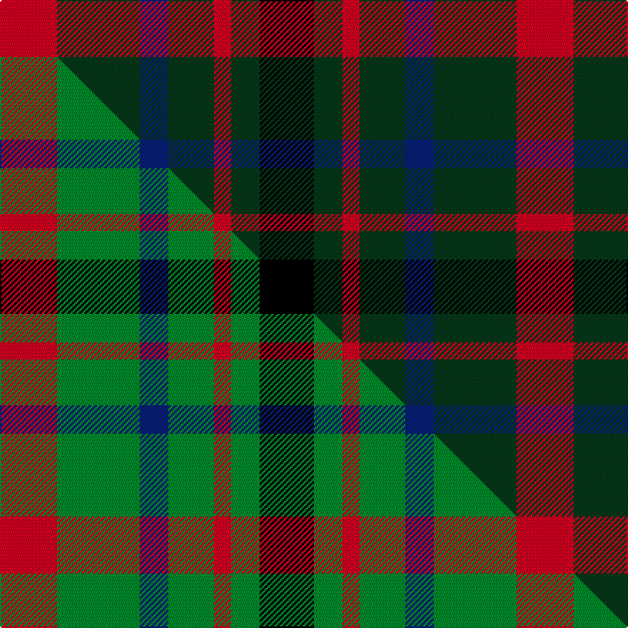

This page is one **sett** — a single exact thread-count. It belongs to the [tartan](/setts/r20dg29db10dg16r6dg10k19/)
(the same proportion at any scale), whose colour order is pattern [KGRGBGR](/stripes/kgrgbgr/).

Part of the [MacDonagh](/tartans/macdonagh/) tartan — the named design grouping this sett with its other cloths.

Sourced from tartans-authority.  It is a [7 stripe tartan](/stripes/stripes7/).

Original link [https://www.tartanregister.gov.uk/tartanDetails.aspx?ref=1104](https://www.tartanregister.gov.uk/tartanDetails.aspx?ref=1104)

Dataset <small>— provenance for this record, inherited from the source manifest</small>

<dl class="dataset-prov">
<dt>source</dt><dd><a href="/sources/tartans-authority/">Scottish Tartans Authority</a></dd>
<dt>data captured from</dt><dd><a href="https://github.com/thetartan/tartan-database/blob/master/data/tartans-authority/data.csv">https://github.com/thetartan/tartan-database/blob/master/data/tartans-authority/data.csv</a></dd>
<dt>data date</dt><dd>circa 1850 <small>(this record)</small></dd>
<dt>licence</dt><dd><a href="https://creativecommons.org/licenses/by-nc-nd/4.0/">CC BY-NC-ND 4.0</a></dd>
</dl>

Capture chain <small>— the hands this data passed through, oldest first; each capture carries its own licence</small>

<ol class="capture-chain">
<li><a href="https://www.tartansauthority.com/">Scottish Tartans Authority</a> <small>the heritage body's archive — its tartan-ferret record browser is retired (links repaired to the SRT, above)</small></li>
<li><a href="https://github.com/thetartan/tartan-database">thetartan/tartan-database</a> <small>2016-2017</small> · <a href="https://creativecommons.org/licenses/by-nc-nd/4.0/">CC BY-NC-ND 4.0</a> <small>Levko Kravets's frozen compilation — the capture we vendored, and where its CC licence text came from</small></li>
<li>this dictionary <small>captured 2026-06-10 · commit 5bf86c7566</small> <small>each re-capture is a git commit to data/sources</small></li>
</ol>

## Register references

External register numbers recorded for this tartan.

- Scottish Tartans Authority (ITI): 1104

## Thread count
R/40 DG58 DB20 DG32 R12 DG20 K/38

One full sett is **362 threads**.

## Palette
<table><thead><tr><th>Colour</th><th>Shade</th><th>OKLCh</th></tr></thead><tbody><tr><td>DB</td><td><code style="background-color:#082077;">#082077</code> <small style="color:#888">#082077</small></td><td><small style="color:#888">oklch(30.0% 0.149 265.1)</small></td></tr><tr><td>DG</td><td><code style="background-color:#053819;">#053819</code> <small style="color:#888">#053819</small></td><td><small style="color:#888">oklch(30.0% 0.075 151.3)</small></td></tr><tr><td>K</td><td><code style="background-color:#000000;">#000000</code> <small style="color:#888">#000000</small></td><td><small style="color:#888">oklch(0.0% 0.000 0.0)</small></td></tr><tr><td>R</td><td><code style="background-color:#D60020;">#D60020</code> <small style="color:#888">#D60020</small></td><td><small style="color:#888">oklch(55.2% 0.224 25.5)</small></td></tr></tbody></table>

# Sample pattern

## Compared to the master

This cloth is one sett of its design; the master sett (the exemplar the design is anchored on) is below for comparison.

Its **ΔTartan distance** from the master is **0.19** — the same measure the nearest-tartans table ranks by (0 is identical; a re-scale of the same cloth is near 0, a recolour or a different proportion further).

<figure class="master-compare" style="margin:0">

this sett
master sett ★

<figcaption style="color:#888;font-size:smaller">One weave of this sett against the <a href="/setts/r20g29db10g16r6g10k19/">master sett ★</a>, split on the diagonal: a shared proportion runs seamlessly across it with only the shades shifting; a different proportion breaks on it.</figcaption>
</figure>

## Nearest tartan variants

The nearest existing variants by ΔTartan distance, with this cloth at the top so the swatches line up against it.

ΔTartan

Threads

Variant

Sett

—

362

<a href="/variants/s7/r20dg29db10dg16r6dg10k19~x2/">MacDonagh (Name)</a>

<a href="/ttd/edit/#slug=r20g29db10g16r6g10k19~x2&amp;base=r20dg29db10dg16r6dg10k19~x2" title="compare in the TTD">0.19</a>

362

<a href="/variants/s7/r20g29db10g16r6g10k19~x2/">MacDonagh</a>

<a href="/ttd/edit/#slug=r35g52db18g17r12g17k18&amp;base=r20dg29db10dg16r6dg10k19~x2" title="compare in the TTD">0.48</a>

285

<a href="/variants/s7/r35g52db18g17r12g17k18/">MacDona</a>

<a href="/ttd/edit/#slug=dg14db8dg14r14k3r14~x2&amp;base=r20dg29db10dg16r6dg10k19~x2" title="compare in the TTD">1.83</a>

212

<a href="/variants/s6/dg14db8dg14r14k3r14~x2/">Tulsa, City of</a>

<a href="/ttd/edit/#slug=r14k3r14g13db8g13~x2&amp;base=r20dg29db10dg16r6dg10k19~x2" title="compare in the TTD">1.86</a>

206

<a href="/variants/s6/r14k3r14g13db8g13~x2/">Tulsa</a>

<a href="/ttd/edit/#slug=r10db6k8g10r6g3r6~x2&amp;base=r20dg29db10dg16r6dg10k19~x2" title="compare in the TTD">2.54</a>

164

<a href="/variants/s7/r10db6k8g10r6g3r6~x2/">MacDuff #3</a>

<a href="/ttd/edit/#slug=dg6dp3k3dp3k3dp3dg6k2~x2~dg1605139-dp1607327&amp;base=r20dg29db10dg16r6dg10k19~x2" title="compare in the TTD">2.65</a>

100

<a href="/variants/s8/dg6dp3k3dp3k3dp3dg6k2~x2~dg1605139-dp1607327/">Wilson's No.173</a>

<a href="/ttd/edit/#slug=db2k2db2o5dy1~x12&amp;base=r20dg29db10dg16r6dg10k19~x2" title="compare in the TTD">2.93</a>

252

<a href="/variants/s5/db2k2db2o5dy1~x12/">Chivas Regal (Corporate)</a>

<a href="/ttd/edit/#slug=db6k6db6o14dy3~x2&amp;base=r20dg29db10dg16r6dg10k19~x2" title="compare in the TTD">2.99</a>

122

<a href="/variants/s5/db6k6db6o14dy3~x2/">Chivas Regal</a>

<a href="/ttd/edit/#slug=k2g7lb1k6r4g2~x4&amp;base=r20dg29db10dg16r6dg10k19~x2" title="compare in the TTD">3.02</a>

160

<a href="/variants/s6/k2g7lb1k6r4g2~x4/">Walker, James</a>

<a href="/ttd/edit/#slug=dp12k12dg12k2dg12k11dg12k2dg12k12dp12y3~x2~dp1607327-dg1605139&amp;base=r20dg29db10dg16r6dg10k19~x2" title="compare in the TTD">3.03</a>

426

<a href="/variants/s12/dp12k12dg12k2dg12k11dg12k2dg12k12dp12y3~x2~dp1607327-dg1605139/">Wilson's No.157 #2</a>

## Neighbour map

Every grey dot is one of 13621 variants placed by the first two principal components of the ΔTartan feature space (42% of its variance). Red is this tartan; blue dots are its nearest — click one to open its page.

<svg viewBox="0 0 640 380" role="img" style="max-width:100%;height:auto;border:1px solid #e0e0e0;border-radius:4px;display:block" xmlns="http://www.w3.org/2000/svg"><image href="/nn/cloud.v1.png" width="640" height="380"/><a href="/variants/s7/r20g29db10g16r6g10k19~x2/"><circle cx="154.6" cy="253.4" r="4" fill="#3465a4"><title>MacDonagh</title></circle></a><a href="/variants/s7/r35g52db18g17r12g17k18/"><circle cx="176.7" cy="248.3" r="4" fill="#3465a4"><title>MacDona</title></circle></a><a href="/variants/s6/dg14db8dg14r14k3r14~x2/"><circle cx="168.6" cy="276.4" r="4" fill="#3465a4"><title>Tulsa, City of</title></circle></a><a href="/variants/s6/r14k3r14g13db8g13~x2/"><circle cx="157.2" cy="276.7" r="4" fill="#3465a4"><title>Tulsa</title></circle></a><a href="/variants/s7/r10db6k8g10r6g3r6~x2/"><circle cx="111.6" cy="282.0" r="4" fill="#3465a4"><title>MacDuff #3</title></circle></a><a href="/variants/s8/dg6dp3k3dp3k3dp3dg6k2~x2~dg1605139-dp1607327/"><circle cx="122.6" cy="283.3" r="4" fill="#3465a4"><title>Wilson's No.173</title></circle></a><a href="/variants/s5/db2k2db2o5dy1~x12/"><circle cx="170.8" cy="259.4" r="4" fill="#3465a4"><title>Chivas Regal (Corporate)</title></circle></a><a href="/variants/s5/db6k6db6o14dy3~x2/"><circle cx="158.5" cy="267.2" r="4" fill="#3465a4"><title>Chivas Regal</title></circle></a><a href="/variants/s6/k2g7lb1k6r4g2~x4/"><circle cx="140.0" cy="224.6" r="4" fill="#3465a4"><title>Walker, James</title></circle></a><a href="/variants/s12/dp12k12dg12k2dg12k11dg12k2dg12k12dp12y3~x2~dp1607327-dg1605139/"><circle cx="142.2" cy="233.3" r="4" fill="#3465a4"><title>Wilson's No.157 #2</title></circle></a><circle cx="184.6" cy="257.6" r="5" fill="#c00000"/><text x="320" y="376" text-anchor="middle" font-size="11" fill="#999">ground</text><text x="11" y="190" text-anchor="middle" font-size="11" fill="#999" transform="rotate(-90 11 190)">complexity</text></svg>

ID: /variants/s7/r20dg29db10dg16r6dg10k19~x2/
