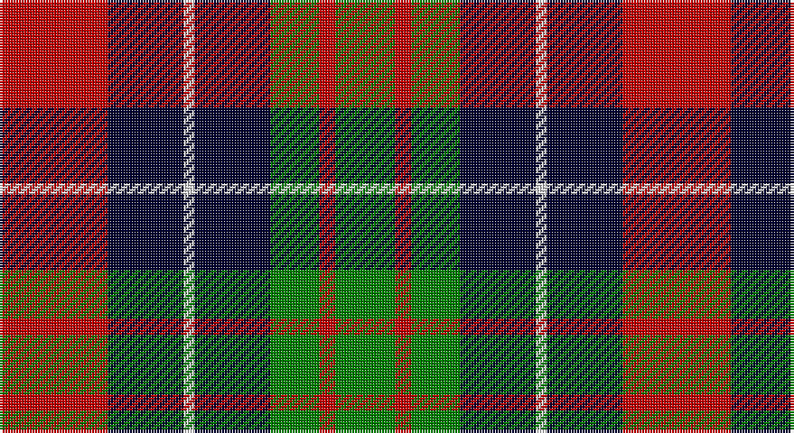

This page is one **sett** — a single exact thread-count. It belongs to the [tartan](/setts/r20k14w2k14g9r3g11/)
(the same proportion at any scale), whose colour order is pattern [GRGKWKR](/stripes/grgkwkr/).

Part of the [Brough](/tartans/brough/) tartan — the named design grouping this sett with its other cloths.

Sourced from weddslist.  It is a [7 stripe tartan](/stripes/stripes7/).

Original link http://www.weddslist.com/cgi-bin/tartans/pg.pl?source=sts

## Thread count
R/40 DB28 LN4 DB28 G18 R6 G/22

One full sett is **230 threads**.

## Palette

Palette: <strong>Tartan Dictionary</strong> <small style="color:#888">(1 of 4 colours)</small>
<table><thead><tr><th>Colour</th><th>Threads</th><th>Shade</th><th>Base</th><th>OKLCh</th></tr></thead><tbody><tr><td>R/</td><td style="text-align:right;font-variant-numeric:tabular-nums">40</td><td><code style="background-color:#C00000;">#C00000</code> <small style="color:#888">#C00000</small></td><td>R <code style="background-color:#CC0000;">#CC0000</code></td><td><small style="color:#888">oklch(50.7% 0.208 29.2)</small></td></tr><tr><td>DB</td><td style="text-align:right;font-variant-numeric:tabular-nums">28</td><td><code style="background-color:#000030;">#000030</code> <small style="color:#888">#000030</small></td><td>K <code style="background-color:#000000;">#000000</code></td><td><small style="color:#888">oklch(14.0% 0.097 264.1)</small></td></tr><tr><td>LN</td><td style="text-align:right;font-variant-numeric:tabular-nums">4</td><td><code style="background-color:#E0E0E0;">#E0E0E0</code> <small style="color:#888">#E0E0E0</small></td><td>W <code style="background-color:#F7F7F7;">#F7F7F7</code></td><td><small style="color:#888">oklch(90.7% 0.000 89.9)</small></td></tr><tr><td>DB</td><td style="text-align:right;font-variant-numeric:tabular-nums">28</td><td><code style="background-color:#000030;">#000030</code> <small style="color:#888">#000030</small></td><td>K <code style="background-color:#000000;">#000000</code></td><td><small style="color:#888">oklch(14.0% 0.097 264.1)</small></td></tr><tr><td>G</td><td style="text-align:right;font-variant-numeric:tabular-nums">18</td><td><code style="background-color:#008000;">#008000</code> <small style="color:#888">#008000</small></td><td>G <code style="background-color:#006100;">#006100</code></td><td><small style="color:#888">oklch(52.0% 0.177 142.5)</small></td></tr><tr><td>R</td><td style="text-align:right;font-variant-numeric:tabular-nums">6</td><td><code style="background-color:#C00000;">#C00000</code> <small style="color:#888">#C00000</small></td><td>R <code style="background-color:#CC0000;">#CC0000</code></td><td><small style="color:#888">oklch(50.7% 0.208 29.2)</small></td></tr><tr><td>G/</td><td style="text-align:right;font-variant-numeric:tabular-nums">22</td><td><code style="background-color:#008000;">#008000</code> <small style="color:#888">#008000</small></td><td>G <code style="background-color:#006100;">#006100</code></td><td><small style="color:#888">oklch(52.0% 0.177 142.5)</small></td></tr></tbody></table>

# Sample pattern

## Compared to the master

This cloth is one sett of its design; the master sett (the exemplar the design is anchored on) is below for comparison.

<figure style="margin:0"><figcaption style="color:#888;font-size:smaller">this sett</figcaption></figure>
<figure style="margin:0"><figcaption style="color:#888;font-size:smaller"><a href="/setts/r18db12w2db12dg8r3dg10/">master sett →</a></figcaption></figure>

## Nearest tartans

The nearest existing variants by ΔTartan distance, with this tartan at the top so the swatches line up against it.

ΔTartan

Tartan

Sett

—

<a href="/ttd/edit/#slug=r20k14w2k14g9r3g11~x2">Brough</a> <a class="nn-out" href="/variants/s7/r20k14w2k14g9r3g11~x2/" title="open its dictionary page">↗</a>

0.65

<a href="/ttd/edit/#slug=db14g21db4r21db14ly2~x2&amp;base=r20k14w2k14g9r3g11~x2">Kilgour</a> <a class="nn-out" href="/variants/s6/db14g21db4r21db14ly2~x2/" title="open its dictionary page">↗</a>

0.84

<a href="/ttd/edit/#slug=db14dg21db4r21db14ly2~x2&amp;base=r20k14w2k14g9r3g11~x2">Kilgour</a> <a class="nn-out" href="/variants/s6/db14dg21db4r21db14ly2~x2/" title="open its dictionary page">↗</a>

1.02

<a href="/ttd/edit/#slug=g12k2r12k3y12k16y12k3r6~x2&amp;base=r20k14w2k14g9r3g11~x2">Borthwick</a> <a class="nn-out" href="/variants/s9/g12k2r12k3y12k16y12k3r6~x2/" title="open its dictionary page">↗</a>

1.05

<a href="/ttd/edit/#slug=p3k1p8k6g8k1w2~x2&amp;base=r20k14w2k14g9r3g11~x2">Baillie</a> <a class="nn-out" href="/variants/s7/p3k1p8k6g8k1w2~x2/" title="open its dictionary page">↗</a>

1.06

<a href="/ttd/edit/#slug=p9k7g5r4g7k1ly1~x2&amp;base=r20k14w2k14g9r3g11~x2">MacLaren</a> <a class="nn-out" href="/variants/s7/p9k7g5r4g7k1ly1~x2/" title="open its dictionary page">↗</a>

1.06

<a href="/ttd/edit/#slug=ly5g22dp15dpi11dp5g2~x2&amp;base=r20k14w2k14g9r3g11~x2">Scottish Ballet</a> <a class="nn-out" href="/variants/s6/ly5g22dp15dpi11dp5g2~x2/" title="open its dictionary page">↗</a>

1.07

<a href="/ttd/edit/#slug=w2r3dg9r3db2r3db3w1~x6&amp;base=r20k14w2k14g9r3g11~x2">Utah (US State)</a> <a class="nn-out" href="/variants/s8/w2r3dg9r3db2r3db3w1~x6/" title="open its dictionary page">↗</a>

1.09

<a href="/ttd/edit/#slug=k3g17ly2k18p17g3~x2&amp;base=r20k14w2k14g9r3g11~x2">Wilson's, No 100</a> <a class="nn-out" href="/variants/s6/k3g17ly2k18p17g3~x2/" title="open its dictionary page">↗</a>

1.12

<a href="/ttd/edit/#slug=k3g17w2k18p17g3~x2&amp;base=r20k14w2k14g9r3g11~x2">Wilson's, No 76</a> <a class="nn-out" href="/variants/s6/k3g17w2k18p17g3~x2/" title="open its dictionary page">↗</a>

1.15

<a href="/ttd/edit/#slug=g18t2g4k14p12k3~x2&amp;base=r20k14w2k14g9r3g11~x2">Wilson's, No 150 &quot;Coburg&quot;</a> <a class="nn-out" href="/variants/s6/g18t2g4k14p12k3~x2/" title="open its dictionary page">↗</a>

## Neighbour map

Every grey dot is one of 14360 variants placed by the first two principal components of the ΔTartan feature space (44% of its variance). Red is this tartan; blue dots are its nearest — click one to open its page.

<svg viewBox="0 0 640 380" role="img" style="max-width:100%;height:auto;border:1px solid #e0e0e0;border-radius:4px;display:block" xmlns="http://www.w3.org/2000/svg"><image href="/nn/cloud.v1.png" width="640" height="380"/><a href="/variants/s6/db14g21db4r21db14ly2~x2/"><circle cx="185.2" cy="225.7" r="4" fill="#3465a4"><title>Kilgour</title></circle></a><a href="/variants/s6/db14dg21db4r21db14ly2~x2/"><circle cx="197.4" cy="228.2" r="4" fill="#3465a4"><title>Kilgour</title></circle></a><a href="/variants/s9/g12k2r12k3y12k16y12k3r6~x2/"><circle cx="99.9" cy="215.3" r="4" fill="#3465a4"><title>Borthwick</title></circle></a><a href="/variants/s7/p3k1p8k6g8k1w2~x2/"><circle cx="147.8" cy="208.6" r="4" fill="#3465a4"><title>Baillie</title></circle></a><a href="/variants/s7/p9k7g5r4g7k1ly1~x2/"><circle cx="106.2" cy="201.2" r="4" fill="#3465a4"><title>MacLaren</title></circle></a><a href="/variants/s6/ly5g22dp15dpi11dp5g2~x2/"><circle cx="194.5" cy="214.0" r="4" fill="#3465a4"><title>Scottish Ballet</title></circle></a><a href="/variants/s8/w2r3dg9r3db2r3db3w1~x6/"><circle cx="158.4" cy="207.5" r="4" fill="#3465a4"><title>Utah (US State)</title></circle></a><a href="/variants/s6/k3g17ly2k18p17g3~x2/"><circle cx="155.6" cy="214.0" r="4" fill="#3465a4"><title>Wilson's, No 100</title></circle></a><a href="/variants/s6/k3g17w2k18p17g3~x2/"><circle cx="154.6" cy="213.6" r="4" fill="#3465a4"><title>Wilson's, No 76</title></circle></a><a href="/variants/s6/g18t2g4k14p12k3~x2/"><circle cx="176.7" cy="221.4" r="4" fill="#3465a4"><title>Wilson's, No 150 &quot;Coburg&quot;</title></circle></a><circle cx="160.8" cy="219.2" r="5" fill="#c00000"/></svg>

ID: /variants/s7/r20k14w2k14g9r3g11~x2/
