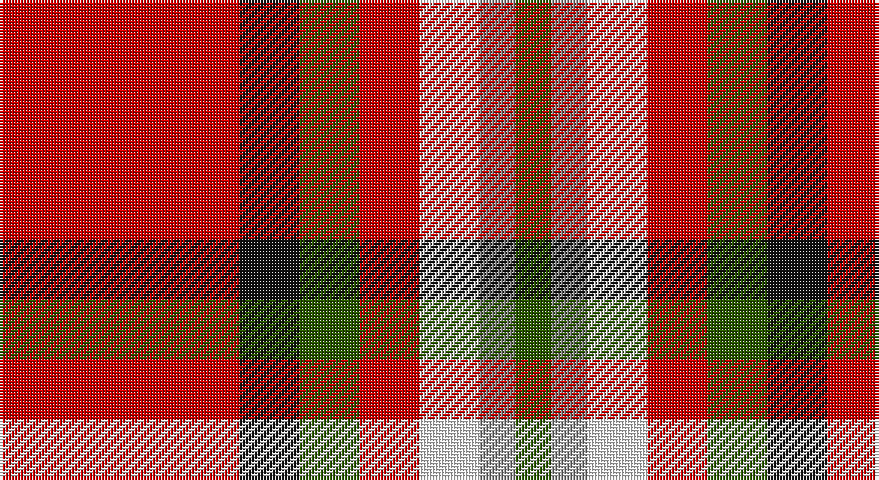

This page is one **sett** — a single exact thread-count. It belongs to the [tartan](/setts/r20k5dg5r5w5o3dg3/)
(the same proportion at any scale), whose colour order is pattern [GRWRGKR](/stripes/grwrgkr/).

Part of the [Mangles, Peter and Annette](/tartans/mangles-peter-and-annette/) tartan — the named design grouping this sett with its other cloths.

Sourced from tartans-authority.  It is a [7 stripe tartan](/stripes/stripes7/).

Original link http://www.tartansauthority.com/tartan-ferret/display/10844/

## Also known as

This cloth is also recorded under:

- Mangles, Peter and Annette (Personal
- Mangles, Peter and Annette Family/Personal

## Register references

External register numbers recorded for this tartan.

- Scottish Register of Tartans: [10844](https://www.tartanregister.gov.uk/tartanDetails?ref=10844)
- Scottish Tartans Authority (ITI): 10844

## Thread count
R/80 K20 G20 R20 W20 N12 G/12

One full sett is **276 threads**.

## Palette

Palette: <strong>Tartan Register</strong>
<table><thead><tr><th>Colour</th><th>Threads</th><th>Shade</th><th>Base</th><th>OKLCh</th></tr></thead><tbody><tr><td>R/</td><td style="text-align:right;font-variant-numeric:tabular-nums">80</td><td><code style="background-color:#C80000;">#C80000</code> <small style="color:#888">#C80000</small></td><td>R <code style="background-color:#CC0000;">#CC0000</code></td><td><small style="color:#888">oklch(52.3% 0.215 29.2)</small></td></tr><tr><td>K</td><td style="text-align:right;font-variant-numeric:tabular-nums">20</td><td><code style="background-color:#101010;">#101010</code> <small style="color:#888">#101010</small></td><td>K <code style="background-color:#000000;">#000000</code></td><td><small style="color:#888">oklch(17.3% 0.000 89.9)</small></td></tr><tr><td>G</td><td style="text-align:right;font-variant-numeric:tabular-nums">20</td><td><code style="background-color:#285800;">#285800</code> <small style="color:#888">#285800</small></td><td>G <code style="background-color:#006100;">#006100</code></td><td><small style="color:#888">oklch(41.0% 0.122 135.8)</small></td></tr><tr><td>R</td><td style="text-align:right;font-variant-numeric:tabular-nums">20</td><td><code style="background-color:#C80000;">#C80000</code> <small style="color:#888">#C80000</small></td><td>R <code style="background-color:#CC0000;">#CC0000</code></td><td><small style="color:#888">oklch(52.3% 0.215 29.2)</small></td></tr><tr><td>W</td><td style="text-align:right;font-variant-numeric:tabular-nums">20</td><td><code style="background-color:#FCFCFC;">#FCFCFC</code> <small style="color:#888">#FCFCFC</small></td><td>W <code style="background-color:#F7F7F7;">#F7F7F7</code></td><td><small style="color:#888">oklch(99.1% 0.000 89.9)</small></td></tr><tr><td>N</td><td style="text-align:right;font-variant-numeric:tabular-nums">12</td><td><code style="background-color:#888888;">#888888</code> <small style="color:#888">#888888</small></td><td>R <code style="background-color:#CC0000;">#CC0000</code></td><td><small style="color:#888">oklch(62.7% 0.000 89.9)</small></td></tr><tr><td>G/</td><td style="text-align:right;font-variant-numeric:tabular-nums">12</td><td><code style="background-color:#285800;">#285800</code> <small style="color:#888">#285800</small></td><td>G <code style="background-color:#006100;">#006100</code></td><td><small style="color:#888">oklch(41.0% 0.122 135.8)</small></td></tr></tbody></table>

# Sample pattern

## Compared to the master

This cloth is one sett of its design; the master sett (the exemplar the design is anchored on) is below for comparison.

<figure style="margin:0"><figcaption style="color:#888;font-size:smaller">this sett</figcaption></figure>
<figure style="margin:0"><figcaption style="color:#888;font-size:smaller"><a href="/setts/r20k5g5r5w5n3g3/">master sett →</a></figcaption></figure>

## Nearest tartans

The nearest existing variants by ΔTartan distance, with this tartan at the top so the swatches line up against it.

ΔTartan

Tartan

Sett

—

<a href="/ttd/edit/#slug=r20k5dg5r5w5o3dg3~x4">Mangles, Peter and Annette (Personal</a> <a class="nn-out" href="/variants/s7/r20k5dg5r5w5o3dg3~x4/" title="open its dictionary page">↗</a>

0.34

<a href="/ttd/edit/#slug=r20k5g5r5w5n3g3~x4&amp;base=r20k5dg5r5w5o3dg3~x4">Mangles, Peter and Annette (Personal)</a> <a class="nn-out" href="/variants/s7/r20k5g5r5w5n3g3~x4/" title="open its dictionary page">↗</a>

0.40

<a href="/ttd/edit/#slug=r20k5g5r5w5lr3g3~x4&amp;base=r20k5dg5r5w5o3dg3~x4">Mangles, Peter and Annette Family/Personal Tartan</a> <a class="nn-out" href="/variants/s7/r20k5g5r5w5lr3g3~x4/" title="open its dictionary page">↗</a>

0.84

<a href="/ttd/edit/#slug=r7db2k2ly1k2r2k1w1~x2&amp;base=r20k5dg5r5w5o3dg3~x4">Royal Stuart/Stewart</a> <a class="nn-out" href="/variants/s8/r7db2k2ly1k2r2k1w1~x2/" title="open its dictionary page">↗</a>

0.84

<a href="/ttd/edit/#slug=dg4lb4k2r15ly4~x4&amp;base=r20k5dg5r5w5o3dg3~x4">Benedict (Personal)</a> <a class="nn-out" href="/variants/s5/dg4lb4k2r15ly4~x4/" title="open its dictionary page">↗</a>

0.98

<a href="/ttd/edit/#slug=g4lb4k2r15ly4~x4&amp;base=r20k5dg5r5w5o3dg3~x4">Benedict (Personal)</a> <a class="nn-out" href="/variants/s5/g4lb4k2r15ly4~x4/" title="open its dictionary page">↗</a>

1.02

<a href="/ttd/edit/#slug=r5g3lb3db5r16ly3~x2&amp;base=r20k5dg5r5w5o3dg3~x4">McCartney (2015)</a> <a class="nn-out" href="/variants/s6/r5g3lb3db5r16ly3~x2/" title="open its dictionary page">↗</a>

1.14

<a href="/ttd/edit/#slug=k4w2db8w3r16k2r5ly2r5w2~x2&amp;base=r20k5dg5r5w5o3dg3~x4">Blaylock</a> <a class="nn-out" href="/variants/s10/k4w2db8w3r16k2r5ly2r5w2~x2/" title="open its dictionary page">↗</a>

1.17

<a href="/ttd/edit/#slug=oi6ly3oi20o20oi3o3lb6~x2&amp;base=r20k5dg5r5w5o3dg3~x4">Banff</a> <a class="nn-out" href="/variants/s7/oi6ly3oi20o20oi3o3lb6~x2/" title="open its dictionary page">↗</a>

1.25

<a href="/ttd/edit/#slug=k6r20w2ri9w3lb2~x2&amp;base=r20k5dg5r5w5o3dg3~x4">Thermos Un-named (aretefact)</a> <a class="nn-out" href="/variants/s6/k6r20w2ri9w3lb2~x2/" title="open its dictionary page">↗</a>

1.26

<a href="/ttd/edit/#slug=w15g8k12g14r64k12r16k10ly8k14&amp;base=r20k5dg5r5w5o3dg3~x4">Carlow County Crest (Fashion)</a> <a class="nn-out" href="/variants/s10/w15g8k12g14r64k12r16k10ly8k14/" title="open its dictionary page">↗</a>

## Neighbour map

Every grey dot is one of 14360 variants placed by the first two principal components of the ΔTartan feature space (44% of its variance). Red is this tartan; blue dots are its nearest — click one to open its page.

<svg viewBox="0 0 640 380" role="img" style="max-width:100%;height:auto;border:1px solid #e0e0e0;border-radius:4px;display:block" xmlns="http://www.w3.org/2000/svg"><image href="/nn/cloud.v1.png" width="640" height="380"/><a href="/variants/s7/r20k5g5r5w5n3g3~x4/"><circle cx="221.3" cy="171.3" r="4" fill="#3465a4"><title>Mangles, Peter and Annette (Personal)</title></circle></a><a href="/variants/s7/r20k5g5r5w5lr3g3~x4/"><circle cx="226.6" cy="172.3" r="4" fill="#3465a4"><title>Mangles, Peter and Annette Family/Personal Tartan</title></circle></a><a href="/variants/s8/r7db2k2ly1k2r2k1w1~x2/"><circle cx="207.3" cy="169.5" r="4" fill="#3465a4"><title>Royal Stuart/Stewart</title></circle></a><a href="/variants/s5/dg4lb4k2r15ly4~x4/"><circle cx="225.6" cy="190.1" r="4" fill="#3465a4"><title>Benedict (Personal)</title></circle></a><a href="/variants/s5/g4lb4k2r15ly4~x4/"><circle cx="231.0" cy="192.7" r="4" fill="#3465a4"><title>Benedict (Personal)</title></circle></a><a href="/variants/s6/r5g3lb3db5r16ly3~x2/"><circle cx="270.7" cy="199.9" r="4" fill="#3465a4"><title>McCartney (2015)</title></circle></a><a href="/variants/s10/k4w2db8w3r16k2r5ly2r5w2~x2/"><circle cx="210.9" cy="147.5" r="4" fill="#3465a4"><title>Blaylock</title></circle></a><a href="/variants/s7/oi6ly3oi20o20oi3o3lb6~x2/"><circle cx="247.2" cy="200.1" r="4" fill="#3465a4"><title>Banff</title></circle></a><a href="/variants/s6/k6r20w2ri9w3lb2~x2/"><circle cx="225.6" cy="163.0" r="4" fill="#3465a4"><title>Thermos Un-named (aretefact)</title></circle></a><a href="/variants/s10/w15g8k12g14r64k12r16k10ly8k14/"><circle cx="189.0" cy="150.9" r="4" fill="#3465a4"><title>Carlow County Crest (Fashion)</title></circle></a><circle cx="229.8" cy="176.1" r="5" fill="#c00000"/></svg>

ID: /variants/s7/r20k5dg5r5w5o3dg3~x4/
