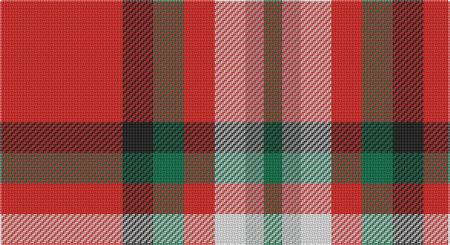

This page is one **sett** — a single exact thread-count. It belongs to the [tartan](/setts/r20k5g5r5w5lr3g3/)
(the same proportion at any scale), whose colour order is pattern [GYWRGKR](/stripes/gywrgkr/).

Sourced from house-of-tartan.  It is a [7 stripe tartan](/stripes/stripes7/).

Original link http://www.house-of-tartan.scotland.net/house/TartanViewjs.asp?colr=Def&tnam=10844

## Provenance

Earliest known date: 02/05/2013 The colours were chosen to represent the organisation and the location where Peter and Annette first met in Liverpool. In addition the red is representative of the city of Aberdeen (Scotland) and the black and grey is representative of the granite used extensively throughout Aberdeen

## Thread count
R/80 K20 G20 R20 W20 N12 G/12

One full sett is **276 threads**.

## Palette

Palette: <strong>Tartan Register</strong> <small style="color:#888">(2 of 5 colours)</small>
<table><thead><tr><th>Colour</th><th>Threads</th><th>Shade</th><th>Base</th><th>OKLCh</th></tr></thead><tbody><tr><td>R/</td><td style="text-align:right;font-variant-numeric:tabular-nums">80</td><td><code style="background-color:#E01C18;">#E01C18</code> <small style="color:#888">#E01C18</small></td><td>R <code style="background-color:#CC0000;">#CC0000</code></td><td><small style="color:#888">oklch(57.8% 0.225 28.6)</small></td></tr><tr><td>K</td><td style="text-align:right;font-variant-numeric:tabular-nums">20</td><td><code style="background-color:#101010;">#101010</code> <small style="color:#888">#101010</small></td><td>K <code style="background-color:#000000;">#000000</code></td><td><small style="color:#888">oklch(17.3% 0.000 89.9)</small></td></tr><tr><td>G</td><td style="text-align:right;font-variant-numeric:tabular-nums">20</td><td><code style="background-color:#006840;">#006840</code> <small style="color:#888">#006840</small></td><td>G <code style="background-color:#006100;">#006100</code></td><td><small style="color:#888">oklch(45.6% 0.106 158.5)</small></td></tr><tr><td>R</td><td style="text-align:right;font-variant-numeric:tabular-nums">20</td><td><code style="background-color:#E01C18;">#E01C18</code> <small style="color:#888">#E01C18</small></td><td>R <code style="background-color:#CC0000;">#CC0000</code></td><td><small style="color:#888">oklch(57.8% 0.225 28.6)</small></td></tr><tr><td>W</td><td style="text-align:right;font-variant-numeric:tabular-nums">20</td><td><code style="background-color:#F8F8F8;">#F8F8F8</code> <small style="color:#888">#F8F8F8</small></td><td>W <code style="background-color:#F7F7F7;">#F7F7F7</code></td><td><small style="color:#888">oklch(97.9% 0.000 89.9)</small></td></tr><tr><td>N</td><td style="text-align:right;font-variant-numeric:tabular-nums">12</td><td><code style="background-color:#A4A8A8;">#A4A8A8</code> <small style="color:#888">#A4A8A8</small></td><td>Y <code style="background-color:#F2BF00;">#F2BF00</code></td><td><small style="color:#888">oklch(72.8% 0.005 197.1)</small></td></tr><tr><td>G/</td><td style="text-align:right;font-variant-numeric:tabular-nums">12</td><td><code style="background-color:#006840;">#006840</code> <small style="color:#888">#006840</small></td><td>G <code style="background-color:#006100;">#006100</code></td><td><small style="color:#888">oklch(45.6% 0.106 158.5)</small></td></tr></tbody></table>

# Sample pattern

## Nearest tartans

The nearest existing variants by ΔTartan distance, with this tartan at the top so the swatches line up against it.

ΔTartan

Tartan

Sett

—

<a href="/ttd/edit/#slug=r20k5g5r5w5lr3g3~x4">Mangles, Peter and Annette Family/Personal Tartan</a> <a class="nn-out" href="/variants/s7/r20k5g5r5w5lr3g3~x4/" title="open its dictionary page">↗</a>

0.40

<a href="/ttd/edit/#slug=r20k5dg5r5w5o3dg3~x4&amp;base=r20k5g5r5w5lr3g3~x4">Mangles, Peter and Annette (Personal</a> <a class="nn-out" href="/variants/s7/r20k5dg5r5w5o3dg3~x4/" title="open its dictionary page">↗</a>

0.42

<a href="/ttd/edit/#slug=r20k5g5r5w5n3g3~x4&amp;base=r20k5g5r5w5lr3g3~x4">Mangles, Peter and Annette (Personal)</a> <a class="nn-out" href="/variants/s7/r20k5g5r5w5n3g3~x4/" title="open its dictionary page">↗</a>

0.90

<a href="/ttd/edit/#slug=dg4lb4k2r15ly4~x4&amp;base=r20k5g5r5w5lr3g3~x4">Benedict (Personal)</a> <a class="nn-out" href="/variants/s5/dg4lb4k2r15ly4~x4/" title="open its dictionary page">↗</a>

0.99

<a href="/ttd/edit/#slug=r5g3lb3db5r16ly3~x2&amp;base=r20k5g5r5w5lr3g3~x4">McCartney (2015)</a> <a class="nn-out" href="/variants/s6/r5g3lb3db5r16ly3~x2/" title="open its dictionary page">↗</a>

1.00

<a href="/ttd/edit/#slug=g4lb4k2r15ly4~x4&amp;base=r20k5g5r5w5lr3g3~x4">Benedict (Personal)</a> <a class="nn-out" href="/variants/s5/g4lb4k2r15ly4~x4/" title="open its dictionary page">↗</a>

1.01

<a href="/ttd/edit/#slug=r7db2k2ly1k2r2k1w1~x2&amp;base=r20k5g5r5w5lr3g3~x4">Royal Stuart/Stewart</a> <a class="nn-out" href="/variants/s8/r7db2k2ly1k2r2k1w1~x2/" title="open its dictionary page">↗</a>

1.07

<a href="/ttd/edit/#slug=k4w2db8w3r16k2r5ly2r5w2~x2&amp;base=r20k5g5r5w5lr3g3~x4">Blaylock</a> <a class="nn-out" href="/variants/s10/k4w2db8w3r16k2r5ly2r5w2~x2/" title="open its dictionary page">↗</a>

1.20

<a href="/ttd/edit/#slug=oi6ly3oi20o20oi3o3lb6~x2&amp;base=r20k5g5r5w5lr3g3~x4">Banff</a> <a class="nn-out" href="/variants/s7/oi6ly3oi20o20oi3o3lb6~x2/" title="open its dictionary page">↗</a>

1.29

<a href="/ttd/edit/#slug=w6o1r4w1db4o1r8w1r2~x2&amp;base=r20k5g5r5w5lr3g3~x4">Unidentified #41</a> <a class="nn-out" href="/variants/s9/w6o1r4w1db4o1r8w1r2~x2/" title="open its dictionary page">↗</a>

1.32

<a href="/ttd/edit/#slug=k6r20w2ri9w3lb2~x2&amp;base=r20k5g5r5w5lr3g3~x4">Thermos Un-named (aretefact)</a> <a class="nn-out" href="/variants/s6/k6r20w2ri9w3lb2~x2/" title="open its dictionary page">↗</a>

## Neighbour map

Every grey dot is one of 14360 variants placed by the first two principal components of the ΔTartan feature space (44% of its variance). Red is this tartan; blue dots are its nearest — click one to open its page.

<svg viewBox="0 0 640 380" role="img" style="max-width:100%;height:auto;border:1px solid #e0e0e0;border-radius:4px;display:block" xmlns="http://www.w3.org/2000/svg"><image href="/nn/cloud.v1.png" width="640" height="380"/><a href="/variants/s7/r20k5dg5r5w5o3dg3~x4/"><circle cx="229.8" cy="176.1" r="4" fill="#3465a4"><title>Mangles, Peter and Annette (Personal</title></circle></a><a href="/variants/s7/r20k5g5r5w5n3g3~x4/"><circle cx="221.3" cy="171.3" r="4" fill="#3465a4"><title>Mangles, Peter and Annette (Personal)</title></circle></a><a href="/variants/s5/dg4lb4k2r15ly4~x4/"><circle cx="225.6" cy="190.1" r="4" fill="#3465a4"><title>Benedict (Personal)</title></circle></a><a href="/variants/s6/r5g3lb3db5r16ly3~x2/"><circle cx="270.7" cy="199.9" r="4" fill="#3465a4"><title>McCartney (2015)</title></circle></a><a href="/variants/s5/g4lb4k2r15ly4~x4/"><circle cx="231.0" cy="192.7" r="4" fill="#3465a4"><title>Benedict (Personal)</title></circle></a><a href="/variants/s8/r7db2k2ly1k2r2k1w1~x2/"><circle cx="207.3" cy="169.5" r="4" fill="#3465a4"><title>Royal Stuart/Stewart</title></circle></a><a href="/variants/s10/k4w2db8w3r16k2r5ly2r5w2~x2/"><circle cx="210.9" cy="147.5" r="4" fill="#3465a4"><title>Blaylock</title></circle></a><a href="/variants/s7/oi6ly3oi20o20oi3o3lb6~x2/"><circle cx="247.2" cy="200.1" r="4" fill="#3465a4"><title>Banff</title></circle></a><a href="/variants/s9/w6o1r4w1db4o1r8w1r2~x2/"><circle cx="219.8" cy="168.9" r="4" fill="#3465a4"><title>Unidentified #41</title></circle></a><a href="/variants/s6/k6r20w2ri9w3lb2~x2/"><circle cx="225.6" cy="163.0" r="4" fill="#3465a4"><title>Thermos Un-named (aretefact)</title></circle></a><circle cx="226.6" cy="172.3" r="5" fill="#c00000"/></svg>

ID: /variants/s7/r20k5g5r5w5lr3g3~x4/
