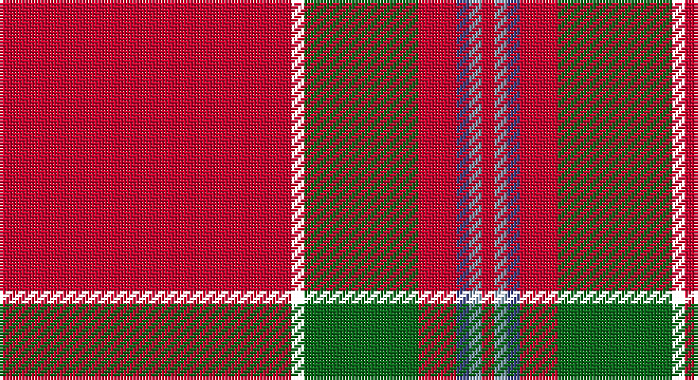

This page is one **sett** — a single exact thread-count. It belongs to the [tartan](/setts/r23k1g9r3db1lr1r1/)
(the same proportion at any scale), whose colour order is pattern [RKGRBYR](/stripes/rkgrbyr/).

Sourced from house-of-tartan.  It is a [7 stripe tartan](/stripes/stripes7/).

Original link http://www.house-of-tartan.scotland.net/house/TartanViewjs.asp?colr=Def&tnam=2800

## Provenance

Earliest known date: c.1739 Early historic plaid woven for (or by) Janet Craigie (nee Spalding) from the Braes of Clayquhat (now Cloquhat) in East Perthshire. Two pieces are now in the possession of the Scottish Tartans Authority (2014). See http://scottishtartans.co.uk/An_Unnamed_C18th_Plaid_from_Bridge_of_Cally.pdf

## Thread count
R/92 XB4 G36 R12 Ba4 B4 R/4

One full sett is **216 threads**.

## Palette

Palette: <strong>Tartan Register</strong> <small style="color:#888">(1 of 4 colours)</small>
<table><thead><tr><th>Colour</th><th>Threads</th><th>Shade</th><th>Base</th><th>OKLCh</th></tr></thead><tbody><tr><td>R/</td><td style="text-align:right;font-variant-numeric:tabular-nums">92</td><td><code style="background-color:#C8002C;">#C8002C</code> <small style="color:#888">#C8002C</small></td><td>R <code style="background-color:#CC0000;">#CC0000</code></td><td><small style="color:#888">oklch(52.6% 0.212 22.0)</small></td></tr><tr><td></td><td style="text-align:right;font-variant-numeric:tabular-nums">4</td><td><code style="background-color:;"></code> <small style="color:#888"></small></td><td> <code style="background-color:;"></code></td><td><small style="color:#888"></small></td></tr><tr><td>G</td><td style="text-align:right;font-variant-numeric:tabular-nums">36</td><td><code style="background-color:#086818;">#086818</code> <small style="color:#888">#086818</small></td><td>G <code style="background-color:#006100;">#006100</code></td><td><small style="color:#888">oklch(45.1% 0.140 144.4)</small></td></tr><tr><td>R</td><td style="text-align:right;font-variant-numeric:tabular-nums">12</td><td><code style="background-color:#C8002C;">#C8002C</code> <small style="color:#888">#C8002C</small></td><td>R <code style="background-color:#CC0000;">#CC0000</code></td><td><small style="color:#888">oklch(52.6% 0.212 22.0)</small></td></tr><tr><td>Ba</td><td style="text-align:right;font-variant-numeric:tabular-nums">4</td><td><code style="background-color:#384080;">#384080</code> <small style="color:#888">#384080</small></td><td>B <code style="background-color:#2A418A;">#2A418A</code></td><td><small style="color:#888">oklch(39.9% 0.107 275.1)</small></td></tr><tr><td>B</td><td style="text-align:right;font-variant-numeric:tabular-nums">4</td><td><code style="background-color:#809CB0;">#809CB0</code> <small style="color:#888">#809CB0</small></td><td>Y <code style="background-color:#F2BF00;">#F2BF00</code></td><td><small style="color:#888">oklch(67.8% 0.043 239.4)</small></td></tr><tr><td>R/</td><td style="text-align:right;font-variant-numeric:tabular-nums">4</td><td><code style="background-color:#C8002C;">#C8002C</code> <small style="color:#888">#C8002C</small></td><td>R <code style="background-color:#CC0000;">#CC0000</code></td><td><small style="color:#888">oklch(52.6% 0.212 22.0)</small></td></tr></tbody></table>

# Sample pattern

## Nearest tartans

The nearest existing variants by ΔTartan distance, with this tartan at the top so the swatches line up against it.

ΔTartan

Tartan

Sett

—

<a href="/ttd/edit/#slug=r23k1g9r3db1lr1r1~x4">Perthshire Clayquhat District Tartan</a> <a class="nn-out" href="/variants/s7/r23k1g9r3db1lr1r1~x4/" title="open its dictionary page">↗</a>

0.74

<a href="/ttd/edit/#slug=r68db27r5ly3r5g3r13t3~x2&amp;base=r23k1g9r3db1lr1r1~x4">De Nardi #2 (Personal)</a> <a class="nn-out" href="/variants/s8/r68db27r5ly3r5g3r13t3~x2/" title="open its dictionary page">↗</a>

0.80

<a href="/ttd/edit/#slug=r60db8w3db10ly3t4ly3r19~x2&amp;base=r23k1g9r3db1lr1r1~x4">Princess Elizabeth #2</a> <a class="nn-out" href="/variants/s8/r60db8w3db10ly3t4ly3r19~x2/" title="open its dictionary page">↗</a>

0.83

<a href="/ttd/edit/#slug=r68db26r5ly3r5g3r13o3~x2&amp;base=r23k1g9r3db1lr1r1~x4">De Nardi (Personal)</a> <a class="nn-out" href="/variants/s8/r68db26r5ly3r5g3r13o3~x2/" title="open its dictionary page">↗</a>

0.93

<a href="/ttd/edit/#slug=r40k3r2db12r2g2r2g2ly3~x2&amp;base=r23k1g9r3db1lr1r1~x4">Oliver, dress</a> <a class="nn-out" href="/variants/s9/r40k3r2db12r2g2r2g2ly3~x2/" title="open its dictionary page">↗</a>

0.95

<a href="/ttd/edit/#slug=r100dbi10w5dbi14ly4db8ly4r24&amp;base=r23k1g9r3db1lr1r1~x4">Earl of Inverness (Royal)</a> <a class="nn-out" href="/variants/s8/r100dbi10w5dbi14ly4db8ly4r24/" title="open its dictionary page">↗</a>

1.17

<a href="/ttd/edit/#slug=r48db3lo2g14r8db3t4w3~x2&amp;base=r23k1g9r3db1lr1r1~x4">Drummond of Fingask</a> <a class="nn-out" href="/variants/s8/r48db3lo2g14r8db3t4w3~x2/" title="open its dictionary page">↗</a>

1.22

<a href="/ttd/edit/#slug=r32lb4dt7ly2t2~x5&amp;base=r23k1g9r3db1lr1r1~x4">Sildesalaten</a> <a class="nn-out" href="/variants/s5/r32lb4dt7ly2t2~x5/" title="open its dictionary page">↗</a>

1.29

<a href="/ttd/edit/#slug=r72dg3ly2dg26r14db6t6w2&amp;base=r23k1g9r3db1lr1r1~x4">Stuart/Stewart of Fingask</a> <a class="nn-out" href="/variants/s8/r72dg3ly2dg26r14db6t6w2/" title="open its dictionary page">↗</a>

1.29

<a href="/ttd/edit/#slug=r51lr2k11lo3r11lo3r11g3~x2&amp;base=r23k1g9r3db1lr1r1~x4">Hackston (Green stripe) (Portrait)</a> <a class="nn-out" href="/variants/s8/r51lr2k11lo3r11lo3r11g3~x2/" title="open its dictionary page">↗</a>

1.31

<a href="/ttd/edit/#slug=r72g3ly2g26r14db6t6w2&amp;base=r23k1g9r3db1lr1r1~x4">Stewart of Fingask - 1745 (Clan?)</a> <a class="nn-out" href="/variants/s8/r72g3ly2g26r14db6t6w2/" title="open its dictionary page">↗</a>

## Neighbour map

Every grey dot is one of 14360 variants placed by the first two principal components of the ΔTartan feature space (44% of its variance). Red is this tartan; blue dots are its nearest — click one to open its page.

<svg viewBox="0 0 640 380" role="img" style="max-width:100%;height:auto;border:1px solid #e0e0e0;border-radius:4px;display:block" xmlns="http://www.w3.org/2000/svg"><image href="/nn/cloud.v1.png" width="640" height="380"/><a href="/variants/s8/r68db27r5ly3r5g3r13t3~x2/"><circle cx="474.1" cy="114.3" r="4" fill="#3465a4"><title>De Nardi #2 (Personal)</title></circle></a><a href="/variants/s8/r60db8w3db10ly3t4ly3r19~x2/"><circle cx="462.0" cy="114.8" r="4" fill="#3465a4"><title>Princess Elizabeth #2</title></circle></a><a href="/variants/s8/r68db26r5ly3r5g3r13o3~x2/"><circle cx="488.3" cy="118.1" r="4" fill="#3465a4"><title>De Nardi (Personal)</title></circle></a><a href="/variants/s9/r40k3r2db12r2g2r2g2ly3~x2/"><circle cx="430.4" cy="98.6" r="4" fill="#3465a4"><title>Oliver, dress</title></circle></a><a href="/variants/s8/r100dbi10w5dbi14ly4db8ly4r24/"><circle cx="483.0" cy="99.6" r="4" fill="#3465a4"><title>Earl of Inverness (Royal)</title></circle></a><a href="/variants/s8/r48db3lo2g14r8db3t4w3~x2/"><circle cx="400.9" cy="91.6" r="4" fill="#3465a4"><title>Drummond of Fingask</title></circle></a><a href="/variants/s5/r32lb4dt7ly2t2~x5/"><circle cx="415.6" cy="142.8" r="4" fill="#3465a4"><title>Sildesalaten</title></circle></a><a href="/variants/s8/r72dg3ly2dg26r14db6t6w2/"><circle cx="422.5" cy="77.6" r="4" fill="#3465a4"><title>Stuart/Stewart of Fingask</title></circle></a><a href="/variants/s8/r51lr2k11lo3r11lo3r11g3~x2/"><circle cx="521.1" cy="115.2" r="4" fill="#3465a4"><title>Hackston (Green stripe) (Portrait)</title></circle></a><a href="/variants/s8/r72g3ly2g26r14db6t6w2/"><circle cx="430.4" cy="84.4" r="4" fill="#3465a4"><title>Stewart of Fingask - 1745 (Clan?)</title></circle></a><circle cx="463.2" cy="121.0" r="5" fill="#c00000"/></svg>

ID: /variants/s7/r23k1g9r3db1lr1r1~x4/
