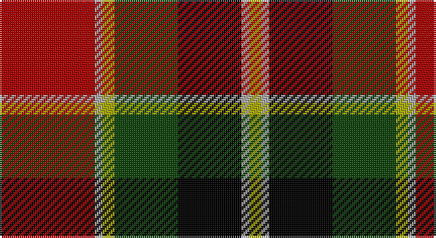

This page is one **sett** — a single exact thread-count. It belongs to the [tartan](/setts/r24lr2ly3dg16k16lr2ly3/)
(the same proportion at any scale), whose colour order is pattern [RYYGKYY](/stripes/ryygkyy/).

Sourced from weddslist.  It is a [7 stripe tartan](/stripes/stripes7/).

Original link http://www.weddslist.com/cgi-bin/tartans/pg.pl?source=tinsel

## Thread count
DR/48 N4 LG6 DG32 K32 N4 LG/6

One full sett is **210 threads**.

## Palette

Palette: <strong>Ingles Buchan</strong> <small style="color:#888">(1 of 5 colours)</small>
<table><thead><tr><th>Colour</th><th>Threads</th><th>Shade</th><th>Base</th><th>OKLCh</th></tr></thead><tbody><tr><td>DR/</td><td style="text-align:right;font-variant-numeric:tabular-nums">48</td><td><code style="background-color:#AA0000;">#AA0000</code> <small style="color:#888">#AA0000</small></td><td>R <code style="background-color:#CC0000;">#CC0000</code></td><td><small style="color:#888">oklch(46.3% 0.190 29.2)</small></td></tr><tr><td>N</td><td style="text-align:right;font-variant-numeric:tabular-nums">4</td><td><code style="background-color:#AAAAAA;">#AAAAAA</code> <small style="color:#888">#AAAAAA</small></td><td>Y <code style="background-color:#F2BF00;">#F2BF00</code></td><td><small style="color:#888">oklch(73.8% 0.000 89.9)</small></td></tr><tr><td>LG</td><td style="text-align:right;font-variant-numeric:tabular-nums">6</td><td><code style="background-color:#AAAA00;">#AAAA00</code> <small style="color:#888">#AAAA00</small></td><td>Y <code style="background-color:#F2BF00;">#F2BF00</code></td><td><small style="color:#888">oklch(71.4% 0.156 109.8)</small></td></tr><tr><td>DG</td><td style="text-align:right;font-variant-numeric:tabular-nums">32</td><td><code style="background-color:#11450D;">#11450D</code> <small style="color:#888">#11450D</small></td><td>G <code style="background-color:#006100;">#006100</code></td><td><small style="color:#888">oklch(34.4% 0.101 142.1)</small></td></tr><tr><td>K</td><td style="text-align:right;font-variant-numeric:tabular-nums">32</td><td><code style="background-color:#000000;">#000000</code> <small style="color:#888">#000000</small></td><td>K <code style="background-color:#000000;">#000000</code></td><td><small style="color:#888">oklch(0.0% 0.000 0.0)</small></td></tr><tr><td>N</td><td style="text-align:right;font-variant-numeric:tabular-nums">4</td><td><code style="background-color:#AAAAAA;">#AAAAAA</code> <small style="color:#888">#AAAAAA</small></td><td>Y <code style="background-color:#F2BF00;">#F2BF00</code></td><td><small style="color:#888">oklch(73.8% 0.000 89.9)</small></td></tr><tr><td>LG/</td><td style="text-align:right;font-variant-numeric:tabular-nums">6</td><td><code style="background-color:#AAAA00;">#AAAA00</code> <small style="color:#888">#AAAA00</small></td><td>Y <code style="background-color:#F2BF00;">#F2BF00</code></td><td><small style="color:#888">oklch(71.4% 0.156 109.8)</small></td></tr></tbody></table>

# Sample pattern

## Nearest tartans

The nearest existing variants by ΔTartan distance, with this tartan at the top so the swatches line up against it.

ΔTartan

Tartan

Sett

—

<a href="/ttd/edit/#slug=r24lr2ly3dg16k16lr2ly3~x2">MacLachlan W</a> <a class="nn-out" href="/variants/s7/r24lr2ly3dg16k16lr2ly3~x2/" title="open its dictionary page">↗</a>

0.00

<a href="/ttd/edit/#slug=r24lr2ly3dg16k16lr2ly3&amp;base=r24lr2ly3dg16k16lr2ly3~x2">MacLachlan W</a> <a class="nn-out" href="/variants/s7/r24lr2ly3dg16k16lr2ly3/" title="open its dictionary page">↗</a>

0.72

<a href="/ttd/edit/#slug=r24lb2ly3dg16k16lb2ly3&amp;base=r24lr2ly3dg16k16lr2ly3~x2">MacLachlan W</a> <a class="nn-out" href="/variants/s7/r24lb2ly3dg16k16lb2ly3/" title="open its dictionary page">↗</a>

0.78

<a href="/ttd/edit/#slug=k10ly2dg11r11w1r1w1k9~x2&amp;base=r24lr2ly3dg16k16lr2ly3~x2">Unidentified No 5</a> <a class="nn-out" href="/variants/s8/k10ly2dg11r11w1r1w1k9~x2/" title="open its dictionary page">↗</a>

0.92

<a href="/ttd/edit/#slug=g28t3g3k10r2k10r20ly4~x2&amp;base=r24lr2ly3dg16k16lr2ly3~x2">Garvock (2015)</a> <a class="nn-out" href="/variants/s8/g28t3g3k10r2k10r20ly4~x2/" title="open its dictionary page">↗</a>

0.95

<a href="/ttd/edit/#slug=r24w2ly3dg16k16w2ly3~x2&amp;base=r24lr2ly3dg16k16lr2ly3~x2">MacLachlan #4</a> <a class="nn-out" href="/variants/s7/r24w2ly3dg16k16w2ly3~x2/" title="open its dictionary page">↗</a>

0.96

<a href="/ttd/edit/#slug=r24w2ly3g16k16w2ly3~x2&amp;base=r24lr2ly3dg16k16lr2ly3~x2">MacLachlan Old Clan Tartan</a> <a class="nn-out" href="/variants/s7/r24w2ly3g16k16w2ly3~x2/" title="open its dictionary page">↗</a>

1.01

<a href="/ttd/edit/#slug=k10ly2g11r11w1r1w1k9~x2&amp;base=r24lr2ly3dg16k16lr2ly3~x2">Unnamed No 5</a> <a class="nn-out" href="/variants/s8/k10ly2g11r11w1r1w1k9~x2/" title="open its dictionary page">↗</a>

1.05

<a href="/ttd/edit/#slug=ly2dg7k6r11k1r1ly2~x4&amp;base=r24lr2ly3dg16k16lr2ly3~x2">Blackstock Red (Dress)</a> <a class="nn-out" href="/variants/s7/ly2dg7k6r11k1r1ly2~x4/" title="open its dictionary page">↗</a>

1.07

<a href="/ttd/edit/#slug=lb4k13g6r16lbi2r2g2~x2&amp;base=r24lr2ly3dg16k16lr2ly3~x2">Caledonian Brewery Corporate Tartan</a> <a class="nn-out" href="/variants/s7/lb4k13g6r16lbi2r2g2~x2/" title="open its dictionary page">↗</a>

1.08

<a href="/ttd/edit/#slug=w4dg20dgi10r25b2r2dgi2~x2&amp;base=r24lr2ly3dg16k16lr2ly3~x2">Caledonian Brewery (Corporate)</a> <a class="nn-out" href="/variants/s7/w4dg20dgi10r25b2r2dgi2~x2/" title="open its dictionary page">↗</a>

## Neighbour map

Every grey dot is one of 14360 variants placed by the first two principal components of the ΔTartan feature space (44% of its variance). Red is this tartan; blue dots are its nearest — click one to open its page.

<svg viewBox="0 0 640 380" role="img" style="max-width:100%;height:auto;border:1px solid #e0e0e0;border-radius:4px;display:block" xmlns="http://www.w3.org/2000/svg"><image href="/nn/cloud.v1.png" width="640" height="380"/><a href="/variants/s7/r24lr2ly3dg16k16lr2ly3/"><circle cx="155.2" cy="161.9" r="4" fill="#3465a4"><title>MacLachlan W</title></circle></a><a href="/variants/s7/r24lb2ly3dg16k16lb2ly3/"><circle cx="139.3" cy="150.6" r="4" fill="#3465a4"><title>MacLachlan W</title></circle></a><a href="/variants/s8/k10ly2dg11r11w1r1w1k9~x2/"><circle cx="173.7" cy="170.9" r="4" fill="#3465a4"><title>Unidentified No 5</title></circle></a><a href="/variants/s8/g28t3g3k10r2k10r20ly4~x2/"><circle cx="163.5" cy="149.7" r="4" fill="#3465a4"><title>Garvock (2015)</title></circle></a><a href="/variants/s7/r24w2ly3dg16k16w2ly3~x2/"><circle cx="153.5" cy="153.4" r="4" fill="#3465a4"><title>MacLachlan #4</title></circle></a><a href="/variants/s7/r24w2ly3g16k16w2ly3~x2/"><circle cx="154.4" cy="155.6" r="4" fill="#3465a4"><title>MacLachlan Old Clan Tartan</title></circle></a><a href="/variants/s8/k10ly2g11r11w1r1w1k9~x2/"><circle cx="155.6" cy="166.7" r="4" fill="#3465a4"><title>Unnamed No 5</title></circle></a><a href="/variants/s7/ly2dg7k6r11k1r1ly2~x4/"><circle cx="187.8" cy="183.9" r="4" fill="#3465a4"><title>Blackstock Red (Dress)</title></circle></a><a href="/variants/s7/lb4k13g6r16lbi2r2g2~x2/"><circle cx="171.7" cy="189.2" r="4" fill="#3465a4"><title>Caledonian Brewery Corporate Tartan</title></circle></a><a href="/variants/s7/w4dg20dgi10r25b2r2dgi2~x2/"><circle cx="202.2" cy="154.6" r="4" fill="#3465a4"><title>Caledonian Brewery (Corporate)</title></circle></a><circle cx="155.2" cy="161.9" r="5" fill="#c00000"/></svg>

ID: /variants/s7/r24lr2ly3dg16k16lr2ly3~x2/
