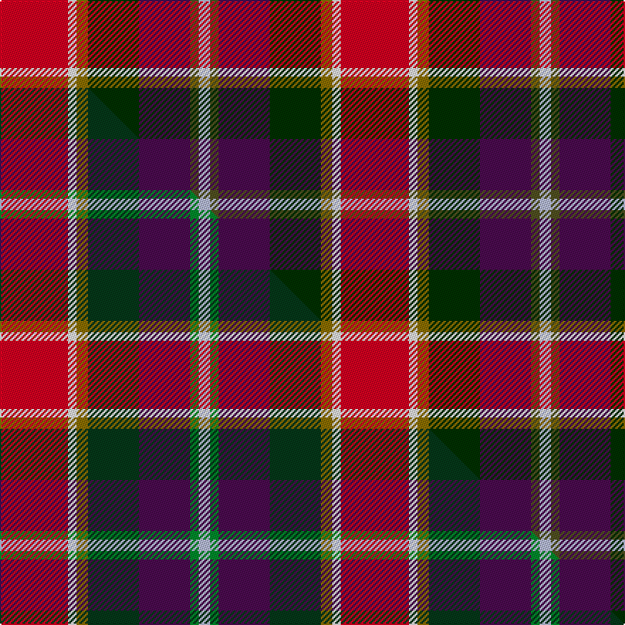

This is one **variant** — a specific cloth: this exact thread count and colourway, with its own
provenance below. It is one weaving of the [sett](/setts/r24w3y4dg18dp18dy3lb4/) (the scale-free proportion — the
same cloth at any scale or shade), whose colour order is pattern [RWGGBGW](/stripes/rwggbgw/).

Part of the [Walter](/tartans/w/wa/walter/) tartan — the named design grouping this sett with its other cloths.

Sourced from weddslist.  It is a [7 stripe tartan](/stripes/stripes7/).

Original link [http://www.weddslist.com/cgi-bin/tartans/pg.pl?source=sts](http://www.weddslist.com/cgi-bin/tartans/pg.pl?source=sts)

Dataset <small>— provenance for this record, inherited from the source manifest</small>

<dl class="dataset-prov">
<dt>source</dt><dd><a href="/sources/weddslist/">Weddslist</a></dd>
<dt>data captured from</dt><dd><a href="https://github.com/thetartan/tartan-database/blob/master/data/weddslist/data.csv">https://github.com/thetartan/tartan-database/blob/master/data/weddslist/data.csv</a></dd>
<dt>data date</dt><dd>2016-11-17 <small>(dataset default)</small></dd>
<dt>licence</dt><dd><a href="https://creativecommons.org/licenses/by-nc-nd/4.0/">CC BY-NC-ND 4.0</a></dd>
</dl>

Capture chain <small>— the hands this data passed through, oldest first; each capture carries its own licence</small>

<ol class="capture-chain">
<li><a href="https://www.weddslist.com/tartans/">Weddslist</a> <small>the living privately compiled reference</small></li>
<li><a href="https://github.com/thetartan/tartan-database">thetartan/tartan-database</a> <small>2016-2017</small> · <a href="https://creativecommons.org/licenses/by-nc-nd/4.0/">CC BY-NC-ND 4.0</a> <small>Levko Kravets's frozen compilation — the capture we vendored, and where its CC licence text came from</small></li>
<li>this dictionary <small>captured 2026-06-10 · commit 5bf86c7566</small> <small>each re-capture is a git commit to data/sources</small></li>
</ol>

## Thread count
R/48 W6 Y8 DG36 DP36 DY6 LB/8

One full sett is **240 threads**.

## Palette
<table><thead><tr><th>Colour</th><th>Shade</th><th>OKLCh</th></tr></thead><tbody><tr><td>LB</td><td><code style="background-color:#B5BBDE;">#B5BBDE</code> <small style="color:#888">#B5BBDE</small></td><td><small style="color:#888">oklch(79.9% 0.050 277.6)</small></td></tr><tr><td>DG</td><td><code style="background-color:#003000;">#003000</code> <small style="color:#888">#003000</small></td><td><small style="color:#888">oklch(26.8% 0.091 142.5)</small></td></tr><tr><td>W</td><td><code style="background-color:#F7F7F7;">#F7F7F7</code> <small style="color:#888">#F7F7F7</small></td><td><small style="color:#888">oklch(97.6% 0.000 89.9)</small></td></tr><tr><td>DP</td><td><code style="background-color:#4B0B4F;">#4B0B4F</code> <small style="color:#888">#4B0B4F</small></td><td><small style="color:#888">oklch(30.1% 0.125 325.4)</small></td></tr><tr><td>R</td><td><code style="background-color:#D60020;">#D60020</code> <small style="color:#888">#D60020</small></td><td><small style="color:#888">oklch(55.2% 0.224 25.5)</small></td></tr><tr><td>DY</td><td><code style="background-color:#505020;">#505020</code> <small style="color:#888">#505020</small></td><td><small style="color:#888">oklch(42.0% 0.068 109.0)</small></td></tr><tr><td>Y</td><td><code style="background-color:#8B6E00;">#8B6E00</code> <small style="color:#888">#8B6E00</small></td><td><small style="color:#888">oklch(55.1% 0.113 90.4)</small></td></tr></tbody></table>

# Sample pattern

## Compared to the master

This cloth is one sett of its design; the master sett (the exemplar the design is anchored on) is below for comparison.

Its **ΔTartan distance** from the master is **0.61** — the same measure the nearest-tartans table ranks by (0 is identical; a re-scale of the same cloth is near 0, a recolour or a different proportion further).

<figure class="master-compare" style="margin:0">

this sett
master sett ★

<figcaption style="color:#888;font-size:smaller">One weave of this sett against the <a href="/setts/r24w3y4dg18dp18g3lb4/">master sett ★</a>, split on the diagonal: a shared proportion runs seamlessly across it with only the shades shifting; a different proportion breaks on it.</figcaption>
</figure>

## Nearest tartan variants

The nearest existing variants by ΔTartan distance, with this cloth at the top so the swatches line up against it.

ΔTartan

Threads

Variant

Sett

—

240

<a href="/variants/s7/r24w3y4dg18dp18dy3lb4~x2~dg1104144-dy1703114/">Walter</a>

<a href="/ttd/edit/#slug=r24w3y4dg18dp18g3lb4~x2&amp;base=r24w3y4dg18dp18dy3lb4~x2~dg1104144-dy1703114" title="compare in the TTD">0.61</a>

240

<a href="/variants/s7/r24w3y4dg18dp18g3lb4~x2/">Walter (Personal)</a>

<a href="/ttd/edit/#slug=g25r9lb3y7w3dp11&amp;base=r24w3y4dg18dp18dy3lb4~x2~dg1104144-dy1703114" title="compare in the TTD">1.76</a>

80

<a href="/variants/s6/g25r9lb3y7w3dp11/">Montessori School of Denver</a>

<a href="/ttd/edit/#slug=g25r9lb3y7w3dp11~x3&amp;base=r24w3y4dg18dp18dy3lb4~x2~dg1104144-dy1703114" title="compare in the TTD">1.76</a>

240

<a href="/variants/s6/g25r9lb3y7w3dp11~x3/">Montessori School of Denver (School)</a>

<a href="/ttd/edit/#slug=lb4dp3b1g9w1r8k1~x4&amp;base=r24w3y4dg18dp18dy3lb4~x2~dg1104144-dy1703114" title="compare in the TTD">2.03</a>

196

<a href="/variants/s7/lb4dp3b1g9w1r8k1~x4/">Wilson's, No 121</a>

<a href="/ttd/edit/#slug=r3y2g12dp12db14w3~x2&amp;base=r24w3y4dg18dp18dy3lb4~x2~dg1104144-dy1703114" title="compare in the TTD">2.12</a>

172

<a href="/variants/s6/r3y2g12dp12db14w3~x2/">Jamestown Parish Church (Corporate)</a>

<a href="/ttd/edit/#slug=g21db21y3r21n3dp5n3~x2&amp;base=r24w3y4dg18dp18dy3lb4~x2~dg1104144-dy1703114" title="compare in the TTD">2.42</a>

260

<a href="/variants/s7/g21db21y3r21n3dp5n3~x2/">Falardeau-Murphy (Canada) (Personal)</a>

<a href="/ttd/edit/#slug=g21lb21ly3r21n3dp5n3~x2&amp;base=r24w3y4dg18dp18dy3lb4~x2~dg1104144-dy1703114" title="compare in the TTD">2.46</a>

260

<a href="/variants/s7/g21lb21ly3r21n3dp5n3~x2/">Falardeau-Murphy (Canada) (Personal)</a>

<a href="/ttd/edit/#slug=y3k2lb3r14g19k3w3dp10lb3~x2&amp;base=r24w3y4dg18dp18dy3lb4~x2~dg1104144-dy1703114" title="compare in the TTD">2.64</a>

228

<a href="/variants/s9/y3k2lb3r14g19k3w3dp10lb3~x2/">Wilson's, No 110</a>

<a href="/ttd/edit/#slug=r6y15do4db12g12dy4r25w5~x2&amp;base=r24w3y4dg18dp18dy3lb4~x2~dg1104144-dy1703114" title="compare in the TTD">2.72</a>

310

<a href="/variants/s8/r6y15do4db12g12dy4r25w5~x2/">Young Presidents Organisation Dress</a>

<a href="/ttd/edit/#slug=g3dbi8r11db3k2dp2~x4~dbi1406275-db1404245&amp;base=r24w3y4dg18dp18dy3lb4~x2~dg1104144-dy1703114" title="compare in the TTD">2.86</a>

212

<a href="/variants/s6/g3dbi8r11db3k2dp2~x4~dbi1406275-db1404245/">Nicolson of Tiree &amp; Coll (Clan)</a>

## Neighbour map

Every grey dot is one of 13621 variants placed by the first two principal components of the ΔTartan feature space (42% of its variance). Red is this tartan; blue dots are its nearest — click one to open its page.

<svg viewBox="0 0 640 380" role="img" style="max-width:100%;height:auto;border:1px solid #e0e0e0;border-radius:4px;display:block" xmlns="http://www.w3.org/2000/svg"><image href="/nn/cloud.v1.png" width="640" height="380"/><a href="/variants/s7/r24w3y4dg18dp18g3lb4~x2/"><circle cx="103.7" cy="166.2" r="4" fill="#3465a4"><title>Walter (Personal)</title></circle></a><a href="/variants/s6/g25r9lb3y7w3dp11/"><circle cx="177.0" cy="204.9" r="4" fill="#3465a4"><title>Montessori School of Denver</title></circle></a><a href="/variants/s6/g25r9lb3y7w3dp11~x3/"><circle cx="177.0" cy="204.9" r="4" fill="#3465a4"><title>Montessori School of Denver (School)</title></circle></a><a href="/variants/s7/lb4dp3b1g9w1r8k1~x4/"><circle cx="86.0" cy="157.1" r="4" fill="#3465a4"><title>Wilson's, No 121</title></circle></a><a href="/variants/s6/r3y2g12dp12db14w3~x2/"><circle cx="105.6" cy="220.1" r="4" fill="#3465a4"><title>Jamestown Parish Church (Corporate)</title></circle></a><a href="/variants/s7/g21db21y3r21n3dp5n3~x2/"><circle cx="122.4" cy="206.8" r="4" fill="#3465a4"><title>Falardeau-Murphy (Canada) (Personal)</title></circle></a><a href="/variants/s7/g21lb21ly3r21n3dp5n3~x2/"><circle cx="125.5" cy="209.8" r="4" fill="#3465a4"><title>Falardeau-Murphy (Canada) (Personal)</title></circle></a><a href="/variants/s9/y3k2lb3r14g19k3w3dp10lb3~x2/"><circle cx="60.6" cy="138.1" r="4" fill="#3465a4"><title>Wilson's, No 110</title></circle></a><a href="/variants/s8/r6y15do4db12g12dy4r25w5~x2/"><circle cx="108.4" cy="197.1" r="4" fill="#3465a4"><title>Young Presidents Organisation Dress</title></circle></a><a href="/variants/s6/g3dbi8r11db3k2dp2~x4~dbi1406275-db1404245/"><circle cx="127.4" cy="206.7" r="4" fill="#3465a4"><title>Nicolson of Tiree &amp; Coll (Clan)</title></circle></a><circle cx="124.1" cy="183.1" r="5" fill="#c00000"/><text x="320" y="376" text-anchor="middle" font-size="11" fill="#999">ground</text><text x="11" y="190" text-anchor="middle" font-size="11" fill="#999" transform="rotate(-90 11 190)">complexity</text></svg>

ID: /variants/s7/r24w3y4dg18dp18dy3lb4~x2~dg1104144-dy1703114/
