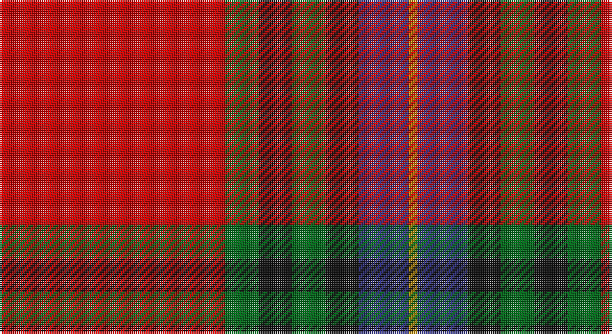

This page is one **sett** — a single exact thread-count. It belongs to the [tartan](/setts/r27g4k4g4k4db6lo1/)
(the same proportion at any scale), whose colour order is pattern [RGKGKBY](/stripes/rgkgkby/).

Part of the [MacLeay](/tartans/macleay/) tartan — the named design grouping this sett with its other cloths.

Sourced from tartans-authority.  It is a [7 stripe tartan](/stripes/stripes7/).

Original link http://www.tartansauthority.com/tartan-ferret/display/3437/

## Register references

External register numbers recorded for this tartan.

- Scottish Tartans Authority (ITI): 3437

## Thread count
R/108 G16 K16 G16 K16 DB24 DY/4

One full sett is **288 threads**.

## Palette

Palette: <strong>Tartan Register</strong> <small style="color:#888">(4 of 5 colours)</small>
<table><thead><tr><th>Colour</th><th>Threads</th><th>Shade</th><th>Base</th><th>OKLCh</th></tr></thead><tbody><tr><td>R/</td><td style="text-align:right;font-variant-numeric:tabular-nums">108</td><td><code style="background-color:#C80000;">#C80000</code> <small style="color:#888">#C80000</small></td><td>R <code style="background-color:#CC0000;">#CC0000</code></td><td><small style="color:#888">oklch(52.3% 0.215 29.2)</small></td></tr><tr><td>G</td><td style="text-align:right;font-variant-numeric:tabular-nums">16</td><td><code style="background-color:#006818;">#006818</code> <small style="color:#888">#006818</small></td><td>G <code style="background-color:#006100;">#006100</code></td><td><small style="color:#888">oklch(45.0% 0.142 145.0)</small></td></tr><tr><td>K</td><td style="text-align:right;font-variant-numeric:tabular-nums">16</td><td><code style="background-color:#101010;">#101010</code> <small style="color:#888">#101010</small></td><td>K <code style="background-color:#000000;">#000000</code></td><td><small style="color:#888">oklch(17.3% 0.000 89.9)</small></td></tr><tr><td>G</td><td style="text-align:right;font-variant-numeric:tabular-nums">16</td><td><code style="background-color:#006818;">#006818</code> <small style="color:#888">#006818</small></td><td>G <code style="background-color:#006100;">#006100</code></td><td><small style="color:#888">oklch(45.0% 0.142 145.0)</small></td></tr><tr><td>K</td><td style="text-align:right;font-variant-numeric:tabular-nums">16</td><td><code style="background-color:#101010;">#101010</code> <small style="color:#888">#101010</small></td><td>K <code style="background-color:#000000;">#000000</code></td><td><small style="color:#888">oklch(17.3% 0.000 89.9)</small></td></tr><tr><td>DB</td><td style="text-align:right;font-variant-numeric:tabular-nums">24</td><td><code style="background-color:#2C2C80;">#2C2C80</code> <small style="color:#888">#2C2C80</small></td><td>B <code style="background-color:#2A418A;">#2A418A</code></td><td><small style="color:#888">oklch(35.0% 0.138 276.6)</small></td></tr><tr><td>DY/</td><td style="text-align:right;font-variant-numeric:tabular-nums">4</td><td><code style="background-color:#D09800;">#D09800</code> <small style="color:#888">#D09800</small></td><td>Y <code style="background-color:#F2BF00;">#F2BF00</code></td><td><small style="color:#888">oklch(71.4% 0.147 82.1)</small></td></tr></tbody></table>

# Sample pattern

## Compared to the master

This cloth is one sett of its design; the master sett (the exemplar the design is anchored on) is below for comparison.

<figure style="margin:0"><figcaption style="color:#888;font-size:smaller">this sett</figcaption></figure>
<figure style="margin:0"><figcaption style="color:#888;font-size:smaller"><a href="/setts/r27y4k4y4k4t6lo1/">master sett →</a></figcaption></figure>

## Nearest tartans

The nearest existing variants by ΔTartan distance, with this tartan at the top so the swatches line up against it.

ΔTartan

Tartan

Sett

—

<a href="/ttd/edit/#slug=r27g4k4g4k4db6lo1~x4">MacLeay (Clan)</a> <a class="nn-out" href="/variants/s7/r27g4k4g4k4db6lo1~x4/" title="open its dictionary page">↗</a>

0.51

<a href="/ttd/edit/#slug=r28dg4k4dg4k4t6ly1~x2&amp;base=r27g4k4g4k4db6lo1~x4">Livingstone MacLay MacLeay</a> <a class="nn-out" href="/variants/s7/r28dg4k4dg4k4t6ly1~x2/" title="open its dictionary page">↗</a>

0.55

<a href="/ttd/edit/#slug=r27y4k4y4k4t6lo1~x4&amp;base=r27g4k4g4k4db6lo1~x4">MacLeay</a> <a class="nn-out" href="/variants/s7/r27y4k4y4k4t6lo1~x4/" title="open its dictionary page">↗</a>

0.85

<a href="/ttd/edit/#slug=r28g4k4g4k4t6ly1~x2&amp;base=r27g4k4g4k4db6lo1~x4">Livingstone, MacLay MacLeay</a> <a class="nn-out" href="/variants/s7/r28g4k4g4k4t6ly1~x2/" title="open its dictionary page">↗</a>

0.87

<a href="/ttd/edit/#slug=r25db7r3g13t1k2~x4&amp;base=r27g4k4g4k4db6lo1~x4">MacPhail</a> <a class="nn-out" href="/variants/s6/r25db7r3g13t1k2~x4/" title="open its dictionary page">↗</a>

0.96

<a href="/ttd/edit/#slug=lo5dt1r2dt4r36dt22w4ly2~x2&amp;base=r27g4k4g4k4db6lo1~x4">Aberdeen F.C. Corporate Tartan</a> <a class="nn-out" href="/variants/s8/lo5dt1r2dt4r36dt22w4ly2~x2/" title="open its dictionary page">↗</a>

0.98

<a href="/ttd/edit/#slug=r6lb1r24db6dg2k1dg2k1dg12r1&amp;base=r27g4k4g4k4db6lo1~x4">Chisholm VS</a> <a class="nn-out" href="/variants/s10/r6lb1r24db6dg2k1dg2k1dg12r1/" title="open its dictionary page">↗</a>

0.98

<a href="/ttd/edit/#slug=r6ly1r24g6db2k1db2k1db12r1~x2&amp;base=r27g4k4g4k4db6lo1~x4">MacEdward</a> <a class="nn-out" href="/variants/s10/r6ly1r24g6db2k1db2k1db12r1~x2/" title="open its dictionary page">↗</a>

0.98

<a href="/ttd/edit/#slug=r6w1r24db6dg2k1dg2k1dg12r1~x2&amp;base=r27g4k4g4k4db6lo1~x4">Chisholm #2</a> <a class="nn-out" href="/variants/s10/r6w1r24db6dg2k1dg2k1dg12r1~x2/" title="open its dictionary page">↗</a>

0.99

<a href="/ttd/edit/#slug=r50k25g10o5ly2~x2&amp;base=r27g4k4g4k4db6lo1~x4">MacGleish Formal (Personal)</a> <a class="nn-out" href="/variants/s5/r50k25g10o5ly2~x2/" title="open its dictionary page">↗</a>

1.00

<a href="/ttd/edit/#slug=r24lb1k3lb1g14r8k3dp3lb2~x4&amp;base=r27g4k4g4k4db6lo1~x4">Leach (1995)</a> <a class="nn-out" href="/variants/s9/r24lb1k3lb1g14r8k3dp3lb2~x4/" title="open its dictionary page">↗</a>

## Neighbour map

Every grey dot is one of 14360 variants placed by the first two principal components of the ΔTartan feature space (44% of its variance). Red is this tartan; blue dots are its nearest — click one to open its page.

<svg viewBox="0 0 640 380" role="img" style="max-width:100%;height:auto;border:1px solid #e0e0e0;border-radius:4px;display:block" xmlns="http://www.w3.org/2000/svg"><image href="/nn/cloud.v1.png" width="640" height="380"/><a href="/variants/s7/r28dg4k4dg4k4t6ly1~x2/"><circle cx="323.9" cy="110.5" r="4" fill="#3465a4"><title>Livingstone MacLay MacLeay</title></circle></a><a href="/variants/s7/r27y4k4y4k4t6lo1~x4/"><circle cx="324.3" cy="117.2" r="4" fill="#3465a4"><title>MacLeay</title></circle></a><a href="/variants/s7/r28g4k4g4k4t6ly1~x2/"><circle cx="308.9" cy="107.5" r="4" fill="#3465a4"><title>Livingstone, MacLay MacLeay</title></circle></a><a href="/variants/s6/r25db7r3g13t1k2~x4/"><circle cx="327.3" cy="143.1" r="4" fill="#3465a4"><title>MacPhail</title></circle></a><a href="/variants/s8/lo5dt1r2dt4r36dt22w4ly2~x2/"><circle cx="327.3" cy="94.7" r="4" fill="#3465a4"><title>Aberdeen F.C. Corporate Tartan</title></circle></a><a href="/variants/s10/r6lb1r24db6dg2k1dg2k1dg12r1/"><circle cx="330.4" cy="103.1" r="4" fill="#3465a4"><title>Chisholm VS</title></circle></a><a href="/variants/s10/r6ly1r24g6db2k1db2k1db12r1~x2/"><circle cx="342.6" cy="106.9" r="4" fill="#3465a4"><title>MacEdward</title></circle></a><a href="/variants/s10/r6w1r24db6dg2k1dg2k1dg12r1~x2/"><circle cx="339.6" cy="103.3" r="4" fill="#3465a4"><title>Chisholm #2</title></circle></a><a href="/variants/s5/r50k25g10o5ly2~x2/"><circle cx="321.1" cy="146.9" r="4" fill="#3465a4"><title>MacGleish Formal (Personal)</title></circle></a><a href="/variants/s9/r24lb1k3lb1g14r8k3dp3lb2~x4/"><circle cx="329.8" cy="129.9" r="4" fill="#3465a4"><title>Leach (1995)</title></circle></a><circle cx="324.9" cy="121.0" r="5" fill="#c00000"/></svg>

ID: /variants/s7/r27g4k4g4k4db6lo1~x4/
