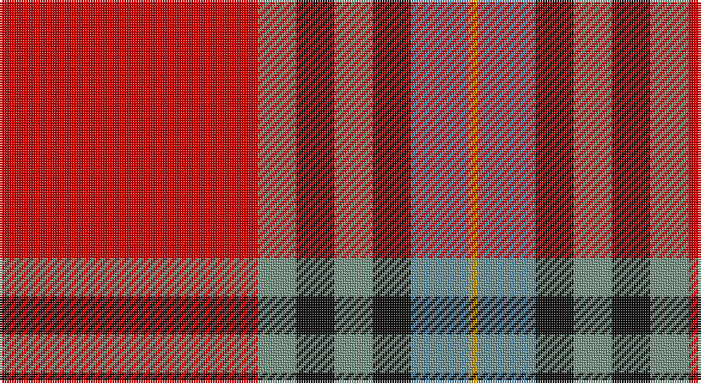

This page is one **sett** — a single exact thread-count. It belongs to the [tartan](/setts/r27y4k4y4k4t6lo1/)
(the same proportion at any scale), whose colour order is pattern [RGKGKBY](/stripes/rgkgkby/).

Part of the [MacLeay](/tartans/macleay/) tartan — the named design grouping this sett with its other cloths.

Sourced from register-of-tartans.  It is a [7 stripe tartan](/stripes/stripes7/).

Original link https://www.tartanregister.gov.uk/tartanDetails.aspx?ref=5194

## Register references

External register numbers recorded for this tartan.

- Scottish Register of Tartans: [5194](https://www.tartanregister.gov.uk/tartanDetails.aspx?ref=5194)
- Scottish Tartans Authority (ITI): 3437

## Thread count
R/108 LG16 K16 LG16 K16 B24 DY/4

One full sett is **288 threads**.

## Palette

Palette: <strong>Tartan Register</strong> <small style="color:#888">(4 of 5 colours)</small>
<table><thead><tr><th>Colour</th><th>Threads</th><th>Shade</th><th>Base</th><th>OKLCh</th></tr></thead><tbody><tr><td>R/</td><td style="text-align:right;font-variant-numeric:tabular-nums">108</td><td><code style="background-color:#C80000;">#C80000</code> <small style="color:#888">#C80000</small></td><td>R <code style="background-color:#CC0000;">#CC0000</code></td><td><small style="color:#888">oklch(52.3% 0.215 29.2)</small></td></tr><tr><td>LG</td><td style="text-align:right;font-variant-numeric:tabular-nums">16</td><td><code style="background-color:#789484;">#789484</code> <small style="color:#888">#789484</small></td><td>G <code style="background-color:#006100;">#006100</code></td><td><small style="color:#888">oklch(64.0% 0.040 160.0)</small></td></tr><tr><td>K</td><td style="text-align:right;font-variant-numeric:tabular-nums">16</td><td><code style="background-color:#101010;">#101010</code> <small style="color:#888">#101010</small></td><td>K <code style="background-color:#000000;">#000000</code></td><td><small style="color:#888">oklch(17.3% 0.000 89.9)</small></td></tr><tr><td>LG</td><td style="text-align:right;font-variant-numeric:tabular-nums">16</td><td><code style="background-color:#789484;">#789484</code> <small style="color:#888">#789484</small></td><td>G <code style="background-color:#006100;">#006100</code></td><td><small style="color:#888">oklch(64.0% 0.040 160.0)</small></td></tr><tr><td>K</td><td style="text-align:right;font-variant-numeric:tabular-nums">16</td><td><code style="background-color:#101010;">#101010</code> <small style="color:#888">#101010</small></td><td>K <code style="background-color:#000000;">#000000</code></td><td><small style="color:#888">oklch(17.3% 0.000 89.9)</small></td></tr><tr><td>B</td><td style="text-align:right;font-variant-numeric:tabular-nums">24</td><td><code style="background-color:#5C8CA8;">#5C8CA8</code> <small style="color:#888">#5C8CA8</small></td><td>B <code style="background-color:#2A418A;">#2A418A</code></td><td><small style="color:#888">oklch(61.7% 0.067 235.0)</small></td></tr><tr><td>DY/</td><td style="text-align:right;font-variant-numeric:tabular-nums">4</td><td><code style="background-color:#D09800;">#D09800</code> <small style="color:#888">#D09800</small></td><td>Y <code style="background-color:#F2BF00;">#F2BF00</code></td><td><small style="color:#888">oklch(71.4% 0.147 82.1)</small></td></tr></tbody></table>

# Sample pattern

## Nearest tartans

The nearest existing variants by ΔTartan distance, with this tartan at the top so the swatches line up against it.

ΔTartan

Tartan

Sett

—

<a href="/ttd/edit/#slug=r27y4k4y4k4t6lo1~x4">MacLeay</a> <a class="nn-out" href="/variants/s7/r27y4k4y4k4t6lo1~x4/" title="open its dictionary page">↗</a>

0.46

<a href="/ttd/edit/#slug=r28dg4k4dg4k4t6ly1~x2&amp;base=r27y4k4y4k4t6lo1~x4">Livingstone MacLay MacLeay</a> <a class="nn-out" href="/variants/s7/r28dg4k4dg4k4t6ly1~x2/" title="open its dictionary page">↗</a>

0.55

<a href="/ttd/edit/#slug=r27g4k4g4k4db6lo1~x4&amp;base=r27y4k4y4k4t6lo1~x4">MacLeay (Clan)</a> <a class="nn-out" href="/variants/s7/r27g4k4g4k4db6lo1~x4/" title="open its dictionary page">↗</a>

0.83

<a href="/ttd/edit/#slug=lo5dt1r2dt4r36dt22w4ly2~x2&amp;base=r27y4k4y4k4t6lo1~x4">Aberdeen F.C. Corporate Tartan</a> <a class="nn-out" href="/variants/s8/lo5dt1r2dt4r36dt22w4ly2~x2/" title="open its dictionary page">↗</a>

0.92

<a href="/ttd/edit/#slug=r25db7r3g13t1k2~x4&amp;base=r27y4k4y4k4t6lo1~x4">MacPhail</a> <a class="nn-out" href="/variants/s6/r25db7r3g13t1k2~x4/" title="open its dictionary page">↗</a>

0.92

<a href="/ttd/edit/#slug=r6b22r6g20ly2r45b2w5~x2&amp;base=r27y4k4y4k4t6lo1~x4">Elbrick Dress (Personal)</a> <a class="nn-out" href="/variants/s8/r6b22r6g20ly2r45b2w5~x2/" title="open its dictionary page">↗</a>

0.94

<a href="/ttd/edit/#slug=r6w1r24db6dg2k1dg2k1dg12r1~x2&amp;base=r27y4k4y4k4t6lo1~x4">Chisholm #2</a> <a class="nn-out" href="/variants/s10/r6w1r24db6dg2k1dg2k1dg12r1~x2/" title="open its dictionary page">↗</a>

1.01

<a href="/ttd/edit/#slug=r6ly1r24g6db2k1db2k1db12r1~x2&amp;base=r27y4k4y4k4t6lo1~x4">MacEdward</a> <a class="nn-out" href="/variants/s10/r6ly1r24g6db2k1db2k1db12r1~x2/" title="open its dictionary page">↗</a>

1.06

<a href="/ttd/edit/#slug=r28g4k4g4k4t6ly1~x2&amp;base=r27y4k4y4k4t6lo1~x4">Livingstone, MacLay MacLeay</a> <a class="nn-out" href="/variants/s7/r28g4k4g4k4t6ly1~x2/" title="open its dictionary page">↗</a>

1.09

<a href="/ttd/edit/#slug=r36lb1db3ly1dg16r8db3lb5&amp;base=r27y4k4y4k4t6lo1~x4">Drummond of Perth</a> <a class="nn-out" href="/variants/s8/r36lb1db3ly1dg16r8db3lb5/" title="open its dictionary page">↗</a>

1.12

<a href="/ttd/edit/#slug=ly3n8w3n34r34g4r4w2~x2&amp;base=r27y4k4y4k4t6lo1~x4">Manitoba Masonic</a> <a class="nn-out" href="/variants/s8/ly3n8w3n34r34g4r4w2~x2/" title="open its dictionary page">↗</a>

## Neighbour map

Every grey dot is one of 14360 variants placed by the first two principal components of the ΔTartan feature space (44% of its variance). Red is this tartan; blue dots are its nearest — click one to open its page.

<svg viewBox="0 0 640 380" role="img" style="max-width:100%;height:auto;border:1px solid #e0e0e0;border-radius:4px;display:block" xmlns="http://www.w3.org/2000/svg"><image href="/nn/cloud.v1.png" width="640" height="380"/><a href="/variants/s7/r28dg4k4dg4k4t6ly1~x2/"><circle cx="323.9" cy="110.5" r="4" fill="#3465a4"><title>Livingstone MacLay MacLeay</title></circle></a><a href="/variants/s7/r27g4k4g4k4db6lo1~x4/"><circle cx="324.9" cy="121.0" r="4" fill="#3465a4"><title>MacLeay (Clan)</title></circle></a><a href="/variants/s8/lo5dt1r2dt4r36dt22w4ly2~x2/"><circle cx="327.3" cy="94.7" r="4" fill="#3465a4"><title>Aberdeen F.C. Corporate Tartan</title></circle></a><a href="/variants/s6/r25db7r3g13t1k2~x4/"><circle cx="327.3" cy="143.1" r="4" fill="#3465a4"><title>MacPhail</title></circle></a><a href="/variants/s8/r6b22r6g20ly2r45b2w5~x2/"><circle cx="307.7" cy="128.6" r="4" fill="#3465a4"><title>Elbrick Dress (Personal)</title></circle></a><a href="/variants/s10/r6w1r24db6dg2k1dg2k1dg12r1~x2/"><circle cx="339.6" cy="103.3" r="4" fill="#3465a4"><title>Chisholm #2</title></circle></a><a href="/variants/s10/r6ly1r24g6db2k1db2k1db12r1~x2/"><circle cx="342.6" cy="106.9" r="4" fill="#3465a4"><title>MacEdward</title></circle></a><a href="/variants/s7/r28g4k4g4k4t6ly1~x2/"><circle cx="308.9" cy="107.5" r="4" fill="#3465a4"><title>Livingstone, MacLay MacLeay</title></circle></a><a href="/variants/s8/r36lb1db3ly1dg16r8db3lb5/"><circle cx="371.7" cy="93.8" r="4" fill="#3465a4"><title>Drummond of Perth</title></circle></a><a href="/variants/s8/ly3n8w3n34r34g4r4w2~x2/"><circle cx="288.1" cy="130.8" r="4" fill="#3465a4"><title>Manitoba Masonic</title></circle></a><circle cx="324.3" cy="117.2" r="5" fill="#c00000"/></svg>

ID: /variants/s7/r27y4k4y4k4t6lo1~x4/
