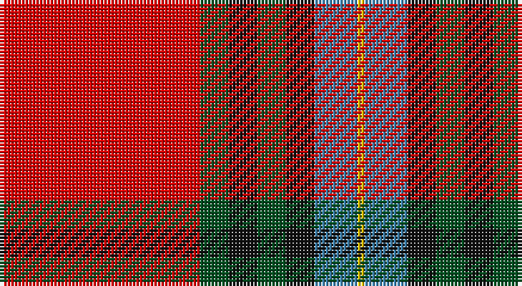

This page is one **sett** — a single exact thread-count. It belongs to the [tartan](/setts/r28dg4k4dg4k4t6ly1/)
(the same proportion at any scale), whose colour order is pattern [RGKGKBY](/stripes/rgkgkby/).

Part of the [Livingstone MacLay MacLeay](/tartans/livingstone-maclay-macleay/) tartan — the named design grouping this sett with its other cloths.

Sourced from register-of-tartans.  It is a [7 stripe tartan](/stripes/stripes7/).

Original link https://www.tartanregister.gov.uk/tartanDetails.aspx?ref=2137

## Also known as

This cloth is also recorded under:

- Livingstone, MacLay MacLeay

## Register references

External register numbers recorded for this tartan.

- Scottish Register of Tartans: [2137](https://www.tartanregister.gov.uk/tartanDetails.aspx?ref=2137)
- Scottish Tartans World Register: 1488

## Thread count
R/56 G8 K8 G8 K8 B12 Y/2

One full sett is **146 threads**.

## Palette

Palette: <strong>Tartan Register</strong>
<table><thead><tr><th>Colour</th><th>Threads</th><th>Shade</th><th>Base</th><th>OKLCh</th></tr></thead><tbody><tr><td>R/</td><td style="text-align:right;font-variant-numeric:tabular-nums">56</td><td><code style="background-color:#DC0000;">#DC0000</code> <small style="color:#888">#DC0000</small></td><td>R <code style="background-color:#CC0000;">#CC0000</code></td><td><small style="color:#888">oklch(56.2% 0.230 29.2)</small></td></tr><tr><td>G</td><td style="text-align:right;font-variant-numeric:tabular-nums">8</td><td><code style="background-color:#005020;">#005020</code> <small style="color:#888">#005020</small></td><td>G <code style="background-color:#006100;">#006100</code></td><td><small style="color:#888">oklch(37.7% 0.105 149.6)</small></td></tr><tr><td>K</td><td style="text-align:right;font-variant-numeric:tabular-nums">8</td><td><code style="background-color:#101010;">#101010</code> <small style="color:#888">#101010</small></td><td>K <code style="background-color:#000000;">#000000</code></td><td><small style="color:#888">oklch(17.3% 0.000 89.9)</small></td></tr><tr><td>G</td><td style="text-align:right;font-variant-numeric:tabular-nums">8</td><td><code style="background-color:#005020;">#005020</code> <small style="color:#888">#005020</small></td><td>G <code style="background-color:#006100;">#006100</code></td><td><small style="color:#888">oklch(37.7% 0.105 149.6)</small></td></tr><tr><td>K</td><td style="text-align:right;font-variant-numeric:tabular-nums">8</td><td><code style="background-color:#101010;">#101010</code> <small style="color:#888">#101010</small></td><td>K <code style="background-color:#000000;">#000000</code></td><td><small style="color:#888">oklch(17.3% 0.000 89.9)</small></td></tr><tr><td>B</td><td style="text-align:right;font-variant-numeric:tabular-nums">12</td><td><code style="background-color:#3C82AF;">#3C82AF</code> <small style="color:#888">#3C82AF</small></td><td>B <code style="background-color:#2A418A;">#2A418A</code></td><td><small style="color:#888">oklch(58.1% 0.099 239.8)</small></td></tr><tr><td>Y/</td><td style="text-align:right;font-variant-numeric:tabular-nums">2</td><td><code style="background-color:#E8C000;">#E8C000</code> <small style="color:#888">#E8C000</small></td><td>Y <code style="background-color:#F2BF00;">#F2BF00</code></td><td><small style="color:#888">oklch(81.9% 0.168 93.7)</small></td></tr></tbody></table>

# Sample pattern

## Nearest tartans

The nearest existing variants by ΔTartan distance, with this tartan at the top so the swatches line up against it.

ΔTartan

Tartan

Sett

—

<a href="/ttd/edit/#slug=r28dg4k4dg4k4t6ly1~x2">Livingstone MacLay MacLeay</a> <a class="nn-out" href="/variants/s7/r28dg4k4dg4k4t6ly1~x2/" title="open its dictionary page">↗</a>

0.46

<a href="/ttd/edit/#slug=r27y4k4y4k4t6lo1~x4&amp;base=r28dg4k4dg4k4t6ly1~x2">MacLeay</a> <a class="nn-out" href="/variants/s7/r27y4k4y4k4t6lo1~x4/" title="open its dictionary page">↗</a>

0.51

<a href="/ttd/edit/#slug=r27g4k4g4k4db6lo1~x4&amp;base=r28dg4k4dg4k4t6ly1~x2">MacLeay (Clan)</a> <a class="nn-out" href="/variants/s7/r27g4k4g4k4db6lo1~x4/" title="open its dictionary page">↗</a>

0.67

<a href="/ttd/edit/#slug=r28g4k4g4k4t6ly1~x2&amp;base=r28dg4k4dg4k4t6ly1~x2">Livingstone, MacLay MacLeay</a> <a class="nn-out" href="/variants/s7/r28g4k4g4k4t6ly1~x2/" title="open its dictionary page">↗</a>

0.87

<a href="/ttd/edit/#slug=r36lb1db3ly1dg16r8db3lb5&amp;base=r28dg4k4dg4k4t6ly1~x2">Drummond of Perth</a> <a class="nn-out" href="/variants/s8/r36lb1db3ly1dg16r8db3lb5/" title="open its dictionary page">↗</a>

0.87

<a href="/ttd/edit/#slug=lo5dt1r2dt4r36dt22w4ly2~x2&amp;base=r28dg4k4dg4k4t6ly1~x2">Aberdeen F.C. Corporate Tartan</a> <a class="nn-out" href="/variants/s8/lo5dt1r2dt4r36dt22w4ly2~x2/" title="open its dictionary page">↗</a>

0.92

<a href="/ttd/edit/#slug=r6w1r24db6dg2k1dg2k1dg12r1~x2&amp;base=r28dg4k4dg4k4t6ly1~x2">Chisholm #2</a> <a class="nn-out" href="/variants/s10/r6w1r24db6dg2k1dg2k1dg12r1~x2/" title="open its dictionary page">↗</a>

0.95

<a href="/ttd/edit/#slug=r25db7r3g13t1k2~x4&amp;base=r28dg4k4dg4k4t6ly1~x2">MacPhail</a> <a class="nn-out" href="/variants/s6/r25db7r3g13t1k2~x4/" title="open its dictionary page">↗</a>

1.00

<a href="/ttd/edit/#slug=r6lb1r24db6dg2k1dg2k1dg12r1&amp;base=r28dg4k4dg4k4t6ly1~x2">Chisholm VS</a> <a class="nn-out" href="/variants/s10/r6lb1r24db6dg2k1dg2k1dg12r1/" title="open its dictionary page">↗</a>

1.01

<a href="/ttd/edit/#slug=ri5k1r2k4r36k23w4ly2~x2&amp;base=r28dg4k4dg4k4t6ly1~x2">Aberdeen Football Club (1999)</a> <a class="nn-out" href="/variants/s8/ri5k1r2k4r36k23w4ly2~x2/" title="open its dictionary page">↗</a>

1.02

<a href="/ttd/edit/#slug=r50k25g10o5ly2~x2&amp;base=r28dg4k4dg4k4t6ly1~x2">MacGleish Formal (Personal)</a> <a class="nn-out" href="/variants/s5/r50k25g10o5ly2~x2/" title="open its dictionary page">↗</a>

## Neighbour map

Every grey dot is one of 14360 variants placed by the first two principal components of the ΔTartan feature space (44% of its variance). Red is this tartan; blue dots are its nearest — click one to open its page.

<svg viewBox="0 0 640 380" role="img" style="max-width:100%;height:auto;border:1px solid #e0e0e0;border-radius:4px;display:block" xmlns="http://www.w3.org/2000/svg"><image href="/nn/cloud.v1.png" width="640" height="380"/><a href="/variants/s7/r27y4k4y4k4t6lo1~x4/"><circle cx="324.3" cy="117.2" r="4" fill="#3465a4"><title>MacLeay</title></circle></a><a href="/variants/s7/r27g4k4g4k4db6lo1~x4/"><circle cx="324.9" cy="121.0" r="4" fill="#3465a4"><title>MacLeay (Clan)</title></circle></a><a href="/variants/s7/r28g4k4g4k4t6ly1~x2/"><circle cx="308.9" cy="107.5" r="4" fill="#3465a4"><title>Livingstone, MacLay MacLeay</title></circle></a><a href="/variants/s8/r36lb1db3ly1dg16r8db3lb5/"><circle cx="371.7" cy="93.8" r="4" fill="#3465a4"><title>Drummond of Perth</title></circle></a><a href="/variants/s8/lo5dt1r2dt4r36dt22w4ly2~x2/"><circle cx="327.3" cy="94.7" r="4" fill="#3465a4"><title>Aberdeen F.C. Corporate Tartan</title></circle></a><a href="/variants/s10/r6w1r24db6dg2k1dg2k1dg12r1~x2/"><circle cx="339.6" cy="103.3" r="4" fill="#3465a4"><title>Chisholm #2</title></circle></a><a href="/variants/s6/r25db7r3g13t1k2~x4/"><circle cx="327.3" cy="143.1" r="4" fill="#3465a4"><title>MacPhail</title></circle></a><a href="/variants/s10/r6lb1r24db6dg2k1dg2k1dg12r1/"><circle cx="330.4" cy="103.1" r="4" fill="#3465a4"><title>Chisholm VS</title></circle></a><a href="/variants/s8/ri5k1r2k4r36k23w4ly2~x2/"><circle cx="315.3" cy="88.2" r="4" fill="#3465a4"><title>Aberdeen Football Club (1999)</title></circle></a><a href="/variants/s5/r50k25g10o5ly2~x2/"><circle cx="321.1" cy="146.9" r="4" fill="#3465a4"><title>MacGleish Formal (Personal)</title></circle></a><circle cx="323.9" cy="110.5" r="5" fill="#c00000"/></svg>

ID: /variants/s7/r28dg4k4dg4k4t6ly1~x2/
