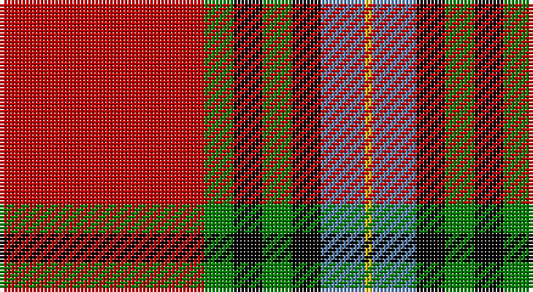

This page is one **sett** — a single exact thread-count. It belongs to the [tartan](/setts/r28g4k4g4k4t6ly1/)
(the same proportion at any scale), whose colour order is pattern [RGKGKBY](/stripes/rgkgkby/).

Part of the [Livingstone MacLay MacLeay](/tartans/livingstone-maclay-macleay/) tartan — the named design grouping this sett with its other cloths.

Sourced from weddslist.  It is a [7 stripe tartan](/stripes/stripes7/).

Original link http://www.weddslist.com/cgi-bin/tartans/pg.pl?source=sts

## Provenance

Earliest known date: 1934 Nothing

## Also known as

This cloth is also recorded under:

- Livingstone, MacLay MacLeay

2 attestations — the source records this cloth was collapsed from (oldest owns this page)

<ul>
<li>undated — Livingstone, MacLay MacLeay (weddslist, <a href="http://www.weddslist.com/cgi-bin/tartans/pg.pl?source=sts">record</a>)</li>
<li>undated — Livingstone MacLay MacLeay Clan Tartan (house-of-tartan, <a href="http://www.house-of-tartan.scotland.net/house/TartanViewjs.asp?colr=Def&tnam=1488">record</a>)</li>
</ul>

## Thread count
R/56 G8 K8 G8 K8 B12 Y/2

One full sett is **146 threads**.

## Palette

Palette: <strong>Ingles Buchan</strong> <small style="color:#888">(1 of 5 colours)</small>
<table><thead><tr><th>Colour</th><th>Threads</th><th>Shade</th><th>Base</th><th>OKLCh</th></tr></thead><tbody><tr><td>R/</td><td style="text-align:right;font-variant-numeric:tabular-nums">56</td><td><code style="background-color:#C00000;">#C00000</code> <small style="color:#888">#C00000</small></td><td>R <code style="background-color:#CC0000;">#CC0000</code></td><td><small style="color:#888">oklch(50.7% 0.208 29.2)</small></td></tr><tr><td>G</td><td style="text-align:right;font-variant-numeric:tabular-nums">8</td><td><code style="background-color:#008000;">#008000</code> <small style="color:#888">#008000</small></td><td>G <code style="background-color:#006100;">#006100</code></td><td><small style="color:#888">oklch(52.0% 0.177 142.5)</small></td></tr><tr><td>K</td><td style="text-align:right;font-variant-numeric:tabular-nums">8</td><td><code style="background-color:#000000;">#000000</code> <small style="color:#888">#000000</small></td><td>K <code style="background-color:#000000;">#000000</code></td><td><small style="color:#888">oklch(0.0% 0.000 0.0)</small></td></tr><tr><td>G</td><td style="text-align:right;font-variant-numeric:tabular-nums">8</td><td><code style="background-color:#008000;">#008000</code> <small style="color:#888">#008000</small></td><td>G <code style="background-color:#006100;">#006100</code></td><td><small style="color:#888">oklch(52.0% 0.177 142.5)</small></td></tr><tr><td>K</td><td style="text-align:right;font-variant-numeric:tabular-nums">8</td><td><code style="background-color:#000000;">#000000</code> <small style="color:#888">#000000</small></td><td>K <code style="background-color:#000000;">#000000</code></td><td><small style="color:#888">oklch(0.0% 0.000 0.0)</small></td></tr><tr><td>B</td><td style="text-align:right;font-variant-numeric:tabular-nums">12</td><td><code style="background-color:#5480B0;">#5480B0</code> <small style="color:#888">#5480B0</small></td><td>B <code style="background-color:#2A418A;">#2A418A</code></td><td><small style="color:#888">oklch(58.8% 0.089 251.5)</small></td></tr><tr><td>Y/</td><td style="text-align:right;font-variant-numeric:tabular-nums">2</td><td><code style="background-color:#F0C000;">#F0C000</code> <small style="color:#888">#F0C000</small></td><td>Y <code style="background-color:#F2BF00;">#F2BF00</code></td><td><small style="color:#888">oklch(82.7% 0.169 90.5)</small></td></tr></tbody></table>

# Sample pattern

## Compared to the master

This cloth is one sett of its design; the master sett (the exemplar the design is anchored on) is below for comparison.

<figure style="margin:0"><figcaption style="color:#888;font-size:smaller">this sett</figcaption></figure>
<figure style="margin:0"><figcaption style="color:#888;font-size:smaller"><a href="/setts/r28dg4k4dg4k4t6ly1/">master sett →</a></figcaption></figure>

## Nearest tartans

The nearest existing variants by ΔTartan distance, with this tartan at the top so the swatches line up against it.

ΔTartan

Tartan

Sett

—

<a href="/ttd/edit/#slug=r28g4k4g4k4t6ly1~x2">Livingstone, MacLay MacLeay</a> <a class="nn-out" href="/variants/s7/r28g4k4g4k4t6ly1~x2/" title="open its dictionary page">↗</a>

0.67

<a href="/ttd/edit/#slug=r28dg4k4dg4k4t6ly1~x2&amp;base=r28g4k4g4k4t6ly1~x2">Livingstone MacLay MacLeay</a> <a class="nn-out" href="/variants/s7/r28dg4k4dg4k4t6ly1~x2/" title="open its dictionary page">↗</a>

0.85

<a href="/ttd/edit/#slug=r27g4k4g4k4db6lo1~x4&amp;base=r28g4k4g4k4t6ly1~x2">MacLeay (Clan)</a> <a class="nn-out" href="/variants/s7/r27g4k4g4k4db6lo1~x4/" title="open its dictionary page">↗</a>

0.99

<a href="/ttd/edit/#slug=r6lb1r24db6dg2k1dg2k1dg12r1&amp;base=r28g4k4g4k4t6ly1~x2">Chisholm VS</a> <a class="nn-out" href="/variants/s10/r6lb1r24db6dg2k1dg2k1dg12r1/" title="open its dictionary page">↗</a>

1.04

<a href="/ttd/edit/#slug=ri5k1r2k4r36k23w4ly2~x2&amp;base=r28g4k4g4k4t6ly1~x2">Aberdeen Football Club (1999)</a> <a class="nn-out" href="/variants/s8/ri5k1r2k4r36k23w4ly2~x2/" title="open its dictionary page">↗</a>

1.05

<a href="/ttd/edit/#slug=ly3g9db9k1ly2k15r37g2~x2&amp;base=r28g4k4g4k4t6ly1~x2">Mensah</a> <a class="nn-out" href="/variants/s8/ly3g9db9k1ly2k15r37g2~x2/" title="open its dictionary page">↗</a>

1.05

<a href="/ttd/edit/#slug=w8r100k42g42r5k3r5t42r100w8&amp;base=r28g4k4g4k4t6ly1~x2">Unidentified Plaid 10</a> <a class="nn-out" href="/variants/s10/w8r100k42g42r5k3r5t42r100w8/" title="open its dictionary page">↗</a>

1.06

<a href="/ttd/edit/#slug=r27y4k4y4k4t6lo1~x4&amp;base=r28g4k4g4k4t6ly1~x2">MacLeay</a> <a class="nn-out" href="/variants/s7/r27y4k4y4k4t6lo1~x4/" title="open its dictionary page">↗</a>

1.07

<a href="/ttd/edit/#slug=k3w9k2r8db1g3db1r25w5db3~x2&amp;base=r28g4k4g4k4t6ly1~x2">Bro-Zol</a> <a class="nn-out" href="/variants/s10/k3w9k2r8db1g3db1r25w5db3~x2/" title="open its dictionary page">↗</a>

1.11

<a href="/ttd/edit/#slug=r36lb1db3ly1dg16r8db3lb5&amp;base=r28g4k4g4k4t6ly1~x2">Drummond of Perth</a> <a class="nn-out" href="/variants/s8/r36lb1db3ly1dg16r8db3lb5/" title="open its dictionary page">↗</a>

1.12

<a href="/ttd/edit/#slug=r50k25g10o5ly2~x2&amp;base=r28g4k4g4k4t6ly1~x2">MacGleish Formal (Personal)</a> <a class="nn-out" href="/variants/s5/r50k25g10o5ly2~x2/" title="open its dictionary page">↗</a>

## Neighbour map

Every grey dot is one of 14360 variants placed by the first two principal components of the ΔTartan feature space (44% of its variance). Red is this tartan; blue dots are its nearest — click one to open its page.

<svg viewBox="0 0 640 380" role="img" style="max-width:100%;height:auto;border:1px solid #e0e0e0;border-radius:4px;display:block" xmlns="http://www.w3.org/2000/svg"><image href="/nn/cloud.v1.png" width="640" height="380"/><a href="/variants/s7/r28dg4k4dg4k4t6ly1~x2/"><circle cx="323.9" cy="110.5" r="4" fill="#3465a4"><title>Livingstone MacLay MacLeay</title></circle></a><a href="/variants/s7/r27g4k4g4k4db6lo1~x4/"><circle cx="324.9" cy="121.0" r="4" fill="#3465a4"><title>MacLeay (Clan)</title></circle></a><a href="/variants/s10/r6lb1r24db6dg2k1dg2k1dg12r1/"><circle cx="330.4" cy="103.1" r="4" fill="#3465a4"><title>Chisholm VS</title></circle></a><a href="/variants/s8/ri5k1r2k4r36k23w4ly2~x2/"><circle cx="315.3" cy="88.2" r="4" fill="#3465a4"><title>Aberdeen Football Club (1999)</title></circle></a><a href="/variants/s8/ly3g9db9k1ly2k15r37g2~x2/"><circle cx="279.4" cy="97.6" r="4" fill="#3465a4"><title>Mensah</title></circle></a><a href="/variants/s10/w8r100k42g42r5k3r5t42r100w8/"><circle cx="324.3" cy="95.4" r="4" fill="#3465a4"><title>Unidentified Plaid 10</title></circle></a><a href="/variants/s7/r27y4k4y4k4t6lo1~x4/"><circle cx="324.3" cy="117.2" r="4" fill="#3465a4"><title>MacLeay</title></circle></a><a href="/variants/s10/k3w9k2r8db1g3db1r25w5db3~x2/"><circle cx="291.7" cy="95.2" r="4" fill="#3465a4"><title>Bro-Zol</title></circle></a><a href="/variants/s8/r36lb1db3ly1dg16r8db3lb5/"><circle cx="371.7" cy="93.8" r="4" fill="#3465a4"><title>Drummond of Perth</title></circle></a><a href="/variants/s5/r50k25g10o5ly2~x2/"><circle cx="321.1" cy="146.9" r="4" fill="#3465a4"><title>MacGleish Formal (Personal)</title></circle></a><circle cx="308.9" cy="107.5" r="5" fill="#c00000"/></svg>

ID: /variants/s7/r28g4k4g4k4t6ly1~x2/
