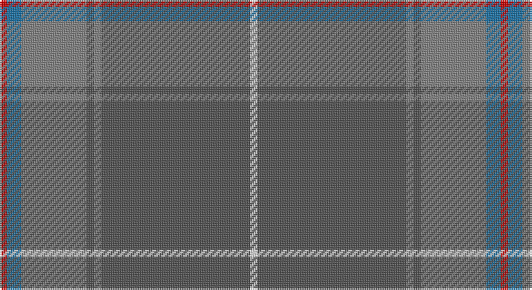

This page is one **sett** — a single exact thread-count. It belongs to the [tartan](/setts/r2b4y18n2y2n41w2/)
(the same proportion at any scale), whose colour order is pattern [RBGBGBW](/stripes/rbgbgbw/).

Part of the [Haddrell](/tartans/haddrell/) tartan — the named design grouping this sett with its other cloths.

Sourced from register-of-tartans.  It is a [7 stripe tartan](/stripes/stripes7/).

Original link https://www.tartanregister.gov.uk/tartanDetails.aspx?ref=10938

## Register references

External register numbers recorded for this tartan.

- Scottish Register of Tartans: [10938](https://www.tartanregister.gov.uk/tartanDetails.aspx?ref=10938)

## Thread count
R/4 B8 N36 Na4 N4 Na82 LN/4

One full sett is **276 threads**.

## Palette

Palette: <strong>Tartan Register</strong>
<table><thead><tr><th>Colour</th><th>Threads</th><th>Shade</th><th>Base</th><th>OKLCh</th></tr></thead><tbody><tr><td>R/</td><td style="text-align:right;font-variant-numeric:tabular-nums">4</td><td><code style="background-color:#C80000;">#C80000</code> <small style="color:#888">#C80000</small></td><td>R <code style="background-color:#CC0000;">#CC0000</code></td><td><small style="color:#888">oklch(52.3% 0.215 29.2)</small></td></tr><tr><td>B</td><td style="text-align:right;font-variant-numeric:tabular-nums">8</td><td><code style="background-color:#1870A4;">#1870A4</code> <small style="color:#888">#1870A4</small></td><td>B <code style="background-color:#2A418A;">#2A418A</code></td><td><small style="color:#888">oklch(52.2% 0.113 241.2)</small></td></tr><tr><td>N</td><td style="text-align:right;font-variant-numeric:tabular-nums">36</td><td><code style="background-color:#808080;">#808080</code> <small style="color:#888">#808080</small></td><td>G <code style="background-color:#006100;">#006100</code></td><td><small style="color:#888">oklch(60.0% 0.000 89.9)</small></td></tr><tr><td>Na</td><td style="text-align:right;font-variant-numeric:tabular-nums">4</td><td><code style="background-color:#505050;">#505050</code> <small style="color:#888">#505050</small></td><td>B <code style="background-color:#2A418A;">#2A418A</code></td><td><small style="color:#888">oklch(43.1% 0.000 89.9)</small></td></tr><tr><td>N</td><td style="text-align:right;font-variant-numeric:tabular-nums">4</td><td><code style="background-color:#808080;">#808080</code> <small style="color:#888">#808080</small></td><td>G <code style="background-color:#006100;">#006100</code></td><td><small style="color:#888">oklch(60.0% 0.000 89.9)</small></td></tr><tr><td>Na</td><td style="text-align:right;font-variant-numeric:tabular-nums">82</td><td><code style="background-color:#505050;">#505050</code> <small style="color:#888">#505050</small></td><td>B <code style="background-color:#2A418A;">#2A418A</code></td><td><small style="color:#888">oklch(43.1% 0.000 89.9)</small></td></tr><tr><td>LN/</td><td style="text-align:right;font-variant-numeric:tabular-nums">4</td><td><code style="background-color:#E0E0E0;">#E0E0E0</code> <small style="color:#888">#E0E0E0</small></td><td>W <code style="background-color:#F7F7F7;">#F7F7F7</code></td><td><small style="color:#888">oklch(90.7% 0.000 89.9)</small></td></tr></tbody></table>

# Sample pattern

## Nearest tartans

The nearest existing variants by ΔTartan distance, with this tartan at the top so the swatches line up against it.

ΔTartan

Tartan

Sett

—

<a href="/ttd/edit/#slug=r2b4y18n2y2n41w2~x2">Haddrell (2013)</a> <a class="nn-out" href="/variants/s7/r2b4y18n2y2n41w2~x2/" title="open its dictionary page">↗</a>

1.24

<a href="/ttd/edit/#slug=o4dg2o7n30o8n7g5dg1w2~x2&amp;base=r2b4y18n2y2n41w2~x2">Inchforth (Personal)</a> <a class="nn-out" href="/variants/s9/o4dg2o7n30o8n7g5dg1w2~x2/" title="open its dictionary page">↗</a>

1.33

<a href="/ttd/edit/#slug=o4dp2o7n30o8n7dpi5dp1w2~x2&amp;base=r2b4y18n2y2n41w2~x2">Hebridean Thistle (Fashion)</a> <a class="nn-out" href="/variants/s9/o4dp2o7n30o8n7dpi5dp1w2~x2/" title="open its dictionary page">↗</a>

1.52

<a href="/ttd/edit/#slug=n48r4n6lo2n2lr2n2r10b6n2b3lr2~x2&amp;base=r2b4y18n2y2n41w2~x2">Gabrielle (Fashion)</a> <a class="nn-out" href="/variants/s12/n48r4n6lo2n2lr2n2r10b6n2b3lr2~x2/" title="open its dictionary page">↗</a>

1.61

<a href="/ttd/edit/#slug=r4y40dt12yi2dt12y30k2y4k2y4yi2y3k3~x2&amp;base=r2b4y18n2y2n41w2~x2">Bartlett, Chris (Personal)</a> <a class="nn-out" href="/variants/s13/r4y40dt12yi2dt12y30k2y4k2y4yi2y3k3~x2/" title="open its dictionary page">↗</a>

1.67

<a href="/ttd/edit/#slug=r2lo13b8lo3b33lg3b8lg13m2~x2&amp;base=r2b4y18n2y2n41w2~x2">Burt #1 (Name)</a> <a class="nn-out" href="/variants/s9/r2lo13b8lo3b33lg3b8lg13m2~x2/" title="open its dictionary page">↗</a>

1.68

<a href="/ttd/edit/#slug=o6w1o24db6g2db1g2db1g12r1~x2&amp;base=r2b4y18n2y2n41w2~x2">Chisholm hunting</a> <a class="nn-out" href="/variants/s10/o6w1o24db6g2db1g2db1g12r1~x2/" title="open its dictionary page">↗</a>

1.69

<a href="/ttd/edit/#slug=n36dr10lo2dr5g2dr5lo10n5lo2n10w2~x2&amp;base=r2b4y18n2y2n41w2~x2">Toyokawa Check</a> <a class="nn-out" href="/variants/s11/n36dr10lo2dr5g2dr5lo10n5lo2n10w2~x2/" title="open its dictionary page">↗</a>

1.74

<a href="/ttd/edit/#slug=oi80o8oi4dy4lr4dy45n8&amp;base=r2b4y18n2y2n41w2~x2">Isaia (Fashion)</a> <a class="nn-out" href="/variants/s7/oi80o8oi4dy4lr4dy45n8/" title="open its dictionary page">↗</a>

1.75

<a href="/ttd/edit/#slug=n48r4n6o2n2lr2n2r10b6n2b3lr2~x2&amp;base=r2b4y18n2y2n41w2~x2">Gabrielle</a> <a class="nn-out" href="/variants/s12/n48r4n6o2n2lr2n2r10b6n2b3lr2~x2/" title="open its dictionary page">↗</a>

1.77

<a href="/ttd/edit/#slug=dy9n4dy2n4dy2n30dy9n4t14lo2~x2&amp;base=r2b4y18n2y2n41w2~x2">Hanna of Leith (yellow line)</a> <a class="nn-out" href="/variants/s10/dy9n4dy2n4dy2n30dy9n4t14lo2~x2/" title="open its dictionary page">↗</a>

## Neighbour map

Every grey dot is one of 14360 variants placed by the first two principal components of the ΔTartan feature space (44% of its variance). Red is this tartan; blue dots are its nearest — click one to open its page.

<svg viewBox="0 0 640 380" role="img" style="max-width:100%;height:auto;border:1px solid #e0e0e0;border-radius:4px;display:block" xmlns="http://www.w3.org/2000/svg"><image href="/nn/cloud.v1.png" width="640" height="380"/><a href="/variants/s9/o4dg2o7n30o8n7g5dg1w2~x2/"><circle cx="408.5" cy="160.6" r="4" fill="#3465a4"><title>Inchforth (Personal)</title></circle></a><a href="/variants/s9/o4dp2o7n30o8n7dpi5dp1w2~x2/"><circle cx="406.2" cy="154.4" r="4" fill="#3465a4"><title>Hebridean Thistle (Fashion)</title></circle></a><a href="/variants/s12/n48r4n6lo2n2lr2n2r10b6n2b3lr2~x2/"><circle cx="517.9" cy="142.5" r="4" fill="#3465a4"><title>Gabrielle (Fashion)</title></circle></a><a href="/variants/s13/r4y40dt12yi2dt12y30k2y4k2y4yi2y3k3~x2/"><circle cx="486.6" cy="166.0" r="4" fill="#3465a4"><title>Bartlett, Chris (Personal)</title></circle></a><a href="/variants/s9/r2lo13b8lo3b33lg3b8lg13m2~x2/"><circle cx="370.9" cy="183.9" r="4" fill="#3465a4"><title>Burt #1 (Name)</title></circle></a><a href="/variants/s10/o6w1o24db6g2db1g2db1g12r1~x2/"><circle cx="382.3" cy="151.9" r="4" fill="#3465a4"><title>Chisholm hunting</title></circle></a><a href="/variants/s11/n36dr10lo2dr5g2dr5lo10n5lo2n10w2~x2/"><circle cx="384.0" cy="158.0" r="4" fill="#3465a4"><title>Toyokawa Check</title></circle></a><a href="/variants/s7/oi80o8oi4dy4lr4dy45n8/"><circle cx="441.7" cy="184.3" r="4" fill="#3465a4"><title>Isaia (Fashion)</title></circle></a><a href="/variants/s12/n48r4n6o2n2lr2n2r10b6n2b3lr2~x2/"><circle cx="488.5" cy="125.6" r="4" fill="#3465a4"><title>Gabrielle</title></circle></a><a href="/variants/s10/dy9n4dy2n4dy2n30dy9n4t14lo2~x2/"><circle cx="396.7" cy="215.9" r="4" fill="#3465a4"><title>Hanna of Leith (yellow line)</title></circle></a><circle cx="459.5" cy="181.1" r="5" fill="#c00000"/></svg>

ID: /variants/s7/r2b4y18n2y2n41w2~x2/
