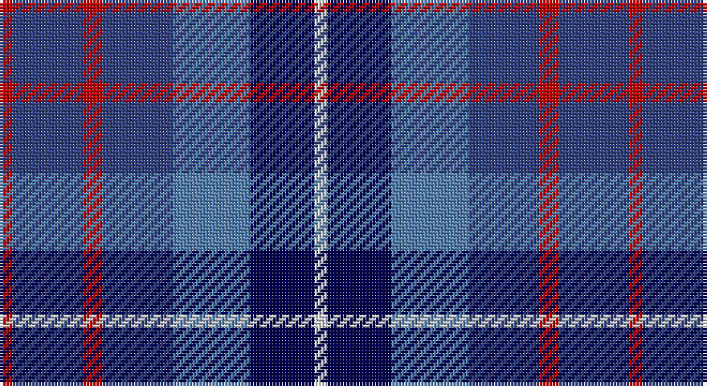

This page is one **sett** — a single exact thread-count. It belongs to the [tartan](/setts/r2db11r3db11t12dbi10w2/)
(the same proportion at any scale), whose colour order is pattern [RBRBBBW](/stripes/rbrbbbw/).

Part of the [Blue](/tartans/blue/) tartan — the named design grouping this sett with its other cloths.

Sourced from weddslist.  It is a [7 stripe tartan](/stripes/stripes7/).

Original link http://www.weddslist.com/cgi-bin/tartans/pg.pl?source=sts

## Thread count
R/4 B22 R6 B22 Ba24 DB20 LN/4

One full sett is **196 threads**.

## Palette

Palette: <strong>Tartan Dictionary</strong> <small style="color:#888">(1 of 5 colours)</small>
<table><thead><tr><th>Colour</th><th>Threads</th><th>Shade</th><th>Base</th><th>OKLCh</th></tr></thead><tbody><tr><td>R/</td><td style="text-align:right;font-variant-numeric:tabular-nums">4</td><td><code style="background-color:#C00000;">#C00000</code> <small style="color:#888">#C00000</small></td><td>R <code style="background-color:#CC0000;">#CC0000</code></td><td><small style="color:#888">oklch(50.7% 0.208 29.2)</small></td></tr><tr><td>B</td><td style="text-align:right;font-variant-numeric:tabular-nums">22</td><td><code style="background-color:#304080;">#304080</code> <small style="color:#888">#304080</small></td><td>B <code style="background-color:#2A418A;">#2A418A</code></td><td><small style="color:#888">oklch(39.4% 0.109 270.2)</small></td></tr><tr><td>R</td><td style="text-align:right;font-variant-numeric:tabular-nums">6</td><td><code style="background-color:#C00000;">#C00000</code> <small style="color:#888">#C00000</small></td><td>R <code style="background-color:#CC0000;">#CC0000</code></td><td><small style="color:#888">oklch(50.7% 0.208 29.2)</small></td></tr><tr><td>B</td><td style="text-align:right;font-variant-numeric:tabular-nums">22</td><td><code style="background-color:#304080;">#304080</code> <small style="color:#888">#304080</small></td><td>B <code style="background-color:#2A418A;">#2A418A</code></td><td><small style="color:#888">oklch(39.4% 0.109 270.2)</small></td></tr><tr><td>Ba</td><td style="text-align:right;font-variant-numeric:tabular-nums">24</td><td><code style="background-color:#5480B0;">#5480B0</code> <small style="color:#888">#5480B0</small></td><td>B <code style="background-color:#2A418A;">#2A418A</code></td><td><small style="color:#888">oklch(58.8% 0.089 251.5)</small></td></tr><tr><td>DB</td><td style="text-align:right;font-variant-numeric:tabular-nums">20</td><td><code style="background-color:#000050;">#000050</code> <small style="color:#888">#000050</small></td><td>B <code style="background-color:#2A418A;">#2A418A</code></td><td><small style="color:#888">oklch(19.5% 0.135 264.1)</small></td></tr><tr><td>LN/</td><td style="text-align:right;font-variant-numeric:tabular-nums">4</td><td><code style="background-color:#E0E0E0;">#E0E0E0</code> <small style="color:#888">#E0E0E0</small></td><td>W <code style="background-color:#F7F7F7;">#F7F7F7</code></td><td><small style="color:#888">oklch(90.7% 0.000 89.9)</small></td></tr></tbody></table>

# Sample pattern

## Compared to the master

This cloth is one sett of its design; the master sett (the exemplar the design is anchored on) is below for comparison.

<figure style="margin:0"><figcaption style="color:#888;font-size:smaller">this sett</figcaption></figure>
<figure style="margin:0"><figcaption style="color:#888;font-size:smaller"><a href="/setts/n14r4n14t15db13w3/">master sett →</a></figcaption></figure>

## Nearest tartans

The nearest existing variants by ΔTartan distance, with this tartan at the top so the swatches line up against it.

ΔTartan

Tartan

Sett

—

<a href="/ttd/edit/#slug=r2db11r3db11t12dbi10w2~x2">Blue</a> <a class="nn-out" href="/variants/s7/r2db11r3db11t12dbi10w2~x2/" title="open its dictionary page">↗</a>

0.31

<a href="/ttd/edit/#slug=r2dbi11r3dbi11t12db10w2~x2&amp;base=r2db11r3db11t12dbi10w2~x2">Blue Family Tartan</a> <a class="nn-out" href="/variants/s7/r2dbi11r3dbi11t12db10w2~x2/" title="open its dictionary page">↗</a>

0.94

<a href="/ttd/edit/#slug=n14r4n14t15db13w3~x2&amp;base=r2db11r3db11t12dbi10w2~x2">Blue</a> <a class="nn-out" href="/variants/s6/n14r4n14t15db13w3~x2/" title="open its dictionary page">↗</a>

1.20

<a href="/ttd/edit/#slug=r9dt6db13dt21y18w4~x2&amp;base=r2db11r3db11t12dbi10w2~x2">Fox-Eves Wedding</a> <a class="nn-out" href="/variants/s6/r9dt6db13dt21y18w4~x2/" title="open its dictionary page">↗</a>

1.23

<a href="/ttd/edit/#slug=db11dg10y6db7lt2db3dp10lt2~x2&amp;base=r2db11r3db11t12dbi10w2~x2">Hummelt, Katherine (Personal)</a> <a class="nn-out" href="/variants/s8/db11dg10y6db7lt2db3dp10lt2~x2/" title="open its dictionary page">↗</a>

1.35

<a href="/ttd/edit/#slug=dp4r1b5dp4k6lb1~x4&amp;base=r2db11r3db11t12dbi10w2~x2">Benreay Medical Centre (Corporate)</a> <a class="nn-out" href="/variants/s6/dp4r1b5dp4k6lb1~x4/" title="open its dictionary page">↗</a>

1.40

<a href="/ttd/edit/#slug=t16db3t3o3t3db10r12w4~x2&amp;base=r2db11r3db11t12dbi10w2~x2">Greer (Name?)</a> <a class="nn-out" href="/variants/s8/t16db3t3o3t3db10r12w4~x2/" title="open its dictionary page">↗</a>

1.41

<a href="/ttd/edit/#slug=m5g20k13db42k13g20ly5~x2&amp;base=r2db11r3db11t12dbi10w2~x2">Newmill</a> <a class="nn-out" href="/variants/s7/m5g20k13db42k13g20ly5~x2/" title="open its dictionary page">↗</a>

1.42

<a href="/ttd/edit/#slug=r5o20dt13db42dt13o20lo5&amp;base=r2db11r3db11t12dbi10w2~x2">Newmill Corporate Tartan</a> <a class="nn-out" href="/variants/s7/r5o20dt13db42dt13o20lo5/" title="open its dictionary page">↗</a>

1.43

<a href="/ttd/edit/#slug=r2db12k5t16w2~x4&amp;base=r2db11r3db11t12dbi10w2~x2">RSCDS Australia? (Corporate)</a> <a class="nn-out" href="/variants/s5/r2db12k5t16w2~x4/" title="open its dictionary page">↗</a>

1.44

<a href="/ttd/edit/#slug=ly5db24k8dbi18ly6dy3&amp;base=r2db11r3db11t12dbi10w2~x2">Cala Homes (Corporate)</a> <a class="nn-out" href="/variants/s6/ly5db24k8dbi18ly6dy3/" title="open its dictionary page">↗</a>

## Neighbour map

Every grey dot is one of 14360 variants placed by the first two principal components of the ΔTartan feature space (44% of its variance). Red is this tartan; blue dots are its nearest — click one to open its page.

<svg viewBox="0 0 640 380" role="img" style="max-width:100%;height:auto;border:1px solid #e0e0e0;border-radius:4px;display:block" xmlns="http://www.w3.org/2000/svg"><image href="/nn/cloud.v1.png" width="640" height="380"/><a href="/variants/s7/r2dbi11r3dbi11t12db10w2~x2/"><circle cx="168.3" cy="240.1" r="4" fill="#3465a4"><title>Blue Family Tartan</title></circle></a><a href="/variants/s6/n14r4n14t15db13w3~x2/"><circle cx="148.0" cy="263.3" r="4" fill="#3465a4"><title>Blue</title></circle></a><a href="/variants/s6/r9dt6db13dt21y18w4~x2/"><circle cx="123.0" cy="255.8" r="4" fill="#3465a4"><title>Fox-Eves Wedding</title></circle></a><a href="/variants/s8/db11dg10y6db7lt2db3dp10lt2~x2/"><circle cx="108.5" cy="232.0" r="4" fill="#3465a4"><title>Hummelt, Katherine (Personal)</title></circle></a><a href="/variants/s6/dp4r1b5dp4k6lb1~x4/"><circle cx="142.3" cy="242.3" r="4" fill="#3465a4"><title>Benreay Medical Centre (Corporate)</title></circle></a><a href="/variants/s8/t16db3t3o3t3db10r12w4~x2/"><circle cx="124.3" cy="204.8" r="4" fill="#3465a4"><title>Greer (Name?)</title></circle></a><a href="/variants/s7/m5g20k13db42k13g20ly5~x2/"><circle cx="163.1" cy="221.8" r="4" fill="#3465a4"><title>Newmill</title></circle></a><a href="/variants/s7/r5o20dt13db42dt13o20lo5/"><circle cx="177.0" cy="219.4" r="4" fill="#3465a4"><title>Newmill Corporate Tartan</title></circle></a><a href="/variants/s5/r2db12k5t16w2~x4/"><circle cx="182.0" cy="215.7" r="4" fill="#3465a4"><title>RSCDS Australia? (Corporate)</title></circle></a><a href="/variants/s6/ly5db24k8dbi18ly6dy3/"><circle cx="142.7" cy="212.9" r="4" fill="#3465a4"><title>Cala Homes (Corporate)</title></circle></a><circle cx="163.0" cy="239.1" r="5" fill="#c00000"/></svg>

ID: /variants/s7/r2db11r3db11t12dbi10w2~x2/
