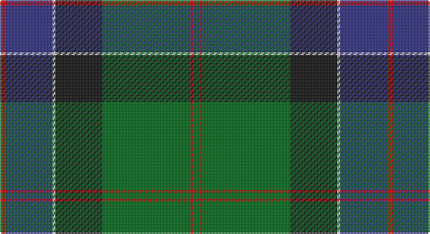

This page is one **sett** — a single exact thread-count. It belongs to the [tartan](/setts/r2db16w1k16g30r1g2/)
(the same proportion at any scale), whose colour order is pattern [GRGKWBR](/stripes/grgkwbr/).

Part of the [Sinclair Hunting](/tartans/sinclair-hunting/) tartan — the named design grouping this sett with its other cloths.

Sourced from register-of-tartans.  It is a [7 stripe tartan](/stripes/stripes7/).

Original link https://www.tartanregister.gov.uk/tartanDetails.aspx?ref=3797

## Provenance

Earliest known date: 1842 Sinclairs wore a green tartan at the Battle of Flodden where the entire contingent were killed save the drummer.

## Also known as

This cloth is also recorded under:

- Sinclair Htg
- Sinclair, hunting

4 attestations — the source records this cloth was collapsed from (oldest owns this page)

<ul>
<li>undated — Sinclair Hunting (VS) (register-of-tartans, <a href="https://www.tartanregister.gov.uk/tartanDetails.aspx?ref=3797">record</a>)</li>
<li>Unknown — Sinclair Htg (VS) (Clan) (tartans-authority, <a href="http://www.tartansauthority.com/tartan-ferret/display/889/">record</a>)</li>
<li>undated — Sinclair, hunting (weddslist, <a href="http://www.weddslist.com/cgi-bin/tartans/pg.pl?source=sts">record</a>)</li>
<li>undated — Sinclair Hunting Clan Tartan (house-of-tartan, <a href="http://www.house-of-tartan.scotland.net/house/TartanViewjs.asp?colr=Def&tnam=889">record</a>)</li>
</ul>

## Register references

External register numbers recorded for this tartan.

- Scottish Register of Tartans: [3797](https://www.tartanregister.gov.uk/tartanDetails.aspx?ref=3797)
- Scottish Tartans Authority (ITI): 889
- Scottish Tartans World Register: 889

## Thread count
R/4 DB32 LN2 K32 G60 R2 G/4

One full sett is **264 threads**.

## Palette

Palette: <strong>Tartan Register</strong>
<table><thead><tr><th>Colour</th><th>Threads</th><th>Shade</th><th>Base</th><th>OKLCh</th></tr></thead><tbody><tr><td>R/</td><td style="text-align:right;font-variant-numeric:tabular-nums">4</td><td><code style="background-color:#C80000;">#C80000</code> <small style="color:#888">#C80000</small></td><td>R <code style="background-color:#CC0000;">#CC0000</code></td><td><small style="color:#888">oklch(52.3% 0.215 29.2)</small></td></tr><tr><td>DB</td><td style="text-align:right;font-variant-numeric:tabular-nums">32</td><td><code style="background-color:#2C2C80;">#2C2C80</code> <small style="color:#888">#2C2C80</small></td><td>B <code style="background-color:#2A418A;">#2A418A</code></td><td><small style="color:#888">oklch(35.0% 0.138 276.6)</small></td></tr><tr><td>LN</td><td style="text-align:right;font-variant-numeric:tabular-nums">2</td><td><code style="background-color:#E0E0E0;">#E0E0E0</code> <small style="color:#888">#E0E0E0</small></td><td>W <code style="background-color:#F7F7F7;">#F7F7F7</code></td><td><small style="color:#888">oklch(90.7% 0.000 89.9)</small></td></tr><tr><td>K</td><td style="text-align:right;font-variant-numeric:tabular-nums">32</td><td><code style="background-color:#101010;">#101010</code> <small style="color:#888">#101010</small></td><td>K <code style="background-color:#000000;">#000000</code></td><td><small style="color:#888">oklch(17.3% 0.000 89.9)</small></td></tr><tr><td>G</td><td style="text-align:right;font-variant-numeric:tabular-nums">60</td><td><code style="background-color:#006818;">#006818</code> <small style="color:#888">#006818</small></td><td>G <code style="background-color:#006100;">#006100</code></td><td><small style="color:#888">oklch(45.0% 0.142 145.0)</small></td></tr><tr><td>R</td><td style="text-align:right;font-variant-numeric:tabular-nums">2</td><td><code style="background-color:#C80000;">#C80000</code> <small style="color:#888">#C80000</small></td><td>R <code style="background-color:#CC0000;">#CC0000</code></td><td><small style="color:#888">oklch(52.3% 0.215 29.2)</small></td></tr><tr><td>G/</td><td style="text-align:right;font-variant-numeric:tabular-nums">4</td><td><code style="background-color:#006818;">#006818</code> <small style="color:#888">#006818</small></td><td>G <code style="background-color:#006100;">#006100</code></td><td><small style="color:#888">oklch(45.0% 0.142 145.0)</small></td></tr></tbody></table>

# Sample pattern

## Compared to the master

This cloth is one sett of its design; the master sett (the exemplar the design is anchored on) is below for comparison.

<figure style="margin:0"><figcaption style="color:#888;font-size:smaller">this sett</figcaption></figure>
<figure style="margin:0"><figcaption style="color:#888;font-size:smaller"><a href="/setts/dg6r2dg13k6w2k16r3/">master sett →</a></figcaption></figure>

## Nearest tartans

The nearest existing variants by ΔTartan distance, with this tartan at the top so the swatches line up against it.

ΔTartan

Tartan

Sett

—

<a href="/ttd/edit/#slug=r2db16w1k16g30r1g2~x2">Sinclair Hunting (VS)</a> <a class="nn-out" href="/variants/s7/r2db16w1k16g30r1g2~x2/" title="open its dictionary page">↗</a>

0.63

<a href="/ttd/edit/#slug=k4g35lo1k18g3db18r3g3r3~x2&amp;base=r2db16w1k16g30r1g2~x2">Mackay, John W. (Personal)</a> <a class="nn-out" href="/variants/s9/k4g35lo1k18g3db18r3g3r3~x2/" title="open its dictionary page">↗</a>

0.87

<a href="/ttd/edit/#slug=db18dp2db16k13g3k2g42lo3~x2&amp;base=r2db16w1k16g30r1g2~x2">McFadden (Personal)</a> <a class="nn-out" href="/variants/s8/db18dp2db16k13g3k2g42lo3~x2/" title="open its dictionary page">↗</a>

0.96

<a href="/ttd/edit/#slug=db10k12dg3k1dg1k1dg30w4lo4~x2&amp;base=r2db16w1k16g30r1g2~x2">Hutchens (Personal)</a> <a class="nn-out" href="/variants/s9/db10k12dg3k1dg1k1dg30w4lo4~x2/" title="open its dictionary page">↗</a>

1.00

<a href="/ttd/edit/#slug=dp6r2dp1g25db16k2db4~x2&amp;base=r2db16w1k16g30r1g2~x2">Laurie Clan Tartan</a> <a class="nn-out" href="/variants/s7/dp6r2dp1g25db16k2db4~x2/" title="open its dictionary page">↗</a>

1.09

<a href="/ttd/edit/#slug=r4db15k18g3k2g2k2g44ly4~x2&amp;base=r2db16w1k16g30r1g2~x2">Sarafilovic (Corporate)</a> <a class="nn-out" href="/variants/s9/r4db15k18g3k2g2k2g44ly4~x2/" title="open its dictionary page">↗</a>

1.11

<a href="/ttd/edit/#slug=dp6o2dp1g25db16k2db4~x2&amp;base=r2db16w1k16g30r1g2~x2">Lawrie Clan Tartan</a> <a class="nn-out" href="/variants/s7/dp6o2dp1g25db16k2db4~x2/" title="open its dictionary page">↗</a>

1.14

<a href="/ttd/edit/#slug=db3t3g30db25dp4r3ly2dp1~x2&amp;base=r2db16w1k16g30r1g2~x2">Young</a> <a class="nn-out" href="/variants/s8/db3t3g30db25dp4r3ly2dp1~x2/" title="open its dictionary page">↗</a>

1.16

<a href="/ttd/edit/#slug=db4k2db16w1k8dg24r4~x2&amp;base=r2db16w1k16g30r1g2~x2">Colquhoun</a> <a class="nn-out" href="/variants/s7/db4k2db16w1k8dg24r4~x2/" title="open its dictionary page">↗</a>

1.16

<a href="/ttd/edit/#slug=k4db16k12g24r1g2k2~x2&amp;base=r2db16w1k16g30r1g2~x2">Dundas Clan Tartan</a> <a class="nn-out" href="/variants/s7/k4db16k12g24r1g2k2~x2/" title="open its dictionary page">↗</a>

1.17

<a href="/ttd/edit/#slug=dg2r1dg30k16lr1db16r2~x2&amp;base=r2db16w1k16g30r1g2~x2">Sinclair Hunting</a> <a class="nn-out" href="/variants/s7/dg2r1dg30k16lr1db16r2~x2/" title="open its dictionary page">↗</a>

## Neighbour map

Every grey dot is one of 14360 variants placed by the first two principal components of the ΔTartan feature space (44% of its variance). Red is this tartan; blue dots are its nearest — click one to open its page.

<svg viewBox="0 0 640 380" role="img" style="max-width:100%;height:auto;border:1px solid #e0e0e0;border-radius:4px;display:block" xmlns="http://www.w3.org/2000/svg"><image href="/nn/cloud.v1.png" width="640" height="380"/><a href="/variants/s9/k4g35lo1k18g3db18r3g3r3~x2/"><circle cx="294.2" cy="134.4" r="4" fill="#3465a4"><title>Mackay, John W. (Personal)</title></circle></a><a href="/variants/s8/db18dp2db16k13g3k2g42lo3~x2/"><circle cx="270.3" cy="160.7" r="4" fill="#3465a4"><title>McFadden (Personal)</title></circle></a><a href="/variants/s9/db10k12dg3k1dg1k1dg30w4lo4~x2/"><circle cx="311.4" cy="133.7" r="4" fill="#3465a4"><title>Hutchens (Personal)</title></circle></a><a href="/variants/s7/dp6r2dp1g25db16k2db4~x2/"><circle cx="299.5" cy="166.8" r="4" fill="#3465a4"><title>Laurie Clan Tartan</title></circle></a><a href="/variants/s9/r4db15k18g3k2g2k2g44ly4~x2/"><circle cx="302.2" cy="135.7" r="4" fill="#3465a4"><title>Sarafilovic (Corporate)</title></circle></a><a href="/variants/s7/dp6o2dp1g25db16k2db4~x2/"><circle cx="304.5" cy="170.4" r="4" fill="#3465a4"><title>Lawrie Clan Tartan</title></circle></a><a href="/variants/s8/db3t3g30db25dp4r3ly2dp1~x2/"><circle cx="268.4" cy="117.6" r="4" fill="#3465a4"><title>Young</title></circle></a><a href="/variants/s7/db4k2db16w1k8dg24r4~x2/"><circle cx="265.3" cy="175.7" r="4" fill="#3465a4"><title>Colquhoun</title></circle></a><a href="/variants/s7/k4db16k12g24r1g2k2~x2/"><circle cx="292.0" cy="191.6" r="4" fill="#3465a4"><title>Dundas Clan Tartan</title></circle></a><a href="/variants/s7/dg2r1dg30k16lr1db16r2~x2/"><circle cx="292.7" cy="155.2" r="4" fill="#3465a4"><title>Sinclair Hunting</title></circle></a><circle cx="292.1" cy="150.6" r="5" fill="#c00000"/></svg>

ID: /variants/s7/r2db16w1k16g30r1g2~x2/
