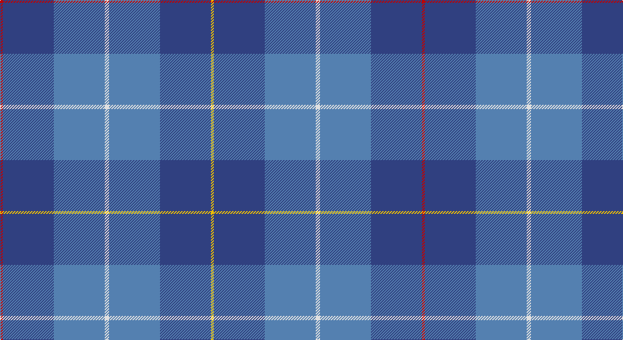

This page is one **sett** — a single exact thread-count. It belongs to the [tartan](/setts/r2db36t36w3t36db36ly2/)
(the same proportion at any scale), whose colour order is pattern [RBBWBBY](/stripes/rbbwbby/).

Sourced from weddslist.  It is a [7 stripe tartan](/stripes/stripes7/).

Original link http://www.weddslist.com/cgi-bin/tartans/pg.pl?source=sts

## Thread count
R/4 B72 Ba72 LN6 Ba72 B72 Y/4

One full sett is **596 threads**.

## Palette

Palette: <strong>Tartan Dictionary</strong> <small style="color:#888">(1 of 5 colours)</small>
<table><thead><tr><th>Colour</th><th>Threads</th><th>Shade</th><th>Base</th><th>OKLCh</th></tr></thead><tbody><tr><td>R/</td><td style="text-align:right;font-variant-numeric:tabular-nums">4</td><td><code style="background-color:#C00000;">#C00000</code> <small style="color:#888">#C00000</small></td><td>R <code style="background-color:#CC0000;">#CC0000</code></td><td><small style="color:#888">oklch(50.7% 0.208 29.2)</small></td></tr><tr><td>B</td><td style="text-align:right;font-variant-numeric:tabular-nums">72</td><td><code style="background-color:#304080;">#304080</code> <small style="color:#888">#304080</small></td><td>B <code style="background-color:#2A418A;">#2A418A</code></td><td><small style="color:#888">oklch(39.4% 0.109 270.2)</small></td></tr><tr><td>Ba</td><td style="text-align:right;font-variant-numeric:tabular-nums">72</td><td><code style="background-color:#5480B0;">#5480B0</code> <small style="color:#888">#5480B0</small></td><td>B <code style="background-color:#2A418A;">#2A418A</code></td><td><small style="color:#888">oklch(58.8% 0.089 251.5)</small></td></tr><tr><td>LN</td><td style="text-align:right;font-variant-numeric:tabular-nums">6</td><td><code style="background-color:#E0E0E0;">#E0E0E0</code> <small style="color:#888">#E0E0E0</small></td><td>W <code style="background-color:#F7F7F7;">#F7F7F7</code></td><td><small style="color:#888">oklch(90.7% 0.000 89.9)</small></td></tr><tr><td>Ba</td><td style="text-align:right;font-variant-numeric:tabular-nums">72</td><td><code style="background-color:#5480B0;">#5480B0</code> <small style="color:#888">#5480B0</small></td><td>B <code style="background-color:#2A418A;">#2A418A</code></td><td><small style="color:#888">oklch(58.8% 0.089 251.5)</small></td></tr><tr><td>B</td><td style="text-align:right;font-variant-numeric:tabular-nums">72</td><td><code style="background-color:#304080;">#304080</code> <small style="color:#888">#304080</small></td><td>B <code style="background-color:#2A418A;">#2A418A</code></td><td><small style="color:#888">oklch(39.4% 0.109 270.2)</small></td></tr><tr><td>Y/</td><td style="text-align:right;font-variant-numeric:tabular-nums">4</td><td><code style="background-color:#F0C000;">#F0C000</code> <small style="color:#888">#F0C000</small></td><td>Y <code style="background-color:#F2BF00;">#F2BF00</code></td><td><small style="color:#888">oklch(82.7% 0.169 90.5)</small></td></tr></tbody></table>

# Sample pattern

## Nearest tartans

The nearest existing variants by ΔTartan distance, with this tartan at the top so the swatches line up against it.

ΔTartan

Tartan

Sett

—

<a href="/ttd/edit/#slug=r2db36t36w3t36db36ly2~x2">MacKerrell</a> <a class="nn-out" href="/variants/s7/r2db36t36w3t36db36ly2~x2/" title="open its dictionary page">↗</a>

1.64

<a href="/ttd/edit/#slug=db9b2db2ly1b7db2r1b4~x4&amp;base=r2db36t36w3t36db36ly2~x2">Mercer, Charles</a> <a class="nn-out" href="/variants/s8/db9b2db2ly1b7db2r1b4~x4/" title="open its dictionary page">↗</a>

1.65

<a href="/ttd/edit/#slug=t34db60ly3db60t34w4t34db60r3db60t34w4~x2&amp;base=r2db36t36w3t36db36ly2~x2">MacKerrell</a> <a class="nn-out" href="/variants/s12/t34db60ly3db60t34w4t34db60r3db60t34w4~x2/" title="open its dictionary page">↗</a>

1.70

<a href="/ttd/edit/#slug=b36db6b5r3k2r3b5db18~x2&amp;base=r2db36t36w3t36db36ly2~x2">Leonard (Name)</a> <a class="nn-out" href="/variants/s8/b36db6b5r3k2r3b5db18~x2/" title="open its dictionary page">↗</a>

1.75

<a href="/ttd/edit/#slug=t9db2t39dt33lo2dt5~x2&amp;base=r2db36t36w3t36db36ly2~x2">Port Authority of NY &amp; NJ</a> <a class="nn-out" href="/variants/s6/t9db2t39dt33lo2dt5~x2/" title="open its dictionary page">↗</a>

1.88

<a href="/ttd/edit/#slug=r2p3r1p16n2p9n9p3n15g1n3g2~x2&amp;base=r2db36t36w3t36db36ly2~x2">Clydebank (Fashion)</a> <a class="nn-out" href="/variants/s12/r2p3r1p16n2p9n9p3n15g1n3g2~x2/" title="open its dictionary page">↗</a>

1.90

<a href="/ttd/edit/#slug=b3bi6dg12b14dg2bi17b3dg1b3bi17dg2lg3~x2&amp;base=r2db36t36w3t36db36ly2~x2">Reflections of the Sea</a> <a class="nn-out" href="/variants/s12/b3bi6dg12b14dg2bi17b3dg1b3bi17dg2lg3~x2/" title="open its dictionary page">↗</a>

1.94

<a href="/ttd/edit/#slug=t20dt4y5n14ly1t2~x2&amp;base=r2db36t36w3t36db36ly2~x2">Riley's Theme</a> <a class="nn-out" href="/variants/s6/t20dt4y5n14ly1t2~x2/" title="open its dictionary page">↗</a>

1.94

<a href="/ttd/edit/#slug=dt3t14dt3o16dt34r3~x2&amp;base=r2db36t36w3t36db36ly2~x2">Thorburn (Lochcarron)</a> <a class="nn-out" href="/variants/s6/dt3t14dt3o16dt34r3~x2/" title="open its dictionary page">↗</a>

1.95

<a href="/ttd/edit/#slug=db4r1db18b18w1b4~x4&amp;base=r2db36t36w3t36db36ly2~x2">Ewell Castle School</a> <a class="nn-out" href="/variants/s6/db4r1db18b18w1b4~x4/" title="open its dictionary page">↗</a>

1.97

<a href="/ttd/edit/#slug=b17lb2b3db16t28db2t3lo2~x2&amp;base=r2db36t36w3t36db36ly2~x2">Banff &amp; Buchan (District)</a> <a class="nn-out" href="/variants/s8/b17lb2b3db16t28db2t3lo2~x2/" title="open its dictionary page">↗</a>

## Neighbour map

Every grey dot is one of 14360 variants placed by the first two principal components of the ΔTartan feature space (44% of its variance). Red is this tartan; blue dots are its nearest — click one to open its page.

<svg viewBox="0 0 640 380" role="img" style="max-width:100%;height:auto;border:1px solid #e0e0e0;border-radius:4px;display:block" xmlns="http://www.w3.org/2000/svg"><image href="/nn/cloud.v1.png" width="640" height="380"/><a href="/variants/s8/db9b2db2ly1b7db2r1b4~x4/"><circle cx="305.7" cy="238.7" r="4" fill="#3465a4"><title>Mercer, Charles</title></circle></a><a href="/variants/s12/t34db60ly3db60t34w4t34db60r3db60t34w4~x2/"><circle cx="400.2" cy="199.2" r="4" fill="#3465a4"><title>MacKerrell</title></circle></a><a href="/variants/s8/b36db6b5r3k2r3b5db18~x2/"><circle cx="417.4" cy="198.1" r="4" fill="#3465a4"><title>Leonard (Name)</title></circle></a><a href="/variants/s6/t9db2t39dt33lo2dt5~x2/"><circle cx="381.2" cy="203.2" r="4" fill="#3465a4"><title>Port Authority of NY &amp; NJ</title></circle></a><a href="/variants/s12/r2p3r1p16n2p9n9p3n15g1n3g2~x2/"><circle cx="354.8" cy="197.1" r="4" fill="#3465a4"><title>Clydebank (Fashion)</title></circle></a><a href="/variants/s12/b3bi6dg12b14dg2bi17b3dg1b3bi17dg2lg3~x2/"><circle cx="312.9" cy="202.4" r="4" fill="#3465a4"><title>Reflections of the Sea</title></circle></a><a href="/variants/s6/t20dt4y5n14ly1t2~x2/"><circle cx="345.0" cy="208.6" r="4" fill="#3465a4"><title>Riley's Theme</title></circle></a><a href="/variants/s6/dt3t14dt3o16dt34r3~x2/"><circle cx="332.7" cy="226.1" r="4" fill="#3465a4"><title>Thorburn (Lochcarron)</title></circle></a><a href="/variants/s6/db4r1db18b18w1b4~x4/"><circle cx="345.4" cy="205.1" r="4" fill="#3465a4"><title>Ewell Castle School</title></circle></a><a href="/variants/s8/b17lb2b3db16t28db2t3lo2~x2/"><circle cx="257.8" cy="185.6" r="4" fill="#3465a4"><title>Banff &amp; Buchan (District)</title></circle></a><circle cx="345.6" cy="214.3" r="5" fill="#c00000"/></svg>

ID: /variants/s7/r2db36t36w3t36db36ly2~x2/
