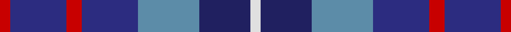
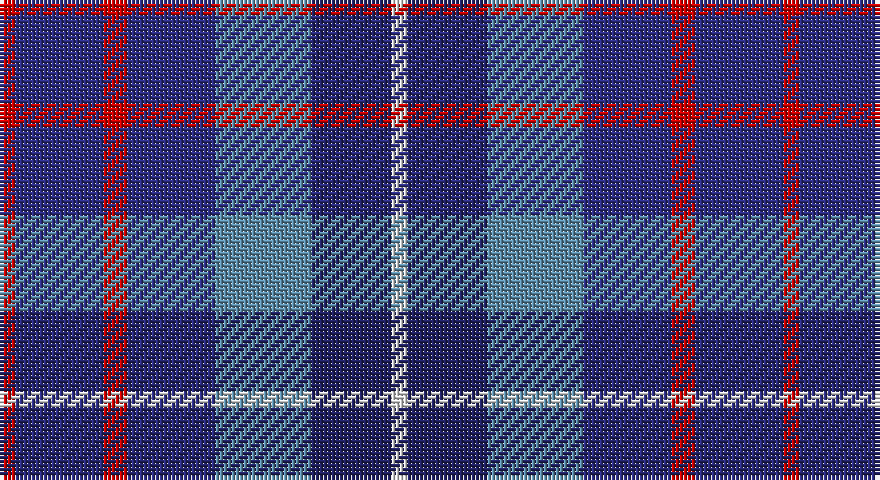

This page is one **sett** — a single exact thread-count. It belongs to the [tartan](/setts/r2dbi11r3dbi11t12db10w2/)
(the same proportion at any scale), whose colour order is pattern [RBRBBBW](/stripes/rbrbbbw/).

Sourced from house-of-tartan.  It is a [7 stripe tartan](/stripes/stripes7/).

Original link http://www.house-of-tartan.scotland.net/house/TartanViewjs.asp?colr=Def&tnam=1420

## Provenance

Earliest known date: 1985 Blue is a Sept name of MacMillan.

## Thread count
R/4 DB22 R6 DB22 B24 DBa20 LN/4

One full sett is **196 threads**.

## Palette

Palette: <strong>Tartan Register</strong>
<table><thead><tr><th>Colour</th><th>Threads</th><th>Shade</th><th>Base</th><th>OKLCh</th></tr></thead><tbody><tr><td>R/</td><td style="text-align:right;font-variant-numeric:tabular-nums">4</td><td><code style="background-color:#C80000;">#C80000</code> <small style="color:#888">#C80000</small></td><td>R <code style="background-color:#CC0000;">#CC0000</code></td><td><small style="color:#888">oklch(52.3% 0.215 29.2)</small></td></tr><tr><td>DB</td><td style="text-align:right;font-variant-numeric:tabular-nums">22</td><td><code style="background-color:#2C2C80;">#2C2C80</code> <small style="color:#888">#2C2C80</small></td><td>B <code style="background-color:#2A418A;">#2A418A</code></td><td><small style="color:#888">oklch(35.0% 0.138 276.6)</small></td></tr><tr><td>R</td><td style="text-align:right;font-variant-numeric:tabular-nums">6</td><td><code style="background-color:#C80000;">#C80000</code> <small style="color:#888">#C80000</small></td><td>R <code style="background-color:#CC0000;">#CC0000</code></td><td><small style="color:#888">oklch(52.3% 0.215 29.2)</small></td></tr><tr><td>DB</td><td style="text-align:right;font-variant-numeric:tabular-nums">22</td><td><code style="background-color:#2C2C80;">#2C2C80</code> <small style="color:#888">#2C2C80</small></td><td>B <code style="background-color:#2A418A;">#2A418A</code></td><td><small style="color:#888">oklch(35.0% 0.138 276.6)</small></td></tr><tr><td>B</td><td style="text-align:right;font-variant-numeric:tabular-nums">24</td><td><code style="background-color:#5C8CA8;">#5C8CA8</code> <small style="color:#888">#5C8CA8</small></td><td>B <code style="background-color:#2A418A;">#2A418A</code></td><td><small style="color:#888">oklch(61.7% 0.067 235.0)</small></td></tr><tr><td>DBa</td><td style="text-align:right;font-variant-numeric:tabular-nums">20</td><td><code style="background-color:#202060;">#202060</code> <small style="color:#888">#202060</small></td><td>B <code style="background-color:#2A418A;">#2A418A</code></td><td><small style="color:#888">oklch(28.9% 0.111 276.9)</small></td></tr><tr><td>LN/</td><td style="text-align:right;font-variant-numeric:tabular-nums">4</td><td><code style="background-color:#E0E0E0;">#E0E0E0</code> <small style="color:#888">#E0E0E0</small></td><td>W <code style="background-color:#F7F7F7;">#F7F7F7</code></td><td><small style="color:#888">oklch(90.7% 0.000 89.9)</small></td></tr></tbody></table>

# Sample pattern

## Nearest tartans

The nearest existing variants by ΔTartan distance, with this tartan at the top so the swatches line up against it.

ΔTartan

Tartan

Sett

—

<a href="/ttd/edit/#slug=r2dbi11r3dbi11t12db10w2~x2">Blue Family Tartan</a> <a class="nn-out" href="/variants/s7/r2dbi11r3dbi11t12db10w2~x2/" title="open its dictionary page">↗</a>

0.31

<a href="/ttd/edit/#slug=r2db11r3db11t12dbi10w2~x2&amp;base=r2dbi11r3dbi11t12db10w2~x2">Blue</a> <a class="nn-out" href="/variants/s7/r2db11r3db11t12dbi10w2~x2/" title="open its dictionary page">↗</a>

1.05

<a href="/ttd/edit/#slug=n14r4n14t15db13w3~x2&amp;base=r2dbi11r3dbi11t12db10w2~x2">Blue</a> <a class="nn-out" href="/variants/s6/n14r4n14t15db13w3~x2/" title="open its dictionary page">↗</a>

1.25

<a href="/ttd/edit/#slug=r9dt6db13dt21y18w4~x2&amp;base=r2dbi11r3dbi11t12db10w2~x2">Fox-Eves Wedding</a> <a class="nn-out" href="/variants/s6/r9dt6db13dt21y18w4~x2/" title="open its dictionary page">↗</a>

1.28

<a href="/ttd/edit/#slug=dp4r1b5dp4k6lb1~x4&amp;base=r2dbi11r3dbi11t12db10w2~x2">Benreay Medical Centre (Corporate)</a> <a class="nn-out" href="/variants/s6/dp4r1b5dp4k6lb1~x4/" title="open its dictionary page">↗</a>

1.35

<a href="/ttd/edit/#slug=r5o20dt13db42dt13o20lo5&amp;base=r2dbi11r3dbi11t12db10w2~x2">Newmill Corporate Tartan</a> <a class="nn-out" href="/variants/s7/r5o20dt13db42dt13o20lo5/" title="open its dictionary page">↗</a>

1.43

<a href="/ttd/edit/#slug=r2db6dt6db2r2db4dt6r2db2w1~x4&amp;base=r2dbi11r3dbi11t12db10w2~x2">Scottish N. A. Business Council (Co</a> <a class="nn-out" href="/variants/s10/r2db6dt6db2r2db4dt6r2db2w1~x4/" title="open its dictionary page">↗</a>

1.46

<a href="/ttd/edit/#slug=db11dg10y6db7lt2db3dp10lt2~x2&amp;base=r2dbi11r3dbi11t12db10w2~x2">Hummelt, Katherine (Personal)</a> <a class="nn-out" href="/variants/s8/db11dg10y6db7lt2db3dp10lt2~x2/" title="open its dictionary page">↗</a>

1.46

<a href="/ttd/edit/#slug=dbi3k13dbi13db13w2db13w3~x2&amp;base=r2dbi11r3dbi11t12db10w2~x2">Brodie Countryfare (Corporate)</a> <a class="nn-out" href="/variants/s7/dbi3k13dbi13db13w2db13w3~x2/" title="open its dictionary page">↗</a>

1.50

<a href="/ttd/edit/#slug=r9b6dt13b21o18w4~x2&amp;base=r2dbi11r3dbi11t12db10w2~x2">Fox-Eves Wedding (Personal)</a> <a class="nn-out" href="/variants/s6/r9b6dt13b21o18w4~x2/" title="open its dictionary page">↗</a>

1.51

<a href="/ttd/edit/#slug=db6w3db21k16dp6k3dp6~x2&amp;base=r2dbi11r3dbi11t12db10w2~x2">Heritage of Scotland</a> <a class="nn-out" href="/variants/s7/db6w3db21k16dp6k3dp6~x2/" title="open its dictionary page">↗</a>

## Neighbour map

Every grey dot is one of 14360 variants placed by the first two principal components of the ΔTartan feature space (44% of its variance). Red is this tartan; blue dots are its nearest — click one to open its page.

<svg viewBox="0 0 640 380" role="img" style="max-width:100%;height:auto;border:1px solid #e0e0e0;border-radius:4px;display:block" xmlns="http://www.w3.org/2000/svg"><image href="/nn/cloud.v1.png" width="640" height="380"/><a href="/variants/s7/r2db11r3db11t12dbi10w2~x2/"><circle cx="163.0" cy="239.1" r="4" fill="#3465a4"><title>Blue</title></circle></a><a href="/variants/s6/n14r4n14t15db13w3~x2/"><circle cx="148.0" cy="263.3" r="4" fill="#3465a4"><title>Blue</title></circle></a><a href="/variants/s6/r9dt6db13dt21y18w4~x2/"><circle cx="123.0" cy="255.8" r="4" fill="#3465a4"><title>Fox-Eves Wedding</title></circle></a><a href="/variants/s6/dp4r1b5dp4k6lb1~x4/"><circle cx="142.3" cy="242.3" r="4" fill="#3465a4"><title>Benreay Medical Centre (Corporate)</title></circle></a><a href="/variants/s7/r5o20dt13db42dt13o20lo5/"><circle cx="177.0" cy="219.4" r="4" fill="#3465a4"><title>Newmill Corporate Tartan</title></circle></a><a href="/variants/s10/r2db6dt6db2r2db4dt6r2db2w1~x4/"><circle cx="199.3" cy="248.1" r="4" fill="#3465a4"><title>Scottish N. A. Business Council (Co</title></circle></a><a href="/variants/s8/db11dg10y6db7lt2db3dp10lt2~x2/"><circle cx="108.5" cy="232.0" r="4" fill="#3465a4"><title>Hummelt, Katherine (Personal)</title></circle></a><a href="/variants/s7/dbi3k13dbi13db13w2db13w3~x2/"><circle cx="195.2" cy="260.5" r="4" fill="#3465a4"><title>Brodie Countryfare (Corporate)</title></circle></a><a href="/variants/s6/r9b6dt13b21o18w4~x2/"><circle cx="131.5" cy="258.4" r="4" fill="#3465a4"><title>Fox-Eves Wedding (Personal)</title></circle></a><a href="/variants/s7/db6w3db21k16dp6k3dp6~x2/"><circle cx="226.1" cy="237.7" r="4" fill="#3465a4"><title>Heritage of Scotland</title></circle></a><circle cx="168.3" cy="240.1" r="5" fill="#c00000"/></svg>

ID: /variants/s7/r2dbi11r3dbi11t12db10w2~x2/
