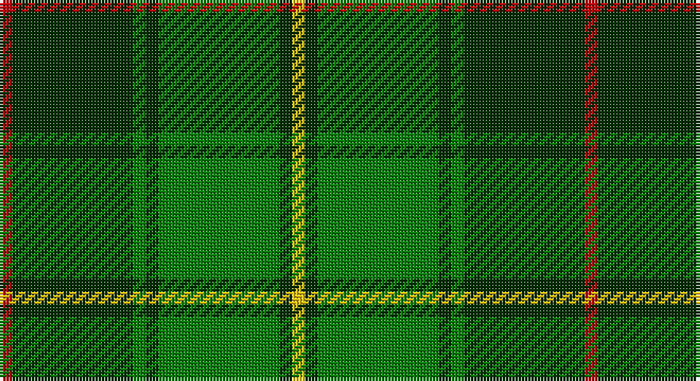

This page is one **sett** — a single exact thread-count. It belongs to the [tartan](/setts/r2dg19g2dg2g19dg2ly2/)
(the same proportion at any scale), whose colour order is pattern [RGGGGGY](/stripes/rgggggy/).

Sourced from weddslist.  It is a [7 stripe tartan](/stripes/stripes7/).

Original link http://www.weddslist.com/cgi-bin/tartans/pg.pl?source=sts

## Also known as

This cloth is also recorded under:

- Kenmore Hunting

## Thread count
R/4 DG38 G4 DG4 G38 DG4 Y/4

One full sett is **184 threads**.

## Palette

Palette: <strong>custom</strong>
<table><thead><tr><th>Colour</th><th>Threads</th><th>Shade</th><th>Base</th><th>OKLCh</th></tr></thead><tbody><tr><td>R/</td><td style="text-align:right;font-variant-numeric:tabular-nums">4</td><td><code style="background-color:#C00000;">#C00000</code> <small style="color:#888">#C00000</small></td><td>R <code style="background-color:#CC0000;">#CC0000</code></td><td><small style="color:#888">oklch(50.7% 0.208 29.2)</small></td></tr><tr><td>DG</td><td style="text-align:right;font-variant-numeric:tabular-nums">38</td><td><code style="background-color:#003000;">#003000</code> <small style="color:#888">#003000</small></td><td>G <code style="background-color:#006100;">#006100</code></td><td><small style="color:#888">oklch(26.8% 0.091 142.5)</small></td></tr><tr><td>G</td><td style="text-align:right;font-variant-numeric:tabular-nums">4</td><td><code style="background-color:#008000;">#008000</code> <small style="color:#888">#008000</small></td><td>G <code style="background-color:#006100;">#006100</code></td><td><small style="color:#888">oklch(52.0% 0.177 142.5)</small></td></tr><tr><td>DG</td><td style="text-align:right;font-variant-numeric:tabular-nums">4</td><td><code style="background-color:#003000;">#003000</code> <small style="color:#888">#003000</small></td><td>G <code style="background-color:#006100;">#006100</code></td><td><small style="color:#888">oklch(26.8% 0.091 142.5)</small></td></tr><tr><td>G</td><td style="text-align:right;font-variant-numeric:tabular-nums">38</td><td><code style="background-color:#008000;">#008000</code> <small style="color:#888">#008000</small></td><td>G <code style="background-color:#006100;">#006100</code></td><td><small style="color:#888">oklch(52.0% 0.177 142.5)</small></td></tr><tr><td>DG</td><td style="text-align:right;font-variant-numeric:tabular-nums">4</td><td><code style="background-color:#003000;">#003000</code> <small style="color:#888">#003000</small></td><td>G <code style="background-color:#006100;">#006100</code></td><td><small style="color:#888">oklch(26.8% 0.091 142.5)</small></td></tr><tr><td>Y/</td><td style="text-align:right;font-variant-numeric:tabular-nums">4</td><td><code style="background-color:#F0C000;">#F0C000</code> <small style="color:#888">#F0C000</small></td><td>Y <code style="background-color:#F2BF00;">#F2BF00</code></td><td><small style="color:#888">oklch(82.7% 0.169 90.5)</small></td></tr></tbody></table>

# Sample pattern

## Nearest tartans

The nearest existing variants by ΔTartan distance, with this tartan at the top so the swatches line up against it.

ΔTartan

Tartan

Sett

—

<a href="/ttd/edit/#slug=r2dg19g2dg2g19dg2ly2~x2">Hunting Kenmore</a> <a class="nn-out" href="/variants/s7/r2dg19g2dg2g19dg2ly2~x2/" title="open its dictionary page">↗</a>

1.00

<a href="/ttd/edit/#slug=g4ly2g17dg2r4dg2g3dg11g2~x2&amp;base=r2dg19g2dg2g19dg2ly2~x2">Armagh</a> <a class="nn-out" href="/variants/s9/g4ly2g17dg2r4dg2g3dg11g2~x2/" title="open its dictionary page">↗</a>

1.13

<a href="/ttd/edit/#slug=o5g12dg4r4dg27g3dg4o5&amp;base=r2dg19g2dg2g19dg2ly2~x2">Daks, Muted Loden</a> <a class="nn-out" href="/variants/s8/o5g12dg4r4dg27g3dg4o5/" title="open its dictionary page">↗</a>

1.46

<a href="/ttd/edit/#slug=k4g32k4g4k8w3k8t4~x2&amp;base=r2dg19g2dg2g19dg2ly2~x2">Hartmann (Personal)</a> <a class="nn-out" href="/variants/s8/k4g32k4g4k8w3k8t4~x2/" title="open its dictionary page">↗</a>

1.48

<a href="/ttd/edit/#slug=r3g20k20g20lo2g2lo2~x2&amp;base=r2dg19g2dg2g19dg2ly2~x2">Paton (Personal)</a> <a class="nn-out" href="/variants/s7/r3g20k20g20lo2g2lo2~x2/" title="open its dictionary page">↗</a>

1.51

<a href="/ttd/edit/#slug=dy3g6dg2r2dg14g2dg2dy3~x2&amp;base=r2dg19g2dg2g19dg2ly2~x2">Daks (Muted Loden)</a> <a class="nn-out" href="/variants/s8/dy3g6dg2r2dg14g2dg2dy3~x2/" title="open its dictionary page">↗</a>

1.55

<a href="/ttd/edit/#slug=dg30g13dg7g30dg2ly4~x2&amp;base=r2dg19g2dg2g19dg2ly2~x2">MacSporran, Rejected design</a> <a class="nn-out" href="/variants/s6/dg30g13dg7g30dg2ly4~x2/" title="open its dictionary page">↗</a>

1.56

<a href="/ttd/edit/#slug=g14db1g1db1g3db6gi12r2~x2&amp;base=r2dg19g2dg2g19dg2ly2~x2">Cranstoun Clan Tartan</a> <a class="nn-out" href="/variants/s8/g14db1g1db1g3db6gi12r2~x2/" title="open its dictionary page">↗</a>

1.58

<a href="/ttd/edit/#slug=t4dg26g8t8g8gi3t2~x2&amp;base=r2dg19g2dg2g19dg2ly2~x2">Valley, of the Green. (The )</a> <a class="nn-out" href="/variants/s7/t4dg26g8t8g8gi3t2~x2/" title="open its dictionary page">↗</a>

1.60

<a href="/ttd/edit/#slug=g28r2g2r2g8db24y3r2~x2&amp;base=r2dg19g2dg2g19dg2ly2~x2">Leatherneck, U.S.Marine Corps</a> <a class="nn-out" href="/variants/s8/g28r2g2r2g8db24y3r2~x2/" title="open its dictionary page">↗</a>

1.62

<a href="/ttd/edit/#slug=k60g64dg5g8dg5g64k60ly8k8ly8&amp;base=r2dg19g2dg2g19dg2ly2~x2">Sin-Cos (Corporate)</a> <a class="nn-out" href="/variants/s10/k60g64dg5g8dg5g64k60ly8k8ly8/" title="open its dictionary page">↗</a>

## Neighbour map

Every grey dot is one of 14360 variants placed by the first two principal components of the ΔTartan feature space (44% of its variance). Red is this tartan; blue dots are its nearest — click one to open its page.

<svg viewBox="0 0 640 380" role="img" style="max-width:100%;height:auto;border:1px solid #e0e0e0;border-radius:4px;display:block" xmlns="http://www.w3.org/2000/svg"><image href="/nn/cloud.v1.png" width="640" height="380"/><a href="/variants/s9/g4ly2g17dg2r4dg2g3dg11g2~x2/"><circle cx="303.7" cy="209.6" r="4" fill="#3465a4"><title>Armagh</title></circle></a><a href="/variants/s8/o5g12dg4r4dg27g3dg4o5/"><circle cx="291.9" cy="208.1" r="4" fill="#3465a4"><title>Daks, Muted Loden</title></circle></a><a href="/variants/s8/k4g32k4g4k8w3k8t4~x2/"><circle cx="304.9" cy="191.4" r="4" fill="#3465a4"><title>Hartmann (Personal)</title></circle></a><a href="/variants/s7/r3g20k20g20lo2g2lo2~x2/"><circle cx="347.3" cy="222.0" r="4" fill="#3465a4"><title>Paton (Personal)</title></circle></a><a href="/variants/s8/dy3g6dg2r2dg14g2dg2dy3~x2/"><circle cx="296.7" cy="234.8" r="4" fill="#3465a4"><title>Daks (Muted Loden)</title></circle></a><a href="/variants/s6/dg30g13dg7g30dg2ly4~x2/"><circle cx="342.9" cy="242.7" r="4" fill="#3465a4"><title>MacSporran, Rejected design</title></circle></a><a href="/variants/s8/g14db1g1db1g3db6gi12r2~x2/"><circle cx="265.8" cy="195.1" r="4" fill="#3465a4"><title>Cranstoun Clan Tartan</title></circle></a><a href="/variants/s7/t4dg26g8t8g8gi3t2~x2/"><circle cx="252.7" cy="211.3" r="4" fill="#3465a4"><title>Valley, of the Green. (The )</title></circle></a><a href="/variants/s8/g28r2g2r2g8db24y3r2~x2/"><circle cx="340.8" cy="187.4" r="4" fill="#3465a4"><title>Leatherneck, U.S.Marine Corps</title></circle></a><a href="/variants/s10/k60g64dg5g8dg5g64k60ly8k8ly8/"><circle cx="282.1" cy="190.6" r="4" fill="#3465a4"><title>Sin-Cos (Corporate)</title></circle></a><circle cx="305.9" cy="208.9" r="5" fill="#c00000"/></svg>

ID: /variants/s7/r2dg19g2dg2g19dg2ly2~x2/
