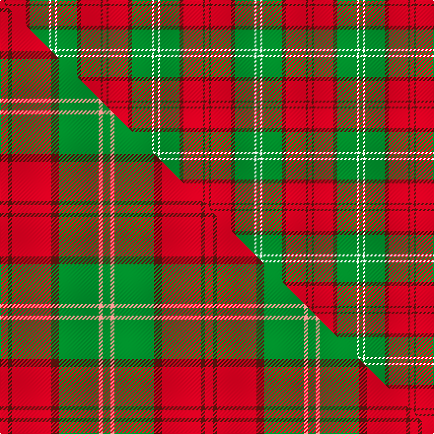

This is one **variant** — a specific cloth: this exact thread count and colourway, with its own
provenance below. It is one weaving of the [sett](/setts/r2dr1r10dr2g10w1g2/) (the scale-free proportion — the
same cloth at any scale or shade), whose colour order is pattern [GWGBRBR](/stripes/gwgbrbr/).

Part of the [Lennox](/tartans/l/le/lennox/) tartan — the named design grouping this sett with its other cloths.

Sourced from house-of-tartan.  It is a [7 stripe tartan](/stripes/stripes7/).

Original link [http://www.house-of-tartan.scotland.net/house/TartanViewjs.asp?colr=Def&tnam=935](http://www.house-of-tartan.scotland.net/house/TartanViewjs.asp?colr=Def&tnam=935)

## Provenance

Earliest known date: pre 1600 Families with the surname 'Lennox' are usually considered related to Clans Stewart or MacFarlane. Some of this surname also choose to wear the distinctive and ancient 'Lennox' tartan. D W Stewart reproduced the sett from a 'lost' portrait of the Countess of Lennox dating from the 16th century.

Dataset <small>— provenance for this record, inherited from the source manifest</small>

<dl class="dataset-prov">
<dt>source</dt><dd><a href="/sources/house-of-tartan/">House of Tartan</a></dd>
<dt>data captured from</dt><dd><a href="https://github.com/thetartan/tartan-database/blob/master/data/house-of-tartan/data.csv">https://github.com/thetartan/tartan-database/blob/master/data/house-of-tartan/data.csv</a></dd>
<dt>data date</dt><dd>pre 1600 <small>(this record)</small></dd>
<dt>licence</dt><dd><a href="https://creativecommons.org/licenses/by-nc-nd/4.0/">CC BY-NC-ND 4.0</a></dd>
</dl>

Capture chain <small>— the hands this data passed through, oldest first; each capture carries its own licence</small>

<ol class="capture-chain">
<li><a href="http://www.house-of-tartan.scotland.net/">House of Tartan</a> <small>the weaver/retailer's database — the site is now offline; the URL is kept as the ultimate source's identity</small></li>
<li><a href="https://github.com/thetartan/tartan-database">thetartan/tartan-database</a> <small>2016-2017</small> · <a href="https://creativecommons.org/licenses/by-nc-nd/4.0/">CC BY-NC-ND 4.0</a> <small>Levko Kravets's frozen compilation — the capture we vendored, and where its CC licence text came from</small></li>
<li>this dictionary <small>captured 2026-06-10 · commit 5bf86c7566</small> <small>each re-capture is a git commit to data/sources</small></li>
</ol>

## Thread count
R/4 DR2 R20 DR4 G20 W2 G/4

One full sett is **104 threads**.

## Palette
<table><thead><tr><th>Colour</th><th>Shade</th><th>OKLCh</th></tr></thead><tbody><tr><td>DR</td><td><code style="background-color:#55120C;">#55120C</code> <small style="color:#888">#55120C</small></td><td><small style="color:#888">oklch(30.0% 0.099 29.3)</small></td></tr><tr><td>G</td><td><code style="background-color:#008B2A;">#008B2A</code> <small style="color:#888">#008B2A</small></td><td><small style="color:#888">oklch(55.4% 0.170 145.9)</small></td></tr><tr><td>W</td><td><code style="background-color:#F7F7F7;">#F7F7F7</code> <small style="color:#888">#F7F7F7</small></td><td><small style="color:#888">oklch(97.6% 0.000 89.9)</small></td></tr><tr><td>R</td><td><code style="background-color:#D60020;">#D60020</code> <small style="color:#888">#D60020</small></td><td><small style="color:#888">oklch(55.2% 0.224 25.5)</small></td></tr></tbody></table>

# Sample pattern

## Compared to the master

This cloth is one sett of its design; the master sett (the exemplar the design is anchored on) is below for comparison.

Its **ΔTartan distance** from the master is **0.30** — the same measure the nearest-tartans table ranks by (0 is identical; a re-scale of the same cloth is near 0, a recolour or a different proportion further).

<figure class="master-compare" style="margin:0">

this sett
master sett ★

<figcaption style="color:#888;font-size:smaller">One weave of this sett against the <a href="/setts/r2dr1r10dr2g10lr1g2/">master sett ★</a>, split on the diagonal: a shared proportion runs seamlessly across it with only the shades shifting; a different proportion breaks on it.</figcaption>
</figure>

## Nearest tartan variants

The nearest existing variants by ΔTartan distance, with this cloth at the top so the swatches line up against it.

ΔTartan

Threads

Variant

Sett

—

104

<a href="/variants/s7/r2dr1r10dr2g10w1g2~x2/">Lennox District Tartan</a>

<a href="/ttd/edit/#slug=ri2r1ri10r2g10w1g2~x2~ri2008029-r1506028&amp;base=r2dr1r10dr2g10w1g2~x2" title="compare in the TTD">0.07</a>

104

<a href="/variants/s7/ri2r1ri10r2g10w1g2~x2~ri2008029-r1506028/">Lennox</a>

<a href="/ttd/edit/#slug=r2dr1r10dr2g10lr1g2~x4&amp;base=r2dr1r10dr2g10w1g2~x2" title="compare in the TTD">0.30</a>

208

<a href="/variants/s7/r2dr1r10dr2g10lr1g2~x4/">Lennox</a>

<a href="/ttd/edit/#slug=db1r12g6y1g6db1~x4&amp;base=r2dr1r10dr2g10w1g2~x2" title="compare in the TTD">1.66</a>

208

<a href="/variants/s6/db1r12g6y1g6db1~x4/">Cetoloni (Personal)</a>

<a href="/ttd/edit/#slug=r3g3lo2r18w2g21lo2g2lo3~x2&amp;base=r2dr1r10dr2g10w1g2~x2" title="compare in the TTD">2.12</a>

212

<a href="/variants/s9/r3g3lo2r18w2g21lo2g2lo3~x2/">MacDonald of Kingsburgh</a>

<a href="/ttd/edit/#slug=r2g16ri1r2ri12y1lb1~x2~r1706009-ri2109032&amp;base=r2dr1r10dr2g10w1g2~x2" title="compare in the TTD">2.25</a>

134

<a href="/variants/s7/r2g16ri1r2ri12y1lb1~x2~r1706009-ri2109032/">Spragg (Name)</a>

<a href="/ttd/edit/#slug=dy24g2dy5r14g2r5lo17dy2~x2&amp;base=r2dr1r10dr2g10w1g2~x2" title="compare in the TTD">2.29</a>

232

<a href="/variants/s8/dy24g2dy5r14g2r5lo17dy2~x2/">Loch Rannoch #2</a>

<a href="/ttd/edit/#slug=ri8r1g4r1g1lb2~x2~ri2209032-r2208029&amp;base=r2dr1r10dr2g10w1g2~x2" title="compare in the TTD">2.32</a>

48

<a href="/variants/s6/ri8r1g4r1g1lb2~x2~ri2209032-r2208029/">Moray of Abercairney</a>

<a href="/ttd/edit/#slug=r4g14ly3g14r4g3r29y4~x2&amp;base=r2dr1r10dr2g10w1g2~x2" title="compare in the TTD">2.40</a>

284

<a href="/variants/s8/r4g14ly3g14r4g3r29y4~x2/">Burnett</a>

<a href="/ttd/edit/#slug=dp8r3y1r3g14r3y1~x4&amp;base=r2dr1r10dr2g10w1g2~x2" title="compare in the TTD">2.42</a>

228

<a href="/variants/s7/dp8r3y1r3g14r3y1~x4/">Logan with Yellow</a>

<a href="/ttd/edit/#slug=w2r4g8r16lb2r3g16r4lb2r4w2~x2&amp;base=r2dr1r10dr2g10w1g2~x2" title="compare in the TTD">2.62</a>

244

<a href="/variants/s11/w2r4g8r16lb2r3g16r4lb2r4w2~x2/">MacKinnon #10</a>

## Neighbour map

Every grey dot is one of 13621 variants placed by the first two principal components of the ΔTartan feature space (42% of its variance). Red is this tartan; blue dots are its nearest — click one to open its page.

<svg viewBox="0 0 640 380" role="img" style="max-width:100%;height:auto;border:1px solid #e0e0e0;border-radius:4px;display:block" xmlns="http://www.w3.org/2000/svg"><image href="/nn/cloud.v1.png" width="640" height="380"/><a href="/variants/s7/ri2r1ri10r2g10w1g2~x2~ri2008029-r1506028/"><circle cx="283.1" cy="203.5" r="4" fill="#3465a4"><title>Lennox</title></circle></a><a href="/variants/s7/r2dr1r10dr2g10lr1g2~x4/"><circle cx="285.3" cy="204.8" r="4" fill="#3465a4"><title>Lennox</title></circle></a><a href="/variants/s6/db1r12g6y1g6db1~x4/"><circle cx="300.1" cy="208.6" r="4" fill="#3465a4"><title>Cetoloni (Personal)</title></circle></a><a href="/variants/s9/r3g3lo2r18w2g21lo2g2lo3~x2/"><circle cx="293.5" cy="179.9" r="4" fill="#3465a4"><title>MacDonald of Kingsburgh</title></circle></a><a href="/variants/s7/r2g16ri1r2ri12y1lb1~x2~r1706009-ri2109032/"><circle cx="311.7" cy="165.1" r="4" fill="#3465a4"><title>Spragg (Name)</title></circle></a><a href="/variants/s8/dy24g2dy5r14g2r5lo17dy2~x2/"><circle cx="244.0" cy="186.7" r="4" fill="#3465a4"><title>Loch Rannoch #2</title></circle></a><a href="/variants/s6/ri8r1g4r1g1lb2~x2~ri2209032-r2208029/"><circle cx="289.3" cy="222.5" r="4" fill="#3465a4"><title>Moray of Abercairney</title></circle></a><a href="/variants/s8/r4g14ly3g14r4g3r29y4~x2/"><circle cx="324.8" cy="205.9" r="4" fill="#3465a4"><title>Burnett</title></circle></a><a href="/variants/s7/dp8r3y1r3g14r3y1~x4/"><circle cx="261.1" cy="193.2" r="4" fill="#3465a4"><title>Logan with Yellow</title></circle></a><a href="/variants/s11/w2r4g8r16lb2r3g16r4lb2r4w2~x2/"><circle cx="272.9" cy="193.0" r="4" fill="#3465a4"><title>MacKinnon #10</title></circle></a><circle cx="275.2" cy="202.2" r="5" fill="#c00000"/><text x="320" y="376" text-anchor="middle" font-size="11" fill="#999">ground</text><text x="11" y="190" text-anchor="middle" font-size="11" fill="#999" transform="rotate(-90 11 190)">complexity</text></svg>

ID: /variants/s7/r2dr1r10dr2g10w1g2~x2/
