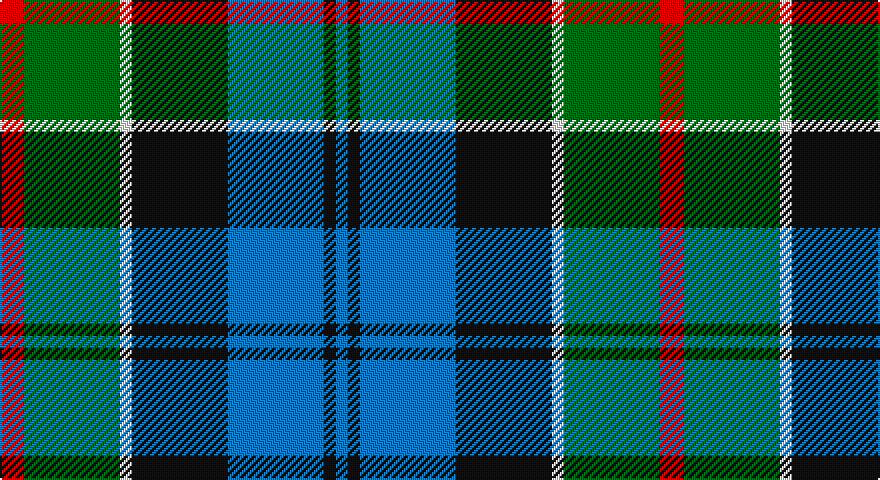

This page is one **sett** — a single exact thread-count. It belongs to the [tartan](/setts/r2g8w1k8b8k1b1/)
(the same proportion at any scale), whose colour order is pattern [BKBKWGR](/stripes/bkbkwgr/).

Part of the [Colquhoun](/tartans/colquhoun/) tartan — the named design grouping this sett with its other cloths.

Sourced from register-of-tartans.  It is a [7 stripe tartan](/stripes/stripes7/).

Original link https://www.tartanregister.gov.uk/tartanDetails.aspx?ref=715

## Also known as

This cloth is also recorded under:

- Colquhoun #2
- Colquhoun #3

## Register references

External register numbers recorded for this tartan.

- Scottish Register of Tartans: [715](https://www.tartanregister.gov.uk/tartanDetails.aspx?ref=715)
- Scottish Tartans Authority (ITI): 274
- Scottish Tartans World Register: 274

## Thread count
R/12 G48 W6 K48 B48 K6 B/6

One full sett is **330 threads**.

## Palette

Palette: <strong>Tartan Register</strong>
<table><thead><tr><th>Colour</th><th>Threads</th><th>Shade</th><th>Base</th><th>OKLCh</th></tr></thead><tbody><tr><td>R/</td><td style="text-align:right;font-variant-numeric:tabular-nums">12</td><td><code style="background-color:#C80000;">#C80000</code> <small style="color:#888">#C80000</small></td><td>R <code style="background-color:#CC0000;">#CC0000</code></td><td><small style="color:#888">oklch(52.3% 0.215 29.2)</small></td></tr><tr><td>G</td><td style="text-align:right;font-variant-numeric:tabular-nums">48</td><td><code style="background-color:#006818;">#006818</code> <small style="color:#888">#006818</small></td><td>G <code style="background-color:#006100;">#006100</code></td><td><small style="color:#888">oklch(45.0% 0.142 145.0)</small></td></tr><tr><td>W</td><td style="text-align:right;font-variant-numeric:tabular-nums">6</td><td><code style="background-color:#FCFCFC;">#FCFCFC</code> <small style="color:#888">#FCFCFC</small></td><td>W <code style="background-color:#F7F7F7;">#F7F7F7</code></td><td><small style="color:#888">oklch(99.1% 0.000 89.9)</small></td></tr><tr><td>K</td><td style="text-align:right;font-variant-numeric:tabular-nums">48</td><td><code style="background-color:#101010;">#101010</code> <small style="color:#888">#101010</small></td><td>K <code style="background-color:#000000;">#000000</code></td><td><small style="color:#888">oklch(17.3% 0.000 89.9)</small></td></tr><tr><td>B</td><td style="text-align:right;font-variant-numeric:tabular-nums">48</td><td><code style="background-color:#1474B4;">#1474B4</code> <small style="color:#888">#1474B4</small></td><td>B <code style="background-color:#2A418A;">#2A418A</code></td><td><small style="color:#888">oklch(54.0% 0.129 245.1)</small></td></tr><tr><td>K</td><td style="text-align:right;font-variant-numeric:tabular-nums">6</td><td><code style="background-color:#101010;">#101010</code> <small style="color:#888">#101010</small></td><td>K <code style="background-color:#000000;">#000000</code></td><td><small style="color:#888">oklch(17.3% 0.000 89.9)</small></td></tr><tr><td>B/</td><td style="text-align:right;font-variant-numeric:tabular-nums">6</td><td><code style="background-color:#1474B4;">#1474B4</code> <small style="color:#888">#1474B4</small></td><td>B <code style="background-color:#2A418A;">#2A418A</code></td><td><small style="color:#888">oklch(54.0% 0.129 245.1)</small></td></tr></tbody></table>

# Sample pattern

## Compared to the master

This cloth is one sett of its design; the master sett (the exemplar the design is anchored on) is below for comparison.

<figure style="margin:0"><figcaption style="color:#888;font-size:smaller">this sett</figcaption></figure>
<figure style="margin:0"><figcaption style="color:#888;font-size:smaller"><a href="/setts/db4k2db16w1k8dg24r4/">master sett →</a></figcaption></figure>

## Nearest tartans

The nearest existing variants by ΔTartan distance, with this tartan at the top so the swatches line up against it.

ΔTartan

Tartan

Sett

—

<a href="/ttd/edit/#slug=r2g8w1k8b8k1b1~x6">Colquhoun #2</a> <a class="nn-out" href="/variants/s7/r2g8w1k8b8k1b1~x6/" title="open its dictionary page">↗</a>

0.58

<a href="/ttd/edit/#slug=ly4k2b20k10g15k2r3~x2&amp;base=r2g8w1k8b8k1b1~x6">Green MacLeod</a> <a class="nn-out" href="/variants/s7/ly4k2b20k10g15k2r3~x2/" title="open its dictionary page">↗</a>

0.74

<a href="/ttd/edit/#slug=db27g5ly8k20ly3g15r3~x2&amp;base=r2g8w1k8b8k1b1~x6">Nelson Mandela (Personal)</a> <a class="nn-out" href="/variants/s7/db27g5ly8k20ly3g15r3~x2/" title="open its dictionary page">↗</a>

0.79

<a href="/ttd/edit/#slug=k2g17k16r2db17w2~x2&amp;base=r2g8w1k8b8k1b1~x6">Galbraith</a> <a class="nn-out" href="/variants/s6/k2g17k16r2db17w2~x2/" title="open its dictionary page">↗</a>

0.85

<a href="/ttd/edit/#slug=r3g16w2k16db16k2db2~x2&amp;base=r2g8w1k8b8k1b1~x6">Colquhoun Clan Tartan</a> <a class="nn-out" href="/variants/s7/r3g16w2k16db16k2db2~x2/" title="open its dictionary page">↗</a>

0.85

<a href="/ttd/edit/#slug=r3k2g20k10b20ly2~x2&amp;base=r2g8w1k8b8k1b1~x6">MacLeod of Assynt</a> <a class="nn-out" href="/variants/s6/r3k2g20k10b20ly2~x2/" title="open its dictionary page">↗</a>

0.86

<a href="/ttd/edit/#slug=db24k4r3k4g24k4lo4~x2&amp;base=r2g8w1k8b8k1b1~x6">Skene</a> <a class="nn-out" href="/variants/s7/db24k4r3k4g24k4lo4~x2/" title="open its dictionary page">↗</a>

0.87

<a href="/ttd/edit/#slug=t4g14ly2k14db14k2db3~x2&amp;base=r2g8w1k8b8k1b1~x6">Hogarth of Firhill (Clan)</a> <a class="nn-out" href="/variants/s7/t4g14ly2k14db14k2db3~x2/" title="open its dictionary page">↗</a>

0.87

<a href="/ttd/edit/#slug=r3db20g3k20db3g20w3g3~x2&amp;base=r2g8w1k8b8k1b1~x6">MacFrog (Personal)</a> <a class="nn-out" href="/variants/s8/r3db20g3k20db3g20w3g3~x2/" title="open its dictionary page">↗</a>

0.88

<a href="/ttd/edit/#slug=t2g6ly1k6db6k1db1~x2&amp;base=r2g8w1k8b8k1b1~x6">Hogarth of Firhill</a> <a class="nn-out" href="/variants/s7/t2g6ly1k6db6k1db1~x2/" title="open its dictionary page">↗</a>

0.92

<a href="/ttd/edit/#slug=g2k2g17k16r2db17ly2~x2&amp;base=r2g8w1k8b8k1b1~x6">Greenock</a> <a class="nn-out" href="/variants/s7/g2k2g17k16r2db17ly2~x2/" title="open its dictionary page">↗</a>

## Neighbour map

Every grey dot is one of 14360 variants placed by the first two principal components of the ΔTartan feature space (44% of its variance). Red is this tartan; blue dots are its nearest — click one to open its page.

<svg viewBox="0 0 640 380" role="img" style="max-width:100%;height:auto;border:1px solid #e0e0e0;border-radius:4px;display:block" xmlns="http://www.w3.org/2000/svg"><image href="/nn/cloud.v1.png" width="640" height="380"/><a href="/variants/s7/ly4k2b20k10g15k2r3~x2/"><circle cx="148.2" cy="189.3" r="4" fill="#3465a4"><title>Green MacLeod</title></circle></a><a href="/variants/s7/db27g5ly8k20ly3g15r3~x2/"><circle cx="121.3" cy="197.1" r="4" fill="#3465a4"><title>Nelson Mandela (Personal)</title></circle></a><a href="/variants/s6/k2g17k16r2db17w2~x2/"><circle cx="151.3" cy="214.4" r="4" fill="#3465a4"><title>Galbraith</title></circle></a><a href="/variants/s7/r3g16w2k16db16k2db2~x2/"><circle cx="150.2" cy="206.9" r="4" fill="#3465a4"><title>Colquhoun Clan Tartan</title></circle></a><a href="/variants/s6/r3k2g20k10b20ly2~x2/"><circle cx="169.4" cy="203.8" r="4" fill="#3465a4"><title>MacLeod of Assynt</title></circle></a><a href="/variants/s7/db24k4r3k4g24k4lo4~x2/"><circle cx="149.2" cy="183.6" r="4" fill="#3465a4"><title>Skene</title></circle></a><a href="/variants/s7/t4g14ly2k14db14k2db3~x2/"><circle cx="134.9" cy="222.1" r="4" fill="#3465a4"><title>Hogarth of Firhill (Clan)</title></circle></a><a href="/variants/s8/r3db20g3k20db3g20w3g3~x2/"><circle cx="143.5" cy="200.1" r="4" fill="#3465a4"><title>MacFrog (Personal)</title></circle></a><a href="/variants/s7/t2g6ly1k6db6k1db1~x2/"><circle cx="116.2" cy="227.0" r="4" fill="#3465a4"><title>Hogarth of Firhill</title></circle></a><a href="/variants/s7/g2k2g17k16r2db17ly2~x2/"><circle cx="166.9" cy="205.0" r="4" fill="#3465a4"><title>Greenock</title></circle></a><circle cx="125.0" cy="199.6" r="5" fill="#c00000"/></svg>

ID: /variants/s7/r2g8w1k8b8k1b1~x6/
