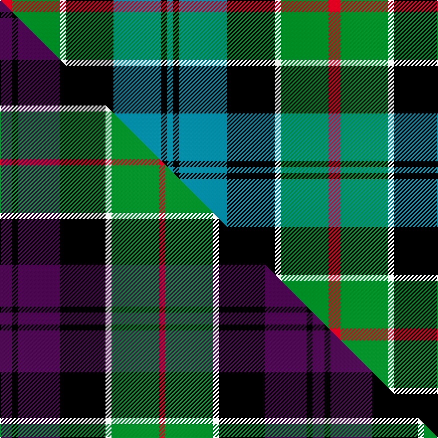

This is one **variant** — a specific cloth: this exact thread count and colourway, with its own
provenance below. It is one weaving of the [sett](/setts/r2g8w1k8t8k1t1/) (the scale-free proportion — the
same cloth at any scale or shade), whose colour order is pattern [BKBKWGR](/stripes/bkbkwgr/).

Part of the [Colquhoun](/tartans/colquhoun-2/) tartan — the named design grouping this sett with its other cloths.

Sourced from register-of-tartans.  It is a [7 stripe tartan](/stripes/stripes7/).

Original link [https://www.tartanregister.gov.uk/tartanDetails.aspx?ref=715](https://www.tartanregister.gov.uk/tartanDetails.aspx?ref=715)

Dataset <small>— provenance for this record, inherited from the source manifest</small>

<dl class="dataset-prov">
<dt>source</dt><dd><a href="/sources/register-of-tartans/">Scottish Register of Tartans</a></dd>
<dt>data captured from</dt><dd><a href="https://github.com/thetartan/tartan-database/blob/master/data/register-of-tartans/data.csv">https://github.com/thetartan/tartan-database/blob/master/data/register-of-tartans/data.csv</a></dd>
<dt>data date</dt><dd>1810 <small>(this record)</small></dd>
<dt>licence</dt><dd><a href="https://www.tartanregister.gov.uk/copyright">Crown copyright</a></dd>
</dl>

Capture chain <small>— the hands this data passed through, oldest first; each capture carries its own licence</small>

<ol class="capture-chain">
<li><a href="https://www.tartanregister.gov.uk/">Scottish Register of Tartans</a> · <a href="https://www.tartanregister.gov.uk/copyright">Crown copyright</a> <small>the living register — still published by National Records of Scotland</small></li>
<li><a href="https://github.com/thetartan/tartan-database">thetartan/tartan-database</a> <small>2016-2017</small> · <a href="https://creativecommons.org/licenses/by-nc-nd/4.0/">CC BY-NC-ND 4.0</a> <small>Levko Kravets's frozen compilation — the capture we vendored, and where its CC licence text came from</small></li>
<li>this dictionary <small>captured 2026-06-10 · commit 5bf86c7566</small> <small>each re-capture is a git commit to data/sources</small></li>
</ol>

## Register references

External register numbers recorded for this tartan.

- Scottish Register of Tartans: [715](https://www.tartanregister.gov.uk/tartanDetails.aspx?ref=715)
- Scottish Tartans Authority (ITI): 274
- Scottish Tartans World Register: 274

## Thread count
R/12 G48 W6 K48 T48 K6 T/6

One full sett is **330 threads**.

## Palette
<table><thead><tr><th>Colour</th><th>Shade</th><th>OKLCh</th></tr></thead><tbody><tr><td>T</td><td><code style="background-color:#00879F;">#00879F</code> <small style="color:#888">#00879F</small></td><td><small style="color:#888">oklch(57.4% 0.102 216.1)</small></td></tr><tr><td>DB</td><td><code style="background-color:#082077;">#082077</code> <small style="color:#888">#082077</small></td><td><small style="color:#888">oklch(30.0% 0.149 265.1)</small></td></tr><tr><td>DG</td><td><code style="background-color:#003820;">#003820</code> <small style="color:#888">#003820</small></td><td><small style="color:#888">oklch(30.0% 0.070 158.3)</small></td></tr><tr><td>G</td><td><code style="background-color:#008B2A;">#008B2A</code> <small style="color:#888">#008B2A</small></td><td><small style="color:#888">oklch(55.4% 0.170 145.9)</small></td></tr><tr><td>DG</td><td><code style="background-color:#285800;">#285800</code> <small style="color:#888">#285800</small></td><td><small style="color:#888">oklch(41.0% 0.122 135.8)</small></td></tr><tr><td>K</td><td><code style="background-color:#000000;">#000000</code> <small style="color:#888">#000000</small></td><td><small style="color:#888">oklch(0.0% 0.000 0.0)</small></td></tr><tr><td>LB</td><td><code style="background-color:#B5BBDE;">#B5BBDE</code> <small style="color:#888">#B5BBDE</small></td><td><small style="color:#888">oklch(79.9% 0.050 277.6)</small></td></tr><tr><td>R</td><td><code style="background-color:#D60020;">#D60020</code> <small style="color:#888">#D60020</small></td><td><small style="color:#888">oklch(55.2% 0.224 25.5)</small></td></tr><tr><td>W</td><td><code style="background-color:#F7F7F7;">#F7F7F7</code> <small style="color:#888">#F7F7F7</small></td><td><small style="color:#888">oklch(97.6% 0.000 89.9)</small></td></tr></tbody></table>

# Sample pattern

## Compared to the master

This cloth is one sett of its design; the master sett (the exemplar the design is anchored on) is below for comparison.

Its **ΔTartan distance** from the master is **2.52** — the same measure the nearest-tartans table ranks by (0 is identical; a re-scale of the same cloth is near 0, a recolour or a different proportion further).

<figure class="master-compare" style="margin:0">

this sett
master sett ★

<figcaption style="color:#888;font-size:smaller">One weave of this sett against the <a href="/setts/dp6k3dp21k23w3g24r3/">master sett ★</a>, split on the diagonal: a shared proportion runs seamlessly across it with only the shades shifting; a different proportion breaks on it.</figcaption>
</figure>

## Nearest tartan variants

The nearest existing variants by ΔTartan distance, with this cloth at the top so the swatches line up against it.

ΔTartan

Threads

Variant

Sett

—

330

<a href="/variants/s7/r2g8w1k8t8k1t1~x6/">Colquhoun #2</a>

<a href="/ttd/edit/#slug=r2g8w1k8db8k1db1~x4&amp;base=r2g8w1k8t8k1t1~x6" title="compare in the TTD">0.15</a>

220

<a href="/variants/s7/r2g8w1k8db8k1db1~x4/">Colquhoun</a>

<a href="/ttd/edit/#slug=r2g8w1k8db8k1db1~x2&amp;base=r2g8w1k8t8k1t1~x6" title="compare in the TTD">0.15</a>

110

<a href="/variants/s7/r2g8w1k8db8k1db1~x2/">Colquhoun</a>

<a href="/ttd/edit/#slug=r3g16w2k16db16k2db2~x2&amp;base=r2g8w1k8t8k1t1~x6" title="compare in the TTD">0.17</a>

218

<a href="/variants/s7/r3g16w2k16db16k2db2~x2/">Colquhoun Clan Tartan</a>

<a href="/ttd/edit/#slug=r4g16w2k15db15k2db2y2~x2~db1406275&amp;base=r2g8w1k8t8k1t1~x6" title="compare in the TTD">0.44</a>

220

<a href="/variants/s8/r4g16w2k15db15k2db2y2~x2~db1406275/">Cowan of Inveresk (Personal)</a>

<a href="/ttd/edit/#slug=r4g16w2k15db15k2db2y2~x2&amp;base=r2g8w1k8t8k1t1~x6" title="compare in the TTD">0.45</a>

220

<a href="/variants/s8/r4g16w2k15db15k2db2y2~x2/">Cowan of Inveresk (Personal)</a>

<a href="/ttd/edit/#slug=lb4g14y2k14db14k2db3~x2&amp;base=r2g8w1k8t8k1t1~x6" title="compare in the TTD">0.84</a>

198

<a href="/variants/s7/lb4g14y2k14db14k2db3~x2/">Hogarth of Firhill (Clan)</a>

<a href="/ttd/edit/#slug=lb2g6y1k6db6k1db1~x2&amp;base=r2g8w1k8t8k1t1~x6" title="compare in the TTD">0.91</a>

86

<a href="/variants/s7/lb2g6y1k6db6k1db1~x2/">Hogarth of Firhill</a>

<a href="/ttd/edit/#slug=db2k2db12k11g16w2~x2&amp;base=r2g8w1k8t8k1t1~x6" title="compare in the TTD">0.92</a>

172

<a href="/variants/s6/db2k2db12k11g16w2~x2/">Campbell of Argyll (Smiths)</a>

<a href="/ttd/edit/#slug=db20k6dy4db3k16g20w2~x2&amp;base=r2g8w1k8t8k1t1~x6" title="compare in the TTD">1.44</a>

240

<a href="/variants/s7/db20k6dy4db3k16g20w2~x2/">Deloughery, Paul</a>

<a href="/ttd/edit/#slug=k5g30y3t15k15t7w3~x2&amp;base=r2g8w1k8t8k1t1~x6" title="compare in the TTD">1.58</a>

296

<a href="/variants/s7/k5g30y3t15k15t7w3~x2/">Dick (Personal)</a>

## Neighbour map

Every grey dot is one of 13621 variants placed by the first two principal components of the ΔTartan feature space (42% of its variance). Red is this tartan; blue dots are its nearest — click one to open its page.

<svg viewBox="0 0 640 380" role="img" style="max-width:100%;height:auto;border:1px solid #e0e0e0;border-radius:4px;display:block" xmlns="http://www.w3.org/2000/svg"><image href="/nn/cloud.v1.png" width="640" height="380"/><a href="/variants/s7/r2g8w1k8db8k1db1~x4/"><circle cx="102.8" cy="188.7" r="4" fill="#3465a4"><title>Colquhoun</title></circle></a><a href="/variants/s7/r2g8w1k8db8k1db1~x2/"><circle cx="102.8" cy="188.7" r="4" fill="#3465a4"><title>Colquhoun</title></circle></a><a href="/variants/s7/r3g16w2k16db16k2db2~x2/"><circle cx="108.8" cy="186.7" r="4" fill="#3465a4"><title>Colquhoun Clan Tartan</title></circle></a><a href="/variants/s8/r4g16w2k15db15k2db2y2~x2~db1406275/"><circle cx="76.7" cy="165.0" r="4" fill="#3465a4"><title>Cowan of Inveresk (Personal)</title></circle></a><a href="/variants/s8/r4g16w2k15db15k2db2y2~x2/"><circle cx="75.5" cy="165.5" r="4" fill="#3465a4"><title>Cowan of Inveresk (Personal)</title></circle></a><a href="/variants/s7/lb4g14y2k14db14k2db3~x2/"><circle cx="95.1" cy="200.6" r="4" fill="#3465a4"><title>Hogarth of Firhill (Clan)</title></circle></a><a href="/variants/s7/lb2g6y1k6db6k1db1~x2/"><circle cx="80.0" cy="207.9" r="4" fill="#3465a4"><title>Hogarth of Firhill</title></circle></a><a href="/variants/s6/db2k2db12k11g16w2~x2/"><circle cx="141.6" cy="213.6" r="4" fill="#3465a4"><title>Campbell of Argyll (Smiths)</title></circle></a><a href="/variants/s7/db20k6dy4db3k16g20w2~x2/"><circle cx="116.1" cy="188.2" r="4" fill="#3465a4"><title>Deloughery, Paul</title></circle></a><a href="/variants/s7/k5g30y3t15k15t7w3~x2/"><circle cx="135.5" cy="183.7" r="4" fill="#3465a4"><title>Dick (Personal)</title></circle></a><circle cx="97.4" cy="190.4" r="5" fill="#c00000"/><text x="320" y="376" text-anchor="middle" font-size="11" fill="#999">ground</text><text x="11" y="190" text-anchor="middle" font-size="11" fill="#999" transform="rotate(-90 11 190)">complexity</text></svg>

ID: /variants/s7/r2g8w1k8t8k1t1~x6/
