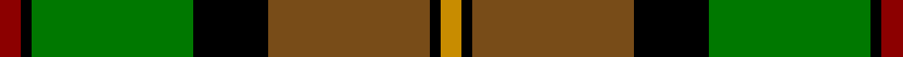
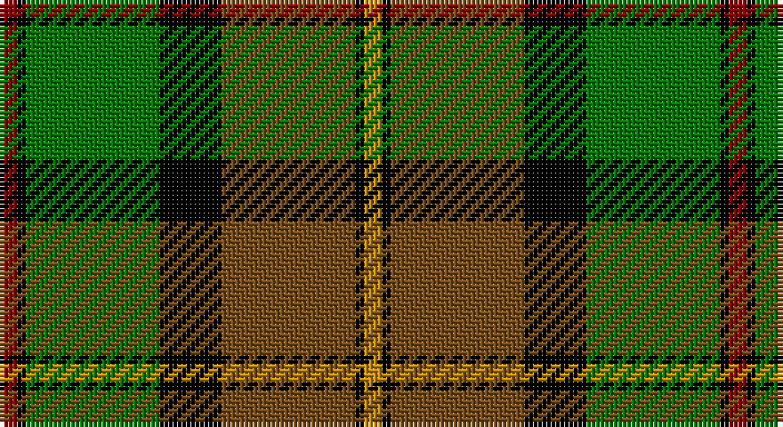

This page is one **sett** — a single exact thread-count. It belongs to the [tartan](/setts/r2k1g15k7y15k1lo2/)
(the same proportion at any scale), whose colour order is pattern [RKGKGKY](/stripes/rkgkgky/).

Sourced from register-of-tartans.  It is a [7 stripe tartan](/stripes/stripes7/).

Original link https://www.tartanregister.gov.uk/tartanDetails.aspx?ref=4276

## Register references

External register numbers recorded for this tartan.

- Scottish Register of Tartans: [4276](https://www.tartanregister.gov.uk/tartanDetails.aspx?ref=4276)
- Scottish Tartans Authority (ITI): 4395

## Thread count
DR/4 K2 G30 K14 T30 K2 DY/4

One full sett is **164 threads**.

## Palette

Palette: <strong>Tartan Register</strong> <small style="color:#888">(3 of 5 colours)</small>
<table><thead><tr><th>Colour</th><th>Threads</th><th>Shade</th><th>Base</th><th>OKLCh</th></tr></thead><tbody><tr><td>DR/</td><td style="text-align:right;font-variant-numeric:tabular-nums">4</td><td><code style="background-color:#8C0000;">#8C0000</code> <small style="color:#888">#8C0000</small></td><td>R <code style="background-color:#CC0000;">#CC0000</code></td><td><small style="color:#888">oklch(40.2% 0.165 29.2)</small></td></tr><tr><td>K</td><td style="text-align:right;font-variant-numeric:tabular-nums">2</td><td><code style="background-color:#000000;">#000000</code> <small style="color:#888">#000000</small></td><td>K <code style="background-color:#000000;">#000000</code></td><td><small style="color:#888">oklch(0.0% 0.000 0.0)</small></td></tr><tr><td>G</td><td style="text-align:right;font-variant-numeric:tabular-nums">30</td><td><code style="background-color:#007800;">#007800</code> <small style="color:#888">#007800</small></td><td>G <code style="background-color:#006100;">#006100</code></td><td><small style="color:#888">oklch(49.6% 0.169 142.5)</small></td></tr><tr><td>K</td><td style="text-align:right;font-variant-numeric:tabular-nums">14</td><td><code style="background-color:#000000;">#000000</code> <small style="color:#888">#000000</small></td><td>K <code style="background-color:#000000;">#000000</code></td><td><small style="color:#888">oklch(0.0% 0.000 0.0)</small></td></tr><tr><td>T</td><td style="text-align:right;font-variant-numeric:tabular-nums">30</td><td><code style="background-color:#784C18;">#784C18</code> <small style="color:#888">#784C18</small></td><td>G <code style="background-color:#006100;">#006100</code></td><td><small style="color:#888">oklch(45.7% 0.088 66.1)</small></td></tr><tr><td>K</td><td style="text-align:right;font-variant-numeric:tabular-nums">2</td><td><code style="background-color:#000000;">#000000</code> <small style="color:#888">#000000</small></td><td>K <code style="background-color:#000000;">#000000</code></td><td><small style="color:#888">oklch(0.0% 0.000 0.0)</small></td></tr><tr><td>DY/</td><td style="text-align:right;font-variant-numeric:tabular-nums">4</td><td><code style="background-color:#C88C00;">#C88C00</code> <small style="color:#888">#C88C00</small></td><td>Y <code style="background-color:#F2BF00;">#F2BF00</code></td><td><small style="color:#888">oklch(68.2% 0.142 78.2)</small></td></tr></tbody></table>

# Sample pattern

## Nearest tartans

The nearest existing variants by ΔTartan distance, with this tartan at the top so the swatches line up against it.

ΔTartan

Tartan

Sett

—

<a href="/ttd/edit/#slug=r2k1g15k7y15k1lo2~x2">Unidentified 20th Centuary</a> <a class="nn-out" href="/variants/s7/r2k1g15k7y15k1lo2~x2/" title="open its dictionary page">↗</a>

1.02

<a href="/ttd/edit/#slug=ly4k1dg16k16r1w3~x2&amp;base=r2k1g15k7y15k1lo2~x2">MacLamroc</a> <a class="nn-out" href="/variants/s6/ly4k1dg16k16r1w3~x2/" title="open its dictionary page">↗</a>

1.16

<a href="/variants/s10/lo16k7w1g7k1ly3~x4/">Hamilton of Brandon</a>

1.18

<a href="/ttd/edit/#slug=k3r9k5dr9o3dr9k5g24k2o3~x2&amp;base=r2k1g15k7y15k1lo2~x2">Cavan</a> <a class="nn-out" href="/variants/s10/k3r9k5dr9o3dr9k5g24k2o3~x2/" title="open its dictionary page">↗</a>

1.19

<a href="/ttd/edit/#slug=dg2dr13dg11ly5dr1oi21dg2o1~x2&amp;base=r2k1g15k7y15k1lo2~x2">St Lawrence Trade</a> <a class="nn-out" href="/variants/s8/dg2dr13dg11ly5dr1oi21dg2o1~x2/" title="open its dictionary page">↗</a>

1.21

<a href="/ttd/edit/#slug=g28t3g3k10r2k10r20ly4~x2&amp;base=r2k1g15k7y15k1lo2~x2">Garvock (2015)</a> <a class="nn-out" href="/variants/s8/g28t3g3k10r2k10r20ly4~x2/" title="open its dictionary page">↗</a>

1.29

<a href="/ttd/edit/#slug=k3g2k21w11g1y21g2y3~x2&amp;base=r2k1g15k7y15k1lo2~x2">Dalveen (Fashion)</a> <a class="nn-out" href="/variants/s8/k3g2k21w11g1y21g2y3~x2/" title="open its dictionary page">↗</a>

1.29

<a href="/ttd/edit/#slug=k2r7k6g12ly1g1k2~x4&amp;base=r2k1g15k7y15k1lo2~x2">Blackstock Hunting</a> <a class="nn-out" href="/variants/s7/k2r7k6g12ly1g1k2~x4/" title="open its dictionary page">↗</a>

1.31

<a href="/ttd/edit/#slug=m5dg27o2g25ly7dg3m3~x2&amp;base=r2k1g15k7y15k1lo2~x2">Kilkenny</a> <a class="nn-out" href="/variants/s7/m5dg27o2g25ly7dg3m3~x2/" title="open its dictionary page">↗</a>

1.32

<a href="/ttd/edit/#slug=r5k2db19g4k19g28k2ly5~x2&amp;base=r2k1g15k7y15k1lo2~x2">Tait #1</a> <a class="nn-out" href="/variants/s8/r5k2db19g4k19g28k2ly5~x2/" title="open its dictionary page">↗</a>

1.35

<a href="/ttd/edit/#slug=r2g10k12n1ly2n14k1n1g2~x2&amp;base=r2k1g15k7y15k1lo2~x2">McWilliams Wedding (Personal)</a> <a class="nn-out" href="/variants/s9/r2g10k12n1ly2n14k1n1g2~x2/" title="open its dictionary page">↗</a>

## Neighbour map

Every grey dot is one of 14360 variants placed by the first two principal components of the ΔTartan feature space (44% of its variance). Red is this tartan; blue dots are its nearest — click one to open its page.

<svg viewBox="0 0 640 380" role="img" style="max-width:100%;height:auto;border:1px solid #e0e0e0;border-radius:4px;display:block" xmlns="http://www.w3.org/2000/svg"><image href="/nn/cloud.v1.png" width="640" height="380"/><a href="/variants/s6/ly4k1dg16k16r1w3~x2/"><circle cx="212.3" cy="163.5" r="4" fill="#3465a4"><title>MacLamroc</title></circle></a><a href="/variants/s10/lo16k7w1g7k1ly3~x4/"><circle cx="144.3" cy="144.2" r="4" fill="#3465a4"><title>Hamilton of Brandon</title></circle></a><a href="/variants/s10/k3r9k5dr9o3dr9k5g24k2o3~x2/"><circle cx="131.9" cy="159.7" r="4" fill="#3465a4"><title>Cavan</title></circle></a><a href="/variants/s8/dg2dr13dg11ly5dr1oi21dg2o1~x2/"><circle cx="207.7" cy="141.1" r="4" fill="#3465a4"><title>St Lawrence Trade</title></circle></a><a href="/variants/s8/g28t3g3k10r2k10r20ly4~x2/"><circle cx="163.5" cy="149.7" r="4" fill="#3465a4"><title>Garvock (2015)</title></circle></a><a href="/variants/s8/k3g2k21w11g1y21g2y3~x2/"><circle cx="197.7" cy="131.4" r="4" fill="#3465a4"><title>Dalveen (Fashion)</title></circle></a><a href="/variants/s7/k2r7k6g12ly1g1k2~x4/"><circle cx="229.0" cy="196.0" r="4" fill="#3465a4"><title>Blackstock Hunting</title></circle></a><a href="/variants/s7/m5dg27o2g25ly7dg3m3~x2/"><circle cx="202.2" cy="165.6" r="4" fill="#3465a4"><title>Kilkenny</title></circle></a><a href="/variants/s8/r5k2db19g4k19g28k2ly5~x2/"><circle cx="184.2" cy="172.9" r="4" fill="#3465a4"><title>Tait #1</title></circle></a><a href="/variants/s9/r2g10k12n1ly2n14k1n1g2~x2/"><circle cx="191.0" cy="160.7" r="4" fill="#3465a4"><title>McWilliams Wedding (Personal)</title></circle></a><circle cx="182.6" cy="163.8" r="5" fill="#c00000"/></svg>

ID: /variants/s7/r2k1g15k7y15k1lo2~x2/
