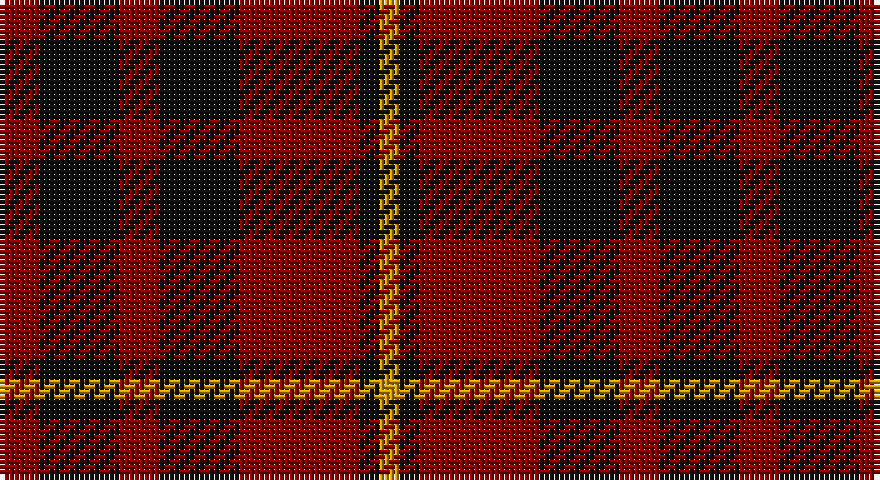

This page is one **sett** — a single exact thread-count. It belongs to the [tartan](/setts/r2k4r2k4r6k1lo1/)
(the same proportion at any scale), whose colour order is pattern [RKRKRKY](/stripes/rkrkrky/).

Sourced from register-of-tartans.  It is a [7 stripe tartan](/stripes/stripes7/).

Original link https://www.tartanregister.gov.uk/tartanDetails.aspx?ref=5214

## Register references

External register numbers recorded for this tartan.

- Scottish Register of Tartans: [5214](https://www.tartanregister.gov.uk/tartanDetails.aspx?ref=5214)
- Scottish Tartans Authority (ITI): 3390

## Thread count
DR/8 K16 DR8 K16 DR24 K4 DY/4

One full sett is **148 threads**.

## Palette

Palette: <strong>Tartan Register</strong> <small style="color:#888">(2 of 3 colours)</small>
<table><thead><tr><th>Colour</th><th>Threads</th><th>Shade</th><th>Base</th><th>OKLCh</th></tr></thead><tbody><tr><td>DR/</td><td style="text-align:right;font-variant-numeric:tabular-nums">8</td><td><code style="background-color:#880000;">#880000</code> <small style="color:#888">#880000</small></td><td>R <code style="background-color:#CC0000;">#CC0000</code></td><td><small style="color:#888">oklch(39.4% 0.162 29.2)</small></td></tr><tr><td>K</td><td style="text-align:right;font-variant-numeric:tabular-nums">16</td><td><code style="background-color:#101010;">#101010</code> <small style="color:#888">#101010</small></td><td>K <code style="background-color:#000000;">#000000</code></td><td><small style="color:#888">oklch(17.3% 0.000 89.9)</small></td></tr><tr><td>DR</td><td style="text-align:right;font-variant-numeric:tabular-nums">8</td><td><code style="background-color:#880000;">#880000</code> <small style="color:#888">#880000</small></td><td>R <code style="background-color:#CC0000;">#CC0000</code></td><td><small style="color:#888">oklch(39.4% 0.162 29.2)</small></td></tr><tr><td>K</td><td style="text-align:right;font-variant-numeric:tabular-nums">16</td><td><code style="background-color:#101010;">#101010</code> <small style="color:#888">#101010</small></td><td>K <code style="background-color:#000000;">#000000</code></td><td><small style="color:#888">oklch(17.3% 0.000 89.9)</small></td></tr><tr><td>DR</td><td style="text-align:right;font-variant-numeric:tabular-nums">24</td><td><code style="background-color:#880000;">#880000</code> <small style="color:#888">#880000</small></td><td>R <code style="background-color:#CC0000;">#CC0000</code></td><td><small style="color:#888">oklch(39.4% 0.162 29.2)</small></td></tr><tr><td>K</td><td style="text-align:right;font-variant-numeric:tabular-nums">4</td><td><code style="background-color:#101010;">#101010</code> <small style="color:#888">#101010</small></td><td>K <code style="background-color:#000000;">#000000</code></td><td><small style="color:#888">oklch(17.3% 0.000 89.9)</small></td></tr><tr><td>DY/</td><td style="text-align:right;font-variant-numeric:tabular-nums">4</td><td><code style="background-color:#D09800;">#D09800</code> <small style="color:#888">#D09800</small></td><td>Y <code style="background-color:#F2BF00;">#F2BF00</code></td><td><small style="color:#888">oklch(71.4% 0.147 82.1)</small></td></tr></tbody></table>

# Sample pattern

## Nearest tartans

The nearest existing variants by ΔTartan distance, with this tartan at the top so the swatches line up against it.

ΔTartan

Tartan

Sett

—

<a href="/ttd/edit/#slug=r2k4r2k4r6k1lo1~x4">MacIan</a> <a class="nn-out" href="/variants/s7/r2k4r2k4r6k1lo1~x4/" title="open its dictionary page">↗</a>

1.45

<a href="/ttd/edit/#slug=k25r25k10lb3k10r25k25r3~x2&amp;base=r2k4r2k4r6k1lo1~x4">bodog.com Corporate Tartan</a> <a class="nn-out" href="/variants/s8/k25r25k10lb3k10r25k25r3~x2/" title="open its dictionary page">↗</a>

1.51

<a href="/ttd/edit/#slug=dg1r5dg4r1dg1r1dt4r5dt1~x14&amp;base=r2k4r2k4r6k1lo1~x4">Lumsden Boghead</a> <a class="nn-out" href="/variants/s9/dg1r5dg4r1dg1r1dt4r5dt1~x14/" title="open its dictionary page">↗</a>

1.51

<a href="/ttd/edit/#slug=r5dg3r18db18dg3~x4&amp;base=r2k4r2k4r6k1lo1~x4">Wotherspoon</a> <a class="nn-out" href="/variants/s5/r5dg3r18db18dg3~x4/" title="open its dictionary page">↗</a>

1.53

<a href="/ttd/edit/#slug=r1dg4r1lr1r4dg1r1~x4&amp;base=r2k4r2k4r6k1lo1~x4">Unidentified #59</a> <a class="nn-out" href="/variants/s7/r1dg4r1lr1r4dg1r1~x4/" title="open its dictionary page">↗</a>

1.55

<a href="/variants/s8/r26k18r7k4ly4~x2/">Haig &amp; Haig Whisky</a>

1.58

<a href="/ttd/edit/#slug=dp1k2r7o4r2k4r7o2dp1~x4&amp;base=r2k4r2k4r6k1lo1~x4">Clanton (Personal)</a> <a class="nn-out" href="/variants/s9/dp1k2r7o4r2k4r7o2dp1~x4/" title="open its dictionary page">↗</a>

1.59

<a href="/ttd/edit/#slug=dg16r5dg2r18k2&amp;base=r2k4r2k4r6k1lo1~x4">MacDonald of Sleat</a> <a class="nn-out" href="/variants/s5/dg16r5dg2r18k2/" title="open its dictionary page">↗</a>

1.60

<a href="/ttd/edit/#slug=dt1r5dt4r1g1r1g4r5g1~x12&amp;base=r2k4r2k4r6k1lo1~x4">Lumsden of Kintore (Clan?)</a> <a class="nn-out" href="/variants/s9/dt1r5dt4r1g1r1g4r5g1~x12/" title="open its dictionary page">↗</a>

1.60

<a href="/ttd/edit/#slug=db6r39db10r10db21ly5~x2&amp;base=r2k4r2k4r6k1lo1~x4">Rajput</a> <a class="nn-out" href="/variants/s6/db6r39db10r10db21ly5~x2/" title="open its dictionary page">↗</a>

1.62

<a href="/ttd/edit/#slug=db3r19db13r5g21r8db3~x2&amp;base=r2k4r2k4r6k1lo1~x4">MacBean of Tomatin (Clan)</a> <a class="nn-out" href="/variants/s7/db3r19db13r5g21r8db3~x2/" title="open its dictionary page">↗</a>

## Neighbour map

Every grey dot is one of 14360 variants placed by the first two principal components of the ΔTartan feature space (44% of its variance). Red is this tartan; blue dots are its nearest — click one to open its page.

<svg viewBox="0 0 640 380" role="img" style="max-width:100%;height:auto;border:1px solid #e0e0e0;border-radius:4px;display:block" xmlns="http://www.w3.org/2000/svg"><image href="/nn/cloud.v1.png" width="640" height="380"/><a href="/variants/s8/k25r25k10lb3k10r25k25r3~x2/"><circle cx="313.7" cy="237.2" r="4" fill="#3465a4"><title>bodog.com Corporate Tartan</title></circle></a><a href="/variants/s9/dg1r5dg4r1dg1r1dt4r5dt1~x14/"><circle cx="279.2" cy="247.2" r="4" fill="#3465a4"><title>Lumsden Boghead</title></circle></a><a href="/variants/s5/r5dg3r18db18dg3~x4/"><circle cx="289.7" cy="257.0" r="4" fill="#3465a4"><title>Wotherspoon</title></circle></a><a href="/variants/s7/r1dg4r1lr1r4dg1r1~x4/"><circle cx="315.7" cy="275.7" r="4" fill="#3465a4"><title>Unidentified #59</title></circle></a><a href="/variants/s8/r26k18r7k4ly4~x2/"><circle cx="283.1" cy="228.6" r="4" fill="#3465a4"><title>Haig &amp; Haig Whisky</title></circle></a><a href="/variants/s9/dp1k2r7o4r2k4r7o2dp1~x4/"><circle cx="273.9" cy="226.4" r="4" fill="#3465a4"><title>Clanton (Personal)</title></circle></a><a href="/variants/s5/dg16r5dg2r18k2/"><circle cx="362.4" cy="250.4" r="4" fill="#3465a4"><title>MacDonald of Sleat</title></circle></a><a href="/variants/s9/dt1r5dt4r1g1r1g4r5g1~x12/"><circle cx="272.1" cy="244.6" r="4" fill="#3465a4"><title>Lumsden of Kintore (Clan?)</title></circle></a><a href="/variants/s6/db6r39db10r10db21ly5~x2/"><circle cx="348.3" cy="248.4" r="4" fill="#3465a4"><title>Rajput</title></circle></a><a href="/variants/s7/db3r19db13r5g21r8db3~x2/"><circle cx="256.1" cy="258.6" r="4" fill="#3465a4"><title>MacBean of Tomatin (Clan)</title></circle></a><circle cx="309.1" cy="273.8" r="5" fill="#c00000"/></svg>

ID: /variants/s7/r2k4r2k4r6k1lo1~x4/
