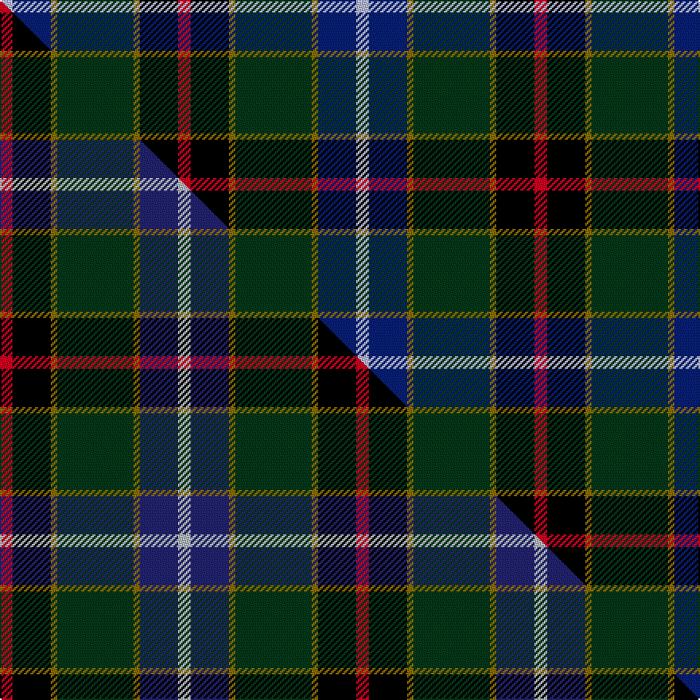

This page is one **sett** — a single exact thread-count. It belongs to the [tartan](/setts/r2k6y1dg12y1db6lb2/)
(the same proportion at any scale), whose colour order is pattern [RKGGGBW](/stripes/rkgggbw/).

Part of the [James](/tartans/james/) tartan — the named design grouping this sett with its other cloths.

Sourced from tartans-authority.  It is a [7 stripe tartan](/stripes/stripes7/).

Original link http://www.tartansauthority.com/tartan-ferret/display/2456/

## Register references

External register numbers recorded for this tartan.

- Scottish Tartans Authority (ITI): 2456

## Thread count
LB/8 DB24 Y4 DG48 Y4 K24 R/8

One full sett is **224 threads**.

## Palette
<table><thead><tr><th>Colour</th><th>Shade</th><th>OKLCh</th></tr></thead><tbody><tr><td>DB</td><td><code style="background-color:#082077;">#082077</code> <small style="color:#888">#082077</small></td><td><small style="color:#888">oklch(30.0% 0.149 265.1)</small></td></tr><tr><td>DG</td><td><code style="background-color:#053819;">#053819</code> <small style="color:#888">#053819</small></td><td><small style="color:#888">oklch(30.0% 0.075 151.3)</small></td></tr><tr><td>K</td><td><code style="background-color:#000000;">#000000</code> <small style="color:#888">#000000</small></td><td><small style="color:#888">oklch(0.0% 0.000 0.0)</small></td></tr><tr><td>LB</td><td><code style="background-color:#B5BBDE;">#B5BBDE</code> <small style="color:#888">#B5BBDE</small></td><td><small style="color:#888">oklch(79.9% 0.050 277.6)</small></td></tr><tr><td>R</td><td><code style="background-color:#D60020;">#D60020</code> <small style="color:#888">#D60020</small></td><td><small style="color:#888">oklch(55.2% 0.224 25.5)</small></td></tr><tr><td>Y</td><td><code style="background-color:#8B6E00;">#8B6E00</code> <small style="color:#888">#8B6E00</small></td><td><small style="color:#888">oklch(55.1% 0.113 90.4)</small></td></tr></tbody></table>

# Sample pattern

## Compared to the master

This cloth is one sett of its design; the master sett (the exemplar the design is anchored on) is below for comparison.

Its **ΔTartan distance** from the master is **0.22** — the same measure the nearest-tartans table ranks by (0 is identical; a re-scale of the same cloth is near 0, a recolour or a different proportion further).

<figure class="master-compare" style="margin:0">

this sett
master sett ★

<figcaption style="color:#888;font-size:smaller">One weave of this sett against the <a href="/setts/r2k6y1dg12y1db6lr2/">master sett ★</a>, split on the diagonal: a shared proportion runs seamlessly across it with only the shades shifting; a different proportion breaks on it.</figcaption>
</figure>

## Nearest tartan variants

The nearest existing variants by ΔTartan distance, with this cloth at the top so the swatches line up against it.

ΔTartan

Threads

Variant

Sett

—

224

<a href="/variants/s7/r2k6y1dg12y1db6lb2~x4/">James (Personal)</a>

<a href="/ttd/edit/#slug=r5k12y2dg25y2db12lb5~x2&amp;base=r2k6y1dg12y1db6lb2~x4" title="compare in the TTD">0.09</a>

232

<a href="/variants/s7/r5k12y2dg25y2db12lb5~x2/">James</a>

<a href="/ttd/edit/#slug=r2k6y1dg12y1db6lr2~x4~db1305279-lr3200000&amp;base=r2k6y1dg12y1db6lb2~x4" title="compare in the TTD">0.30</a>

224

<a href="/variants/s7/r2k6y1dg12y1db6lr2~x4~db1305279-lr3200000/">James (Personal)</a>

<a href="/ttd/edit/#slug=dy2g12k10r1db16r2~x2&amp;base=r2k6y1dg12y1db6lb2~x4" title="compare in the TTD">1.68</a>

164

<a href="/variants/s6/dy2g12k10r1db16r2~x2/">MacWilliam Clan Tartan</a>

<a href="/ttd/edit/#slug=y4g22r3k17r3db37w3~x2&amp;base=r2k6y1dg12y1db6lb2~x4" title="compare in the TTD">1.71</a>

342

<a href="/variants/s7/y4g22r3k17r3db37w3~x2/">Souza Nery</a>

<a href="/ttd/edit/#slug=ly4g22r3k17r3db37w3~x2&amp;base=r2k6y1dg12y1db6lb2~x4" title="compare in the TTD">1.71</a>

342

<a href="/variants/s7/ly4g22r3k17r3db37w3~x2/">Souza Nery (Personal)</a>

<a href="/ttd/edit/#slug=r2db16r1k10g12o2~x2&amp;base=r2k6y1dg12y1db6lb2~x4" title="compare in the TTD">1.98</a>

164

<a href="/variants/s6/r2db16r1k10g12o2~x2/">MacWilliam</a>

2.10

—

<a href="/variants/s7/r3w2dy10dg37k12db21w2~x2~dy1703114-dg1304144/">Jones, The</a>

<a href="/ttd/edit/#slug=w5k26y2dg24db7k3r3~x2&amp;base=r2k6y1dg12y1db6lb2~x4" title="compare in the TTD">2.26</a>

264

<a href="/variants/s7/w5k26y2dg24db7k3r3~x2/">Cornish Hunting District Tartan</a>

<a href="/ttd/edit/#slug=w5k26y2dg24ki7k3r3~x2~ki0604259&amp;base=r2k6y1dg12y1db6lb2~x4" title="compare in the TTD">2.26</a>

264

<a href="/variants/s7/w5k26y2dg24ki7k3r3~x2~ki0604259/">Cornish, hunting</a>

<a href="/ttd/edit/#slug=w2dg20b3k10dy20ly2~x2&amp;base=r2k6y1dg12y1db6lb2~x4" title="compare in the TTD">2.35</a>

220

<a href="/variants/s6/w2dg20b3k10dy20ly2~x2/">Morris of Balgonie Htg (Personal)</a>

## Neighbour map

Every grey dot is one of 13620 variants placed by the first two principal components of the ΔTartan feature space (42% of its variance). Red is this tartan; blue dots are its nearest — click one to open its page.

<svg viewBox="0 0 640 380" role="img" style="max-width:100%;height:auto;border:1px solid #e0e0e0;border-radius:4px;display:block" xmlns="http://www.w3.org/2000/svg"><image href="/nn/cloud.v1.png" width="640" height="380"/><a href="/variants/s7/r5k12y2dg25y2db12lb5~x2/"><circle cx="138.3" cy="156.9" r="4" fill="#3465a4"><title>James</title></circle></a><a href="/variants/s7/r2k6y1dg12y1db6lr2~x4~db1305279-lr3200000/"><circle cx="148.1" cy="157.7" r="4" fill="#3465a4"><title>James (Personal)</title></circle></a><a href="/variants/s6/dy2g12k10r1db16r2~x2/"><circle cx="156.4" cy="169.2" r="4" fill="#3465a4"><title>MacWilliam Clan Tartan</title></circle></a><a href="/variants/s7/y4g22r3k17r3db37w3~x2/"><circle cx="143.5" cy="142.6" r="4" fill="#3465a4"><title>Souza Nery</title></circle></a><a href="/variants/s7/ly4g22r3k17r3db37w3~x2/"><circle cx="138.5" cy="141.2" r="4" fill="#3465a4"><title>Souza Nery (Personal)</title></circle></a><a href="/variants/s6/r2db16r1k10g12o2~x2/"><circle cx="153.5" cy="168.0" r="4" fill="#3465a4"><title>MacWilliam</title></circle></a><a href="/variants/s7/r3w2dy10dg37k12db21w2~x2~dy1703114-dg1304144/"><circle cx="191.5" cy="141.9" r="4" fill="#3465a4"><title>Jones, The</title></circle></a><a href="/variants/s7/w5k26y2dg24db7k3r3~x2/"><circle cx="154.7" cy="139.0" r="4" fill="#3465a4"><title>Cornish Hunting District Tartan</title></circle></a><a href="/variants/s7/w5k26y2dg24ki7k3r3~x2~ki0604259/"><circle cx="150.9" cy="135.9" r="4" fill="#3465a4"><title>Cornish, hunting</title></circle></a><a href="/variants/s6/w2dg20b3k10dy20ly2~x2/"><circle cx="156.8" cy="184.2" r="4" fill="#3465a4"><title>Morris of Balgonie Htg (Personal)</title></circle></a><circle cx="145.6" cy="157.6" r="5" fill="#c00000"/><text x="320" y="376" text-anchor="middle" font-size="11" fill="#999">ground</text><text x="11" y="190" text-anchor="middle" font-size="11" fill="#999" transform="rotate(-90 11 190)">complexity</text></svg>

ID: /variants/s7/r2k6y1dg12y1db6lb2~x4/
