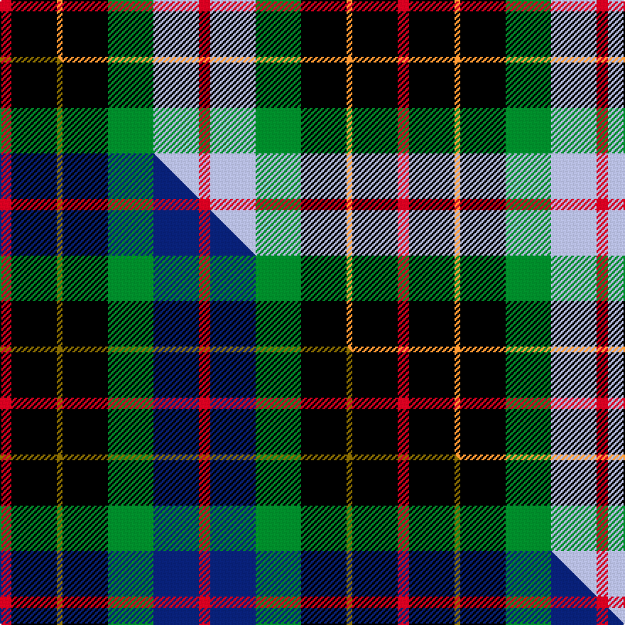

This is one **variant** — a specific cloth: this exact thread count and colourway, with its own
provenance below. It is one weaving of the [sett](/setts/r2k8lo1k8g8lb8r2/) (the scale-free proportion — the
same cloth at any scale or shade), whose colour order is pattern [RKYKGWR](/stripes/rkykgwr/).

Part of the [Brodie Hunting](/tartans/b/br/brodie-hunting-2/) tartan — the named design grouping this sett with its other cloths.

Sourced from tartans-authority.  It is a [7 stripe tartan](/stripes/stripes7/).

Original link [https://www.tartanregister.gov.uk/tartanDetails.aspx?ref=1334](https://www.tartanregister.gov.uk/tartanDetails.aspx?ref=1334)

Dataset <small>— provenance for this record, inherited from the source manifest</small>

<dl class="dataset-prov">
<dt>source</dt><dd><a href="/sources/tartans-authority/">Scottish Tartans Authority</a></dd>
<dt>data captured from</dt><dd><a href="https://github.com/thetartan/tartan-database/blob/master/data/tartans-authority/data.csv">https://github.com/thetartan/tartan-database/blob/master/data/tartans-authority/data.csv</a></dd>
<dt>data date</dt><dd>1880 <small>(this record)</small></dd>
<dt>licence</dt><dd><a href="https://creativecommons.org/licenses/by-nc-nd/4.0/">CC BY-NC-ND 4.0</a></dd>
</dl>

Capture chain <small>— the hands this data passed through, oldest first; each capture carries its own licence</small>

<ol class="capture-chain">
<li><a href="https://www.tartansauthority.com/">Scottish Tartans Authority</a> <small>the heritage body's archive — its tartan-ferret record browser is retired (links repaired to the SRT, above)</small></li>
<li><a href="https://github.com/thetartan/tartan-database">thetartan/tartan-database</a> <small>2016-2017</small> · <a href="https://creativecommons.org/licenses/by-nc-nd/4.0/">CC BY-NC-ND 4.0</a> <small>Levko Kravets's frozen compilation — the capture we vendored, and where its CC licence text came from</small></li>
<li>this dictionary <small>captured 2026-06-10 · commit 5bf86c7566</small> <small>each re-capture is a git commit to data/sources</small></li>
</ol>

## Register references

External register numbers recorded for this tartan.

- Scottish Tartans Authority (ITI): 1334

## Thread count
R/8 K32 LO4 K32 G32 LB32 R/8

One full sett is **280 threads**.

## Palette
<table><thead><tr><th>Colour</th><th>Shade</th><th>OKLCh</th></tr></thead><tbody><tr><td>LB</td><td><code style="background-color:#B5BBDE;">#B5BBDE</code> <small style="color:#888">#B5BBDE</small></td><td><small style="color:#888">oklch(79.9% 0.050 277.6)</small></td></tr><tr><td>LO</td><td><code style="background-color:#FF9C34;">#FF9C34</code> <small style="color:#888">#FF9C34</small></td><td><small style="color:#888">oklch(77.9% 0.161 61.8)</small></td></tr><tr><td>G</td><td><code style="background-color:#008B2A;">#008B2A</code> <small style="color:#888">#008B2A</small></td><td><small style="color:#888">oklch(55.4% 0.170 145.9)</small></td></tr><tr><td>K</td><td><code style="background-color:#000000;">#000000</code> <small style="color:#888">#000000</small></td><td><small style="color:#888">oklch(0.0% 0.000 0.0)</small></td></tr><tr><td>R</td><td><code style="background-color:#D60020;">#D60020</code> <small style="color:#888">#D60020</small></td><td><small style="color:#888">oklch(55.2% 0.224 25.5)</small></td></tr></tbody></table>

# Sample pattern

## Compared to the master

This cloth is one sett of its design; the master sett (the exemplar the design is anchored on) is below for comparison.

Its **ΔTartan distance** from the master is **0.42** — the same measure the nearest-tartans table ranks by (0 is identical; a re-scale of the same cloth is near 0, a recolour or a different proportion further).

<figure class="master-compare" style="margin:0">

this sett
master sett ★

<figcaption style="color:#888;font-size:smaller">One weave of this sett against the <a href="/setts/r2k8y1k8g8db8r2/">master sett ★</a>, split on the diagonal: a shared proportion runs seamlessly across it with only the shades shifting; a different proportion breaks on it.</figcaption>
</figure>

## Nearest tartan variants

The nearest existing variants by ΔTartan distance, with this cloth at the top so the swatches line up against it.

ΔTartan

Threads

Variant

Sett

—

280

<a href="/variants/s7/r2k8lo1k8g8lb8r2~x4/">Brodie Hunting (Clan)</a>

<a href="/ttd/edit/#slug=r2k8y1k8g8db8r2~x4&amp;base=r2k8lo1k8g8lb8r2~x4" title="compare in the TTD">0.42</a>

280

<a href="/variants/s7/r2k8y1k8g8db8r2~x4/">Brodie Hunting</a>

<a href="/ttd/edit/#slug=r2k8y1k8g8db8r2~x2&amp;base=r2k8lo1k8g8lb8r2~x4" title="compare in the TTD">0.42</a>

140

<a href="/variants/s7/r2k8y1k8g8db8r2~x2/">Brodie Hunting Clan Tartan</a>

<a href="/ttd/edit/#slug=r1g8k8r1k8lb8r1~x4&amp;base=r2k8lo1k8g8lb8r2~x4" title="compare in the TTD">1.50</a>

272

<a href="/variants/s7/r1g8k8r1k8lb8r1~x4/">Triad Highland Games Proposed</a>

<a href="/ttd/edit/#slug=r2k8y1k8g8db8k2w2~x2&amp;base=r2k8lo1k8g8lb8r2~x4" title="compare in the TTD">1.66</a>

148

<a href="/variants/s8/r2k8y1k8g8db8k2w2~x2/">Hislop Family Tartan</a>

<a href="/ttd/edit/#slug=r2db8g8k8y1g8r2&amp;base=r2k8lo1k8g8lb8r2~x4" title="compare in the TTD">1.67</a>

70

<a href="/variants/s7/r2db8g8k8y1g8r2/">Brodie Hunting</a>

<a href="/ttd/edit/#slug=w4k2lb18g18k18wi3k18r3~x2~w3600000-wi3703114&amp;base=r2k8lo1k8g8lb8r2~x4" title="compare in the TTD">1.79</a>

322

<a href="/variants/s8/w4k2lb18g18k18wi3k18r3~x2~w3600000-wi3703114/">Hislop (Name)</a>

<a href="/ttd/edit/#slug=k18db12k5g4r6g12k2ly4~x2&amp;base=r2k8lo1k8g8lb8r2~x4" title="compare in the TTD">2.02</a>

208

<a href="/variants/s8/k18db12k5g4r6g12k2ly4~x2/">MacLeish</a>

<a href="/ttd/edit/#slug=dp9k7g5r4g7k1y1~x2&amp;base=r2k8lo1k8g8lb8r2~x4" title="compare in the TTD">2.14</a>

116

<a href="/variants/s7/dp9k7g5r4g7k1y1~x2/">MacLaren #2</a>

<a href="/ttd/edit/#slug=r4n25k6w12k11y3~x2&amp;base=r2k8lo1k8g8lb8r2~x4" title="compare in the TTD">2.22</a>

230

<a href="/variants/s6/r4n25k6w12k11y3~x2/">Thomson Dress (Grey) (Fashion)</a>

<a href="/ttd/edit/#slug=g24k4g24k24lb7r24lb7~x2&amp;base=r2k8lo1k8g8lb8r2~x4" title="compare in the TTD">2.25</a>

394

<a href="/variants/s7/g24k4g24k24lb7r24lb7~x2/">Unidentified Pinafore</a>

## Neighbour map

Every grey dot is one of 13656 variants placed by the first two principal components of the ΔTartan feature space (42% of its variance). Red is this tartan; blue dots are its nearest — click one to open its page. The map is a flat projection of a many-dimensional space — [how to read it](/posts/neighbourhood-maps/).

<svg viewBox="0 0 640 380" role="img" style="max-width:100%;height:auto;border:1px solid #e0e0e0;border-radius:4px;display:block" xmlns="http://www.w3.org/2000/svg"><image href="/nn/cloud.v1.png" width="640" height="380"/><a href="/variants/s7/r2k8y1k8g8db8r2~x4/"><circle cx="126.1" cy="200.9" r="4" fill="#3465a4"><title>Brodie Hunting</title></circle></a><a href="/variants/s7/r2k8y1k8g8db8r2~x2/"><circle cx="126.1" cy="200.9" r="4" fill="#3465a4"><title>Brodie Hunting Clan Tartan</title></circle></a><a href="/variants/s7/r1g8k8r1k8lb8r1~x4/"><circle cx="148.7" cy="198.0" r="4" fill="#3465a4"><title>Triad Highland Games Proposed</title></circle></a><a href="/variants/s8/r2k8y1k8g8db8k2w2~x2/"><circle cx="115.1" cy="175.9" r="4" fill="#3465a4"><title>Hislop Family Tartan</title></circle></a><a href="/variants/s7/r2db8g8k8y1g8r2/"><circle cx="130.9" cy="208.6" r="4" fill="#3465a4"><title>Brodie Hunting</title></circle></a><a href="/variants/s8/w4k2lb18g18k18wi3k18r3~x2~w3600000-wi3703114/"><circle cx="109.1" cy="161.8" r="4" fill="#3465a4"><title>Hislop (Name)</title></circle></a><a href="/variants/s8/k18db12k5g4r6g12k2ly4~x2/"><circle cx="108.7" cy="186.7" r="4" fill="#3465a4"><title>MacLeish</title></circle></a><a href="/variants/s7/dp9k7g5r4g7k1y1~x2/"><circle cx="105.1" cy="203.1" r="4" fill="#3465a4"><title>MacLaren #2</title></circle></a><a href="/variants/s6/r4n25k6w12k11y3~x2/"><circle cx="124.8" cy="188.7" r="4" fill="#3465a4"><title>Thomson Dress (Grey) (Fashion)</title></circle></a><a href="/variants/s7/g24k4g24k24lb7r24lb7~x2/"><circle cx="121.7" cy="231.6" r="4" fill="#3465a4"><title>Unidentified Pinafore</title></circle></a><circle cx="108.5" cy="195.5" r="5" fill="#c00000"/><text x="320" y="376" text-anchor="middle" font-size="11" fill="#999">ground</text><text x="11" y="190" text-anchor="middle" font-size="11" fill="#999" transform="rotate(-90 11 190)">complexity</text></svg>

ID: /variants/s7/r2k8lo1k8g8lb8r2~x4/
