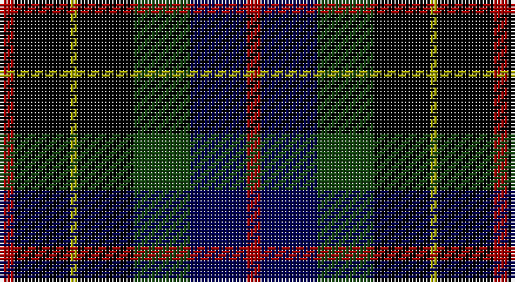

This page is one **sett** — a single exact thread-count. It belongs to the [tartan](/setts/r2k8ly1k8dg8db8r2/)
(the same proportion at any scale), whose colour order is pattern [RBGKYKR](/stripes/rbgkykr/).

Part of the [Brodie Hunting](/tartans/brodie-hunting/) tartan — the named design grouping this sett with its other cloths.

Sourced from weddslist.  It is a [7 stripe tartan](/stripes/stripes7/).

Original link http://www.weddslist.com/cgi-bin/tartans/pg.pl?source=tinsel

## Also known as

This cloth is also recorded under:

- Brodie hunting

2 attestations — the source records this cloth was collapsed from (oldest owns this page)

<ul>
<li>undated — Brodie Hunting (weddslist, <a href="http://www.weddslist.com/cgi-bin/tartans/pg.pl?source=tinsel">record</a>)</li>
<li>undated — Brodie Hunting (weddslist, <a href="http://www.weddslist.com/cgi-bin/tartans/pg.pl?source=x">record</a>)</li>
</ul>

## Thread count
DR/4 K16 LG2 K16 DG16 DB16 DR/4

One full sett is **140 threads**.

## Palette

Palette: <strong>Ingles Buchan</strong> <small style="color:#888">(1 of 5 colours)</small>
<table><thead><tr><th>Colour</th><th>Threads</th><th>Shade</th><th>Base</th><th>OKLCh</th></tr></thead><tbody><tr><td>DR/</td><td style="text-align:right;font-variant-numeric:tabular-nums">4</td><td><code style="background-color:#AA0000;">#AA0000</code> <small style="color:#888">#AA0000</small></td><td>R <code style="background-color:#CC0000;">#CC0000</code></td><td><small style="color:#888">oklch(46.3% 0.190 29.2)</small></td></tr><tr><td>K</td><td style="text-align:right;font-variant-numeric:tabular-nums">16</td><td><code style="background-color:#000000;">#000000</code> <small style="color:#888">#000000</small></td><td>K <code style="background-color:#000000;">#000000</code></td><td><small style="color:#888">oklch(0.0% 0.000 0.0)</small></td></tr><tr><td>LG</td><td style="text-align:right;font-variant-numeric:tabular-nums">2</td><td><code style="background-color:#AAAA00;">#AAAA00</code> <small style="color:#888">#AAAA00</small></td><td>Y <code style="background-color:#F2BF00;">#F2BF00</code></td><td><small style="color:#888">oklch(71.4% 0.156 109.8)</small></td></tr><tr><td>K</td><td style="text-align:right;font-variant-numeric:tabular-nums">16</td><td><code style="background-color:#000000;">#000000</code> <small style="color:#888">#000000</small></td><td>K <code style="background-color:#000000;">#000000</code></td><td><small style="color:#888">oklch(0.0% 0.000 0.0)</small></td></tr><tr><td>DG</td><td style="text-align:right;font-variant-numeric:tabular-nums">16</td><td><code style="background-color:#11450D;">#11450D</code> <small style="color:#888">#11450D</small></td><td>G <code style="background-color:#006100;">#006100</code></td><td><small style="color:#888">oklch(34.4% 0.101 142.1)</small></td></tr><tr><td>DB</td><td style="text-align:right;font-variant-numeric:tabular-nums">16</td><td><code style="background-color:#000052;">#000052</code> <small style="color:#888">#000052</small></td><td>B <code style="background-color:#2A418A;">#2A418A</code></td><td><small style="color:#888">oklch(19.8% 0.137 264.1)</small></td></tr><tr><td>DR/</td><td style="text-align:right;font-variant-numeric:tabular-nums">4</td><td><code style="background-color:#AA0000;">#AA0000</code> <small style="color:#888">#AA0000</small></td><td>R <code style="background-color:#CC0000;">#CC0000</code></td><td><small style="color:#888">oklch(46.3% 0.190 29.2)</small></td></tr></tbody></table>

# Sample pattern

## Compared to the master

This cloth is one sett of its design; the master sett (the exemplar the design is anchored on) is below for comparison.

<figure style="margin:0"><figcaption style="color:#888;font-size:smaller">this sett</figcaption></figure>
<figure style="margin:0"><figcaption style="color:#888;font-size:smaller"><a href="/setts/r2k8lo1k8g8t8r2/">master sett →</a></figcaption></figure>

## Nearest tartans

The nearest existing variants by ΔTartan distance, with this tartan at the top so the swatches line up against it.

ΔTartan

Tartan

Sett

—

<a href="/ttd/edit/#slug=r2k8ly1k8dg8db8r2~x2">Brodie Hunting</a> <a class="nn-out" href="/variants/s7/r2k8ly1k8dg8db8r2~x2/" title="open its dictionary page">↗</a>

0.80

<a href="/ttd/edit/#slug=k4lr1dg10k10db10r2~x2&amp;base=r2k8ly1k8dg8db8r2~x2">Rose Hunting</a> <a class="nn-out" href="/variants/s6/k4lr1dg10k10db10r2~x2/" title="open its dictionary page">↗</a>

0.80

<a href="/ttd/edit/#slug=k4lr1dg10k10db10r2&amp;base=r2k8ly1k8dg8db8r2~x2">Rose Hunting</a> <a class="nn-out" href="/variants/s6/k4lr1dg10k10db10r2/" title="open its dictionary page">↗</a>

0.98

<a href="/ttd/edit/#slug=dg4lb1dg10k10db10r2&amp;base=r2k8ly1k8dg8db8r2~x2">Rose Hunting</a> <a class="nn-out" href="/variants/s6/dg4lb1dg10k10db10r2/" title="open its dictionary page">↗</a>

1.02

<a href="/ttd/edit/#slug=r2dg8ly1k8dg8db8r2&amp;base=r2k8ly1k8dg8db8r2~x2">Brodie Hunting</a> <a class="nn-out" href="/variants/s7/r2dg8ly1k8dg8db8r2/" title="open its dictionary page">↗</a>

1.15

<a href="/ttd/edit/#slug=r2k8ly1k8g8db8r2~x2&amp;base=r2k8ly1k8dg8db8r2~x2">Brodie hunting</a> <a class="nn-out" href="/variants/s7/r2k8ly1k8g8db8r2~x2/" title="open its dictionary page">↗</a>

1.16

<a href="/ttd/edit/#slug=r2db8k8lr1dg8k1~x2&amp;base=r2k8ly1k8dg8db8r2~x2">Leslie Hunting</a> <a class="nn-out" href="/variants/s6/r2db8k8lr1dg8k1~x2/" title="open its dictionary page">↗</a>

1.16

<a href="/ttd/edit/#slug=r2db8k8lr1dg8k1&amp;base=r2k8ly1k8dg8db8r2~x2">Leslie Hunting</a> <a class="nn-out" href="/variants/s6/r2db8k8lr1dg8k1/" title="open its dictionary page">↗</a>

1.20

<a href="/ttd/edit/#slug=db6k1db6k8r1dg8r2&amp;base=r2k8ly1k8dg8db8r2~x2">Fletcher C</a> <a class="nn-out" href="/variants/s7/db6k1db6k8r1dg8r2/" title="open its dictionary page">↗</a>

1.20

<a href="/ttd/edit/#slug=db28r4k14r4dg33ly4~x2&amp;base=r2k8ly1k8dg8db8r2~x2">Royal College of Physicians of Edinburgh</a> <a class="nn-out" href="/variants/s6/db28r4k14r4dg33ly4~x2/" title="open its dictionary page">↗</a>

1.21

<a href="/ttd/edit/#slug=r2k1db8k8dg8k1b2~x2&amp;base=r2k8ly1k8dg8db8r2~x2">Campbell of Cawdor</a> <a class="nn-out" href="/variants/s7/r2k1db8k8dg8k1b2~x2/" title="open its dictionary page">↗</a>

## Neighbour map

Every grey dot is one of 14360 variants placed by the first two principal components of the ΔTartan feature space (44% of its variance). Red is this tartan; blue dots are its nearest — click one to open its page.

<svg viewBox="0 0 640 380" role="img" style="max-width:100%;height:auto;border:1px solid #e0e0e0;border-radius:4px;display:block" xmlns="http://www.w3.org/2000/svg"><image href="/nn/cloud.v1.png" width="640" height="380"/><a href="/variants/s6/k4lr1dg10k10db10r2~x2/"><circle cx="169.4" cy="232.1" r="4" fill="#3465a4"><title>Rose Hunting</title></circle></a><a href="/variants/s6/k4lr1dg10k10db10r2/"><circle cx="169.4" cy="232.1" r="4" fill="#3465a4"><title>Rose Hunting</title></circle></a><a href="/variants/s6/dg4lb1dg10k10db10r2/"><circle cx="157.2" cy="225.7" r="4" fill="#3465a4"><title>Rose Hunting</title></circle></a><a href="/variants/s7/r2dg8ly1k8dg8db8r2/"><circle cx="153.9" cy="225.4" r="4" fill="#3465a4"><title>Brodie Hunting</title></circle></a><a href="/variants/s7/r2k8ly1k8g8db8r2~x2/"><circle cx="138.2" cy="215.1" r="4" fill="#3465a4"><title>Brodie hunting</title></circle></a><a href="/variants/s6/r2db8k8lr1dg8k1~x2/"><circle cx="139.3" cy="227.9" r="4" fill="#3465a4"><title>Leslie Hunting</title></circle></a><a href="/variants/s6/r2db8k8lr1dg8k1/"><circle cx="139.3" cy="227.9" r="4" fill="#3465a4"><title>Leslie Hunting</title></circle></a><a href="/variants/s7/db6k1db6k8r1dg8r2/"><circle cx="168.3" cy="244.5" r="4" fill="#3465a4"><title>Fletcher C</title></circle></a><a href="/variants/s6/db28r4k14r4dg33ly4~x2/"><circle cx="169.2" cy="214.4" r="4" fill="#3465a4"><title>Royal College of Physicians of Edinburgh</title></circle></a><a href="/variants/s7/r2k1db8k8dg8k1b2~x2/"><circle cx="144.1" cy="220.4" r="4" fill="#3465a4"><title>Campbell of Cawdor</title></circle></a><circle cx="165.5" cy="232.4" r="5" fill="#c00000"/></svg>

ID: /variants/s7/r2k8ly1k8dg8db8r2~x2/
