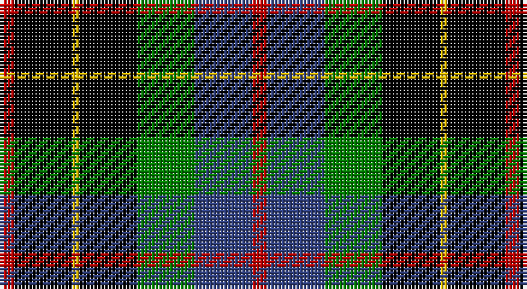

This page is one **sett** — a single exact thread-count. It belongs to the [tartan](/setts/r2k8ly1k8g8db8r2/)
(the same proportion at any scale), whose colour order is pattern [RBGKYKR](/stripes/rbgkykr/).

Sourced from weddslist.  It is a [7 stripe tartan](/stripes/stripes7/).

Original link http://www.weddslist.com/cgi-bin/tartans/pg.pl?source=sts

## Provenance

Earliest known date: 1891 The Hunting Brodie first appears in Whyte's first edition of 1891, published by W. and A.K. Johnston, at which time it seems to have been a recent design. D.W. Stewart remarks in his book, 'Old And Rare..'(1893), "of late a green tartan has been sold as undress or hunting Brodie..."

2 attestations — the source records this cloth was collapsed from (oldest owns this page)

<ul>
<li>undated — Brodie hunting (weddslist, <a href="http://www.weddslist.com/cgi-bin/tartans/pg.pl?source=sts">record</a>)</li>
<li>undated — Brodie Hunting Clan Tartan (house-of-tartan, <a href="http://www.house-of-tartan.scotland.net/house/TartanViewjs.asp?colr=Def&tnam=1334">record</a>)</li>
</ul>

## Thread count
R/4 K16 Y2 K16 G16 B16 R/4

One full sett is **140 threads**.

## Palette

Palette: <strong>Ingles Buchan</strong> <small style="color:#888">(1 of 5 colours)</small>
<table><thead><tr><th>Colour</th><th>Threads</th><th>Shade</th><th>Base</th><th>OKLCh</th></tr></thead><tbody><tr><td>R/</td><td style="text-align:right;font-variant-numeric:tabular-nums">4</td><td><code style="background-color:#C00000;">#C00000</code> <small style="color:#888">#C00000</small></td><td>R <code style="background-color:#CC0000;">#CC0000</code></td><td><small style="color:#888">oklch(50.7% 0.208 29.2)</small></td></tr><tr><td>K</td><td style="text-align:right;font-variant-numeric:tabular-nums">16</td><td><code style="background-color:#000000;">#000000</code> <small style="color:#888">#000000</small></td><td>K <code style="background-color:#000000;">#000000</code></td><td><small style="color:#888">oklch(0.0% 0.000 0.0)</small></td></tr><tr><td>Y</td><td style="text-align:right;font-variant-numeric:tabular-nums">2</td><td><code style="background-color:#F0C000;">#F0C000</code> <small style="color:#888">#F0C000</small></td><td>Y <code style="background-color:#F2BF00;">#F2BF00</code></td><td><small style="color:#888">oklch(82.7% 0.169 90.5)</small></td></tr><tr><td>K</td><td style="text-align:right;font-variant-numeric:tabular-nums">16</td><td><code style="background-color:#000000;">#000000</code> <small style="color:#888">#000000</small></td><td>K <code style="background-color:#000000;">#000000</code></td><td><small style="color:#888">oklch(0.0% 0.000 0.0)</small></td></tr><tr><td>G</td><td style="text-align:right;font-variant-numeric:tabular-nums">16</td><td><code style="background-color:#008000;">#008000</code> <small style="color:#888">#008000</small></td><td>G <code style="background-color:#006100;">#006100</code></td><td><small style="color:#888">oklch(52.0% 0.177 142.5)</small></td></tr><tr><td>B</td><td style="text-align:right;font-variant-numeric:tabular-nums">16</td><td><code style="background-color:#304080;">#304080</code> <small style="color:#888">#304080</small></td><td>B <code style="background-color:#2A418A;">#2A418A</code></td><td><small style="color:#888">oklch(39.4% 0.109 270.2)</small></td></tr><tr><td>R/</td><td style="text-align:right;font-variant-numeric:tabular-nums">4</td><td><code style="background-color:#C00000;">#C00000</code> <small style="color:#888">#C00000</small></td><td>R <code style="background-color:#CC0000;">#CC0000</code></td><td><small style="color:#888">oklch(50.7% 0.208 29.2)</small></td></tr></tbody></table>

# Sample pattern

## Nearest tartans

The nearest existing variants by ΔTartan distance, with this tartan at the top so the swatches line up against it.

ΔTartan

Tartan

Sett

—

<a href="/ttd/edit/#slug=r2k8ly1k8g8db8r2~x2">Brodie hunting</a> <a class="nn-out" href="/variants/s7/r2k8ly1k8g8db8r2~x2/" title="open its dictionary page">↗</a>

0.68

<a href="/ttd/edit/#slug=r2dg8ly1k8dg8db8r2&amp;base=r2k8ly1k8g8db8r2~x2">Brodie Hunting</a> <a class="nn-out" href="/variants/s7/r2dg8ly1k8dg8db8r2/" title="open its dictionary page">↗</a>

0.69

<a href="/variants/s7/w8r4ki8kii20k6kii3k5~x2/">BlackRock (Asymmetrical)</a>

0.84

<a href="/ttd/edit/#slug=db25k12ly4k9r6k9ly4k12g25~x2&amp;base=r2k8ly1k8g8db8r2~x2">Vosko</a> <a class="nn-out" href="/variants/s9/db25k12ly4k9r6k9ly4k12g25~x2/" title="open its dictionary page">↗</a>

1.01

<a href="/ttd/edit/#slug=db10r7db31k25g23k8db7k8ly5~x2&amp;base=r2k8ly1k8g8db8r2~x2">MacCallum, of Berwick</a> <a class="nn-out" href="/variants/s9/db10r7db31k25g23k8db7k8ly5~x2/" title="open its dictionary page">↗</a>

1.01

<a href="/ttd/edit/#slug=k6g6w1g6k6p6gi1~x4&amp;base=r2k8ly1k8g8db8r2~x2">Wilson's, No 233</a> <a class="nn-out" href="/variants/s7/k6g6w1g6k6p6gi1~x4/" title="open its dictionary page">↗</a>

1.05

<a href="/ttd/edit/#slug=k12g12w2g12k12p12r3~x2&amp;base=r2k8ly1k8g8db8r2~x2">Wilson's, No 120</a> <a class="nn-out" href="/variants/s7/k12g12w2g12k12p12r3~x2/" title="open its dictionary page">↗</a>

1.06

<a href="/ttd/edit/#slug=r2k8ly1k8g8db8k2w2~x2&amp;base=r2k8ly1k8g8db8r2~x2">Hislop hunting</a> <a class="nn-out" href="/variants/s8/r2k8ly1k8g8db8k2w2~x2/" title="open its dictionary page">↗</a>

1.08

<a href="/ttd/edit/#slug=k7g7k1g7k7t1p7k1~x4&amp;base=r2k8ly1k8g8db8r2~x2">Wilson's, No 108</a> <a class="nn-out" href="/variants/s8/k7g7k1g7k7t1p7k1~x4/" title="open its dictionary page">↗</a>

1.09

<a href="/ttd/edit/#slug=r5g18ly2k14t5k4~x2&amp;base=r2k8ly1k8g8db8r2~x2">Dahlonega (District)</a> <a class="nn-out" href="/variants/s6/r5g18ly2k14t5k4~x2/" title="open its dictionary page">↗</a>

1.11

<a href="/ttd/edit/#slug=k2ly1g6k6db6w1~x4&amp;base=r2k8ly1k8g8db8r2~x2">Dyce</a> <a class="nn-out" href="/variants/s6/k2ly1g6k6db6w1~x4/" title="open its dictionary page">↗</a>

## Neighbour map

Every grey dot is one of 14360 variants placed by the first two principal components of the ΔTartan feature space (44% of its variance). Red is this tartan; blue dots are its nearest — click one to open its page.

<svg viewBox="0 0 640 380" role="img" style="max-width:100%;height:auto;border:1px solid #e0e0e0;border-radius:4px;display:block" xmlns="http://www.w3.org/2000/svg"><image href="/nn/cloud.v1.png" width="640" height="380"/><a href="/variants/s7/r2dg8ly1k8dg8db8r2/"><circle cx="153.9" cy="225.4" r="4" fill="#3465a4"><title>Brodie Hunting</title></circle></a><a href="/variants/s7/w8r4ki8kii20k6kii3k5~x2/"><circle cx="132.0" cy="211.0" r="4" fill="#3465a4"><title>BlackRock (Asymmetrical)</title></circle></a><a href="/variants/s9/db25k12ly4k9r6k9ly4k12g25~x2/"><circle cx="105.4" cy="205.1" r="4" fill="#3465a4"><title>Vosko</title></circle></a><a href="/variants/s9/db10r7db31k25g23k8db7k8ly5~x2/"><circle cx="120.0" cy="207.7" r="4" fill="#3465a4"><title>MacCallum, of Berwick</title></circle></a><a href="/variants/s7/k6g6w1g6k6p6gi1~x4/"><circle cx="99.4" cy="234.8" r="4" fill="#3465a4"><title>Wilson's, No 233</title></circle></a><a href="/variants/s7/k12g12w2g12k12p12r3~x2/"><circle cx="92.6" cy="237.1" r="4" fill="#3465a4"><title>Wilson's, No 120</title></circle></a><a href="/variants/s8/r2k8ly1k8g8db8k2w2~x2/"><circle cx="131.7" cy="191.3" r="4" fill="#3465a4"><title>Hislop hunting</title></circle></a><a href="/variants/s8/k7g7k1g7k7t1p7k1~x4/"><circle cx="163.6" cy="229.8" r="4" fill="#3465a4"><title>Wilson's, No 108</title></circle></a><a href="/variants/s6/r5g18ly2k14t5k4~x2/"><circle cx="140.2" cy="202.0" r="4" fill="#3465a4"><title>Dahlonega (District)</title></circle></a><a href="/variants/s6/k2ly1g6k6db6w1~x4/"><circle cx="100.7" cy="224.7" r="4" fill="#3465a4"><title>Dyce</title></circle></a><circle cx="138.2" cy="215.1" r="5" fill="#c00000"/></svg>

ID: /variants/s7/r2k8ly1k8g8db8r2~x2/
