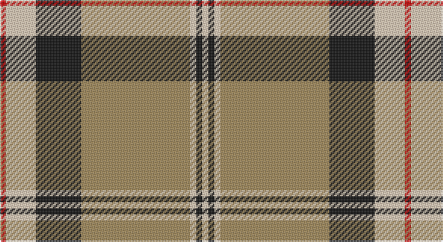

This page is one **sett** — a single exact thread-count. It belongs to the [tartan](/setts/r2lb10k15lo36lb2k2lb2/)
(the same proportion at any scale), whose colour order is pattern [RWKYWKW](/stripes/rwkywkw/).

Part of the [Unidentified](/tartans/unidentified/) tartan — the named design grouping this sett with its other cloths.

Sourced from tartans-authority.  It is a [7 stripe tartan](/stripes/stripes7/).

Original link http://www.tartansauthority.com/tartan-ferret/display/8885/

## Also known as

This cloth is also recorded under:

- Unidentified #10
- Unidentified #12
- Unidentified #14
- Unidentified #15
- Unidentified #16
- Unidentified #18
- Unidentified #2
- Unidentified #21
- Unidentified #22
- Unidentified #24
- Unidentified #25
- Unidentified #28
- Unidentified #29
- Unidentified #30
- Unidentified #31
- Unidentified #32
- Unidentified #36
- Unidentified #37
- Unidentified #38
- Unidentified #40
- Unidentified #43
- Unidentified #44
- Unidentified #45
- Unidentified #46
- Unidentified #47
- Unidentified #48
- Unidentified #49
- Unidentified #5
- Unidentified #50
- Unidentified #51
- Unidentified #52
- Unidentified #53
- Unidentified #54
- Unidentified #55
- Unidentified #56
- Unidentified #57
- Unidentified #58
- Unidentified #59
- Unidentified #60
- Unidentified #61
- Unidentified #62
- Unidentified #63
- Unidentified #64
- Unidentified #65
- Unidentified #66
- Unidentified #7
- Unidentified #8
- Unidentified #9
- Unidentified 16
- Unidentified Artifact
- Unidentified Plaid
- Unidentified Plaid #11
- Unidentified Plaid #13
- Unidentified Plaid #2
- Unidentified Plaid #3
- Unidentified Plaid #7
- Unidentified Plaid #8
- Unidentified Plaid #9
- Unidentified Portrait

## Register references

External register numbers recorded for this tartan.

- Scottish Register of Tartans: [8885](https://www.tartanregister.gov.uk/tartanDetails?ref=8885)
- Scottish Tartans Authority (ITI): 8885

## Thread count
R/4 LR20 K30 LT72 LR4 K4 LR/4

One full sett is **268 threads**.

## Palette

Palette: <strong>Tartan Register</strong>
<table><thead><tr><th>Colour</th><th>Threads</th><th>Shade</th><th>Base</th><th>OKLCh</th></tr></thead><tbody><tr><td>R/</td><td style="text-align:right;font-variant-numeric:tabular-nums">4</td><td><code style="background-color:#C80000;">#C80000</code> <small style="color:#888">#C80000</small></td><td>R <code style="background-color:#CC0000;">#CC0000</code></td><td><small style="color:#888">oklch(52.3% 0.215 29.2)</small></td></tr><tr><td>LR</td><td style="text-align:right;font-variant-numeric:tabular-nums">20</td><td><code style="background-color:#E8CCB8;">#E8CCB8</code> <small style="color:#888">#E8CCB8</small></td><td>W <code style="background-color:#F7F7F7;">#F7F7F7</code></td><td><small style="color:#888">oklch(86.3% 0.042 57.7)</small></td></tr><tr><td>K</td><td style="text-align:right;font-variant-numeric:tabular-nums">30</td><td><code style="background-color:#101010;">#101010</code> <small style="color:#888">#101010</small></td><td>K <code style="background-color:#000000;">#000000</code></td><td><small style="color:#888">oklch(17.3% 0.000 89.9)</small></td></tr><tr><td>LT</td><td style="text-align:right;font-variant-numeric:tabular-nums">72</td><td><code style="background-color:#A08858;">#A08858</code> <small style="color:#888">#A08858</small></td><td>Y <code style="background-color:#F2BF00;">#F2BF00</code></td><td><small style="color:#888">oklch(63.7% 0.071 84.0)</small></td></tr><tr><td>LR</td><td style="text-align:right;font-variant-numeric:tabular-nums">4</td><td><code style="background-color:#E8CCB8;">#E8CCB8</code> <small style="color:#888">#E8CCB8</small></td><td>W <code style="background-color:#F7F7F7;">#F7F7F7</code></td><td><small style="color:#888">oklch(86.3% 0.042 57.7)</small></td></tr><tr><td>K</td><td style="text-align:right;font-variant-numeric:tabular-nums">4</td><td><code style="background-color:#101010;">#101010</code> <small style="color:#888">#101010</small></td><td>K <code style="background-color:#000000;">#000000</code></td><td><small style="color:#888">oklch(17.3% 0.000 89.9)</small></td></tr><tr><td>LR/</td><td style="text-align:right;font-variant-numeric:tabular-nums">4</td><td><code style="background-color:#E8CCB8;">#E8CCB8</code> <small style="color:#888">#E8CCB8</small></td><td>W <code style="background-color:#F7F7F7;">#F7F7F7</code></td><td><small style="color:#888">oklch(86.3% 0.042 57.7)</small></td></tr></tbody></table>

# Sample pattern

## Compared to the master

This cloth is one sett of its design; the master sett (the exemplar the design is anchored on) is below for comparison.

<figure style="margin:0"><figcaption style="color:#888;font-size:smaller">this sett</figcaption></figure>
<figure style="margin:0"><figcaption style="color:#888;font-size:smaller"><a href="/setts/dp4r3dp26r26dg26r4/">master sett →</a></figcaption></figure>

## Nearest tartans

The nearest existing variants by ΔTartan distance, with this tartan at the top so the swatches line up against it.

ΔTartan

Tartan

Sett

—

<a href="/ttd/edit/#slug=r2lb10k15lo36lb2k2lb2~x2">Unidentified (ex Tony Murray)</a> <a class="nn-out" href="/variants/s7/r2lb10k15lo36lb2k2lb2~x2/" title="open its dictionary page">↗</a>

0.43

<a href="/ttd/edit/#slug=r1lb5k8o18lb1k1lb1~x4&amp;base=r2lb10k15lo36lb2k2lb2~x2">Merrick, Camel</a> <a class="nn-out" href="/variants/s7/r1lb5k8o18lb1k1lb1~x4/" title="open its dictionary page">↗</a>

1.08

<a href="/ttd/edit/#slug=ly5db9r3db5ly2db4ly26t3r4~x2&amp;base=r2lb10k15lo36lb2k2lb2~x2">Bracken</a> <a class="nn-out" href="/variants/s9/ly5db9r3db5ly2db4ly26t3r4~x2/" title="open its dictionary page">↗</a>

1.09

<a href="/ttd/edit/#slug=t1r1lo1k15lo15r1t1lo1~x4&amp;base=r2lb10k15lo36lb2k2lb2~x2">Pittsburgh St Andrew's Society</a> <a class="nn-out" href="/variants/s8/t1r1lo1k15lo15r1t1lo1~x4/" title="open its dictionary page">↗</a>

1.12

<a href="/ttd/edit/#slug=r4k2lb10k10y28k3~x2&amp;base=r2lb10k15lo36lb2k2lb2~x2">Thomson Camel (Jedburgh Mill)</a> <a class="nn-out" href="/variants/s6/r4k2lb10k10y28k3~x2/" title="open its dictionary page">↗</a>

1.13

<a href="/ttd/edit/#slug=g18w3ly1r2ly1r3ly1r10~x4&amp;base=r2lb10k15lo36lb2k2lb2~x2">Brisbane (Artefact)</a> <a class="nn-out" href="/variants/s8/g18w3ly1r2ly1r3ly1r10~x4/" title="open its dictionary page">↗</a>

1.18

<a href="/ttd/edit/#slug=do2w2k6do3k2o14k1o1~x4&amp;base=r2lb10k15lo36lb2k2lb2~x2">Braemar or Blair Atholl</a> <a class="nn-out" href="/variants/s8/do2w2k6do3k2o14k1o1~x4/" title="open its dictionary page">↗</a>

1.19

<a href="/ttd/edit/#slug=lb3k3lb3k3o15r1~x4&amp;base=r2lb10k15lo36lb2k2lb2~x2">Tiree Grey</a> <a class="nn-out" href="/variants/s6/lb3k3lb3k3o15r1~x4/" title="open its dictionary page">↗</a>

1.19

<a href="/ttd/edit/#slug=ly20db27r6db15ly8db11ly78dbi10r12&amp;base=r2lb10k15lo36lb2k2lb2~x2">Braken Tartan</a> <a class="nn-out" href="/variants/s9/ly20db27r6db15ly8db11ly78dbi10r12/" title="open its dictionary page">↗</a>

1.20

<a href="/ttd/edit/#slug=k9lr4k2lr4k2lr29k9lr4lg14ly2~x2&amp;base=r2lb10k15lo36lb2k2lb2~x2">Hannay Dress (Dance)</a> <a class="nn-out" href="/variants/s10/k9lr4k2lr4k2lr29k9lr4lg14ly2~x2/" title="open its dictionary page">↗</a>

1.21

<a href="/ttd/edit/#slug=ly20dbi27r6dbi15ly8dbi11ly78db10r12&amp;base=r2lb10k15lo36lb2k2lb2~x2">Bracken</a> <a class="nn-out" href="/variants/s9/ly20dbi27r6dbi15ly8dbi11ly78db10r12/" title="open its dictionary page">↗</a>

## Neighbour map

Every grey dot is one of 14360 variants placed by the first two principal components of the ΔTartan feature space (44% of its variance). Red is this tartan; blue dots are its nearest — click one to open its page.

<svg viewBox="0 0 640 380" role="img" style="max-width:100%;height:auto;border:1px solid #e0e0e0;border-radius:4px;display:block" xmlns="http://www.w3.org/2000/svg"><image href="/nn/cloud.v1.png" width="640" height="380"/><a href="/variants/s7/r1lb5k8o18lb1k1lb1~x4/"><circle cx="294.4" cy="143.3" r="4" fill="#3465a4"><title>Merrick, Camel</title></circle></a><a href="/variants/s9/ly5db9r3db5ly2db4ly26t3r4~x2/"><circle cx="268.8" cy="140.0" r="4" fill="#3465a4"><title>Bracken</title></circle></a><a href="/variants/s8/t1r1lo1k15lo15r1t1lo1~x4/"><circle cx="283.0" cy="129.6" r="4" fill="#3465a4"><title>Pittsburgh St Andrew's Society</title></circle></a><a href="/variants/s6/r4k2lb10k10y28k3~x2/"><circle cx="260.4" cy="177.6" r="4" fill="#3465a4"><title>Thomson Camel (Jedburgh Mill)</title></circle></a><a href="/variants/s8/g18w3ly1r2ly1r3ly1r10~x4/"><circle cx="281.7" cy="138.5" r="4" fill="#3465a4"><title>Brisbane (Artefact)</title></circle></a><a href="/variants/s8/do2w2k6do3k2o14k1o1~x4/"><circle cx="255.7" cy="155.3" r="4" fill="#3465a4"><title>Braemar or Blair Atholl</title></circle></a><a href="/variants/s6/lb3k3lb3k3o15r1~x4/"><circle cx="290.6" cy="171.5" r="4" fill="#3465a4"><title>Tiree Grey</title></circle></a><a href="/variants/s9/ly20db27r6db15ly8db11ly78dbi10r12/"><circle cx="280.6" cy="141.8" r="4" fill="#3465a4"><title>Braken Tartan</title></circle></a><a href="/variants/s10/k9lr4k2lr4k2lr29k9lr4lg14ly2~x2/"><circle cx="267.0" cy="139.7" r="4" fill="#3465a4"><title>Hannay Dress (Dance)</title></circle></a><a href="/variants/s9/ly20dbi27r6dbi15ly8dbi11ly78db10r12/"><circle cx="273.8" cy="140.5" r="4" fill="#3465a4"><title>Bracken</title></circle></a><circle cx="291.2" cy="138.2" r="5" fill="#c00000"/></svg>

ID: /variants/s7/r2lb10k15lo36lb2k2lb2~x2/
