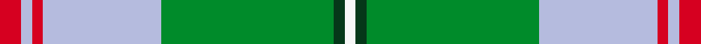

This page is one **sett** — a single exact thread-count. It belongs to the [tartan](/setts/r2lb1r1lb11g16dg1w1/)
(the same proportion at any scale), whose colour order is pattern [RWRWGGW](/stripes/rwrwggw/).

Sourced from register-of-tartans.  It is a [7 stripe tartan](/stripes/stripes7/).

Original link https://www.tartanregister.gov.uk/tartanDetails.aspx?ref=10354

2 attestations — the source records this cloth was collapsed from (oldest owns this page)

<ul>
<li>07/07/2009 — Gift of Life Michigan (register-of-tartans, <a href="https://www.tartanregister.gov.uk/tartanDetails.aspx?ref=10354">record</a>)  <em>Designed and woven for Gift of Life Michigan, an organ donor registry. The blue and green are taken from the 'donate life' logo which represents the earth meeting the sky (the heavens and the earth), showing the importance of those who have given the gift of life to those on earth. The red represents the heart, both the physical heart and the heart placed on the drivers license to show that one is a donor. The dark green and white represent the Gift of Life Michigan. Proceeds from the use/production of this tartan will benefit Gift of Life Michigan. Copyright holder: Nicole McCowan</em></li>
<li>9th July 2009 — Gift of Life Michigan (Corporate) (tartans-authority, <a href="http://www.tartansauthority.com/tartan-ferret/display/10354/">record</a>)  <em>Designed and woven for Gift of Life Michigan, an organ donor registry. The tartan uses the colours of the Gift of Life Michigan logo.</em></li>
</ul>

## Register references

External register numbers recorded for this tartan.

- Scottish Register of Tartans: [10354](https://www.tartanregister.gov.uk/tartanDetails?ref=10354)
- Scottish Tartans Authority (ITI): 10354

## Thread count
R/4 LB2 R2 LB22 G32 DG2 W/2

One full sett is **126 threads**.

## Palette
<table><thead><tr><th>Colour</th><th>Shade</th><th>OKLCh</th></tr></thead><tbody><tr><td>G</td><td><code style="background-color:#053819;">#053819</code> <small style="color:#888">#053819</small></td><td><small style="color:#888">oklch(30.0% 0.075 151.3)</small></td></tr><tr><td>LB</td><td><code style="background-color:#B5BBDE;">#B5BBDE</code> <small style="color:#888">#B5BBDE</small></td><td><small style="color:#888">oklch(79.9% 0.050 277.6)</small></td></tr><tr><td>LG</td><td><code style="background-color:#008B2A;">#008B2A</code> <small style="color:#888">#008B2A</small></td><td><small style="color:#888">oklch(55.4% 0.170 145.9)</small></td></tr><tr><td>R</td><td><code style="background-color:#D60020;">#D60020</code> <small style="color:#888">#D60020</small></td><td><small style="color:#888">oklch(55.2% 0.224 25.5)</small></td></tr><tr><td>W</td><td><code style="background-color:#F7F7F7;">#F7F7F7</code> <small style="color:#888">#F7F7F7</small></td><td><small style="color:#888">oklch(97.6% 0.000 89.9)</small></td></tr></tbody></table>

# Sample pattern

## Nearest variants

The nearest existing variants by ΔTartan distance, with this cloth at the top so the swatches line up against it.

ΔTartan

Threads

Variant

Sett

—

126

<a href="/variants/s7/r2lb1r1lb11g16dg1w1~x2/">Gift of Life Michigan</a>

<a href="/ttd/edit/#slug=r1g9lb9k1lb1w1~x6&amp;base=r2lb1r1lb11g16dg1w1~x2" title="compare in the TTD">2.64</a>

252

<a href="/variants/s6/r1g9lb9k1lb1w1~x6/">Irving of Glentulchan (Personal)</a>

<a href="/ttd/edit/#slug=g3r1g12w4lb15ly1lb3~x4&amp;base=r2lb1r1lb11g16dg1w1~x2" title="compare in the TTD">2.89</a>

288

<a href="/variants/s7/g3r1g12w4lb15ly1lb3~x4/">Postcode Lottery</a>

<a href="/ttd/edit/#slug=ly30g3t2lb2t30lo4~x2~t2405244-lb3203246&amp;base=r2lb1r1lb11g16dg1w1~x2" title="compare in the TTD">2.91</a>

216

<a href="/variants/s6/ly30g3t2lb2t30lo4~x2~t2405244-lb3203246/">South Aiken Presby Church (Corporate</a>

## Neighbour map

Every grey dot is one of 13620 variants placed by the first two principal components of the ΔTartan feature space (42% of its variance). Red is this tartan; blue dots are its nearest — click one to open its page.

<svg viewBox="0 0 640 380" role="img" style="max-width:100%;height:auto;border:1px solid #e0e0e0;border-radius:4px;display:block" xmlns="http://www.w3.org/2000/svg"><image href="/nn/cloud.v1.png" width="640" height="380"/><a href="/variants/s6/r1g9lb9k1lb1w1~x6/"><circle cx="234.5" cy="187.8" r="4" fill="#3465a4"><title>Irving of Glentulchan (Personal)</title></circle></a><a href="/variants/s7/g3r1g12w4lb15ly1lb3~x4/"><circle cx="286.7" cy="190.5" r="4" fill="#3465a4"><title>Postcode Lottery</title></circle></a><a href="/variants/s6/ly30g3t2lb2t30lo4~x2~t2405244-lb3203246/"><circle cx="340.5" cy="204.8" r="4" fill="#3465a4"><title>South Aiken Presby Church (Corporate</title></circle></a><circle cx="309.9" cy="169.2" r="5" fill="#c00000"/><text x="320" y="376" text-anchor="middle" font-size="11" fill="#999">ground</text><text x="11" y="190" text-anchor="middle" font-size="11" fill="#999" transform="rotate(-90 11 190)">complexity</text></svg>

ID: /variants/s7/r2lb1r1lb11g16dg1w1~x2/
