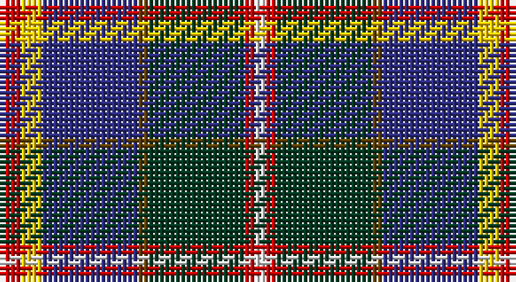

This page is one **sett** — a single exact thread-count. It belongs to the [tartan](/setts/r2ly2db9dy1dg9r1w1/)
(the same proportion at any scale), whose colour order is pattern [RYBGGRW](/stripes/rybggrw/).

Part of the [Unidentified](/tartans/unidentified/) tartan — the named design grouping this sett with its other cloths.

Sourced from tartans-authority.  It is a [7 stripe tartan](/stripes/stripes7/).

Original link http://www.tartansauthority.com/tartan-ferret/display/8867/

## Also known as

This cloth is also recorded under:

- Unidentified #10
- Unidentified #12
- Unidentified #14
- Unidentified #15
- Unidentified #16
- Unidentified #18
- Unidentified #2
- Unidentified #21
- Unidentified #22
- Unidentified #24
- Unidentified #25
- Unidentified #28
- Unidentified #29
- Unidentified #30
- Unidentified #31
- Unidentified #32
- Unidentified #36
- Unidentified #37
- Unidentified #38
- Unidentified #40
- Unidentified #43
- Unidentified #44
- Unidentified #45
- Unidentified #46
- Unidentified #47
- Unidentified #48
- Unidentified #49
- Unidentified #5
- Unidentified #50
- Unidentified #51
- Unidentified #52
- Unidentified #53
- Unidentified #54
- Unidentified #55
- Unidentified #56
- Unidentified #57
- Unidentified #58
- Unidentified #59
- Unidentified #60
- Unidentified #61
- Unidentified #62
- Unidentified #63
- Unidentified #64
- Unidentified #65
- Unidentified #66
- Unidentified #7
- Unidentified #8
- Unidentified #9
- Unidentified 16
- Unidentified Artifact
- Unidentified Plaid
- Unidentified Plaid #11
- Unidentified Plaid #13
- Unidentified Plaid #2
- Unidentified Plaid #3
- Unidentified Plaid #7
- Unidentified Plaid #8
- Unidentified Plaid #9
- Unidentified Portrait

## Register references

External register numbers recorded for this tartan.

- Scottish Register of Tartans: [8867](https://www.tartanregister.gov.uk/tartanDetails?ref=8867)
- Scottish Tartans Authority (ITI): 8867

## Thread count
R/4 Y4 DB18 T2 DG18 R2 LN/2

One full sett is **94 threads**.

## Palette

Palette: <strong>Tartan Register</strong>
<table><thead><tr><th>Colour</th><th>Threads</th><th>Shade</th><th>Base</th><th>OKLCh</th></tr></thead><tbody><tr><td>R/</td><td style="text-align:right;font-variant-numeric:tabular-nums">4</td><td><code style="background-color:#C80000;">#C80000</code> <small style="color:#888">#C80000</small></td><td>R <code style="background-color:#CC0000;">#CC0000</code></td><td><small style="color:#888">oklch(52.3% 0.215 29.2)</small></td></tr><tr><td>Y</td><td style="text-align:right;font-variant-numeric:tabular-nums">4</td><td><code style="background-color:#FCCC00;">#FCCC00</code> <small style="color:#888">#FCCC00</small></td><td>Y <code style="background-color:#F2BF00;">#F2BF00</code></td><td><small style="color:#888">oklch(86.2% 0.176 91.5)</small></td></tr><tr><td>DB</td><td style="text-align:right;font-variant-numeric:tabular-nums">18</td><td><code style="background-color:#2C2C80;">#2C2C80</code> <small style="color:#888">#2C2C80</small></td><td>B <code style="background-color:#2A418A;">#2A418A</code></td><td><small style="color:#888">oklch(35.0% 0.138 276.6)</small></td></tr><tr><td>T</td><td style="text-align:right;font-variant-numeric:tabular-nums">2</td><td><code style="background-color:#604000;">#604000</code> <small style="color:#888">#604000</small></td><td>G <code style="background-color:#006100;">#006100</code></td><td><small style="color:#888">oklch(39.8% 0.083 76.8)</small></td></tr><tr><td>DG</td><td style="text-align:right;font-variant-numeric:tabular-nums">18</td><td><code style="background-color:#003820;">#003820</code> <small style="color:#888">#003820</small></td><td>G <code style="background-color:#006100;">#006100</code></td><td><small style="color:#888">oklch(30.0% 0.070 158.3)</small></td></tr><tr><td>R</td><td style="text-align:right;font-variant-numeric:tabular-nums">2</td><td><code style="background-color:#C80000;">#C80000</code> <small style="color:#888">#C80000</small></td><td>R <code style="background-color:#CC0000;">#CC0000</code></td><td><small style="color:#888">oklch(52.3% 0.215 29.2)</small></td></tr><tr><td>LN/</td><td style="text-align:right;font-variant-numeric:tabular-nums">2</td><td><code style="background-color:#E0E0E0;">#E0E0E0</code> <small style="color:#888">#E0E0E0</small></td><td>W <code style="background-color:#F7F7F7;">#F7F7F7</code></td><td><small style="color:#888">oklch(90.7% 0.000 89.9)</small></td></tr></tbody></table>

# Sample pattern

## Compared to the master

This cloth is one sett of its design; the master sett (the exemplar the design is anchored on) is below for comparison.

<figure style="margin:0"><figcaption style="color:#888;font-size:smaller">this sett</figcaption></figure>
<figure style="margin:0"><figcaption style="color:#888;font-size:smaller"><a href="/setts/dp4r3dp26r26dg26r4/">master sett →</a></figcaption></figure>

## Nearest tartans

The nearest existing variants by ΔTartan distance, with this tartan at the top so the swatches line up against it.

ΔTartan

Tartan

Sett

—

<a href="/ttd/edit/#slug=r2ly2db9dy1dg9r1w1~x2">Unidentified (ex Tony Murray)</a> <a class="nn-out" href="/variants/s7/r2ly2db9dy1dg9r1w1~x2/" title="open its dictionary page">↗</a>

0.74

<a href="/ttd/edit/#slug=w10k52db52dg24ly10dg5r5&amp;base=r2ly2db9dy1dg9r1w1~x2">Harvey of Cornwall (Personal)</a> <a class="nn-out" href="/variants/s7/w10k52db52dg24ly10dg5r5/" title="open its dictionary page">↗</a>

0.75

<a href="/ttd/edit/#slug=k3r3g21ri8r3ri4k3db26w3~x2&amp;base=r2ly2db9dy1dg9r1w1~x2">Dunedin</a> <a class="nn-out" href="/variants/s9/k3r3g21ri8r3ri4k3db26w3~x2/" title="open its dictionary page">↗</a>

0.80

<a href="/ttd/edit/#slug=ly4g22r3k17r3db37w3~x2&amp;base=r2ly2db9dy1dg9r1w1~x2">Souza Nery (Personal)</a> <a class="nn-out" href="/variants/s7/ly4g22r3k17r3db37w3~x2/" title="open its dictionary page">↗</a>

0.80

<a href="/ttd/edit/#slug=w2dp20r3k10g20lo2~x2&amp;base=r2ly2db9dy1dg9r1w1~x2">Morris of Balgonie (Personal)</a> <a class="nn-out" href="/variants/s6/w2dp20r3k10g20lo2~x2/" title="open its dictionary page">↗</a>

0.88

<a href="/ttd/edit/#slug=dt48lo25dy15r7lb5dt7k10lb10~x2&amp;base=r2ly2db9dy1dg9r1w1~x2">State Seal of Utah (Fashion)</a> <a class="nn-out" href="/variants/s8/dt48lo25dy15r7lb5dt7k10lb10~x2/" title="open its dictionary page">↗</a>

0.95

<a href="/ttd/edit/#slug=w2db20r3k10g20lo2~x2&amp;base=r2ly2db9dy1dg9r1w1~x2">Morris of Eddergoll (Personal)</a> <a class="nn-out" href="/variants/s6/w2db20r3k10g20lo2~x2/" title="open its dictionary page">↗</a>

0.96

<a href="/ttd/edit/#slug=ly3k2r3db20k24g20r3k2lb3~x2&amp;base=r2ly2db9dy1dg9r1w1~x2">Loch Awe</a> <a class="nn-out" href="/variants/s9/ly3k2r3db20k24g20r3k2lb3~x2/" title="open its dictionary page">↗</a>

0.99

<a href="/ttd/edit/#slug=m4k7m2db25k19w2g13k2ly3~x2&amp;base=r2ly2db9dy1dg9r1w1~x2">Leung (Personal)</a> <a class="nn-out" href="/variants/s9/m4k7m2db25k19w2g13k2ly3~x2/" title="open its dictionary page">↗</a>

0.99

<a href="/ttd/edit/#slug=r5w1db10g10w1ly1g2t2w1~x2&amp;base=r2ly2db9dy1dg9r1w1~x2">Mary, Queen of Scots</a> <a class="nn-out" href="/variants/s9/r5w1db10g10w1ly1g2t2w1~x2/" title="open its dictionary page">↗</a>

1.00

<a href="/ttd/edit/#slug=lg2r20g2dt15k2lg19lb2~x2&amp;base=r2ly2db9dy1dg9r1w1~x2">Wallace Memorial Centenary</a> <a class="nn-out" href="/variants/s7/lg2r20g2dt15k2lg19lb2~x2/" title="open its dictionary page">↗</a>

## Neighbour map

Every grey dot is one of 14360 variants placed by the first two principal components of the ΔTartan feature space (44% of its variance). Red is this tartan; blue dots are its nearest — click one to open its page.

<svg viewBox="0 0 640 380" role="img" style="max-width:100%;height:auto;border:1px solid #e0e0e0;border-radius:4px;display:block" xmlns="http://www.w3.org/2000/svg"><image href="/nn/cloud.v1.png" width="640" height="380"/><a href="/variants/s7/w10k52db52dg24ly10dg5r5/"><circle cx="123.4" cy="168.4" r="4" fill="#3465a4"><title>Harvey of Cornwall (Personal)</title></circle></a><a href="/variants/s9/k3r3g21ri8r3ri4k3db26w3~x2/"><circle cx="128.4" cy="147.8" r="4" fill="#3465a4"><title>Dunedin</title></circle></a><a href="/variants/s7/ly4g22r3k17r3db37w3~x2/"><circle cx="176.0" cy="156.3" r="4" fill="#3465a4"><title>Souza Nery (Personal)</title></circle></a><a href="/variants/s6/w2dp20r3k10g20lo2~x2/"><circle cx="151.3" cy="179.8" r="4" fill="#3465a4"><title>Morris of Balgonie (Personal)</title></circle></a><a href="/variants/s8/dt48lo25dy15r7lb5dt7k10lb10~x2/"><circle cx="157.5" cy="163.9" r="4" fill="#3465a4"><title>State Seal of Utah (Fashion)</title></circle></a><a href="/variants/s6/w2db20r3k10g20lo2~x2/"><circle cx="138.7" cy="182.4" r="4" fill="#3465a4"><title>Morris of Eddergoll (Personal)</title></circle></a><a href="/variants/s9/ly3k2r3db20k24g20r3k2lb3~x2/"><circle cx="145.0" cy="145.2" r="4" fill="#3465a4"><title>Loch Awe</title></circle></a><a href="/variants/s9/m4k7m2db25k19w2g13k2ly3~x2/"><circle cx="152.2" cy="148.7" r="4" fill="#3465a4"><title>Leung (Personal)</title></circle></a><a href="/variants/s9/r5w1db10g10w1ly1g2t2w1~x2/"><circle cx="135.9" cy="143.6" r="4" fill="#3465a4"><title>Mary, Queen of Scots</title></circle></a><a href="/variants/s7/lg2r20g2dt15k2lg19lb2~x2/"><circle cx="138.5" cy="153.6" r="4" fill="#3465a4"><title>Wallace Memorial Centenary</title></circle></a><circle cx="148.3" cy="162.9" r="5" fill="#c00000"/></svg>

ID: /variants/s7/r2ly2db9dy1dg9r1w1~x2/
