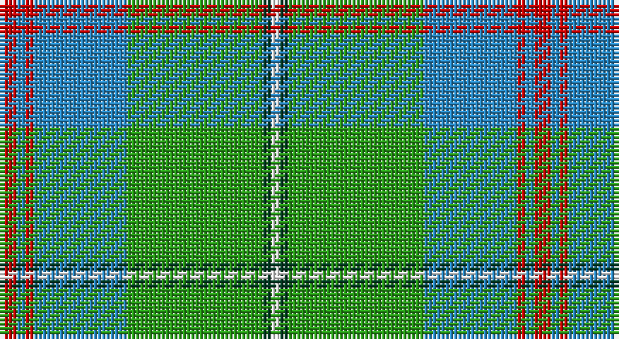

This page is one **sett** — a single exact thread-count. It belongs to the [tartan](/setts/r2t1r1t11g16dg1w1/)
(the same proportion at any scale), whose colour order is pattern [RBRBGGW](/stripes/rbrbggw/).

Sourced from tartans-authority.  It is a [7 stripe tartan](/stripes/stripes7/).

Original link http://www.tartansauthority.com/tartan-ferret/display/10354/

## Register references

External register numbers recorded for this tartan.

- Scottish Register of Tartans: [10354](https://www.tartanregister.gov.uk/tartanDetails?ref=10354)
- Scottish Tartans Authority (ITI): 10354

## Thread count
R/4 B2 R2 B22 G32 DG2 W/2

One full sett is **126 threads**.

## Palette

Palette: <strong>Tartan Register</strong>
<table><thead><tr><th>Colour</th><th>Threads</th><th>Shade</th><th>Base</th><th>OKLCh</th></tr></thead><tbody><tr><td>R/</td><td style="text-align:right;font-variant-numeric:tabular-nums">4</td><td><code style="background-color:#C80000;">#C80000</code> <small style="color:#888">#C80000</small></td><td>R <code style="background-color:#CC0000;">#CC0000</code></td><td><small style="color:#888">oklch(52.3% 0.215 29.2)</small></td></tr><tr><td>B</td><td style="text-align:right;font-variant-numeric:tabular-nums">2</td><td><code style="background-color:#2888C4;">#2888C4</code> <small style="color:#888">#2888C4</small></td><td>B <code style="background-color:#2A418A;">#2A418A</code></td><td><small style="color:#888">oklch(60.1% 0.125 241.5)</small></td></tr><tr><td>R</td><td style="text-align:right;font-variant-numeric:tabular-nums">2</td><td><code style="background-color:#C80000;">#C80000</code> <small style="color:#888">#C80000</small></td><td>R <code style="background-color:#CC0000;">#CC0000</code></td><td><small style="color:#888">oklch(52.3% 0.215 29.2)</small></td></tr><tr><td>B</td><td style="text-align:right;font-variant-numeric:tabular-nums">22</td><td><code style="background-color:#2888C4;">#2888C4</code> <small style="color:#888">#2888C4</small></td><td>B <code style="background-color:#2A418A;">#2A418A</code></td><td><small style="color:#888">oklch(60.1% 0.125 241.5)</small></td></tr><tr><td>G</td><td style="text-align:right;font-variant-numeric:tabular-nums">32</td><td><code style="background-color:#289C18;">#289C18</code> <small style="color:#888">#289C18</small></td><td>G <code style="background-color:#006100;">#006100</code></td><td><small style="color:#888">oklch(60.6% 0.191 141.6)</small></td></tr><tr><td>DG</td><td style="text-align:right;font-variant-numeric:tabular-nums">2</td><td><code style="background-color:#003820;">#003820</code> <small style="color:#888">#003820</small></td><td>G <code style="background-color:#006100;">#006100</code></td><td><small style="color:#888">oklch(30.0% 0.070 158.3)</small></td></tr><tr><td>W/</td><td style="text-align:right;font-variant-numeric:tabular-nums">2</td><td><code style="background-color:#FCFCFC;">#FCFCFC</code> <small style="color:#888">#FCFCFC</small></td><td>W <code style="background-color:#F7F7F7;">#F7F7F7</code></td><td><small style="color:#888">oklch(99.1% 0.000 89.9)</small></td></tr></tbody></table>

# Sample pattern

## Nearest tartans

The nearest existing variants by ΔTartan distance, with this tartan at the top so the swatches line up against it.

ΔTartan

Tartan

Sett

—

<a href="/ttd/edit/#slug=r2t1r1t11g16dg1w1~x2">Gift of Life Michigan (Corporate)</a> <a class="nn-out" href="/variants/s7/r2t1r1t11g16dg1w1~x2/" title="open its dictionary page">↗</a>

1.07

<a href="/ttd/edit/#slug=k3r1ly1t11g13t5r1ly1~x4&amp;base=r2t1r1t11g16dg1w1~x2">Snodgrass (Clan)</a> <a class="nn-out" href="/variants/s8/k3r1ly1t11g13t5r1ly1~x4/" title="open its dictionary page">↗</a>

1.14

<a href="/ttd/edit/#slug=w9dg2g2w3g18k2dg33lo2~x2&amp;base=r2t1r1t11g16dg1w1~x2">New World Irish (Fashion)</a> <a class="nn-out" href="/variants/s8/w9dg2g2w3g18k2dg33lo2~x2/" title="open its dictionary page">↗</a>

1.22

<a href="/ttd/edit/#slug=m3lb35db4g47w3~x2&amp;base=r2t1r1t11g16dg1w1~x2">Exabyte</a> <a class="nn-out" href="/variants/s5/m3lb35db4g47w3~x2/" title="open its dictionary page">↗</a>

1.22

<a href="/ttd/edit/#slug=g20ly2y5w4g2y2g2y2b6~x2&amp;base=r2t1r1t11g16dg1w1~x2">Boucherville (Tartan de..)</a> <a class="nn-out" href="/variants/s9/g20ly2y5w4g2y2g2y2b6~x2/" title="open its dictionary page">↗</a>

1.25

<a href="/ttd/edit/#slug=ly4g3r2g36b30k3b3k3~x2&amp;base=r2t1r1t11g16dg1w1~x2">Chartered Accountants of Scotland</a> <a class="nn-out" href="/variants/s8/ly4g3r2g36b30k3b3k3~x2/" title="open its dictionary page">↗</a>

1.30

<a href="/ttd/edit/#slug=g20ly2o5w4g2o2g2o2b6~x2&amp;base=r2t1r1t11g16dg1w1~x2">Boucherville</a> <a class="nn-out" href="/variants/s9/g20ly2o5w4g2o2g2o2b6~x2/" title="open its dictionary page">↗</a>

1.33

<a href="/ttd/edit/#slug=g30k3g3k3g6b32g3b3~x2&amp;base=r2t1r1t11g16dg1w1~x2">Holmes (Clan?)</a> <a class="nn-out" href="/variants/s8/g30k3g3k3g6b32g3b3~x2/" title="open its dictionary page">↗</a>

1.33

<a href="/ttd/edit/#slug=g20ly2o5w4g2o2g2o2db6~x2&amp;base=r2t1r1t11g16dg1w1~x2">Boucherville (Tartan de..) District Tartan</a> <a class="nn-out" href="/variants/s9/g20ly2o5w4g2o2g2o2db6~x2/" title="open its dictionary page">↗</a>

1.38

<a href="/ttd/edit/#slug=g18w1g4w1ly4dg1ly2dg12r2dg4~x2&amp;base=r2t1r1t11g16dg1w1~x2">Michigan, State of</a> <a class="nn-out" href="/variants/s10/g18w1g4w1ly4dg1ly2dg12r2dg4~x2/" title="open its dictionary page">↗</a>

1.39

<a href="/ttd/edit/#slug=r4k2g36k2b18ly3b18k2~x2&amp;base=r2t1r1t11g16dg1w1~x2">Fox Hunting</a> <a class="nn-out" href="/variants/s8/r4k2g36k2b18ly3b18k2~x2/" title="open its dictionary page">↗</a>

## Neighbour map

Every grey dot is one of 14360 variants placed by the first two principal components of the ΔTartan feature space (44% of its variance). Red is this tartan; blue dots are its nearest — click one to open its page.

<svg viewBox="0 0 640 380" role="img" style="max-width:100%;height:auto;border:1px solid #e0e0e0;border-radius:4px;display:block" xmlns="http://www.w3.org/2000/svg"><image href="/nn/cloud.v1.png" width="640" height="380"/><a href="/variants/s8/k3r1ly1t11g13t5r1ly1~x4/"><circle cx="225.9" cy="163.8" r="4" fill="#3465a4"><title>Snodgrass (Clan)</title></circle></a><a href="/variants/s8/w9dg2g2w3g18k2dg33lo2~x2/"><circle cx="269.8" cy="150.2" r="4" fill="#3465a4"><title>New World Irish (Fashion)</title></circle></a><a href="/variants/s5/m3lb35db4g47w3~x2/"><circle cx="290.0" cy="172.6" r="4" fill="#3465a4"><title>Exabyte</title></circle></a><a href="/variants/s9/g20ly2y5w4g2y2g2y2b6~x2/"><circle cx="246.5" cy="157.6" r="4" fill="#3465a4"><title>Boucherville (Tartan de..)</title></circle></a><a href="/variants/s8/ly4g3r2g36b30k3b3k3~x2/"><circle cx="303.9" cy="159.7" r="4" fill="#3465a4"><title>Chartered Accountants of Scotland</title></circle></a><a href="/variants/s9/g20ly2o5w4g2o2g2o2b6~x2/"><circle cx="271.4" cy="170.8" r="4" fill="#3465a4"><title>Boucherville</title></circle></a><a href="/variants/s8/g30k3g3k3g6b32g3b3~x2/"><circle cx="293.5" cy="194.1" r="4" fill="#3465a4"><title>Holmes (Clan?)</title></circle></a><a href="/variants/s9/g20ly2o5w4g2o2g2o2db6~x2/"><circle cx="257.8" cy="164.4" r="4" fill="#3465a4"><title>Boucherville (Tartan de..) District Tartan</title></circle></a><a href="/variants/s10/g18w1g4w1ly4dg1ly2dg12r2dg4~x2/"><circle cx="268.2" cy="148.6" r="4" fill="#3465a4"><title>Michigan, State of</title></circle></a><a href="/variants/s8/r4k2g36k2b18ly3b18k2~x2/"><circle cx="270.9" cy="163.7" r="4" fill="#3465a4"><title>Fox Hunting</title></circle></a><circle cx="289.0" cy="156.9" r="5" fill="#c00000"/></svg>

ID: /variants/s7/r2t1r1t11g16dg1w1~x2/
