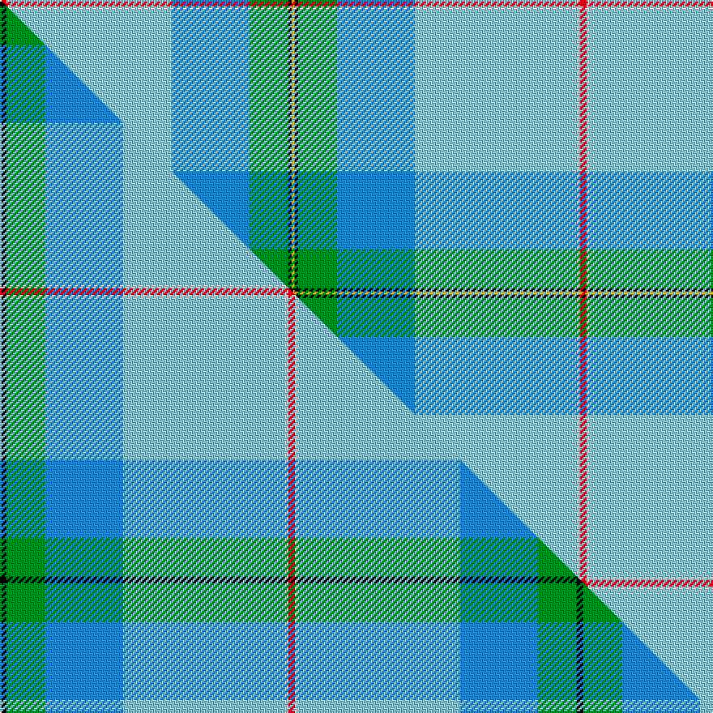

This page is one **sett** — a single exact thread-count. It belongs to the [tartan](/setts/r2w1lb50t24g12k1ly1/)
(the same proportion at any scale), whose colour order is pattern [RWWBGKY](/stripes/rwwbgky/).

Part of the [Pincock](/tartans/pincock/) tartan — the named design grouping this sett with its other cloths.

Sourced from tartans-authority.  It is a [7 stripe tartan](/stripes/stripes7/).

Original link http://www.tartansauthority.com/tartan-ferret/display/10323/

## Register references

External register numbers recorded for this tartan.

- Scottish Register of Tartans: [10323](https://www.tartanregister.gov.uk/tartanDetails?ref=10323)
- Scottish Tartans Authority (ITI): 10323

## Thread count
R/4 W2 LB100 T48 G24 K2 LY/2

One full sett is **358 threads**.

## Palette
<table><thead><tr><th>Colour</th><th>Shade</th><th>OKLCh</th></tr></thead><tbody><tr><td>T</td><td><code style="background-color:#2888C4;">#2888C4</code> <small style="color:#888">#2888C4</small></td><td><small style="color:#888">oklch(60.1% 0.125 241.5)</small></td></tr><tr><td>G</td><td><code style="background-color:#008B2A;">#008B2A</code> <small style="color:#888">#008B2A</small></td><td><small style="color:#888">oklch(55.4% 0.170 145.9)</small></td></tr><tr><td>K</td><td><code style="background-color:#000000;">#000000</code> <small style="color:#888">#000000</small></td><td><small style="color:#888">oklch(0.0% 0.000 0.0)</small></td></tr><tr><td>LB</td><td><code style="background-color:#98C8E8;">#98C8E8</code> <small style="color:#888">#98C8E8</small></td><td><small style="color:#888">oklch(81.0% 0.068 237.9)</small></td></tr><tr><td>W</td><td><code style="background-color:#F7F7F7;">#F7F7F7</code> <small style="color:#888">#F7F7F7</small></td><td><small style="color:#888">oklch(97.6% 0.000 89.9)</small></td></tr><tr><td>R</td><td><code style="background-color:#D60020;">#D60020</code> <small style="color:#888">#D60020</small></td><td><small style="color:#888">oklch(55.2% 0.224 25.5)</small></td></tr><tr><td>LY</td><td><code style="background-color:#DCBC32;">#DCBC32</code> <small style="color:#888">#DCBC32</small></td><td><small style="color:#888">oklch(80.0% 0.150 95.2)</small></td></tr></tbody></table>

# Sample pattern

## Compared to the master

This cloth is one sett of its design; the master sett (the exemplar the design is anchored on) is below for comparison.

Its **ΔTartan distance** from the master is **1.06** — the same measure the nearest-tartans table ranks by (0 is identical; a re-scale of the same cloth is near 0, a recolour or a different proportion further).

<figure class="master-compare" style="margin:0">

this sett
master sett ★

<figcaption style="color:#888;font-size:smaller">One weave of this sett against the <a href="/setts/k2g12t24lb50w1r2/">master sett ★</a>, split on the diagonal: a shared proportion runs seamlessly across it with only the shades shifting; a different proportion breaks on it.</figcaption>
</figure>

## Nearest variants

The nearest existing variants by ΔTartan distance, with this cloth at the top so the swatches line up against it.

ΔTartan

Threads

Variant

Sett

—

358

<a href="/variants/s7/r2w1lb50t24g12k1ly1~x2~lb3203246-t2405244/">Pincock (Name)</a>

<a href="/ttd/edit/#slug=r2w1lb50db24g12k1y1~x2&amp;base=r2w1lb50t24g12k1ly1~x2~lb3203246-t2405244" title="compare in the TTD">0.00</a>

358

<a href="/variants/s7/r2w1lb50db24g12k1y1~x2/">Pincock (Plockton), Dougie</a>

<a href="/ttd/edit/#slug=k2g12t24lb50w1r2~x2~t2405244-lb3203246&amp;base=r2w1lb50t24g12k1ly1~x2~lb3203246-t2405244" title="compare in the TTD">0.60</a>

356

<a href="/variants/s6/k2g12t24lb50w1r2~x2~t2405244-lb3203246/">Pincock Name Tartan</a>

<a href="/ttd/edit/#slug=lb58ly2db24g2r1dr5w1~x2&amp;base=r2w1lb50t24g12k1ly1~x2~lb3203246-t2405244" title="compare in the TTD">1.62</a>

254

<a href="/variants/s7/lb58ly2db24g2r1dr5w1~x2/">Hier (Personal)</a>

<a href="/ttd/edit/#slug=y3k1g12r7lb25k1w3~x2&amp;base=r2w1lb50t24g12k1ly1~x2~lb3203246-t2405244" title="compare in the TTD">2.11</a>

196

<a href="/variants/s7/y3k1g12r7lb25k1w3~x2/">Caskie</a>

<a href="/ttd/edit/#slug=db50g25y3n8r1w1r1~x2&amp;base=r2w1lb50t24g12k1ly1~x2~lb3203246-t2405244" title="compare in the TTD">2.50</a>

254

<a href="/variants/s7/db50g25y3n8r1w1r1~x2/">Wells (2014)</a>

2.56

—

<a href="/variants/s8/lb8db10t69w6t6r8lbi19lb3~lb3200000-t2503227-lbi3203246/">Virginia International Tattoo Hixon</a>

<a href="/ttd/edit/#slug=dp8g31r4y4db17b64w4&amp;base=r2w1lb50t24g12k1ly1~x2~lb3203246-t2405244" title="compare in the TTD">2.67</a>

252

<a href="/variants/s7/dp8g31r4y4db17b64w4/">Manx National</a>

<a href="/ttd/edit/#slug=w4g10lb24g42ri3y4r4ly2~ri2008029-y2405105-r1506028-ly3307090&amp;base=r2w1lb50t24g12k1ly1~x2~lb3203246-t2405244" title="compare in the TTD">2.77</a>

180

<a href="/variants/s8/w4g10lb24g42ri3y4r4ly2~ri2008029-y2405105-r1506028-ly3307090/">Muskoka</a>

<a href="/ttd/edit/#slug=lb53k2w53k2r4lo7~x2&amp;base=r2w1lb50t24g12k1ly1~x2~lb3203246-t2405244" title="compare in the TTD">2.84</a>

364

<a href="/variants/s6/lb53k2w53k2r4lo7~x2/">Galicia</a>

## Neighbour map

Every grey dot is one of 13620 variants placed by the first two principal components of the ΔTartan feature space (42% of its variance). Red is this tartan; blue dots are its nearest — click one to open its page.

<svg viewBox="0 0 640 380" role="img" style="max-width:100%;height:auto;border:1px solid #e0e0e0;border-radius:4px;display:block" xmlns="http://www.w3.org/2000/svg"><image href="/nn/cloud.v1.png" width="640" height="380"/><a href="/variants/s7/r2w1lb50db24g12k1y1~x2/"><circle cx="276.3" cy="58.2" r="4" fill="#3465a4"><title>Pincock (Plockton), Dougie</title></circle></a><a href="/variants/s6/k2g12t24lb50w1r2~x2~t2405244-lb3203246/"><circle cx="322.2" cy="77.3" r="4" fill="#3465a4"><title>Pincock Name Tartan</title></circle></a><a href="/variants/s7/lb58ly2db24g2r1dr5w1~x2/"><circle cx="352.1" cy="60.2" r="4" fill="#3465a4"><title>Hier (Personal)</title></circle></a><a href="/variants/s7/y3k1g12r7lb25k1w3~x2/"><circle cx="227.1" cy="116.6" r="4" fill="#3465a4"><title>Caskie</title></circle></a><a href="/variants/s7/db50g25y3n8r1w1r1~x2/"><circle cx="363.0" cy="98.3" r="4" fill="#3465a4"><title>Wells (2014)</title></circle></a><a href="/variants/s8/lb8db10t69w6t6r8lbi19lb3~lb3200000-t2503227-lbi3203246/"><circle cx="363.7" cy="137.9" r="4" fill="#3465a4"><title>Virginia International Tattoo Hixon</title></circle></a><a href="/variants/s7/dp8g31r4y4db17b64w4/"><circle cx="251.7" cy="145.1" r="4" fill="#3465a4"><title>Manx National</title></circle></a><a href="/variants/s8/w4g10lb24g42ri3y4r4ly2~ri2008029-y2405105-r1506028-ly3307090/"><circle cx="301.3" cy="127.3" r="4" fill="#3465a4"><title>Muskoka</title></circle></a><a href="/variants/s6/lb53k2w53k2r4lo7~x2/"><circle cx="296.9" cy="141.0" r="4" fill="#3465a4"><title>Galicia</title></circle></a><circle cx="346.0" cy="88.0" r="5" fill="#c00000"/><text x="320" y="376" text-anchor="middle" font-size="11" fill="#999">ground</text><text x="11" y="190" text-anchor="middle" font-size="11" fill="#999" transform="rotate(-90 11 190)">complexity</text></svg>

ID: /variants/s7/r2w1lb50t24g12k1ly1~x2~lb3203246-t2405244/
