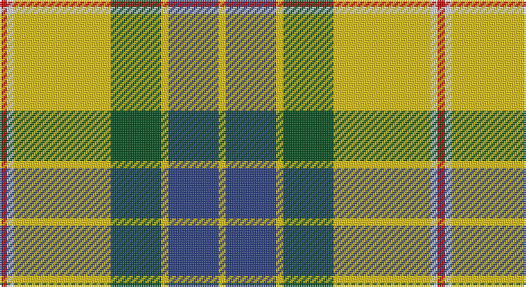

This page is one **sett** — a single exact thread-count. It belongs to the [tartan](/setts/r2w2ly27dg14ly2db14ly2/)
(the same proportion at any scale), whose colour order is pattern [RWYGYBY](/stripes/rwygyby/).

Sourced from register-of-tartans.  It is a [7 stripe tartan](/stripes/stripes7/).

Original link https://www.tartanregister.gov.uk/tartanDetails.aspx?ref=1268

## Register references

External register numbers recorded for this tartan.

- Scottish Register of Tartans: [1268](https://www.tartanregister.gov.uk/tartanDetails.aspx?ref=1268)
- Scottish Tartans World Register: 1709

## Thread count
R/4 LN4 Y54 G28 Y4 B28 Y/4

One full sett is **244 threads**.

## Palette

Palette: <strong>Tartan Register</strong>
<table><thead><tr><th>Colour</th><th>Threads</th><th>Shade</th><th>Base</th><th>OKLCh</th></tr></thead><tbody><tr><td>R/</td><td style="text-align:right;font-variant-numeric:tabular-nums">4</td><td><code style="background-color:#DC0000;">#DC0000</code> <small style="color:#888">#DC0000</small></td><td>R <code style="background-color:#CC0000;">#CC0000</code></td><td><small style="color:#888">oklch(56.2% 0.230 29.2)</small></td></tr><tr><td>LN</td><td style="text-align:right;font-variant-numeric:tabular-nums">4</td><td><code style="background-color:#E0E0E0;">#E0E0E0</code> <small style="color:#888">#E0E0E0</small></td><td>W <code style="background-color:#F7F7F7;">#F7F7F7</code></td><td><small style="color:#888">oklch(90.7% 0.000 89.9)</small></td></tr><tr><td>Y</td><td style="text-align:right;font-variant-numeric:tabular-nums">54</td><td><code style="background-color:#E8C000;">#E8C000</code> <small style="color:#888">#E8C000</small></td><td>Y <code style="background-color:#F2BF00;">#F2BF00</code></td><td><small style="color:#888">oklch(81.9% 0.168 93.7)</small></td></tr><tr><td>G</td><td style="text-align:right;font-variant-numeric:tabular-nums">28</td><td><code style="background-color:#005020;">#005020</code> <small style="color:#888">#005020</small></td><td>G <code style="background-color:#006100;">#006100</code></td><td><small style="color:#888">oklch(37.7% 0.105 149.6)</small></td></tr><tr><td>Y</td><td style="text-align:right;font-variant-numeric:tabular-nums">4</td><td><code style="background-color:#E8C000;">#E8C000</code> <small style="color:#888">#E8C000</small></td><td>Y <code style="background-color:#F2BF00;">#F2BF00</code></td><td><small style="color:#888">oklch(81.9% 0.168 93.7)</small></td></tr><tr><td>B</td><td style="text-align:right;font-variant-numeric:tabular-nums">28</td><td><code style="background-color:#2C4084;">#2C4084</code> <small style="color:#888">#2C4084</small></td><td>B <code style="background-color:#2A418A;">#2A418A</code></td><td><small style="color:#888">oklch(39.4% 0.117 268.3)</small></td></tr><tr><td>Y/</td><td style="text-align:right;font-variant-numeric:tabular-nums">4</td><td><code style="background-color:#E8C000;">#E8C000</code> <small style="color:#888">#E8C000</small></td><td>Y <code style="background-color:#F2BF00;">#F2BF00</code></td><td><small style="color:#888">oklch(81.9% 0.168 93.7)</small></td></tr></tbody></table>

# Sample pattern

## Nearest tartans

The nearest existing variants by ΔTartan distance, with this tartan at the top so the swatches line up against it.

ΔTartan

Tartan

Sett

—

<a href="/ttd/edit/#slug=r2w2ly27dg14ly2db14ly2~x2">Fraser Yellow</a> <a class="nn-out" href="/variants/s7/r2w2ly27dg14ly2db14ly2~x2/" title="open its dictionary page">↗</a>

0.49

<a href="/ttd/edit/#slug=r2w2ly27g14ly2db14ly2~x2&amp;base=r2w2ly27dg14ly2db14ly2~x2">Fraser, Yellow</a> <a class="nn-out" href="/variants/s7/r2w2ly27g14ly2db14ly2~x2/" title="open its dictionary page">↗</a>

0.79

<a href="/ttd/edit/#slug=dg1dy7dg7o2dy1ly15w1~x4&amp;base=r2w2ly27dg14ly2db14ly2~x2">Regalia</a> <a class="nn-out" href="/variants/s7/dg1dy7dg7o2dy1ly15w1~x4/" title="open its dictionary page">↗</a>

1.05

<a href="/ttd/edit/#slug=k5lyi2dy7ly18dy2w2~x4&amp;base=r2w2ly27dg14ly2db14ly2~x2">Shepherd Piping (Personal)</a> <a class="nn-out" href="/variants/s6/k5lyi2dy7ly18dy2w2~x4/" title="open its dictionary page">↗</a>

1.05

<a href="/ttd/edit/#slug=dg41lo3g7n3w24dg10g7n7w3~x2&amp;base=r2w2ly27dg14ly2db14ly2~x2">Drummond of Perth Dress (Dance)</a> <a class="nn-out" href="/variants/s9/dg41lo3g7n3w24dg10g7n7w3~x2/" title="open its dictionary page">↗</a>

1.19

<a href="/ttd/edit/#slug=lo16k7w1g7k1ly3~x4&amp;base=r2w2ly27dg14ly2db14ly2~x2">Hamilton of Brandon (Fashion)</a> <a class="nn-out" href="/variants/s6/lo16k7w1g7k1ly3~x4/" title="open its dictionary page">↗</a>

1.21

<a href="/ttd/edit/#slug=k5ly2dy7lyi18dy2w2~x4&amp;base=r2w2ly27dg14ly2db14ly2~x2">Shepherd, Derek (Piping)</a> <a class="nn-out" href="/variants/s6/k5ly2dy7lyi18dy2w2~x4/" title="open its dictionary page">↗</a>

1.34

<a href="/ttd/edit/#slug=g3w29g3db3g3db6g13ly3r2~x2&amp;base=r2w2ly27dg14ly2db14ly2~x2">Nova Scotia, dress</a> <a class="nn-out" href="/variants/s9/g3w29g3db3g3db6g13ly3r2~x2/" title="open its dictionary page">↗</a>

1.35

<a href="/ttd/edit/#slug=w2k11ly11t3k1r1~x2&amp;base=r2w2ly27dg14ly2db14ly2~x2">Cornish National Small Set Tartan</a> <a class="nn-out" href="/variants/s6/w2k11ly11t3k1r1~x2/" title="open its dictionary page">↗</a>

1.37

<a href="/ttd/edit/#slug=r20k2r2k2r2k8g24db2g3~x2&amp;base=r2w2ly27dg14ly2db14ly2~x2">Mostyn</a> <a class="nn-out" href="/variants/s9/r20k2r2k2r2k8g24db2g3~x2/" title="open its dictionary page">↗</a>

1.37

<a href="/ttd/edit/#slug=k4r5k2ly21g8k2~x2&amp;base=r2w2ly27dg14ly2db14ly2~x2">MacDuck (Corporate)</a> <a class="nn-out" href="/variants/s6/k4r5k2ly21g8k2~x2/" title="open its dictionary page">↗</a>

## Neighbour map

Every grey dot is one of 14360 variants placed by the first two principal components of the ΔTartan feature space (44% of its variance). Red is this tartan; blue dots are its nearest — click one to open its page.

<svg viewBox="0 0 640 380" role="img" style="max-width:100%;height:auto;border:1px solid #e0e0e0;border-radius:4px;display:block" xmlns="http://www.w3.org/2000/svg"><image href="/nn/cloud.v1.png" width="640" height="380"/><a href="/variants/s7/r2w2ly27g14ly2db14ly2~x2/"><circle cx="227.8" cy="143.9" r="4" fill="#3465a4"><title>Fraser, Yellow</title></circle></a><a href="/variants/s7/dg1dy7dg7o2dy1ly15w1~x4/"><circle cx="210.4" cy="145.1" r="4" fill="#3465a4"><title>Regalia</title></circle></a><a href="/variants/s6/k5lyi2dy7ly18dy2w2~x4/"><circle cx="207.0" cy="162.7" r="4" fill="#3465a4"><title>Shepherd Piping (Personal)</title></circle></a><a href="/variants/s9/dg41lo3g7n3w24dg10g7n7w3~x2/"><circle cx="211.8" cy="137.5" r="4" fill="#3465a4"><title>Drummond of Perth Dress (Dance)</title></circle></a><a href="/variants/s6/lo16k7w1g7k1ly3~x4/"><circle cx="215.3" cy="163.5" r="4" fill="#3465a4"><title>Hamilton of Brandon (Fashion)</title></circle></a><a href="/variants/s6/k5ly2dy7lyi18dy2w2~x4/"><circle cx="191.4" cy="151.5" r="4" fill="#3465a4"><title>Shepherd, Derek (Piping)</title></circle></a><a href="/variants/s9/g3w29g3db3g3db6g13ly3r2~x2/"><circle cx="209.9" cy="121.1" r="4" fill="#3465a4"><title>Nova Scotia, dress</title></circle></a><a href="/variants/s6/w2k11ly11t3k1r1~x2/"><circle cx="172.9" cy="158.9" r="4" fill="#3465a4"><title>Cornish National Small Set Tartan</title></circle></a><a href="/variants/s9/r20k2r2k2r2k8g24db2g3~x2/"><circle cx="223.0" cy="149.5" r="4" fill="#3465a4"><title>Mostyn</title></circle></a><a href="/variants/s6/k4r5k2ly21g8k2~x2/"><circle cx="226.9" cy="172.7" r="4" fill="#3465a4"><title>MacDuck (Corporate)</title></circle></a><circle cx="223.1" cy="142.7" r="5" fill="#c00000"/></svg>

ID: /variants/s7/r2w2ly27dg14ly2db14ly2~x2/
