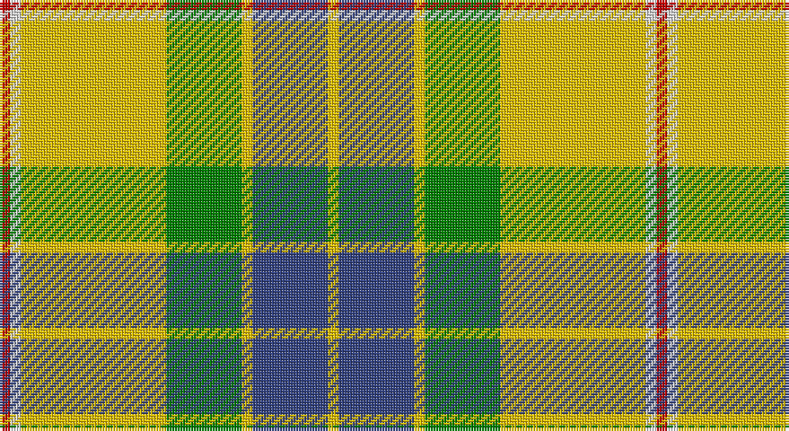

This page is one **sett** — a single exact thread-count. It belongs to the [tartan](/setts/r2w2ly27g14ly2db14ly2/)
(the same proportion at any scale), whose colour order is pattern [RWYGYBY](/stripes/rwygyby/).

Part of the [Fraser](/tartans/fraser/) tartan — the named design grouping this sett with its other cloths.

Sourced from weddslist.  It is a [7 stripe tartan](/stripes/stripes7/).

Original link http://www.weddslist.com/cgi-bin/tartans/pg.pl?source=sts

## Provenance

Earliest known date: pre 2003 Similar to Vestiarium Scoticum

## Also known as

This cloth is also recorded under:

- Fraser Green
- Fraser Yellow
- Fraser Yellow #2
- Fraser of Stratherrick
- Fraser, Stewart of Athol
- Fraser, Yellow

2 attestations — the source records this cloth was collapsed from (oldest owns this page)

<ul>
<li>undated — Fraser, Yellow (weddslist, <a href="http://www.weddslist.com/cgi-bin/tartans/pg.pl?source=sts">record</a>)</li>
<li>undated — Fraser Yellow Tartan (house-of-tartan, <a href="http://www.house-of-tartan.scotland.net/house/TartanViewjs.asp?colr=Def&tnam=1709">record</a>)</li>
</ul>

## Thread count
R/4 LN4 Y54 G28 Y4 B28 Y/4

One full sett is **244 threads**.

## Palette

Palette: <strong>Tartan Dictionary</strong> <small style="color:#888">(1 of 5 colours)</small>
<table><thead><tr><th>Colour</th><th>Threads</th><th>Shade</th><th>Base</th><th>OKLCh</th></tr></thead><tbody><tr><td>R/</td><td style="text-align:right;font-variant-numeric:tabular-nums">4</td><td><code style="background-color:#C00000;">#C00000</code> <small style="color:#888">#C00000</small></td><td>R <code style="background-color:#CC0000;">#CC0000</code></td><td><small style="color:#888">oklch(50.7% 0.208 29.2)</small></td></tr><tr><td>LN</td><td style="text-align:right;font-variant-numeric:tabular-nums">4</td><td><code style="background-color:#E0E0E0;">#E0E0E0</code> <small style="color:#888">#E0E0E0</small></td><td>W <code style="background-color:#F7F7F7;">#F7F7F7</code></td><td><small style="color:#888">oklch(90.7% 0.000 89.9)</small></td></tr><tr><td>Y</td><td style="text-align:right;font-variant-numeric:tabular-nums">54</td><td><code style="background-color:#F0C000;">#F0C000</code> <small style="color:#888">#F0C000</small></td><td>Y <code style="background-color:#F2BF00;">#F2BF00</code></td><td><small style="color:#888">oklch(82.7% 0.169 90.5)</small></td></tr><tr><td>G</td><td style="text-align:right;font-variant-numeric:tabular-nums">28</td><td><code style="background-color:#008000;">#008000</code> <small style="color:#888">#008000</small></td><td>G <code style="background-color:#006100;">#006100</code></td><td><small style="color:#888">oklch(52.0% 0.177 142.5)</small></td></tr><tr><td>Y</td><td style="text-align:right;font-variant-numeric:tabular-nums">4</td><td><code style="background-color:#F0C000;">#F0C000</code> <small style="color:#888">#F0C000</small></td><td>Y <code style="background-color:#F2BF00;">#F2BF00</code></td><td><small style="color:#888">oklch(82.7% 0.169 90.5)</small></td></tr><tr><td>B</td><td style="text-align:right;font-variant-numeric:tabular-nums">28</td><td><code style="background-color:#304080;">#304080</code> <small style="color:#888">#304080</small></td><td>B <code style="background-color:#2A418A;">#2A418A</code></td><td><small style="color:#888">oklch(39.4% 0.109 270.2)</small></td></tr><tr><td>Y/</td><td style="text-align:right;font-variant-numeric:tabular-nums">4</td><td><code style="background-color:#F0C000;">#F0C000</code> <small style="color:#888">#F0C000</small></td><td>Y <code style="background-color:#F2BF00;">#F2BF00</code></td><td><small style="color:#888">oklch(82.7% 0.169 90.5)</small></td></tr></tbody></table>

# Sample pattern

## Compared to the master

This cloth is one sett of its design; the master sett (the exemplar the design is anchored on) is below for comparison.

<figure style="margin:0"><figcaption style="color:#888;font-size:smaller">this sett</figcaption></figure>
<figure style="margin:0"><figcaption style="color:#888;font-size:smaller"><a href="/setts/r2db12r2g12r24w1/">master sett →</a></figcaption></figure>

## Nearest tartans

The nearest existing variants by ΔTartan distance, with this tartan at the top so the swatches line up against it.

ΔTartan

Tartan

Sett

—

<a href="/ttd/edit/#slug=r2w2ly27g14ly2db14ly2~x2">Fraser, Yellow</a> <a class="nn-out" href="/variants/s7/r2w2ly27g14ly2db14ly2~x2/" title="open its dictionary page">↗</a>

0.49

<a href="/ttd/edit/#slug=r2w2ly27dg14ly2db14ly2~x2&amp;base=r2w2ly27g14ly2db14ly2~x2">Fraser Yellow</a> <a class="nn-out" href="/variants/s7/r2w2ly27dg14ly2db14ly2~x2/" title="open its dictionary page">↗</a>

1.01

<a href="/ttd/edit/#slug=k5lyi2dy7ly18dy2w2~x4&amp;base=r2w2ly27g14ly2db14ly2~x2">Shepherd Piping (Personal)</a> <a class="nn-out" href="/variants/s6/k5lyi2dy7ly18dy2w2~x4/" title="open its dictionary page">↗</a>

1.05

<a href="/ttd/edit/#slug=dg1dy7dg7o2dy1ly15w1~x4&amp;base=r2w2ly27g14ly2db14ly2~x2">Regalia</a> <a class="nn-out" href="/variants/s7/dg1dy7dg7o2dy1ly15w1~x4/" title="open its dictionary page">↗</a>

1.24

<a href="/ttd/edit/#slug=dg41lo3g7n3w24dg10g7n7w3~x2&amp;base=r2w2ly27g14ly2db14ly2~x2">Drummond of Perth Dress (Dance)</a> <a class="nn-out" href="/variants/s9/dg41lo3g7n3w24dg10g7n7w3~x2/" title="open its dictionary page">↗</a>

1.25

<a href="/ttd/edit/#slug=k2ly30g4w2g14r13ly2~x2&amp;base=r2w2ly27g14ly2db14ly2~x2">Red Rum Commemorative Tartan</a> <a class="nn-out" href="/variants/s7/k2ly30g4w2g14r13ly2~x2/" title="open its dictionary page">↗</a>

1.27

<a href="/ttd/edit/#slug=k5ly2dy7lyi18dy2w2~x4&amp;base=r2w2ly27g14ly2db14ly2~x2">Shepherd, Derek (Piping)</a> <a class="nn-out" href="/variants/s6/k5ly2dy7lyi18dy2w2~x4/" title="open its dictionary page">↗</a>

1.31

<a href="/ttd/edit/#slug=t6g2t2g41dg6g2r21ly6&amp;base=r2w2ly27g14ly2db14ly2~x2">Manitoba</a> <a class="nn-out" href="/variants/s8/t6g2t2g41dg6g2r21ly6/" title="open its dictionary page">↗</a>

1.41

<a href="/ttd/edit/#slug=k4r5k2ly21g8k2~x2&amp;base=r2w2ly27g14ly2db14ly2~x2">MacDuck (Corporate)</a> <a class="nn-out" href="/variants/s6/k4r5k2ly21g8k2~x2/" title="open its dictionary page">↗</a>

1.42

<a href="/ttd/edit/#slug=g3w29g3db3g3db6g13ly3r2~x2&amp;base=r2w2ly27g14ly2db14ly2~x2">Nova Scotia, dress</a> <a class="nn-out" href="/variants/s9/g3w29g3db3g3db6g13ly3r2~x2/" title="open its dictionary page">↗</a>

1.42

<a href="/ttd/edit/#slug=ly83k35w3g35k3ly10&amp;base=r2w2ly27g14ly2db14ly2~x2">Brandon Manitoba Trade Tartan</a> <a class="nn-out" href="/variants/s6/ly83k35w3g35k3ly10/" title="open its dictionary page">↗</a>

## Neighbour map

Every grey dot is one of 14360 variants placed by the first two principal components of the ΔTartan feature space (44% of its variance). Red is this tartan; blue dots are its nearest — click one to open its page.

<svg viewBox="0 0 640 380" role="img" style="max-width:100%;height:auto;border:1px solid #e0e0e0;border-radius:4px;display:block" xmlns="http://www.w3.org/2000/svg"><image href="/nn/cloud.v1.png" width="640" height="380"/><a href="/variants/s7/r2w2ly27dg14ly2db14ly2~x2/"><circle cx="223.1" cy="142.7" r="4" fill="#3465a4"><title>Fraser Yellow</title></circle></a><a href="/variants/s6/k5lyi2dy7ly18dy2w2~x4/"><circle cx="207.0" cy="162.7" r="4" fill="#3465a4"><title>Shepherd Piping (Personal)</title></circle></a><a href="/variants/s7/dg1dy7dg7o2dy1ly15w1~x4/"><circle cx="210.4" cy="145.1" r="4" fill="#3465a4"><title>Regalia</title></circle></a><a href="/variants/s9/dg41lo3g7n3w24dg10g7n7w3~x2/"><circle cx="211.8" cy="137.5" r="4" fill="#3465a4"><title>Drummond of Perth Dress (Dance)</title></circle></a><a href="/variants/s7/k2ly30g4w2g14r13ly2~x2/"><circle cx="193.8" cy="122.5" r="4" fill="#3465a4"><title>Red Rum Commemorative Tartan</title></circle></a><a href="/variants/s6/k5ly2dy7lyi18dy2w2~x4/"><circle cx="191.4" cy="151.5" r="4" fill="#3465a4"><title>Shepherd, Derek (Piping)</title></circle></a><a href="/variants/s8/t6g2t2g41dg6g2r21ly6/"><circle cx="288.2" cy="127.6" r="4" fill="#3465a4"><title>Manitoba</title></circle></a><a href="/variants/s6/k4r5k2ly21g8k2~x2/"><circle cx="226.9" cy="172.7" r="4" fill="#3465a4"><title>MacDuck (Corporate)</title></circle></a><a href="/variants/s9/g3w29g3db3g3db6g13ly3r2~x2/"><circle cx="209.9" cy="121.1" r="4" fill="#3465a4"><title>Nova Scotia, dress</title></circle></a><a href="/variants/s6/ly83k35w3g35k3ly10/"><circle cx="241.5" cy="121.5" r="4" fill="#3465a4"><title>Brandon Manitoba Trade Tartan</title></circle></a><circle cx="227.8" cy="143.9" r="5" fill="#c00000"/></svg>

ID: /variants/s7/r2w2ly27g14ly2db14ly2~x2/
