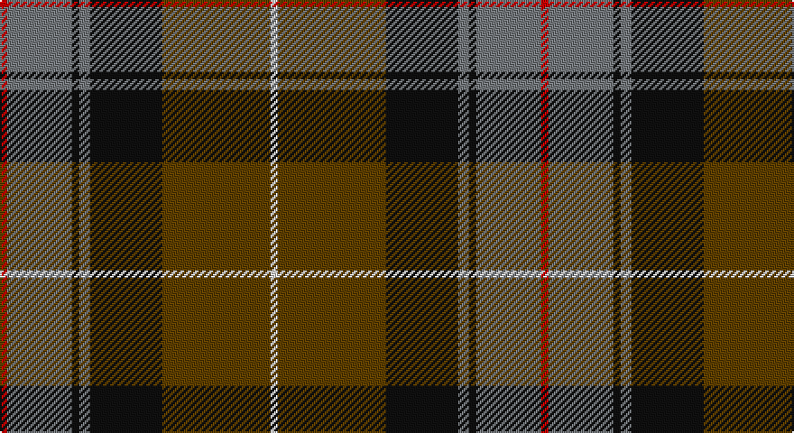

This page is one **sett** — a single exact thread-count. It belongs to the [tartan](/setts/r2y18k2y3k20dy30w2/)
(the same proportion at any scale), whose colour order is pattern [RGKGKGW](/stripes/rgkgkgw/).

Part of the [Bennett, John Paul](/tartans/bennett-john-paul/) tartan — the named design grouping this sett with its other cloths.

Sourced from tartans-authority.  It is a [7 stripe tartan](/stripes/stripes7/).

Original link http://www.tartansauthority.com/tartan-ferret/display/10222/

## Provenance

Earliest known date: 1st June 2009 Woven sample from Lochcarron - ordered through Kilt Pin Ltd. in early 2008. Eventually registered with National Archives in June 2010. Designed for John Paul Bennett in Edinburgh for his wedding and thereafter for his family. The use of this tartan must be approved by JP Bennett ACMA, Finance Director, J & E Shepherd or his immediate family. jpbennett@shepherd.co.uk.

## Also known as

This cloth is also recorded under:

- Bennett, J P.
- Bennett, John Paul Personal

2 attestations — the source records this cloth was collapsed from (oldest owns this page)

<ul>
<li>1st June 2009 — Bennett, J P. (Personal) (tartans-authority, <a href="http://www.tartansauthority.com/tartan-ferret/display/10222/">record</a>)</li>
<li>undated — Bennett, John Paul Personal Tartan (house-of-tartan, <a href="http://www.house-of-tartan.scotland.net/house/TartanViewjs.asp?colr=Def&tnam=10222">record</a>)</li>
</ul>

## Register references

External register numbers recorded for this tartan.

- Scottish Register of Tartans: [10222](https://www.tartanregister.gov.uk/tartanDetails?ref=10222)
- Scottish Tartans Authority (ITI): 10222

## Thread count
R/4 N36 K4 N6 K40 T60 LN/4

One full sett is **300 threads**.

## Palette

Palette: <strong>Tartan Register</strong> <small style="color:#888">(4 of 5 colours)</small>
<table><thead><tr><th>Colour</th><th>Threads</th><th>Shade</th><th>Base</th><th>OKLCh</th></tr></thead><tbody><tr><td>R/</td><td style="text-align:right;font-variant-numeric:tabular-nums">4</td><td><code style="background-color:#C80000;">#C80000</code> <small style="color:#888">#C80000</small></td><td>R <code style="background-color:#CC0000;">#CC0000</code></td><td><small style="color:#888">oklch(52.3% 0.215 29.2)</small></td></tr><tr><td>N</td><td style="text-align:right;font-variant-numeric:tabular-nums">36</td><td><code style="background-color:#74787C;">#74787C</code> <small style="color:#888">#74787C</small></td><td>G <code style="background-color:#006100;">#006100</code></td><td><small style="color:#888">oklch(57.1% 0.008 248.0)</small></td></tr><tr><td>K</td><td style="text-align:right;font-variant-numeric:tabular-nums">4</td><td><code style="background-color:#101010;">#101010</code> <small style="color:#888">#101010</small></td><td>K <code style="background-color:#000000;">#000000</code></td><td><small style="color:#888">oklch(17.3% 0.000 89.9)</small></td></tr><tr><td>N</td><td style="text-align:right;font-variant-numeric:tabular-nums">6</td><td><code style="background-color:#74787C;">#74787C</code> <small style="color:#888">#74787C</small></td><td>G <code style="background-color:#006100;">#006100</code></td><td><small style="color:#888">oklch(57.1% 0.008 248.0)</small></td></tr><tr><td>K</td><td style="text-align:right;font-variant-numeric:tabular-nums">40</td><td><code style="background-color:#101010;">#101010</code> <small style="color:#888">#101010</small></td><td>K <code style="background-color:#000000;">#000000</code></td><td><small style="color:#888">oklch(17.3% 0.000 89.9)</small></td></tr><tr><td>T</td><td style="text-align:right;font-variant-numeric:tabular-nums">60</td><td><code style="background-color:#604000;">#604000</code> <small style="color:#888">#604000</small></td><td>G <code style="background-color:#006100;">#006100</code></td><td><small style="color:#888">oklch(39.8% 0.083 76.8)</small></td></tr><tr><td>LN/</td><td style="text-align:right;font-variant-numeric:tabular-nums">4</td><td><code style="background-color:#E0E0E0;">#E0E0E0</code> <small style="color:#888">#E0E0E0</small></td><td>W <code style="background-color:#F7F7F7;">#F7F7F7</code></td><td><small style="color:#888">oklch(90.7% 0.000 89.9)</small></td></tr></tbody></table>

# Sample pattern

## Compared to the master

This cloth is one sett of its design; the master sett (the exemplar the design is anchored on) is below for comparison.

<figure style="margin:0"><figcaption style="color:#888;font-size:smaller">this sett</figcaption></figure>
<figure style="margin:0"><figcaption style="color:#888;font-size:smaller"><a href="/setts/r4n38k4n6k41dg62y4/">master sett →</a></figcaption></figure>

## Nearest tartans

The nearest existing variants by ΔTartan distance, with this tartan at the top so the swatches line up against it.

ΔTartan

Tartan

Sett

—

<a href="/ttd/edit/#slug=r2y18k2y3k20dy30w2~x2">Bennett, J P. (Personal)</a> <a class="nn-out" href="/variants/s7/r2y18k2y3k20dy30w2~x2/" title="open its dictionary page">↗</a>

0.81

<a href="/ttd/edit/#slug=db4r11db1g8r2g4k1lo2~x4&amp;base=r2y18k2y3k20dy30w2~x2">Craik of Assington (Personal)</a> <a class="nn-out" href="/variants/s8/db4r11db1g8r2g4k1lo2~x4/" title="open its dictionary page">↗</a>

0.87

<a href="/ttd/edit/#slug=lb3r30k18db6g30k2~x2&amp;base=r2y18k2y3k20dy30w2~x2">Bryant (Dalgleish) (Personal)</a> <a class="nn-out" href="/variants/s6/lb3r30k18db6g30k2~x2/" title="open its dictionary page">↗</a>

1.01

<a href="/ttd/edit/#slug=dt12w2dt13dg3g2r24g3~x2&amp;base=r2y18k2y3k20dy30w2~x2">Wellmont Foundation (Corporate)</a> <a class="nn-out" href="/variants/s7/dt12w2dt13dg3g2r24g3~x2/" title="open its dictionary page">↗</a>

1.03

<a href="/ttd/edit/#slug=dp18k7g5r4g7k1ly2~x2&amp;base=r2y18k2y3k20dy30w2~x2">Regent</a> <a class="nn-out" href="/variants/s7/dp18k7g5r4g7k1ly2~x2/" title="open its dictionary page">↗</a>

1.07

<a href="/ttd/edit/#slug=g27ri2g4r15db26k2db6~x2&amp;base=r2y18k2y3k20dy30w2~x2">Bailies of Bennachie (Corporate)</a> <a class="nn-out" href="/variants/s7/g27ri2g4r15db26k2db6~x2/" title="open its dictionary page">↗</a>

1.08

<a href="/ttd/edit/#slug=r12db68w7k39g75r6g6&amp;base=r2y18k2y3k20dy30w2~x2">Rhun (Fashion)</a> <a class="nn-out" href="/variants/s7/r12db68w7k39g75r6g6/" title="open its dictionary page">↗</a>

1.09

<a href="/ttd/edit/#slug=g3dy32g4lb3g18dp18lo3~x2&amp;base=r2y18k2y3k20dy30w2~x2">Wcwm 9275-1410</a> <a class="nn-out" href="/variants/s7/g3dy32g4lb3g18dp18lo3~x2/" title="open its dictionary page">↗</a>

1.09

<a href="/ttd/edit/#slug=o30k4o3k4o3g20dt20ly4~x2&amp;base=r2y18k2y3k20dy30w2~x2">Sikh (Corporate)</a> <a class="nn-out" href="/variants/s8/o30k4o3k4o3g20dt20ly4~x2/" title="open its dictionary page">↗</a>

1.09

<a href="/ttd/edit/#slug=dg26db3r3db20r3db3r30lb3k2~x2&amp;base=r2y18k2y3k20dy30w2~x2">Ormiston (Personal)</a> <a class="nn-out" href="/variants/s9/dg26db3r3db20r3db3r30lb3k2~x2/" title="open its dictionary page">↗</a>

1.12

<a href="/ttd/edit/#slug=w4dt38g6dr2g6dr36lo2dr3~x2&amp;base=r2y18k2y3k20dy30w2~x2">Scotland 2000</a> <a class="nn-out" href="/variants/s8/w4dt38g6dr2g6dr36lo2dr3~x2/" title="open its dictionary page">↗</a>

## Neighbour map

Every grey dot is one of 14360 variants placed by the first two principal components of the ΔTartan feature space (44% of its variance). Red is this tartan; blue dots are its nearest — click one to open its page.

<svg viewBox="0 0 640 380" role="img" style="max-width:100%;height:auto;border:1px solid #e0e0e0;border-radius:4px;display:block" xmlns="http://www.w3.org/2000/svg"><image href="/nn/cloud.v1.png" width="640" height="380"/><a href="/variants/s8/db4r11db1g8r2g4k1lo2~x4/"><circle cx="208.9" cy="187.6" r="4" fill="#3465a4"><title>Craik of Assington (Personal)</title></circle></a><a href="/variants/s6/lb3r30k18db6g30k2~x2/"><circle cx="193.1" cy="191.3" r="4" fill="#3465a4"><title>Bryant (Dalgleish) (Personal)</title></circle></a><a href="/variants/s7/dt12w2dt13dg3g2r24g3~x2/"><circle cx="248.0" cy="180.5" r="4" fill="#3465a4"><title>Wellmont Foundation (Corporate)</title></circle></a><a href="/variants/s7/dp18k7g5r4g7k1ly2~x2/"><circle cx="215.0" cy="170.7" r="4" fill="#3465a4"><title>Regent</title></circle></a><a href="/variants/s7/g27ri2g4r15db26k2db6~x2/"><circle cx="240.6" cy="195.7" r="4" fill="#3465a4"><title>Bailies of Bennachie (Corporate)</title></circle></a><a href="/variants/s7/r12db68w7k39g75r6g6/"><circle cx="196.7" cy="184.1" r="4" fill="#3465a4"><title>Rhun (Fashion)</title></circle></a><a href="/variants/s7/g3dy32g4lb3g18dp18lo3~x2/"><circle cx="235.4" cy="199.9" r="4" fill="#3465a4"><title>Wcwm 9275-1410</title></circle></a><a href="/variants/s8/o30k4o3k4o3g20dt20ly4~x2/"><circle cx="195.1" cy="176.0" r="4" fill="#3465a4"><title>Sikh (Corporate)</title></circle></a><a href="/variants/s9/dg26db3r3db20r3db3r30lb3k2~x2/"><circle cx="254.0" cy="165.1" r="4" fill="#3465a4"><title>Ormiston (Personal)</title></circle></a><a href="/variants/s8/w4dt38g6dr2g6dr36lo2dr3~x2/"><circle cx="274.2" cy="147.9" r="4" fill="#3465a4"><title>Scotland 2000</title></circle></a><circle cx="231.9" cy="173.1" r="5" fill="#c00000"/></svg>

ID: /variants/s7/r2y18k2y3k20dy30w2~x2/
