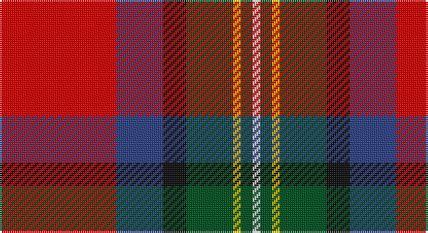

This page is one **sett** — a single exact thread-count. It belongs to the [tartan](/setts/r30db12k6dg12ly2dg3w2/)
(the same proportion at any scale), whose colour order is pattern [RBKGYGW](/stripes/rbkgygw/).

Part of the [Hewitt](/tartans/hewitt/) tartan — the named design grouping this sett with its other cloths.

Sourced from register-of-tartans.  It is a [7 stripe tartan](/stripes/stripes7/).

Original link https://www.tartanregister.gov.uk/tartanDetails.aspx?ref=5929

## Also known as

This cloth is also recorded under:

- Hewitt #2

## Register references

External register numbers recorded for this tartan.

- Scottish Register of Tartans: [5929](https://www.tartanregister.gov.uk/tartanDetails.aspx?ref=5929)
- Scottish Tartans World Register: 3120

## Thread count
R/60 B24 K12 G24 Y4 G6 LN/4

One full sett is **204 threads**.

## Palette

Palette: <strong>Tartan Register</strong>
<table><thead><tr><th>Colour</th><th>Threads</th><th>Shade</th><th>Base</th><th>OKLCh</th></tr></thead><tbody><tr><td>R/</td><td style="text-align:right;font-variant-numeric:tabular-nums">60</td><td><code style="background-color:#DC0000;">#DC0000</code> <small style="color:#888">#DC0000</small></td><td>R <code style="background-color:#CC0000;">#CC0000</code></td><td><small style="color:#888">oklch(56.2% 0.230 29.2)</small></td></tr><tr><td>B</td><td style="text-align:right;font-variant-numeric:tabular-nums">24</td><td><code style="background-color:#2C4084;">#2C4084</code> <small style="color:#888">#2C4084</small></td><td>B <code style="background-color:#2A418A;">#2A418A</code></td><td><small style="color:#888">oklch(39.4% 0.117 268.3)</small></td></tr><tr><td>K</td><td style="text-align:right;font-variant-numeric:tabular-nums">12</td><td><code style="background-color:#101010;">#101010</code> <small style="color:#888">#101010</small></td><td>K <code style="background-color:#000000;">#000000</code></td><td><small style="color:#888">oklch(17.3% 0.000 89.9)</small></td></tr><tr><td>G</td><td style="text-align:right;font-variant-numeric:tabular-nums">24</td><td><code style="background-color:#005020;">#005020</code> <small style="color:#888">#005020</small></td><td>G <code style="background-color:#006100;">#006100</code></td><td><small style="color:#888">oklch(37.7% 0.105 149.6)</small></td></tr><tr><td>Y</td><td style="text-align:right;font-variant-numeric:tabular-nums">4</td><td><code style="background-color:#E8C000;">#E8C000</code> <small style="color:#888">#E8C000</small></td><td>Y <code style="background-color:#F2BF00;">#F2BF00</code></td><td><small style="color:#888">oklch(81.9% 0.168 93.7)</small></td></tr><tr><td>G</td><td style="text-align:right;font-variant-numeric:tabular-nums">6</td><td><code style="background-color:#005020;">#005020</code> <small style="color:#888">#005020</small></td><td>G <code style="background-color:#006100;">#006100</code></td><td><small style="color:#888">oklch(37.7% 0.105 149.6)</small></td></tr><tr><td>LN/</td><td style="text-align:right;font-variant-numeric:tabular-nums">4</td><td><code style="background-color:#E0E0E0;">#E0E0E0</code> <small style="color:#888">#E0E0E0</small></td><td>W <code style="background-color:#F7F7F7;">#F7F7F7</code></td><td><small style="color:#888">oklch(90.7% 0.000 89.9)</small></td></tr></tbody></table>

# Sample pattern

## Compared to the master

This cloth is one sett of its design; the master sett (the exemplar the design is anchored on) is below for comparison.

<figure style="margin:0"><figcaption style="color:#888;font-size:smaller">this sett</figcaption></figure>
<figure style="margin:0"><figcaption style="color:#888;font-size:smaller"><a href="/setts/r30db12k3g12ly2g3w2/">master sett →</a></figcaption></figure>

## Nearest tartans

The nearest existing variants by ΔTartan distance, with this tartan at the top so the swatches line up against it.

ΔTartan

Tartan

Sett

—

<a href="/ttd/edit/#slug=r30db12k6dg12ly2dg3w2~x2">Hewitt</a> <a class="nn-out" href="/variants/s7/r30db12k6dg12ly2dg3w2~x2/" title="open its dictionary page">↗</a>

0.38

<a href="/ttd/edit/#slug=r30db12k3g12ly2g3w2~x2&amp;base=r30db12k6dg12ly2dg3w2~x2">Hewitt (Name)</a> <a class="nn-out" href="/variants/s7/r30db12k3g12ly2g3w2~x2/" title="open its dictionary page">↗</a>

0.69

<a href="/ttd/edit/#slug=r48t16lo5dg17w8k3~x2&amp;base=r30db12k6dg12ly2dg3w2~x2">Scottish American Society of Michigan (Official)</a> <a class="nn-out" href="/variants/s6/r48t16lo5dg17w8k3~x2/" title="open its dictionary page">↗</a>

0.70

<a href="/ttd/edit/#slug=r63w4k4dp18ly4dg50~x2&amp;base=r30db12k6dg12ly2dg3w2~x2">Gordon of Abergeldie (Portrait)</a> <a class="nn-out" href="/variants/s6/r63w4k4dp18ly4dg50~x2/" title="open its dictionary page">↗</a>

0.71

<a href="/ttd/edit/#slug=r3n2r25o12k25w2lb2~x2&amp;base=r30db12k6dg12ly2dg3w2~x2">Bombeiros Voluntarios De Galicia (Co</a> <a class="nn-out" href="/variants/s7/r3n2r25o12k25w2lb2~x2/" title="open its dictionary page">↗</a>

0.82

<a href="/ttd/edit/#slug=r3lo15g4dt6w2r30dt6ly3~x2&amp;base=r30db12k6dg12ly2dg3w2~x2">Round Table Sweden</a> <a class="nn-out" href="/variants/s8/r3lo15g4dt6w2r30dt6ly3~x2/" title="open its dictionary page">↗</a>

0.83

<a href="/ttd/edit/#slug=r3lo15g4t6w2r30t6ly3~x2&amp;base=r30db12k6dg12ly2dg3w2~x2">Round Table Sweden</a> <a class="nn-out" href="/variants/s8/r3lo15g4t6w2r30t6ly3~x2/" title="open its dictionary page">↗</a>

0.96

<a href="/ttd/edit/#slug=t4g3t9dt14ly8dt2r35ri2r3~x2&amp;base=r30db12k6dg12ly2dg3w2~x2">Hogeboom (Personal)</a> <a class="nn-out" href="/variants/s9/t4g3t9dt14ly8dt2r35ri2r3~x2/" title="open its dictionary page">↗</a>

0.97

<a href="/ttd/edit/#slug=r48b16lo5g17w8dy3~x2&amp;base=r30db12k6dg12ly2dg3w2~x2">Scottish American Soc. of Michigan</a> <a class="nn-out" href="/variants/s6/r48b16lo5g17w8dy3~x2/" title="open its dictionary page">↗</a>

1.08

<a href="/ttd/edit/#slug=db4ly3db17g6w2dr6w2r24dr3r4~x2&amp;base=r30db12k6dg12ly2dg3w2~x2">Asman Family</a> <a class="nn-out" href="/variants/s10/db4ly3db17g6w2dr6w2r24dr3r4~x2/" title="open its dictionary page">↗</a>

1.08

<a href="/ttd/edit/#slug=dp2r11t9dp11ly2g13r21w2~x2&amp;base=r30db12k6dg12ly2dg3w2~x2">Wilson's, No 2</a> <a class="nn-out" href="/variants/s8/dp2r11t9dp11ly2g13r21w2~x2/" title="open its dictionary page">↗</a>

## Neighbour map

Every grey dot is one of 14360 variants placed by the first two principal components of the ΔTartan feature space (44% of its variance). Red is this tartan; blue dots are its nearest — click one to open its page.

<svg viewBox="0 0 640 380" role="img" style="max-width:100%;height:auto;border:1px solid #e0e0e0;border-radius:4px;display:block" xmlns="http://www.w3.org/2000/svg"><image href="/nn/cloud.v1.png" width="640" height="380"/><a href="/variants/s7/r30db12k3g12ly2g3w2~x2/"><circle cx="230.1" cy="130.1" r="4" fill="#3465a4"><title>Hewitt (Name)</title></circle></a><a href="/variants/s6/r48t16lo5dg17w8k3~x2/"><circle cx="231.2" cy="135.4" r="4" fill="#3465a4"><title>Scottish American Society of Michigan (Official)</title></circle></a><a href="/variants/s6/r63w4k4dp18ly4dg50~x2/"><circle cx="241.6" cy="141.5" r="4" fill="#3465a4"><title>Gordon of Abergeldie (Portrait)</title></circle></a><a href="/variants/s7/r3n2r25o12k25w2lb2~x2/"><circle cx="185.7" cy="136.1" r="4" fill="#3465a4"><title>Bombeiros Voluntarios De Galicia (Co</title></circle></a><a href="/variants/s8/r3lo15g4dt6w2r30dt6ly3~x2/"><circle cx="229.2" cy="120.6" r="4" fill="#3465a4"><title>Round Table Sweden</title></circle></a><a href="/variants/s8/r3lo15g4t6w2r30t6ly3~x2/"><circle cx="215.9" cy="115.6" r="4" fill="#3465a4"><title>Round Table Sweden</title></circle></a><a href="/variants/s9/t4g3t9dt14ly8dt2r35ri2r3~x2/"><circle cx="235.6" cy="104.4" r="4" fill="#3465a4"><title>Hogeboom (Personal)</title></circle></a><a href="/variants/s6/r48b16lo5g17w8dy3~x2/"><circle cx="242.6" cy="140.8" r="4" fill="#3465a4"><title>Scottish American Soc. of Michigan</title></circle></a><a href="/variants/s10/db4ly3db17g6w2dr6w2r24dr3r4~x2/"><circle cx="175.8" cy="127.0" r="4" fill="#3465a4"><title>Asman Family</title></circle></a><a href="/variants/s8/dp2r11t9dp11ly2g13r21w2~x2/"><circle cx="170.0" cy="160.4" r="4" fill="#3465a4"><title>Wilson's, No 2</title></circle></a><circle cx="206.9" cy="131.8" r="5" fill="#c00000"/></svg>

ID: /variants/s7/r30db12k6dg12ly2dg3w2~x2/
