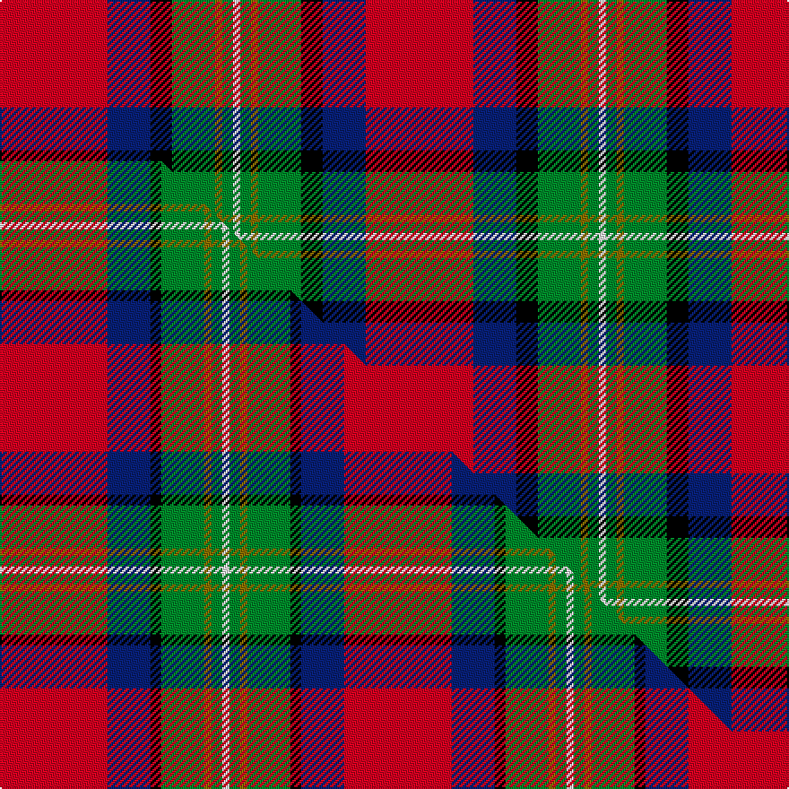

This page is one **sett** — a single exact thread-count. It belongs to the [tartan](/setts/r30db12k6g12y2g3w2/)
(the same proportion at any scale), whose colour order is pattern [RBKGGGW](/stripes/rbkgggw/).

Part of the [Hewitt](/tartans/hewitt/) tartan — the named design grouping this sett with its other cloths.

Sourced from register-of-tartans.  It is a [7 stripe tartan](/stripes/stripes7/).

Original link [https://www.tartanregister.gov.uk/tartanDetails.aspx?ref=5929](https://www.tartanregister.gov.uk/tartanDetails.aspx?ref=5929)

Dataset <small>— provenance for this record, inherited from the source manifest</small>

<dl class="dataset-prov">
<dt>source</dt><dd><a href="/sources/register-of-tartans/">Scottish Register of Tartans</a></dd>
<dt>data captured from</dt><dd><a href="https://github.com/thetartan/tartan-database/blob/master/data/register-of-tartans/data.csv">https://github.com/thetartan/tartan-database/blob/master/data/register-of-tartans/data.csv</a></dd>
<dt>data date</dt><dd>01/11/2005 <small>(this record)</small></dd>
<dt>licence</dt><dd><a href="https://www.tartanregister.gov.uk/copyright">Crown copyright</a></dd>
</dl>

Capture chain <small>— the hands this data passed through, oldest first; each capture carries its own licence</small>

<ol class="capture-chain">
<li><a href="https://www.tartanregister.gov.uk/">Scottish Register of Tartans</a> · <a href="https://www.tartanregister.gov.uk/copyright">Crown copyright</a> <small>the living register — still published by National Records of Scotland</small></li>
<li><a href="https://github.com/thetartan/tartan-database">thetartan/tartan-database</a> <small>2016-2017</small> · <a href="https://creativecommons.org/licenses/by-nc-nd/4.0/">CC BY-NC-ND 4.0</a> <small>Levko Kravets's frozen compilation — the capture we vendored, and where its CC licence text came from</small></li>
<li>this dictionary <small>captured 2026-06-10 · commit 5bf86c7566</small> <small>each re-capture is a git commit to data/sources</small></li>
</ol>

## Register references

External register numbers recorded for this tartan.

- Scottish Register of Tartans: [5929](https://www.tartanregister.gov.uk/tartanDetails.aspx?ref=5929)
- Scottish Tartans World Register: 3120

## Thread count
R/60 DB24 K12 G24 Y4 G6 W/4

One full sett is **204 threads**.

## Palette
<table><thead><tr><th>Colour</th><th>Shade</th><th>OKLCh</th></tr></thead><tbody><tr><td>DB</td><td><code style="background-color:#082077;">#082077</code> <small style="color:#888">#082077</small></td><td><small style="color:#888">oklch(30.0% 0.149 265.1)</small></td></tr><tr><td>G</td><td><code style="background-color:#008B2A;">#008B2A</code> <small style="color:#888">#008B2A</small></td><td><small style="color:#888">oklch(55.4% 0.170 145.9)</small></td></tr><tr><td>K</td><td><code style="background-color:#000000;">#000000</code> <small style="color:#888">#000000</small></td><td><small style="color:#888">oklch(0.0% 0.000 0.0)</small></td></tr><tr><td>W</td><td><code style="background-color:#F7F7F7;">#F7F7F7</code> <small style="color:#888">#F7F7F7</small></td><td><small style="color:#888">oklch(97.6% 0.000 89.9)</small></td></tr><tr><td>R</td><td><code style="background-color:#D60020;">#D60020</code> <small style="color:#888">#D60020</small></td><td><small style="color:#888">oklch(55.2% 0.224 25.5)</small></td></tr><tr><td>Y</td><td><code style="background-color:#8B6E00;">#8B6E00</code> <small style="color:#888">#8B6E00</small></td><td><small style="color:#888">oklch(55.1% 0.113 90.4)</small></td></tr></tbody></table>

# Sample pattern

## Compared to the master

This cloth is one sett of its design; the master sett (the exemplar the design is anchored on) is below for comparison.

Its **ΔTartan distance** from the master is **0.07** — the same measure the nearest-tartans table ranks by (0 is identical; a re-scale of the same cloth is near 0, a recolour or a different proportion further).

<figure class="master-compare" style="margin:0">

this sett
master sett ★

<figcaption style="color:#888;font-size:smaller">One weave of this sett against the <a href="/setts/r30db12k3g12y2g3w2/">master sett ★</a>, split on the diagonal: a shared proportion runs seamlessly across it with only the shades shifting; a different proportion breaks on it.</figcaption>
</figure>

## Nearest tartan variants

The nearest existing variants by ΔTartan distance, with this cloth at the top so the swatches line up against it.

ΔTartan

Threads

Variant

Sett

—

204

<a href="/variants/s7/r30db12k6g12y2g3w2~x2/">Hewitt</a>

<a href="/ttd/edit/#slug=r30db12k3g12y2g3w2~x2&amp;base=r30db12k6g12y2g3w2~x2" title="compare in the TTD">0.07</a>

192

<a href="/variants/s7/r30db12k3g12y2g3w2~x2/">Hewitt (Name)</a>

<a href="/ttd/edit/#slug=k4db12lb3db4g8lo2r24db4r4~x2&amp;base=r30db12k6g12y2g3w2~x2" title="compare in the TTD">2.06</a>

244

<a href="/variants/s9/k4db12lb3db4g8lo2r24db4r4~x2/">MacCreary (Personal)</a>

<a href="/ttd/edit/#slug=r48db16y5g17w8k3~x2&amp;base=r30db12k6g12y2g3w2~x2" title="compare in the TTD">2.08</a>

286

<a href="/variants/s6/r48db16y5g17w8k3~x2/">Scottish American Society of Michigan (Official)</a>

<a href="/ttd/edit/#slug=db3lb1k1r12b1g9r1lb1db3~x4&amp;base=r30db12k6g12y2g3w2~x2" title="compare in the TTD">2.09</a>

232

<a href="/variants/s9/db3lb1k1r12b1g9r1lb1db3~x4/">Moray of Abercairney</a>

<a href="/ttd/edit/#slug=db3lb1k1r12ri1g9r1lb1db3~x4~r2109032-ri2406019&amp;base=r30db12k6g12y2g3w2~x2" title="compare in the TTD">2.15</a>

232

<a href="/variants/s9/db3lb1k1r12ri1g9r1lb1db3~x4~r2109032-ri2406019/">Moray of Abercairney Clan Tartan</a>

<a href="/ttd/edit/#slug=y5k2g4lb18r25w5~x2&amp;base=r30db12k6g12y2g3w2~x2" title="compare in the TTD">2.41</a>

216

<a href="/variants/s6/y5k2g4lb18r25w5~x2/">Christie (London)</a>

<a href="/ttd/edit/#slug=dr24lb4k4g4w13k2~x4&amp;base=r30db12k6g12y2g3w2~x2" title="compare in the TTD">2.49</a>

304

<a href="/variants/s6/dr24lb4k4g4w13k2~x4/">Rose White Dress</a>

<a href="/ttd/edit/#slug=r3n2r25o12k25w2lb2~x2~n1900000-o2500000&amp;base=r30db12k6g12y2g3w2~x2" title="compare in the TTD">2.49</a>

274

<a href="/variants/s7/r3n2r25o12k25w2lb2~x2~n1900000-o2500000/">Bombeiros Voluntarios De Galicia (Co</a>

<a href="/ttd/edit/#slug=r63w4k4dp18ly4dg50~x2&amp;base=r30db12k6g12y2g3w2~x2" title="compare in the TTD">2.50</a>

346

<a href="/variants/s6/r63w4k4dp18ly4dg50~x2/">Gordon of Abergeldie (Portrait)</a>

<a href="/ttd/edit/#slug=t6dp5k2g18r28w2~x2&amp;base=r30db12k6g12y2g3w2~x2" title="compare in the TTD">2.50</a>

228

<a href="/variants/s6/t6dp5k2g18r28w2~x2/">Dundhuin Ladies (Personal)</a>

## Neighbour map

Every grey dot is one of 13621 variants placed by the first two principal components of the ΔTartan feature space (42% of its variance). Red is this tartan; blue dots are its nearest — click one to open its page.

<svg viewBox="0 0 640 380" role="img" style="max-width:100%;height:auto;border:1px solid #e0e0e0;border-radius:4px;display:block" xmlns="http://www.w3.org/2000/svg"><image href="/nn/cloud.v1.png" width="640" height="380"/><a href="/variants/s7/r30db12k3g12y2g3w2~x2/"><circle cx="203.2" cy="128.1" r="4" fill="#3465a4"><title>Hewitt (Name)</title></circle></a><a href="/variants/s9/k4db12lb3db4g8lo2r24db4r4~x2/"><circle cx="161.5" cy="132.3" r="4" fill="#3465a4"><title>MacCreary (Personal)</title></circle></a><a href="/variants/s6/r48db16y5g17w8k3~x2/"><circle cx="205.7" cy="134.5" r="4" fill="#3465a4"><title>Scottish American Society of Michigan (Official)</title></circle></a><a href="/variants/s9/db3lb1k1r12b1g9r1lb1db3~x4/"><circle cx="164.7" cy="126.3" r="4" fill="#3465a4"><title>Moray of Abercairney</title></circle></a><a href="/variants/s9/db3lb1k1r12ri1g9r1lb1db3~x4~r2109032-ri2406019/"><circle cx="167.6" cy="126.9" r="4" fill="#3465a4"><title>Moray of Abercairney Clan Tartan</title></circle></a><a href="/variants/s6/y5k2g4lb18r25w5~x2/"><circle cx="181.5" cy="158.5" r="4" fill="#3465a4"><title>Christie (London)</title></circle></a><a href="/variants/s6/dr24lb4k4g4w13k2~x4/"><circle cx="176.8" cy="158.4" r="4" fill="#3465a4"><title>Rose White Dress</title></circle></a><a href="/variants/s7/r3n2r25o12k25w2lb2~x2~n1900000-o2500000/"><circle cx="143.8" cy="126.8" r="4" fill="#3465a4"><title>Bombeiros Voluntarios De Galicia (Co</title></circle></a><a href="/variants/s6/r63w4k4dp18ly4dg50~x2/"><circle cx="221.7" cy="139.4" r="4" fill="#3465a4"><title>Gordon of Abergeldie (Portrait)</title></circle></a><a href="/variants/s6/t6dp5k2g18r28w2~x2/"><circle cx="209.1" cy="148.5" r="4" fill="#3465a4"><title>Dundhuin Ladies (Personal)</title></circle></a><circle cx="178.1" cy="131.3" r="5" fill="#c00000"/><text x="320" y="376" text-anchor="middle" font-size="11" fill="#999">ground</text><text x="11" y="190" text-anchor="middle" font-size="11" fill="#999" transform="rotate(-90 11 190)">complexity</text></svg>

ID: /variants/s7/r30db12k6g12y2g3w2~x2/
