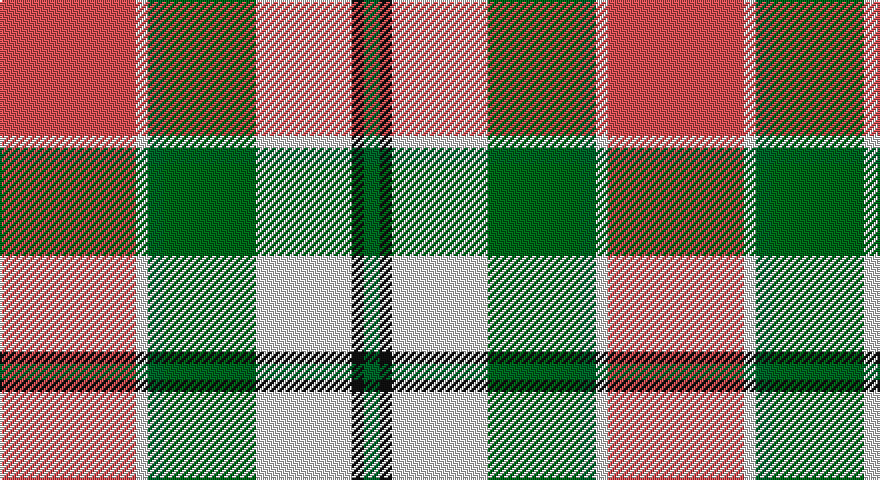

This page is one **sett** — a single exact thread-count. It belongs to the [tartan](/setts/r34w3gi4g23w24k3gi4/)
(the same proportion at any scale), whose colour order is pattern [GKWGGWR](/stripes/gkwggwr/).

Part of the [MacLachlan Dress](/tartans/maclachlan-dress/) tartan — the named design grouping this sett with its other cloths.

Sourced from house-of-tartan.  It is a [7 stripe tartan](/stripes/stripes7/).

Original link http://www.house-of-tartan.scotland.net/house/TartanViewjs.asp?colr=Def&tnam=828

## Provenance

Earliest known date: 1990 Based on the MacLachlan pattern in Old And Rare

## Also known as

This cloth is also recorded under:

- MacLachlan, dress

## Thread count
DO/68 LN6 G8 Ga46 LN48 K6 G/8

One full sett is **304 threads**.

## Palette

Palette: <strong>Tartan Register</strong> <small style="color:#888">(3 of 5 colours)</small>
<table><thead><tr><th>Colour</th><th>Threads</th><th>Shade</th><th>Base</th><th>OKLCh</th></tr></thead><tbody><tr><td>DO/</td><td style="text-align:right;font-variant-numeric:tabular-nums">68</td><td><code style="background-color:#D05054;">#D05054</code> <small style="color:#888">#D05054</small></td><td>R <code style="background-color:#CC0000;">#CC0000</code></td><td><small style="color:#888">oklch(60.2% 0.162 21.5)</small></td></tr><tr><td>LN</td><td style="text-align:right;font-variant-numeric:tabular-nums">6</td><td><code style="background-color:#E0E0E0;">#E0E0E0</code> <small style="color:#888">#E0E0E0</small></td><td>W <code style="background-color:#F7F7F7;">#F7F7F7</code></td><td><small style="color:#888">oklch(90.7% 0.000 89.9)</small></td></tr><tr><td>G</td><td style="text-align:right;font-variant-numeric:tabular-nums">8</td><td><code style="background-color:#006428;">#006428</code> <small style="color:#888">#006428</small></td><td>G <code style="background-color:#006100;">#006100</code></td><td><small style="color:#888">oklch(43.9% 0.124 149.0)</small></td></tr><tr><td>Ga</td><td style="text-align:right;font-variant-numeric:tabular-nums">46</td><td><code style="background-color:#006818;">#006818</code> <small style="color:#888">#006818</small></td><td>G <code style="background-color:#006100;">#006100</code></td><td><small style="color:#888">oklch(45.0% 0.142 145.0)</small></td></tr><tr><td>LN</td><td style="text-align:right;font-variant-numeric:tabular-nums">48</td><td><code style="background-color:#E0E0E0;">#E0E0E0</code> <small style="color:#888">#E0E0E0</small></td><td>W <code style="background-color:#F7F7F7;">#F7F7F7</code></td><td><small style="color:#888">oklch(90.7% 0.000 89.9)</small></td></tr><tr><td>K</td><td style="text-align:right;font-variant-numeric:tabular-nums">6</td><td><code style="background-color:#101010;">#101010</code> <small style="color:#888">#101010</small></td><td>K <code style="background-color:#000000;">#000000</code></td><td><small style="color:#888">oklch(17.3% 0.000 89.9)</small></td></tr><tr><td>G/</td><td style="text-align:right;font-variant-numeric:tabular-nums">8</td><td><code style="background-color:#006428;">#006428</code> <small style="color:#888">#006428</small></td><td>G <code style="background-color:#006100;">#006100</code></td><td><small style="color:#888">oklch(43.9% 0.124 149.0)</small></td></tr></tbody></table>

# Sample pattern

## Compared to the master

This cloth is one sett of its design; the master sett (the exemplar the design is anchored on) is below for comparison.

<figure style="margin:0"><figcaption style="color:#888;font-size:smaller">this sett</figcaption></figure>
<figure style="margin:0"><figcaption style="color:#888;font-size:smaller"><a href="/setts/r36w3lo4g24w24k3lo6/">master sett →</a></figcaption></figure>

## Nearest tartans

The nearest existing variants by ΔTartan distance, with this tartan at the top so the swatches line up against it.

ΔTartan

Tartan

Sett

—

<a href="/ttd/edit/#slug=r34w3gi4g23w24k3gi4~x2">MacLachlan Dress Clan Tartan</a> <a class="nn-out" href="/variants/s7/r34w3gi4g23w24k3gi4~x2/" title="open its dictionary page">↗</a>

0.40

<a href="/ttd/edit/#slug=r34w3dg4g23w24k3dg4~x2&amp;base=r34w3gi4g23w24k3gi4~x2">MacLachlan, dress</a> <a class="nn-out" href="/variants/s7/r34w3dg4g23w24k3dg4~x2/" title="open its dictionary page">↗</a>

0.76

<a href="/ttd/edit/#slug=r36w3lo4g24w24k3lo6~x2&amp;base=r34w3gi4g23w24k3gi4~x2">MacLachlan Dress</a> <a class="nn-out" href="/variants/s7/r36w3lo4g24w24k3lo6~x2/" title="open its dictionary page">↗</a>

0.77

<a href="/ttd/edit/#slug=r1w12g6r8t3ly1~x4&amp;base=r34w3gi4g23w24k3gi4~x2">MacLean, dress</a> <a class="nn-out" href="/variants/s6/r1w12g6r8t3ly1~x4/" title="open its dictionary page">↗</a>

0.90

<a href="/ttd/edit/#slug=r1w12g6r8lb3lo1~x4&amp;base=r34w3gi4g23w24k3gi4~x2">MacLean Dress (Lumsden)</a> <a class="nn-out" href="/variants/s6/r1w12g6r8lb3lo1~x4/" title="open its dictionary page">↗</a>

0.99

<a href="/ttd/edit/#slug=g4lo7r9lo9b20w2b2~x2&amp;base=r34w3gi4g23w24k3gi4~x2">Tombow 140th Anniversary, The</a> <a class="nn-out" href="/variants/s7/g4lo7r9lo9b20w2b2~x2/" title="open its dictionary page">↗</a>

0.99

<a href="/ttd/edit/#slug=r3w33dp8dg18r9g3~x2&amp;base=r34w3gi4g23w24k3gi4~x2">MacKintosh Dress (Dance)</a> <a class="nn-out" href="/variants/s6/r3w33dp8dg18r9g3~x2/" title="open its dictionary page">↗</a>

1.04

<a href="/variants/s8/wi4k13wi17lo2r2lo24wi2w2~x2/">Lalage (Personal)</a>

1.06

<a href="/ttd/edit/#slug=dy17g5db2w12db2ly4g7~x4&amp;base=r34w3gi4g23w24k3gi4~x2">Northern Ontario</a> <a class="nn-out" href="/variants/s7/dy17g5db2w12db2ly4g7~x4/" title="open its dictionary page">↗</a>

1.07

<a href="/ttd/edit/#slug=dg20r3y3r15w19dg3t2~x2&amp;base=r34w3gi4g23w24k3gi4~x2">Glasgow</a> <a class="nn-out" href="/variants/s7/dg20r3y3r15w19dg3t2~x2/" title="open its dictionary page">↗</a>

1.14

<a href="/ttd/edit/#slug=g4ly7o9ly9db20w2db2~x2&amp;base=r34w3gi4g23w24k3gi4~x2">Tombow 140th Anniversary, The</a> <a class="nn-out" href="/variants/s7/g4ly7o9ly9db20w2db2~x2/" title="open its dictionary page">↗</a>

## Neighbour map

Every grey dot is one of 14360 variants placed by the first two principal components of the ΔTartan feature space (44% of its variance). Red is this tartan; blue dots are its nearest — click one to open its page.

<svg viewBox="0 0 640 380" role="img" style="max-width:100%;height:auto;border:1px solid #e0e0e0;border-radius:4px;display:block" xmlns="http://www.w3.org/2000/svg"><image href="/nn/cloud.v1.png" width="640" height="380"/><a href="/variants/s7/r34w3dg4g23w24k3dg4~x2/"><circle cx="148.0" cy="151.7" r="4" fill="#3465a4"><title>MacLachlan, dress</title></circle></a><a href="/variants/s7/r36w3lo4g24w24k3lo6~x2/"><circle cx="139.4" cy="147.3" r="4" fill="#3465a4"><title>MacLachlan Dress</title></circle></a><a href="/variants/s6/r1w12g6r8t3ly1~x4/"><circle cx="157.9" cy="165.6" r="4" fill="#3465a4"><title>MacLean, dress</title></circle></a><a href="/variants/s6/r1w12g6r8lb3lo1~x4/"><circle cx="148.4" cy="159.7" r="4" fill="#3465a4"><title>MacLean Dress (Lumsden)</title></circle></a><a href="/variants/s7/g4lo7r9lo9b20w2b2~x2/"><circle cx="181.7" cy="182.6" r="4" fill="#3465a4"><title>Tombow 140th Anniversary, The</title></circle></a><a href="/variants/s6/r3w33dp8dg18r9g3~x2/"><circle cx="175.2" cy="158.8" r="4" fill="#3465a4"><title>MacKintosh Dress (Dance)</title></circle></a><a href="/variants/s8/wi4k13wi17lo2r2lo24wi2w2~x2/"><circle cx="165.7" cy="134.6" r="4" fill="#3465a4"><title>Lalage (Personal)</title></circle></a><a href="/variants/s7/dy17g5db2w12db2ly4g7~x4/"><circle cx="102.8" cy="176.6" r="4" fill="#3465a4"><title>Northern Ontario</title></circle></a><a href="/variants/s7/dg20r3y3r15w19dg3t2~x2/"><circle cx="133.9" cy="158.8" r="4" fill="#3465a4"><title>Glasgow</title></circle></a><a href="/variants/s7/g4ly7o9ly9db20w2db2~x2/"><circle cx="155.4" cy="171.6" r="4" fill="#3465a4"><title>Tombow 140th Anniversary, The</title></circle></a><circle cx="153.8" cy="156.0" r="5" fill="#c00000"/></svg>

ID: /variants/s7/r34w3gi4g23w24k3gi4~x2/
