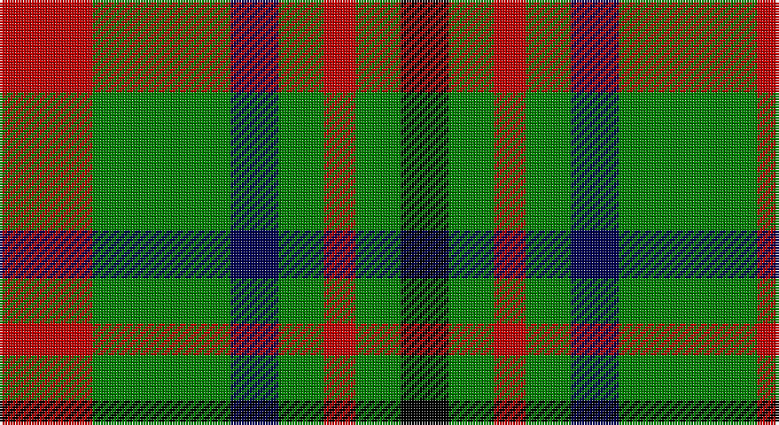

This page is one **sett** — a single exact thread-count. It belongs to the [tartan](/setts/r35g52db18g17r12g17k18/)
(the same proportion at any scale), whose colour order is pattern [KGRGBGR](/stripes/kgrgbgr/).

Sourced from weddslist.  It is a [7 stripe tartan](/stripes/stripes7/).

Original link http://www.weddslist.com/cgi-bin/tartans/pg.pl?source=sts

## Provenance

Earliest known date: 1892 This sett appears in Paton's collection which is housed at the Scottish Tartans Museum, Comrie in Perthshire, Scotland. The samples are undated but the collection is known to have been put together around the 1830's, with some additions during the Victorian period.

2 attestations — the source records this cloth was collapsed from (oldest owns this page)

<ul>
<li>undated — MacDona (weddslist, <a href="http://www.weddslist.com/cgi-bin/tartans/pg.pl?source=sts">record</a>)</li>
<li>undated — MacDona Family Tartan (house-of-tartan, <a href="http://www.house-of-tartan.scotland.net/house/TartanViewjs.asp?colr=Def&tnam=1104">record</a>)</li>
</ul>

## Thread count
R/35 G52 DB18 G17 R12 G17 K/18

One full sett is **285 threads**.

## Palette

Palette: <strong>Ingles Buchan</strong> <small style="color:#888">(1 of 4 colours)</small>
<table><thead><tr><th>Colour</th><th>Threads</th><th>Shade</th><th>Base</th><th>OKLCh</th></tr></thead><tbody><tr><td>R/</td><td style="text-align:right;font-variant-numeric:tabular-nums">35</td><td><code style="background-color:#C00000;">#C00000</code> <small style="color:#888">#C00000</small></td><td>R <code style="background-color:#CC0000;">#CC0000</code></td><td><small style="color:#888">oklch(50.7% 0.208 29.2)</small></td></tr><tr><td>G</td><td style="text-align:right;font-variant-numeric:tabular-nums">52</td><td><code style="background-color:#008000;">#008000</code> <small style="color:#888">#008000</small></td><td>G <code style="background-color:#006100;">#006100</code></td><td><small style="color:#888">oklch(52.0% 0.177 142.5)</small></td></tr><tr><td>DB</td><td style="text-align:right;font-variant-numeric:tabular-nums">18</td><td><code style="background-color:#000050;">#000050</code> <small style="color:#888">#000050</small></td><td>B <code style="background-color:#2A418A;">#2A418A</code></td><td><small style="color:#888">oklch(19.5% 0.135 264.1)</small></td></tr><tr><td>G</td><td style="text-align:right;font-variant-numeric:tabular-nums">17</td><td><code style="background-color:#008000;">#008000</code> <small style="color:#888">#008000</small></td><td>G <code style="background-color:#006100;">#006100</code></td><td><small style="color:#888">oklch(52.0% 0.177 142.5)</small></td></tr><tr><td>R</td><td style="text-align:right;font-variant-numeric:tabular-nums">12</td><td><code style="background-color:#C00000;">#C00000</code> <small style="color:#888">#C00000</small></td><td>R <code style="background-color:#CC0000;">#CC0000</code></td><td><small style="color:#888">oklch(50.7% 0.208 29.2)</small></td></tr><tr><td>G</td><td style="text-align:right;font-variant-numeric:tabular-nums">17</td><td><code style="background-color:#008000;">#008000</code> <small style="color:#888">#008000</small></td><td>G <code style="background-color:#006100;">#006100</code></td><td><small style="color:#888">oklch(52.0% 0.177 142.5)</small></td></tr><tr><td>K/</td><td style="text-align:right;font-variant-numeric:tabular-nums">18</td><td><code style="background-color:#000000;">#000000</code> <small style="color:#888">#000000</small></td><td>K <code style="background-color:#000000;">#000000</code></td><td><small style="color:#888">oklch(0.0% 0.000 0.0)</small></td></tr></tbody></table>

# Sample pattern

## Nearest tartans

The nearest existing variants by ΔTartan distance, with this tartan at the top so the swatches line up against it.

ΔTartan

Tartan

Sett

—

<a href="/ttd/edit/#slug=r35g52db18g17r12g17k18">MacDona</a> <a class="nn-out" href="/variants/s7/r35g52db18g17r12g17k18/" title="open its dictionary page">↗</a>

0.85

<a href="/ttd/edit/#slug=dg10db4dg4db5dg6ly10r6dg18ly4&amp;base=r35g52db18g17r12g17k18">Arkansas (Unofficial)</a> <a class="nn-out" href="/variants/s9/dg10db4dg4db5dg6ly10r6dg18ly4/" title="open its dictionary page">↗</a>

1.18

<a href="/ttd/edit/#slug=r20g29db10g16r6g10k19~x2&amp;base=r35g52db18g17r12g17k18">MacDonagh</a> <a class="nn-out" href="/variants/s7/r20g29db10g16r6g10k19~x2/" title="open its dictionary page">↗</a>

1.23

<a href="/ttd/edit/#slug=dg14o5dg14w5k2o5k2w9~x4&amp;base=r35g52db18g17r12g17k18">Unnamed (Hip Flask)</a> <a class="nn-out" href="/variants/s8/dg14o5dg14w5k2o5k2w9~x4/" title="open its dictionary page">↗</a>

1.24

<a href="/ttd/edit/#slug=g24k4g24k24t7r24t7~x2&amp;base=r35g52db18g17r12g17k18">Unidentified, Pinafore</a> <a class="nn-out" href="/variants/s7/g24k4g24k24t7r24t7~x2/" title="open its dictionary page">↗</a>

1.31

<a href="/ttd/edit/#slug=k5lo5w1lo5k5r1~x10&amp;base=r35g52db18g17r12g17k18">Canyon County Idaho Sheriff</a> <a class="nn-out" href="/variants/s6/k5lo5w1lo5k5r1~x10/" title="open its dictionary page">↗</a>

1.42

<a href="/ttd/edit/#slug=k4lo9k13g6lo3g9w4~x2&amp;base=r35g52db18g17r12g17k18">Ramsay (Orange)</a> <a class="nn-out" href="/variants/s7/k4lo9k13g6lo3g9w4~x2/" title="open its dictionary page">↗</a>

1.43

<a href="/ttd/edit/#slug=k4w19k11dg15k3dg16ly3~x2&amp;base=r35g52db18g17r12g17k18">Lawson, William 2002</a> <a class="nn-out" href="/variants/s7/k4w19k11dg15k3dg16ly3~x2/" title="open its dictionary page">↗</a>

1.44

<a href="/ttd/edit/#slug=g6k1r1t2r2~x4&amp;base=r35g52db18g17r12g17k18">Wilson's, No 193</a> <a class="nn-out" href="/variants/s5/g6k1r1t2r2~x4/" title="open its dictionary page">↗</a>

1.45

<a href="/ttd/edit/#slug=r1k6g6ly1g6ly1~x6&amp;base=r35g52db18g17r12g17k18">Moore Caledonian (Personal)</a> <a class="nn-out" href="/variants/s6/r1k6g6ly1g6ly1~x6/" title="open its dictionary page">↗</a>

1.50

<a href="/ttd/edit/#slug=k2g7t1k6r4g2~x4&amp;base=r35g52db18g17r12g17k18">Walker, James</a> <a class="nn-out" href="/variants/s6/k2g7t1k6r4g2~x4/" title="open its dictionary page">↗</a>

## Neighbour map

Every grey dot is one of 14360 variants placed by the first two principal components of the ΔTartan feature space (44% of its variance). Red is this tartan; blue dots are its nearest — click one to open its page.

<svg viewBox="0 0 640 380" role="img" style="max-width:100%;height:auto;border:1px solid #e0e0e0;border-radius:4px;display:block" xmlns="http://www.w3.org/2000/svg"><image href="/nn/cloud.v1.png" width="640" height="380"/><a href="/variants/s9/dg10db4dg4db5dg6ly10r6dg18ly4/"><circle cx="212.4" cy="240.6" r="4" fill="#3465a4"><title>Arkansas (Unofficial)</title></circle></a><a href="/variants/s7/r20g29db10g16r6g10k19~x2/"><circle cx="196.9" cy="276.7" r="4" fill="#3465a4"><title>MacDonagh</title></circle></a><a href="/variants/s8/dg14o5dg14w5k2o5k2w9~x4/"><circle cx="188.6" cy="213.0" r="4" fill="#3465a4"><title>Unnamed (Hip Flask)</title></circle></a><a href="/variants/s7/g24k4g24k24t7r24t7~x2/"><circle cx="136.9" cy="243.1" r="4" fill="#3465a4"><title>Unidentified, Pinafore</title></circle></a><a href="/variants/s6/k5lo5w1lo5k5r1~x10/"><circle cx="186.7" cy="255.3" r="4" fill="#3465a4"><title>Canyon County Idaho Sheriff</title></circle></a><a href="/variants/s7/k4lo9k13g6lo3g9w4~x2/"><circle cx="94.8" cy="256.2" r="4" fill="#3465a4"><title>Ramsay (Orange)</title></circle></a><a href="/variants/s7/k4w19k11dg15k3dg16ly3~x2/"><circle cx="148.1" cy="225.5" r="4" fill="#3465a4"><title>Lawson, William 2002</title></circle></a><a href="/variants/s5/g6k1r1t2r2~x4/"><circle cx="224.5" cy="237.6" r="4" fill="#3465a4"><title>Wilson's, No 193</title></circle></a><a href="/variants/s6/r1k6g6ly1g6ly1~x6/"><circle cx="262.1" cy="244.2" r="4" fill="#3465a4"><title>Moore Caledonian (Personal)</title></circle></a><a href="/variants/s6/k2g7t1k6r4g2~x4/"><circle cx="157.6" cy="237.9" r="4" fill="#3465a4"><title>Walker, James</title></circle></a><circle cx="181.5" cy="255.2" r="5" fill="#c00000"/></svg>

ID: /variants/s7/r35g52db18g17r12g17k18/
