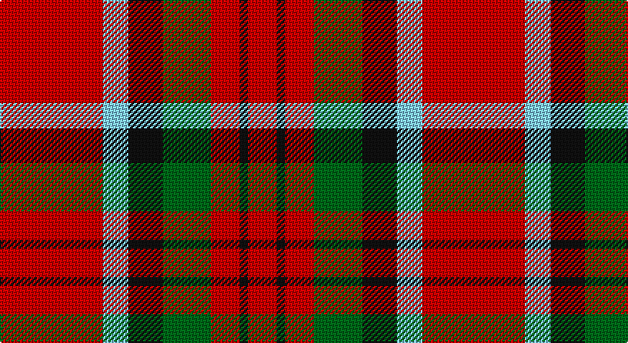

This page is one **sett** — a single exact thread-count. It belongs to the [tartan](/setts/r36lt9k12g17r10k3r10/)
(the same proportion at any scale), whose colour order is pattern [RKRGKWR](/stripes/rkrgkwr/).

Part of the [MacDuff](/tartans/macduff/) tartan — the named design grouping this sett with its other cloths.

Sourced from register-of-tartans.  It is a [7 stripe tartan](/stripes/stripes7/).

Original link https://www.tartanregister.gov.uk/tartanDetails.aspx?ref=2418

## Also known as

This cloth is also recorded under:

- MacDuff #2
- MacDuff #3
- MacDuff #4
- MacDuff #5
- MacDuff #6
- MacDuff Dress #2

## Register references

External register numbers recorded for this tartan.

- Scottish Register of Tartans: [2418](https://www.tartanregister.gov.uk/tartanDetails.aspx?ref=2418)
- Scottish Tartans Authority (ITI): 2455
- Scottish Tartans World Register: 2455

## Thread count
R/72 LB18 K24 G34 R20 K6 R/20

One full sett is **296 threads**.

## Palette

Palette: <strong>Tartan Register</strong>
<table><thead><tr><th>Colour</th><th>Threads</th><th>Shade</th><th>Base</th><th>OKLCh</th></tr></thead><tbody><tr><td>R/</td><td style="text-align:right;font-variant-numeric:tabular-nums">72</td><td><code style="background-color:#C80000;">#C80000</code> <small style="color:#888">#C80000</small></td><td>R <code style="background-color:#CC0000;">#CC0000</code></td><td><small style="color:#888">oklch(52.3% 0.215 29.2)</small></td></tr><tr><td>LB</td><td style="text-align:right;font-variant-numeric:tabular-nums">18</td><td><code style="background-color:#82CFFD;">#82CFFD</code> <small style="color:#888">#82CFFD</small></td><td>W <code style="background-color:#F7F7F7;">#F7F7F7</code></td><td><small style="color:#888">oklch(82.2% 0.100 236.0)</small></td></tr><tr><td>K</td><td style="text-align:right;font-variant-numeric:tabular-nums">24</td><td><code style="background-color:#101010;">#101010</code> <small style="color:#888">#101010</small></td><td>K <code style="background-color:#000000;">#000000</code></td><td><small style="color:#888">oklch(17.3% 0.000 89.9)</small></td></tr><tr><td>G</td><td style="text-align:right;font-variant-numeric:tabular-nums">34</td><td><code style="background-color:#006818;">#006818</code> <small style="color:#888">#006818</small></td><td>G <code style="background-color:#006100;">#006100</code></td><td><small style="color:#888">oklch(45.0% 0.142 145.0)</small></td></tr><tr><td>R</td><td style="text-align:right;font-variant-numeric:tabular-nums">20</td><td><code style="background-color:#C80000;">#C80000</code> <small style="color:#888">#C80000</small></td><td>R <code style="background-color:#CC0000;">#CC0000</code></td><td><small style="color:#888">oklch(52.3% 0.215 29.2)</small></td></tr><tr><td>K</td><td style="text-align:right;font-variant-numeric:tabular-nums">6</td><td><code style="background-color:#101010;">#101010</code> <small style="color:#888">#101010</small></td><td>K <code style="background-color:#000000;">#000000</code></td><td><small style="color:#888">oklch(17.3% 0.000 89.9)</small></td></tr><tr><td>R/</td><td style="text-align:right;font-variant-numeric:tabular-nums">20</td><td><code style="background-color:#C80000;">#C80000</code> <small style="color:#888">#C80000</small></td><td>R <code style="background-color:#CC0000;">#CC0000</code></td><td><small style="color:#888">oklch(52.3% 0.215 29.2)</small></td></tr></tbody></table>

# Sample pattern

## Compared to the master

This cloth is one sett of its design; the master sett (the exemplar the design is anchored on) is below for comparison.

<figure style="margin:0"><figcaption style="color:#888;font-size:smaller">this sett</figcaption></figure>
<figure style="margin:0"><figcaption style="color:#888;font-size:smaller"><a href="/setts/r10db6k8dg10r6dg3r6/">master sett →</a></figcaption></figure>

## Nearest tartans

The nearest existing variants by ΔTartan distance, with this tartan at the top so the swatches line up against it.

ΔTartan

Tartan

Sett

—

<a href="/ttd/edit/#slug=r36lt9k12g17r10k3r10~x2">MacDuff #6</a> <a class="nn-out" href="/variants/s7/r36lt9k12g17r10k3r10~x2/" title="open its dictionary page">↗</a>

0.64

<a href="/ttd/edit/#slug=r36db9k12g17r10k3r10~x2&amp;base=r36lt9k12g17r10k3r10~x2">MacDuff - 1819 (Clan)</a> <a class="nn-out" href="/variants/s7/r36db9k12g17r10k3r10~x2/" title="open its dictionary page">↗</a>

0.70

<a href="/ttd/edit/#slug=r5w2r28k12dg16r3~x2&amp;base=r36lt9k12g17r10k3r10~x2">MacKintosh #4</a> <a class="nn-out" href="/variants/s6/r5w2r28k12dg16r3~x2/" title="open its dictionary page">↗</a>

0.85

<a href="/ttd/edit/#slug=r10g24k10r28lb3r6~x2&amp;base=r36lt9k12g17r10k3r10~x2">Nisbet</a> <a class="nn-out" href="/variants/s6/r10g24k10r28lb3r6~x2/" title="open its dictionary page">↗</a>

0.89

<a href="/ttd/edit/#slug=r22t8k9g14r10t2r10~x2&amp;base=r36lt9k12g17r10k3r10~x2">MacDuff</a> <a class="nn-out" href="/variants/s7/r22t8k9g14r10t2r10~x2/" title="open its dictionary page">↗</a>

0.89

<a href="/ttd/edit/#slug=r22t8k9dg14r10t2r10~x2&amp;base=r36lt9k12g17r10k3r10~x2">MacDuff #2</a> <a class="nn-out" href="/variants/s7/r22t8k9dg14r10t2r10~x2/" title="open its dictionary page">↗</a>

0.94

<a href="/ttd/edit/#slug=r33k8dr12g12r8dr2r8~x2&amp;base=r36lt9k12g17r10k3r10~x2">Tipperary</a> <a class="nn-out" href="/variants/s7/r33k8dr12g12r8dr2r8~x2/" title="open its dictionary page">↗</a>

0.95

<a href="/ttd/edit/#slug=g5w2g8r9k3r4k3r17g3~x2&amp;base=r36lt9k12g17r10k3r10~x2">Morrison</a> <a class="nn-out" href="/variants/s9/g5w2g8r9k3r4k3r17g3~x2/" title="open its dictionary page">↗</a>

0.98

<a href="/ttd/edit/#slug=r52k32dg22r16ly3r16&amp;base=r36lt9k12g17r10k3r10~x2">Sturrock</a> <a class="nn-out" href="/variants/s6/r52k32dg22r16ly3r16/" title="open its dictionary page">↗</a>

1.02

<a href="/ttd/edit/#slug=dg9lb4dg15r17k5r7k5r32dg5&amp;base=r36lt9k12g17r10k3r10~x2">Morrison LC</a> <a class="nn-out" href="/variants/s9/dg9lb4dg15r17k5r7k5r32dg5/" title="open its dictionary page">↗</a>

1.02

<a href="/ttd/edit/#slug=r4k2r24k6db6dg16r3~x2&amp;base=r36lt9k12g17r10k3r10~x2">MacDuff #4</a> <a class="nn-out" href="/variants/s7/r4k2r24k6db6dg16r3~x2/" title="open its dictionary page">↗</a>

## Neighbour map

Every grey dot is one of 14360 variants placed by the first two principal components of the ΔTartan feature space (44% of its variance). Red is this tartan; blue dots are its nearest — click one to open its page.

<svg viewBox="0 0 640 380" role="img" style="max-width:100%;height:auto;border:1px solid #e0e0e0;border-radius:4px;display:block" xmlns="http://www.w3.org/2000/svg"><image href="/nn/cloud.v1.png" width="640" height="380"/><a href="/variants/s7/r36db9k12g17r10k3r10~x2/"><circle cx="308.8" cy="200.4" r="4" fill="#3465a4"><title>MacDuff - 1819 (Clan)</title></circle></a><a href="/variants/s6/r5w2r28k12dg16r3~x2/"><circle cx="300.2" cy="181.9" r="4" fill="#3465a4"><title>MacKintosh #4</title></circle></a><a href="/variants/s6/r10g24k10r28lb3r6~x2/"><circle cx="285.6" cy="217.7" r="4" fill="#3465a4"><title>Nisbet</title></circle></a><a href="/variants/s7/r22t8k9g14r10t2r10~x2/"><circle cx="253.4" cy="213.9" r="4" fill="#3465a4"><title>MacDuff</title></circle></a><a href="/variants/s7/r22t8k9dg14r10t2r10~x2/"><circle cx="267.5" cy="216.7" r="4" fill="#3465a4"><title>MacDuff #2</title></circle></a><a href="/variants/s7/r33k8dr12g12r8dr2r8~x2/"><circle cx="327.9" cy="178.7" r="4" fill="#3465a4"><title>Tipperary</title></circle></a><a href="/variants/s9/g5w2g8r9k3r4k3r17g3~x2/"><circle cx="285.1" cy="195.8" r="4" fill="#3465a4"><title>Morrison</title></circle></a><a href="/variants/s6/r52k32dg22r16ly3r16/"><circle cx="327.4" cy="190.4" r="4" fill="#3465a4"><title>Sturrock</title></circle></a><a href="/variants/s9/dg9lb4dg15r17k5r7k5r32dg5/"><circle cx="280.4" cy="189.6" r="4" fill="#3465a4"><title>Morrison LC</title></circle></a><a href="/variants/s7/r4k2r24k6db6dg16r3~x2/"><circle cx="278.1" cy="183.7" r="4" fill="#3465a4"><title>MacDuff #4</title></circle></a><circle cx="291.5" cy="190.9" r="5" fill="#c00000"/></svg>

ID: /variants/s7/r36lt9k12g17r10k3r10~x2/
