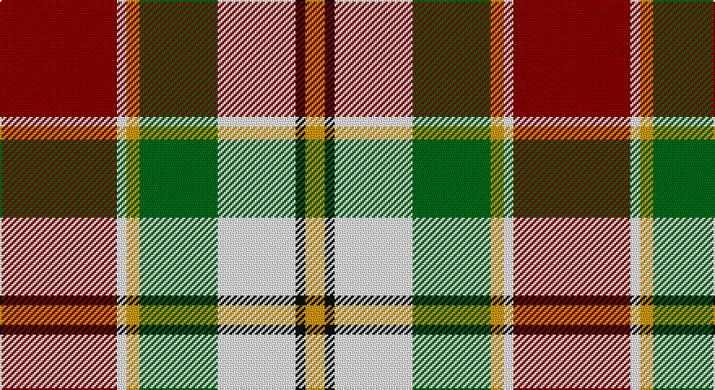

This page is one **sett** — a single exact thread-count. It belongs to the [tartan](/setts/r36w3lo4g24w24k3lo6/)
(the same proportion at any scale), whose colour order is pattern [RWYGWKY](/stripes/rwygwky/).

Part of the [MacLachlan Dress](/tartans/maclachlan-dress/) tartan — the named design grouping this sett with its other cloths.

Sourced from register-of-tartans.  It is a [7 stripe tartan](/stripes/stripes7/).

Original link https://www.tartanregister.gov.uk/tartanDetails.aspx?ref=2587

## Also known as

This cloth is also recorded under:

- MacLachlan, dress

2 attestations — the source records this cloth was collapsed from (oldest owns this page)

<ul>
<li>01/01/2002 — MacLachlan Dress (register-of-tartans, <a href="https://www.tartanregister.gov.uk/tartanDetails.aspx?ref=2587">record</a>)</li>
<li>pre 2002 — MacLachlan Dress (Dance) (tartans-authority, <a href="http://www.tartansauthority.com/tartan-ferret/display/828/">record</a>)</li>
</ul>

## Register references

External register numbers recorded for this tartan.

- Scottish Register of Tartans: [2587](https://www.tartanregister.gov.uk/tartanDetails.aspx?ref=2587)
- Scottish Tartans Authority (ITI): 828
- Scottish Tartans World Register: 828

## Thread count
DR/72 W6 DY8 G48 W48 K6 DY/12

One full sett is **316 threads**.

## Palette

Palette: <strong>Tartan Register</strong> <small style="color:#888">(4 of 5 colours)</small>
<table><thead><tr><th>Colour</th><th>Threads</th><th>Shade</th><th>Base</th><th>OKLCh</th></tr></thead><tbody><tr><td>DR/</td><td style="text-align:right;font-variant-numeric:tabular-nums">72</td><td><code style="background-color:#880000;">#880000</code> <small style="color:#888">#880000</small></td><td>R <code style="background-color:#CC0000;">#CC0000</code></td><td><small style="color:#888">oklch(39.4% 0.162 29.2)</small></td></tr><tr><td>W</td><td style="text-align:right;font-variant-numeric:tabular-nums">6</td><td><code style="background-color:#F8F8F8;">#F8F8F8</code> <small style="color:#888">#F8F8F8</small></td><td>W <code style="background-color:#F7F7F7;">#F7F7F7</code></td><td><small style="color:#888">oklch(97.9% 0.000 89.9)</small></td></tr><tr><td>DY</td><td style="text-align:right;font-variant-numeric:tabular-nums">8</td><td><code style="background-color:#D09800;">#D09800</code> <small style="color:#888">#D09800</small></td><td>Y <code style="background-color:#F2BF00;">#F2BF00</code></td><td><small style="color:#888">oklch(71.4% 0.147 82.1)</small></td></tr><tr><td>G</td><td style="text-align:right;font-variant-numeric:tabular-nums">48</td><td><code style="background-color:#006818;">#006818</code> <small style="color:#888">#006818</small></td><td>G <code style="background-color:#006100;">#006100</code></td><td><small style="color:#888">oklch(45.0% 0.142 145.0)</small></td></tr><tr><td>W</td><td style="text-align:right;font-variant-numeric:tabular-nums">48</td><td><code style="background-color:#F8F8F8;">#F8F8F8</code> <small style="color:#888">#F8F8F8</small></td><td>W <code style="background-color:#F7F7F7;">#F7F7F7</code></td><td><small style="color:#888">oklch(97.9% 0.000 89.9)</small></td></tr><tr><td>K</td><td style="text-align:right;font-variant-numeric:tabular-nums">6</td><td><code style="background-color:#101010;">#101010</code> <small style="color:#888">#101010</small></td><td>K <code style="background-color:#000000;">#000000</code></td><td><small style="color:#888">oklch(17.3% 0.000 89.9)</small></td></tr><tr><td>DY/</td><td style="text-align:right;font-variant-numeric:tabular-nums">12</td><td><code style="background-color:#D09800;">#D09800</code> <small style="color:#888">#D09800</small></td><td>Y <code style="background-color:#F2BF00;">#F2BF00</code></td><td><small style="color:#888">oklch(71.4% 0.147 82.1)</small></td></tr></tbody></table>

# Sample pattern

## Nearest tartans

The nearest existing variants by ΔTartan distance, with this tartan at the top so the swatches line up against it.

ΔTartan

Tartan

Sett

—

<a href="/ttd/edit/#slug=r36w3lo4g24w24k3lo6~x2">MacLachlan Dress</a> <a class="nn-out" href="/variants/s7/r36w3lo4g24w24k3lo6~x2/" title="open its dictionary page">↗</a>

0.46

<a href="/ttd/edit/#slug=r34w3dg4g23w24k3dg4~x2&amp;base=r36w3lo4g24w24k3lo6~x2">MacLachlan, dress</a> <a class="nn-out" href="/variants/s7/r34w3dg4g23w24k3dg4~x2/" title="open its dictionary page">↗</a>

0.76

<a href="/ttd/edit/#slug=r34w3gi4g23w24k3gi4~x2&amp;base=r36w3lo4g24w24k3lo6~x2">MacLachlan Dress Clan Tartan</a> <a class="nn-out" href="/variants/s7/r34w3gi4g23w24k3gi4~x2/" title="open its dictionary page">↗</a>

0.76

<a href="/ttd/edit/#slug=dg20r3y3r15w19dg3t2~x2&amp;base=r36w3lo4g24w24k3lo6~x2">Glasgow</a> <a class="nn-out" href="/variants/s7/dg20r3y3r15w19dg3t2~x2/" title="open its dictionary page">↗</a>

0.98

<a href="/ttd/edit/#slug=ly22k11lyi10k2g2k2lyi10k11ly7r2~x2&amp;base=r36w3lo4g24w24k3lo6~x2">Project, Faith Inc (Corporate)</a> <a class="nn-out" href="/variants/s10/ly22k11lyi10k2g2k2lyi10k11ly7r2~x2/" title="open its dictionary page">↗</a>

1.00

<a href="/ttd/edit/#slug=r2w12t1k12lo12k1~x2&amp;base=r36w3lo4g24w24k3lo6~x2">Dutch, dress</a> <a class="nn-out" href="/variants/s6/r2w12t1k12lo12k1~x2/" title="open its dictionary page">↗</a>

1.02

<a href="/ttd/edit/#slug=r1w12g6r8lb3lo1~x4&amp;base=r36w3lo4g24w24k3lo6~x2">MacLean Dress (Lumsden)</a> <a class="nn-out" href="/variants/s6/r1w12g6r8lb3lo1~x4/" title="open its dictionary page">↗</a>

1.04

<a href="/ttd/edit/#slug=r2w12y1k12o12k1~x2&amp;base=r36w3lo4g24w24k3lo6~x2">Dutch Dress</a> <a class="nn-out" href="/variants/s6/r2w12y1k12o12k1~x2/" title="open its dictionary page">↗</a>

1.10

<a href="/ttd/edit/#slug=do2lo2do15lo1w10loi15lo2loi2~x2&amp;base=r36w3lo4g24w24k3lo6~x2">Bannockbane Orange Stripes</a> <a class="nn-out" href="/variants/s8/do2lo2do15lo1w10loi15lo2loi2~x2/" title="open its dictionary page">↗</a>

1.11

<a href="/ttd/edit/#slug=dg2do8dg8r3do1w12dg2y1~x2&amp;base=r36w3lo4g24w24k3lo6~x2">National Trust Corporate Tartan</a> <a class="nn-out" href="/variants/s8/dg2do8dg8r3do1w12dg2y1~x2/" title="open its dictionary page">↗</a>

1.12

<a href="/ttd/edit/#slug=r10dg3ly3w1k2w1ly3dg12w2r3w1~x4&amp;base=r36w3lo4g24w24k3lo6~x2">Unnamed C18th - Pr Ch Ed Plaid?</a> <a class="nn-out" href="/variants/s11/r10dg3ly3w1k2w1ly3dg12w2r3w1~x4/" title="open its dictionary page">↗</a>

## Neighbour map

Every grey dot is one of 14360 variants placed by the first two principal components of the ΔTartan feature space (44% of its variance). Red is this tartan; blue dots are its nearest — click one to open its page.

<svg viewBox="0 0 640 380" role="img" style="max-width:100%;height:auto;border:1px solid #e0e0e0;border-radius:4px;display:block" xmlns="http://www.w3.org/2000/svg"><image href="/nn/cloud.v1.png" width="640" height="380"/><a href="/variants/s7/r34w3dg4g23w24k3dg4~x2/"><circle cx="148.0" cy="151.7" r="4" fill="#3465a4"><title>MacLachlan, dress</title></circle></a><a href="/variants/s7/r34w3gi4g23w24k3gi4~x2/"><circle cx="153.8" cy="156.0" r="4" fill="#3465a4"><title>MacLachlan Dress Clan Tartan</title></circle></a><a href="/variants/s7/dg20r3y3r15w19dg3t2~x2/"><circle cx="133.9" cy="158.8" r="4" fill="#3465a4"><title>Glasgow</title></circle></a><a href="/variants/s10/ly22k11lyi10k2g2k2lyi10k11ly7r2~x2/"><circle cx="128.0" cy="144.2" r="4" fill="#3465a4"><title>Project, Faith Inc (Corporate)</title></circle></a><a href="/variants/s6/r2w12t1k12lo12k1~x2/"><circle cx="120.1" cy="155.0" r="4" fill="#3465a4"><title>Dutch, dress</title></circle></a><a href="/variants/s6/r1w12g6r8lb3lo1~x4/"><circle cx="148.4" cy="159.7" r="4" fill="#3465a4"><title>MacLean Dress (Lumsden)</title></circle></a><a href="/variants/s6/r2w12y1k12o12k1~x2/"><circle cx="131.6" cy="163.1" r="4" fill="#3465a4"><title>Dutch Dress</title></circle></a><a href="/variants/s8/do2lo2do15lo1w10loi15lo2loi2~x2/"><circle cx="184.8" cy="151.9" r="4" fill="#3465a4"><title>Bannockbane Orange Stripes</title></circle></a><a href="/variants/s8/dg2do8dg8r3do1w12dg2y1~x2/"><circle cx="122.4" cy="152.8" r="4" fill="#3465a4"><title>National Trust Corporate Tartan</title></circle></a><a href="/variants/s11/r10dg3ly3w1k2w1ly3dg12w2r3w1~x4/"><circle cx="142.8" cy="125.3" r="4" fill="#3465a4"><title>Unnamed C18th - Pr Ch Ed Plaid?</title></circle></a><circle cx="139.4" cy="147.3" r="5" fill="#c00000"/></svg>

ID: /variants/s7/r36w3lo4g24w24k3lo6~x2/
