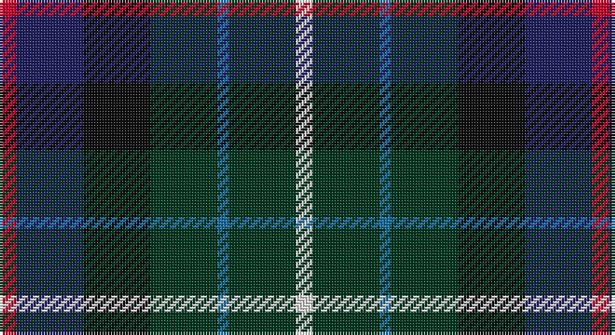

This page is one **sett** — a single exact thread-count. It belongs to the [tartan](/setts/r3db12k12dg12b2dg12w3/)
(the same proportion at any scale), whose colour order is pattern [RBKGBGW](/stripes/rbkgbgw/).

Part of the [Game Fair](/tartans/game-fair/) tartan — the named design grouping this sett with its other cloths.

Sourced from register-of-tartans.  It is a [7 stripe tartan](/stripes/stripes7/).

Original link https://www.tartanregister.gov.uk/tartanDetails.aspx?ref=1310

## Register references

External register numbers recorded for this tartan.

- Scottish Register of Tartans: [1310](https://www.tartanregister.gov.uk/tartanDetails.aspx?ref=1310)
- Scottish Tartans Authority (ITI): 4081

## Thread count
R/6 DB24 K24 DG24 B4 DG24 LN/6

One full sett is **212 threads**.

## Palette

Palette: <strong>Tartan Register</strong>
<table><thead><tr><th>Colour</th><th>Threads</th><th>Shade</th><th>Base</th><th>OKLCh</th></tr></thead><tbody><tr><td>R/</td><td style="text-align:right;font-variant-numeric:tabular-nums">6</td><td><code style="background-color:#C8002C;">#C8002C</code> <small style="color:#888">#C8002C</small></td><td>R <code style="background-color:#CC0000;">#CC0000</code></td><td><small style="color:#888">oklch(52.6% 0.212 22.0)</small></td></tr><tr><td>DB</td><td style="text-align:right;font-variant-numeric:tabular-nums">24</td><td><code style="background-color:#202060;">#202060</code> <small style="color:#888">#202060</small></td><td>B <code style="background-color:#2A418A;">#2A418A</code></td><td><small style="color:#888">oklch(28.9% 0.111 276.9)</small></td></tr><tr><td>K</td><td style="text-align:right;font-variant-numeric:tabular-nums">24</td><td><code style="background-color:#101010;">#101010</code> <small style="color:#888">#101010</small></td><td>K <code style="background-color:#000000;">#000000</code></td><td><small style="color:#888">oklch(17.3% 0.000 89.9)</small></td></tr><tr><td>DG</td><td style="text-align:right;font-variant-numeric:tabular-nums">24</td><td><code style="background-color:#003820;">#003820</code> <small style="color:#888">#003820</small></td><td>G <code style="background-color:#006100;">#006100</code></td><td><small style="color:#888">oklch(30.0% 0.070 158.3)</small></td></tr><tr><td>B</td><td style="text-align:right;font-variant-numeric:tabular-nums">4</td><td><code style="background-color:#1870A4;">#1870A4</code> <small style="color:#888">#1870A4</small></td><td>B <code style="background-color:#2A418A;">#2A418A</code></td><td><small style="color:#888">oklch(52.2% 0.113 241.2)</small></td></tr><tr><td>DG</td><td style="text-align:right;font-variant-numeric:tabular-nums">24</td><td><code style="background-color:#003820;">#003820</code> <small style="color:#888">#003820</small></td><td>G <code style="background-color:#006100;">#006100</code></td><td><small style="color:#888">oklch(30.0% 0.070 158.3)</small></td></tr><tr><td>LN/</td><td style="text-align:right;font-variant-numeric:tabular-nums">6</td><td><code style="background-color:#E0E0E0;">#E0E0E0</code> <small style="color:#888">#E0E0E0</small></td><td>W <code style="background-color:#F7F7F7;">#F7F7F7</code></td><td><small style="color:#888">oklch(90.7% 0.000 89.9)</small></td></tr></tbody></table>

# Sample pattern

## Nearest tartans

The nearest existing variants by ΔTartan distance, with this tartan at the top so the swatches line up against it.

ΔTartan

Tartan

Sett

—

<a href="/ttd/edit/#slug=r3db12k12dg12b2dg12w3~x2">Game Fair</a> <a class="nn-out" href="/variants/s7/r3db12k12dg12b2dg12w3~x2/" title="open its dictionary page">↗</a>

1.19

<a href="/ttd/edit/#slug=db16gi8dbi8gi8db16r3dy3g3~x2&amp;base=r3db12k12dg12b2dg12w3~x2">Glen Erin Canadian Tartan</a> <a class="nn-out" href="/variants/s8/db16gi8dbi8gi8db16r3dy3g3~x2/" title="open its dictionary page">↗</a>

1.19

<a href="/ttd/edit/#slug=r2g10db10k5b2k5g10k10b2k10lo2~x2&amp;base=r3db12k12dg12b2dg12w3~x2">Nairn (Edinburgh Woollen Mill)</a> <a class="nn-out" href="/variants/s11/r2g10db10k5b2k5g10k10b2k10lo2~x2/" title="open its dictionary page">↗</a>

1.20

<a href="/ttd/edit/#slug=r3g9y15db10k2db18w3~x2&amp;base=r3db12k12dg12b2dg12w3~x2">Coulthard (Personal)</a> <a class="nn-out" href="/variants/s7/r3g9y15db10k2db18w3~x2/" title="open its dictionary page">↗</a>

1.20

<a href="/ttd/edit/#slug=db10o3db10r3k21g20k15r3~x2&amp;base=r3db12k12dg12b2dg12w3~x2">Williamson/Smart (Personal)</a> <a class="nn-out" href="/variants/s8/db10o3db10r3k21g20k15r3~x2/" title="open its dictionary page">↗</a>

1.22

<a href="/ttd/edit/#slug=w3db3r2db14k3dg12k14db16lo2~x2&amp;base=r3db12k12dg12b2dg12w3~x2">Royal Navy Submarine Service</a> <a class="nn-out" href="/variants/s9/w3db3r2db14k3dg12k14db16lo2~x2/" title="open its dictionary page">↗</a>

1.24

<a href="/ttd/edit/#slug=g8k7db12r2db12k7g8t2~x4&amp;base=r3db12k12dg12b2dg12w3~x2">Forbo Nairn Corporate Tartan</a> <a class="nn-out" href="/variants/s8/g8k7db12r2db12k7g8t2~x4/" title="open its dictionary page">↗</a>

1.25

<a href="/ttd/edit/#slug=r3dp8g20k20db17k3lg3~x2&amp;base=r3db12k12dg12b2dg12w3~x2">Gracey (2013)</a> <a class="nn-out" href="/variants/s7/r3dp8g20k20db17k3lg3~x2/" title="open its dictionary page">↗</a>

1.27

<a href="/ttd/edit/#slug=db8g11k3g11r12dt10ly2~x2&amp;base=r3db12k12dg12b2dg12w3~x2">Parliament Trade Tartan</a> <a class="nn-out" href="/variants/s7/db8g11k3g11r12dt10ly2~x2/" title="open its dictionary page">↗</a>

1.30

<a href="/ttd/edit/#slug=db2lo1db6r1db2r2k2g6t1g2~x4&amp;base=r3db12k12dg12b2dg12w3~x2">Nance (1998)</a> <a class="nn-out" href="/variants/s10/db2lo1db6r1db2r2k2g6t1g2~x4/" title="open its dictionary page">↗</a>

1.30

<a href="/ttd/edit/#slug=db10r7db31k25dg23k8db7k8ly5~x2&amp;base=r3db12k12dg12b2dg12w3~x2">MacCallum of Berwick</a> <a class="nn-out" href="/variants/s9/db10r7db31k25dg23k8db7k8ly5~x2/" title="open its dictionary page">↗</a>

## Neighbour map

Every grey dot is one of 14360 variants placed by the first two principal components of the ΔTartan feature space (44% of its variance). Red is this tartan; blue dots are its nearest — click one to open its page.

<svg viewBox="0 0 640 380" role="img" style="max-width:100%;height:auto;border:1px solid #e0e0e0;border-radius:4px;display:block" xmlns="http://www.w3.org/2000/svg"><image href="/nn/cloud.v1.png" width="640" height="380"/><a href="/variants/s8/db16gi8dbi8gi8db16r3dy3g3~x2/"><circle cx="200.6" cy="240.5" r="4" fill="#3465a4"><title>Glen Erin Canadian Tartan</title></circle></a><a href="/variants/s11/r2g10db10k5b2k5g10k10b2k10lo2~x2/"><circle cx="141.2" cy="221.1" r="4" fill="#3465a4"><title>Nairn (Edinburgh Woollen Mill)</title></circle></a><a href="/variants/s7/r3g9y15db10k2db18w3~x2/"><circle cx="186.1" cy="202.0" r="4" fill="#3465a4"><title>Coulthard (Personal)</title></circle></a><a href="/variants/s8/db10o3db10r3k21g20k15r3~x2/"><circle cx="172.9" cy="225.3" r="4" fill="#3465a4"><title>Williamson/Smart (Personal)</title></circle></a><a href="/variants/s9/w3db3r2db14k3dg12k14db16lo2~x2/"><circle cx="211.4" cy="205.0" r="4" fill="#3465a4"><title>Royal Navy Submarine Service</title></circle></a><a href="/variants/s8/g8k7db12r2db12k7g8t2~x4/"><circle cx="163.7" cy="259.9" r="4" fill="#3465a4"><title>Forbo Nairn Corporate Tartan</title></circle></a><a href="/variants/s7/r3dp8g20k20db17k3lg3~x2/"><circle cx="111.4" cy="213.5" r="4" fill="#3465a4"><title>Gracey (2013)</title></circle></a><a href="/variants/s7/db8g11k3g11r12dt10ly2~x2/"><circle cx="115.4" cy="248.3" r="4" fill="#3465a4"><title>Parliament Trade Tartan</title></circle></a><a href="/variants/s10/db2lo1db6r1db2r2k2g6t1g2~x4/"><circle cx="134.4" cy="196.5" r="4" fill="#3465a4"><title>Nance (1998)</title></circle></a><a href="/variants/s9/db10r7db31k25dg23k8db7k8ly5~x2/"><circle cx="159.6" cy="225.1" r="4" fill="#3465a4"><title>MacCallum of Berwick</title></circle></a><circle cx="149.9" cy="237.5" r="5" fill="#c00000"/></svg>

ID: /variants/s7/r3db12k12dg12b2dg12w3~x2/
