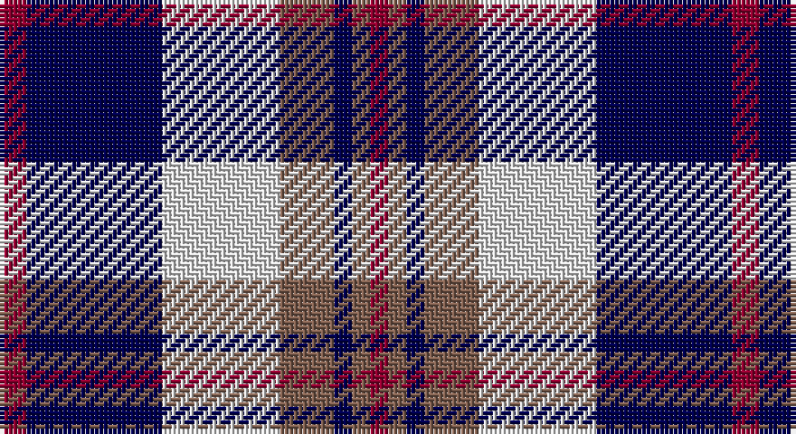

This page is one **sett** — a single exact thread-count. It belongs to the [tartan](/setts/r3db15w13o6db2o2r2/)
(the same proportion at any scale), whose colour order is pattern [RBWRBRR](/stripes/rbwrbrr/).

Sourced from weddslist.  It is a [7 stripe tartan](/stripes/stripes7/).

Original link http://www.weddslist.com/cgi-bin/tartans/pg.pl?source=sts

## Thread count
DR/6 DB30 LN26 LT12 DB4 LT4 DR/4

One full sett is **162 threads**.

## Palette

Palette: <strong>Tartan Dictionary</strong> <small style="color:#888">(1 of 4 colours)</small>
<table><thead><tr><th>Colour</th><th>Threads</th><th>Shade</th><th>Base</th><th>OKLCh</th></tr></thead><tbody><tr><td>DR/</td><td style="text-align:right;font-variant-numeric:tabular-nums">6</td><td><code style="background-color:#900030;">#900030</code> <small style="color:#888">#900030</small></td><td>R <code style="background-color:#CC0000;">#CC0000</code></td><td><small style="color:#888">oklch(41.6% 0.166 13.6)</small></td></tr><tr><td>DB</td><td style="text-align:right;font-variant-numeric:tabular-nums">30</td><td><code style="background-color:#000050;">#000050</code> <small style="color:#888">#000050</small></td><td>B <code style="background-color:#2A418A;">#2A418A</code></td><td><small style="color:#888">oklch(19.5% 0.135 264.1)</small></td></tr><tr><td>LN</td><td style="text-align:right;font-variant-numeric:tabular-nums">26</td><td><code style="background-color:#E0E0E0;">#E0E0E0</code> <small style="color:#888">#E0E0E0</small></td><td>W <code style="background-color:#F7F7F7;">#F7F7F7</code></td><td><small style="color:#888">oklch(90.7% 0.000 89.9)</small></td></tr><tr><td>LT</td><td style="text-align:right;font-variant-numeric:tabular-nums">12</td><td><code style="background-color:#806050;">#806050</code> <small style="color:#888">#806050</small></td><td>R <code style="background-color:#CC0000;">#CC0000</code></td><td><small style="color:#888">oklch(51.7% 0.049 47.8)</small></td></tr><tr><td>DB</td><td style="text-align:right;font-variant-numeric:tabular-nums">4</td><td><code style="background-color:#000050;">#000050</code> <small style="color:#888">#000050</small></td><td>B <code style="background-color:#2A418A;">#2A418A</code></td><td><small style="color:#888">oklch(19.5% 0.135 264.1)</small></td></tr><tr><td>LT</td><td style="text-align:right;font-variant-numeric:tabular-nums">4</td><td><code style="background-color:#806050;">#806050</code> <small style="color:#888">#806050</small></td><td>R <code style="background-color:#CC0000;">#CC0000</code></td><td><small style="color:#888">oklch(51.7% 0.049 47.8)</small></td></tr><tr><td>DR/</td><td style="text-align:right;font-variant-numeric:tabular-nums">4</td><td><code style="background-color:#900030;">#900030</code> <small style="color:#888">#900030</small></td><td>R <code style="background-color:#CC0000;">#CC0000</code></td><td><small style="color:#888">oklch(41.6% 0.166 13.6)</small></td></tr></tbody></table>

# Sample pattern

## Nearest tartans

The nearest existing variants by ΔTartan distance, with this tartan at the top so the swatches line up against it.

ΔTartan

Tartan

Sett

—

<a href="/ttd/edit/#slug=r3db15w13o6db2o2r2~x2">Thom(p)son, Navy</a> <a class="nn-out" href="/variants/s7/r3db15w13o6db2o2r2~x2/" title="open its dictionary page">↗</a>

0.49

<a href="/ttd/edit/#slug=m3db15w13dy6db2dy2m2~x2&amp;base=r3db15w13o6db2o2r2~x2">Thompson Navy Trade Tartan</a> <a class="nn-out" href="/variants/s7/m3db15w13dy6db2dy2m2~x2/" title="open its dictionary page">↗</a>

0.87

<a href="/ttd/edit/#slug=r3k1w5k4db11r1~x4&amp;base=r3db15w13o6db2o2r2~x2">Hydro-Electric (Corporate)</a> <a class="nn-out" href="/variants/s6/r3k1w5k4db11r1~x4/" title="open its dictionary page">↗</a>

1.00

<a href="/ttd/edit/#slug=r2lb1db8lb8y8lb1y1~x2&amp;base=r3db15w13o6db2o2r2~x2">Over Mountain</a> <a class="nn-out" href="/variants/s7/r2lb1db8lb8y8lb1y1~x2/" title="open its dictionary page">↗</a>

1.04

<a href="/variants/s7/k2b16w2ki16w15k2w2~x2/">Strathclyde</a>

1.06

<a href="/ttd/edit/#slug=db18w3db3w3r3w3k5ly12~x2&amp;base=r3db15w13o6db2o2r2~x2">Kile (Red line) (Personal)</a> <a class="nn-out" href="/variants/s8/db18w3db3w3r3w3k5ly12~x2/" title="open its dictionary page">↗</a>

1.12

<a href="/ttd/edit/#slug=dg4db22dt6w10db3w6dp4dt3w4~x2&amp;base=r3db15w13o6db2o2r2~x2">Sibbald Blue (2014)</a> <a class="nn-out" href="/variants/s9/dg4db22dt6w10db3w6dp4dt3w4~x2/" title="open its dictionary page">↗</a>

1.12

<a href="/ttd/edit/#slug=lb33k4lb4k5lb4k7db41r4~x2&amp;base=r3db15w13o6db2o2r2~x2">Kinnaird</a> <a class="nn-out" href="/variants/s8/lb33k4lb4k5lb4k7db41r4~x2/" title="open its dictionary page">↗</a>

1.14

<a href="/ttd/edit/#slug=db2w2db8dr8w10db2w1db1~x2&amp;base=r3db15w13o6db2o2r2~x2">Laval (Tartan de..), dress</a> <a class="nn-out" href="/variants/s8/db2w2db8dr8w10db2w1db1~x2/" title="open its dictionary page">↗</a>

1.16

<a href="/ttd/edit/#slug=r15w10db48t32r6~x2&amp;base=r3db15w13o6db2o2r2~x2">Lands of Liberty (Fashion)</a> <a class="nn-out" href="/variants/s5/r15w10db48t32r6~x2/" title="open its dictionary page">↗</a>

1.18

<a href="/ttd/edit/#slug=r5w2db20ly2k16w18k2w5~x2&amp;base=r3db15w13o6db2o2r2~x2">Ailsa, Craig</a> <a class="nn-out" href="/variants/s8/r5w2db20ly2k16w18k2w5~x2/" title="open its dictionary page">↗</a>

## Neighbour map

Every grey dot is one of 14360 variants placed by the first two principal components of the ΔTartan feature space (44% of its variance). Red is this tartan; blue dots are its nearest — click one to open its page.

<svg viewBox="0 0 640 380" role="img" style="max-width:100%;height:auto;border:1px solid #e0e0e0;border-radius:4px;display:block" xmlns="http://www.w3.org/2000/svg"><image href="/nn/cloud.v1.png" width="640" height="380"/><a href="/variants/s7/m3db15w13dy6db2dy2m2~x2/"><circle cx="159.0" cy="190.3" r="4" fill="#3465a4"><title>Thompson Navy Trade Tartan</title></circle></a><a href="/variants/s6/r3k1w5k4db11r1~x4/"><circle cx="186.7" cy="186.0" r="4" fill="#3465a4"><title>Hydro-Electric (Corporate)</title></circle></a><a href="/variants/s7/r2lb1db8lb8y8lb1y1~x2/"><circle cx="158.4" cy="199.3" r="4" fill="#3465a4"><title>Over Mountain</title></circle></a><a href="/variants/s7/k2b16w2ki16w15k2w2~x2/"><circle cx="128.7" cy="189.2" r="4" fill="#3465a4"><title>Strathclyde</title></circle></a><a href="/variants/s8/db18w3db3w3r3w3k5ly12~x2/"><circle cx="120.9" cy="172.4" r="4" fill="#3465a4"><title>Kile (Red line) (Personal)</title></circle></a><a href="/variants/s9/dg4db22dt6w10db3w6dp4dt3w4~x2/"><circle cx="122.9" cy="166.1" r="4" fill="#3465a4"><title>Sibbald Blue (2014)</title></circle></a><a href="/variants/s8/lb33k4lb4k5lb4k7db41r4~x2/"><circle cx="202.4" cy="157.9" r="4" fill="#3465a4"><title>Kinnaird</title></circle></a><a href="/variants/s8/db2w2db8dr8w10db2w1db1~x2/"><circle cx="186.2" cy="190.9" r="4" fill="#3465a4"><title>Laval (Tartan de..), dress</title></circle></a><a href="/variants/s5/r15w10db48t32r6~x2/"><circle cx="185.6" cy="224.2" r="4" fill="#3465a4"><title>Lands of Liberty (Fashion)</title></circle></a><a href="/variants/s8/r5w2db20ly2k16w18k2w5~x2/"><circle cx="116.3" cy="155.2" r="4" fill="#3465a4"><title>Ailsa, Craig</title></circle></a><circle cx="151.2" cy="190.0" r="5" fill="#c00000"/></svg>

ID: /variants/s7/r3db15w13o6db2o2r2~x2/
